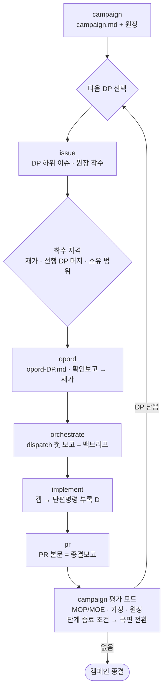

# Campaign — 작전계획 작성·평가

## 1. 개요

**campaign.md 가 L 사이즈(PR 여러 개) 작업의 플랜이다.** 템플릿은 `docs/operations/templates/campaign.md` — 항목 밖 서술 금지, 해당 없는 항목은 "없음". 용어(DP·LOE·FRAGO·MOP/MOE·PIR/FFIR·branch/sequel)는 템플릿 머리의 용어 줄이 정본이다.

- 진입은 양방향 — kickoff 사이즈 판정(L·XL)의 위임, 또는 유저의 직접 호출. **kickoff 가 안 돌았으면 먼저 invoke 한다** (정찰은 kickoff 소관 — 여기서 중복 구현하지 않는다).
- 분해 브리프는 이 계획이 갈음한다 — 9항 DP 목록이 리스트업이고, 미결 목록이 "미분해 잔여"다.
- 계획 파일은 `docs/operations/<상위이슈>/campaign.md` 로, **재가 시점에 develop 에 바로 커밋한다** — PR 도 안 만들고 DP 브랜치 base 로도 쓰지 않는다. 계획을 브랜치에 묶어두면 그 브랜치가 DP 전부를 받는 장수 integration 브랜치가 돼 캠페인이 끝날 때까지 develop 이 아무것도 못 받는다. DP base 는 orchestrate §3-1 대로 develop 또는 앞 DP 브랜치다. 이슈 본문 = 이 파일 전문 + `<!-- progress -->` 블록 (§5).
- **해상도 경계 — campaign 은 DP 수준까지만 다룬다.** branch 도 "DP 재배열·대체·범위 축소"까지다. 태스크 수준 결정지점·우발계획은 opord 소관 — 그 아래로 내려가면 opord 를 복제하며 비대해진다.

**L 실행 루프** — 이 스킬은 루프의 양 끝(계획·평가)만 맡는다:

M 은 kickoff → opord → implement → pr, S 는 kickoff → 구두지시 → implement → pr. XL 은 strategy.md 의 캠페인마다 위 루프.

## 2. 작성 모드

1. **상황·과업 도출** — kickoff 정찰을 재사용해 1항 상황(정찰 요약·장애의 유력/최위험 양상)을 채운다 (부족하면 code-analyzer). 이어서 과업을 도출한다: **명시**(전략 지침·이슈 본문이 시키는 것) / **추정**(명시 안 됐지만 rules·아키텍처가 딸려 붙이는 것 — 짝지어진 두 위치, 테스트 스킴, localization 키 등) / **필수**(명시·추정 중 누락 시 최종상태 미달로 직결되는 것). 도출된 과업 전부가 DP 좌표를 갖는지가 9항의 검산 기준이다 — 추정 과업이 계획에서 빠지면 실행 중 FRAGO 로 계속 불어난다.
2. **작전구상 순서로 질문한다**: 전략 지침 → 문제 정의 → 종결·중단 기준 → 최종상태 → 중심 → 접근 → 노력선 → 단계 → 작전 배열 → DP·소유 범위·인터페이스 계약 → 결정지점·branch → 가정·위험·한계점 → 자원 → 평가 지표. 기본안을 붙여 **일괄** AskUserQuestion — 답에 따라 계획이 바뀌는 것만 묻는다. 정찰(kickoff 탐색)로 알 수 있는 건 묻지 않는다. **kickoff 정찰 브리프의 "유저만 답 가능" 미정 목록을 질문 입력에 포함한다** (확정 자리는 kickoff 가 아니라 여기다) — 캠페인 고도 결정은 여기서 확정하고, DP 고도 미정은 확정하지 말고 미결 목록에 실어 해당 DP 의 opord 로 넘긴다.
3. **COA 비교 — 분해안을 하나로 시작하지 않는다.** LOE 구성·단계화·배열이 다른 분해안을 2개 이상 스케치하고, 스크리닝을 통과한 안들을 트레이드오프와 함께 제시해 유저가 고른다 — 적합(최종상태 전 관점 커버) · 실행가능(자원 13항 안에서 굴러감) · 수용가능(위험이 수용 범위) · 구별(접근이 실제로 다름) · 완전(필수 과업 전부가 DP 좌표를 가짐). 실행가능한 분해가 정말 하나뿐이면 단일안으로 가되 그 근거를 적는다 — 선택 근거의 기록처는 5항 중심 분석의 "접근"이다.
4. **초안마다 정합성 검사**: 담당 없는 최종상태 관점 / 소유 범위 겹침 / 자원 충돌 / 시각 조건(종료 조건이 상태가 아니라 시점) / DP 크기(PR 하나로 며칠 안) / 선후 의존 / MOE≠MOP / 중심 반영 / 결정지점 없는 즉시보고 조건 / branch 없는 고위험 단계 전환 / 근거 없는 병렬 묶음 / 종결·중단 기준 없음 / 지표 없는 MOE / 좌표 없는 필수 과업. 하나라도 걸리면 해당 항목으로 되돌아간다.
5. **워게임** — 초안 완성 후·게시 전. 단계 순서대로 DP 를 걸어보며, 가정(11항)·위험(12항)·제약(16항)마다 "깨지는 시나리오에서 어느 결정지점·branch 가 흡수하나"를 확인한다. 흡수 못 하는 시나리오가 나오면 8·10~12항을 보강하고 다시 걸어본다 — 결정지점·branch·배열은 이 워게임의 산출물이지 머리로 채우는 칸이 아니다.
6. **산출**: `campaign.md` 커밋 + 이슈 본문 미러(§5) + 미결 목록. 8항 요도(mermaid)는 워게임까지 반영된 최종 배열 기준으로 표에서 생성해 싣는다 — GitHub 이 이슈 미러에서 렌더링한다. **노력선·최종상태를 대신 정하지 않는다** — 참모는 채우는 걸 돕지, 결정은 유저 몫이다.
7. **초안 게시**: 초안이 완료되면(재가 대기) `mcp__github-reviewer__add_issue_comment` 로 상위 이슈에 요지·파일 경로를 봇 코멘트로 게시하고 `@sudopark` 를 멘션한다 — 유저 행동이 필요해 세션이 멈춘 시점이 게시 기준이다. 작전계획·전략 지침은 대응 report 템플릿이 없어 게시 규정이 여기 직접 산다.

- DP 는 이슈 = PR 필수 — 원장의 이슈# 칸은 항상 채워지고, 커밋은 `[#DP이슈]`. DP 이슈 생성은 루프의 issue 단계에서 유저 지시로.
- 위임은 `docs/operations/templates/delegation.md` 상속 — 계획엔 좁히는 것만 적는다 (15항).

## 3. XL 전략 모드

캠페인 둘 이상이 한 목적을 공유하면 `docs/operations/templates/strategy.md` **전 항목**을 채워 `docs/operations/<이슈>/strategy.md` 로 커밋한다 (§1 대로 develop 직접) — 작성 모드 절차를 전략 고도로 그대로 적용한다: 질문(목적 → 최종상태 → 종결·중단 → 수단·제한·ends-ways-means-risk 정합 → 위임 → 캠페인 목록·배열 → 가정·위험·한계점 → 결정지점 → 평가), 캠페인 배열이 갈리면 COA 비교, 초안 후 워게임(캠페인 배열 순서로 걸어보며 전략 가정·위험이 10항 결정지점에 흡수되는지). 캠페인 내부(LOE·DP)로는 내려가지 않는다 — 그건 각 campaign.md 소관이다. 각 캠페인의 campaign.md 는 0항에 이 문서를 인용한다.

- 원장: `.operations/<이슈>/strategy-progress.md` — `<!-- progress -->` 헤딩 + 캠페인 원장 표(strategy.md 템플릿 12항 서식). 갱신 시점은 캠페인 착수·종결 — 종결 판정은 §4 평가 모드(캠페인 종결)가 맡는다.
- 이슈 본문 = strategy.md 전문 + progress 블록 — 재조립 규칙은 §5 와 같다.
- 초안 완료 게시·재가는 작성 모드(§2)와 같다.

## 4. 평가 모드 — 종결보고 접수

DP 의 PR 이 생성돼 종결보고가 오면 (pr 스킬이 호출한다):

1. **MOP** — 종결보고 1항(최종상태 대조)로 DP 완료 판정.
2. **MOE** — 그 DP 가 담당한 관점(LOE 중간 목표)에 효과가 났는지, 14항의 지표·판정 데이터 출처 기준으로 판정한다 — 과업 수행(MOP)과 별개다.
3. **가정 검증** — 종결보고 5항을 campaign.md 11항에 반영. 깨진 가정 처리는 상향 규칙(delegation.md)대로 — 계획된 branch 우선 발동은 그 표가 규정한다. 발동 시 원장 반영 + 정기보고 게시.
4. **잔여 위험·한계점** — 종결보고 4항을 12항에 반영. 작전한계점 지표가 걸렸으면(리뷰 대기 적체 등) 신규 DP 착수 대신 소화(리뷰·머지 대기 해소)를 제안한다.
5. **원장 갱신** — 진행 파일(§5)의 해당 DP 행(상태·PR#·비고).
6. **단계 종료 조건 대조** — campaign.md 7항의 종료 조건이 상태로 충족됐으면 국면 전환: 다음 단계 진입 조건 확인, DP 활성화, 주노력 재배분, 진행 파일의 현재 국면 갱신 — 전환 시 정기보고(`report-periodic.md`)를 머리 게시 줄대로 이슈 봇 코멘트로 게시한다. 종료 상태가 부분·미충족이면 7항 sequel 경로를 따르고, 결정지점이 도래했으면 국면 전환 대신 해당 branch 를 발동한다.
7. **종결·중단 기준 대조** — 3항 중단·축소 조건이 충족됐으면 캠페인 지속 여부를 유저에게 상신한다 — 중단 결정은 유저 몫이고, 수습은 3항대로.
8. **다음 DP 선택** — 선행 DP 머지·소유 범위·8항 배열 시퀀스 기준으로 착수 가능한 DP 를 제안한다.

가정·위험 반영이 campaign.md **본문**을 고치는 경우(계획 개정)만 커밋이 생긴다 — 원장·국면은 진행 파일이라 커밋 없음. branch 발동이 8항 배열·9항 DP 목록을 바꾸면 그것도 계획 개정이다 — 요도도 재생성한다. 개정·원장 갱신 후 이슈 본문 미러를 재조립한다.

**머지는 이 절차의 재실행이 아니다** — DP 가 머지되면 §5 원장을 `머지` 로 갱신하고, 종료 조건이 머지를 요구하는 단계(예: "모든 DP 머지")만 종료 조건을 재대조해 국면을 확정한다. MOP/MOE·가정·위험 반영은 종결보고 접수 시 1회로 끝난다.

## 5. 원장·진행 파일

- 경로: `.operations/<상위이슈>/campaign-progress.md` — gitignore 대상, 시점 무관 자유 갱신.
- 서식: `<!-- progress -->` 헤딩 + 현재 국면 줄 + 원장 표 `| DP | 상태 미착수/착수/실행/검토/머지 | 이슈# | 브랜치 | base | PR# | 비고 |`.
- 갱신 시점: DP 착수(issue 단계)·PR 생성·종결보고 접수·머지·branch 발동. 갱신마다 **이슈 본문 미러 재조립** — 본문 = `campaign.md` 전문 + 진행 파일 내용, `gh issue edit <상위이슈> --body-file` 로. 다른 세션·워크트리는 이슈 본문에서 상태를 복원한다.

## 6. 종료 기록 — skill_end

작성 모드는 campaign.md 저장·재가로, 평가 모드는 원장·미러 갱신 완료로 절차가 끝난다 — 그 시점에 `log-record.py skill_end` 를 기록한다 (명령·compliance 규칙은 CLAUDE.md §1). 평가 모드가 캠페인 종결(모든 DP 머지 + MOE)로 끝나면 상위 이슈 클로즈는 pr 스킬 머지 단계가 아니라 이 평가가 맡는다 — 클로즈 코멘트에 MOE 판정을 싣는다. XL 하위 캠페인이면 strategy 원장(§3)과 그 상위 이슈 미러도 함께 갱신한다.
