# Domain Framework

앱의 모든 **비즈니스 모델**, **Repository 프로토콜**, **Usecase 구현**이 위치하는 프레임워크.
Repository 구현체는 여기 없고 프로토콜만 정의한다. 구현은 `Repository/` 프레임워크에 있다.

## Usecase 작성 규칙

### 서브도메인 분리 기준
응집도가 높고 결합도가 낮은 기능끼리 묶는다. 폴더 구조가 이를 반영한다.

각 Usecase는 Presentation layer에서 **재사용**된다. 이때 공유되는 것은 두 가지:
- **로직**: Usecase 인스턴스 자체
- **상태**: `SharedDataStore`를 통해 공유 (서로 다른 VM이 같은 Usecase를 쓰면 상태가 자동으로 공유됨)

### typealias Usecase
비즈니스 로직 없이 Repository를 그대로 노출하면 되는 경우, typealias로 정의한다.

```swift
// EventDetailDataUsecase.swift — 현재 유일한 typealias Usecase
public typealias EventDetailDataUsecase = EventDetailDataRepository
```

새 Usecase를 추가할 때 "이 Usecase가 Repository 결과를 bypass만 하는가?"를 먼저 따져볼 것.

---

## SharedDataStore

모든 Usecase가 공유하는 중앙 상태 저장소. Combine 기반으로 변화가 즉시 전파된다.
`Domain/Sources/Utils/SharedDataStore.swift`

키 목록은 `Domain/Sources/Utils/SharedDataStore.swift`의 `ShareDataKeys` enum 참조.

### 사용 패턴

```swift
// 전체 저장 (replace)
sharedDataStore.put([TodoEvent].self, key: ShareDataKeys.uncompletedTodos.rawValue, todos)

// 부분 업데이트 (mutation) — update는 저장 전용, 결과를 밖으로 캡처하지 말 것
sharedDataStore.update([String: TodoEvent].self, key: shareKey) {
    ($0 ?? [:]) |> key(event.uuid) .~ event
}

// 구독
sharedDataStore.observe([TodoEvent].self, key: shareKey)
    .map { $0 ?? [] }
    .eraseToAnyPublisher()

// 현재값 동기 조회
let current = sharedDataStore.value([TodoEvent].self, key: shareKey)
```

---

## SharedEventNotifyService

이벤트 로딩 진행 상태처럼 **SharedDataStore로 표현하기 어려운 일시적 이벤트**를 전파할 때 사용한다.
`Domain/Sources/Utils/SharedEventNotifyService.swift`

### RefreshingEvent (5가지)
- `refreshingTodo(Bool)` — Todo 목록 로딩
- `refreshingSchedule(Bool)` — 일정 목록 로딩
- `refreshingCurrentTodo(Bool)` — 오늘의 Todo 로딩
- `refreshingUncompletedTodo(Bool)` — 미완료 Todo 로딩
- `refreshForemostEvent(Bool)` — 강조 이벤트 로딩

### 사용 패턴

```swift
// Publisher extension으로 간편하게 — subscription 시 true, completion 시 false 발송
self.todoRepository.loadCurrentTodoEvents()
    .handleNotify(self.eventNotifyService) {
        $0 ? RefreshingEvent.refreshingCurrentTodo(true) : .refreshingCurrentTodo(false)
    }
    .sink(...)

// 직접 구독
self.eventNotifyService.event<RefreshingEvent>()
    .sink { event in ... }
```

---

## MemorizedEventsContainer

반복 이벤트(ScheduleEvent)의 발생 인스턴스를 기간별로 캐싱하는 컨테이너.
`Domain/Sources/Usecases/Events/MemorizedEventsContainer.swift`

- **ScheduleEvent에만 사용**. TodoEvent는 평면 딕셔너리(`[String: TodoEvent]`)로 충분.
- **Immutable**: 모든 변경 메서드가 새 컨테이너를 반환.
- `refresh(_:in:)` — 특정 기간의 이벤트 목록으로 캐시 갱신
- `append(_:)` — 새 이벤트 추가
- `invalidate(_:)` — 특정 이벤트 캐시 제거
- `replace(_:ifExists:)` — 특정 이벤트 교체 또는 제거
- `events(in:)` — 기간 내 이벤트 조회
- `evnet(_:)` — 단일 이벤트 ID로 조회

---

## 반복 이벤트 turn 규칙

반복 이벤트 회차 추적. 없으면 count 기반 종료가 깨지는 핵심 불변식. 상세·엣지케이스는 [`docs/spec/repeating-events.md`](../docs/spec/repeating-events.md).

- turn은 1부터. `EventRepeatTimeEnumerator.nextEventTime`은 항상 `from.turn + 1` 반환.
- `TodoEvent.repeatingTurn`: 현재 회차 (`nil` = turn 1). 완료·수정·삭제·스킵마다 다음 turn으로 갱신. 없으면 `.count(n)` 종료가 동작 안 함.
- 다음 반복 계산 시 starting turn은 `origin.repeatingTurn ?? 1` (Local·Remote 동일).
- `ScheduleEvent` 수정 범위: `.onlyThisTime`(현재 회차만 + 원본 제외) / `.fromNow`(현재부터 새 시리즈 분기) / 기본(전체 시리즈).

---

## 외부 캘린더 계정 연동/해제 플로우

```mermaid
flowchart TD
    subgraph "계정 연동 (integrate)"
        A[사용자: 구글 계정 연동 요청] --> B[OAuth 인증 플로우]
        B --> C[Credential 저장]
        C --> D[ExternalCalendarAccountRemotePool\n— Remote API 클라이언트 생성]
        D --> E[ExternalCalendarDBConnectionPool\n— DB 연결 open 참조카운트 +1]
        E --> F{첫 번째 open?}
        F -->|Yes| G[onFirstOpen: 테이블 생성 + 마이그레이션]
        F -->|No| H[기존 연결 재사용]
        G --> I[AppDataMigrationImple\n— 레거시 데이터 마이그레이션 1회]
        I --> J[Integration 상태 broadcast\n— .integrated]
        H --> J
        J --> K[GoogleCalendarUsecase\n— 색상/태그/이벤트 refresh]
        K --> L[SharedDataStore 업데이트\n→ UI 자동 반영]
    end

    subgraph "계정 해제 (stopIntegrate)"
        M[사용자: 구글 계정 해제 요청] --> N[Credential 삭제]
        N --> O[ExternalCalendarAccountRemotePool\n— Remote API 클라이언트 제거]
        O --> P[ExternalCalendarDBConnectionPool\n— DB 연결 close 참조카운트 -1]
        P --> Q{참조카운트 = 0?}
        Q -->|Yes| R[DB 연결 실제 종료]
        Q -->|No| S[다른 계정이 사용 중 → 유지]
        R --> T[Integration 상태 broadcast\n— .disconnected]
        S --> T
        T --> U[GoogleCalendarUsecase\n— 해당 계정 캐시 제거]
        U --> V[SharedDataStore 업데이트\n→ UI 자동 반영]
    end

    subgraph "앱 시작 시 (prepareIntegratedAccounts)"
        W[앱 실행] --> X[저장된 Credential 로드]
        X --> Y[계정별 Remote/DB 설정]
        Y --> Z[GoogleCalendarUsecase\n— 전체 계정 refresh]
        Z --> AA[SharedDataStore → UI]
    end
```



**주요 파일**:

| 파일 | 역할 |
|---|---|
| `ExternalCalendarIntegrationUsecase.swift` | 계정 연동 상태 관리 + reactive 상태 브로드캐스트 |
| `GoogleCalendarUsecase.swift` | 계정별 이벤트/색상/태그 로드 (repositoryPool 사용) |
