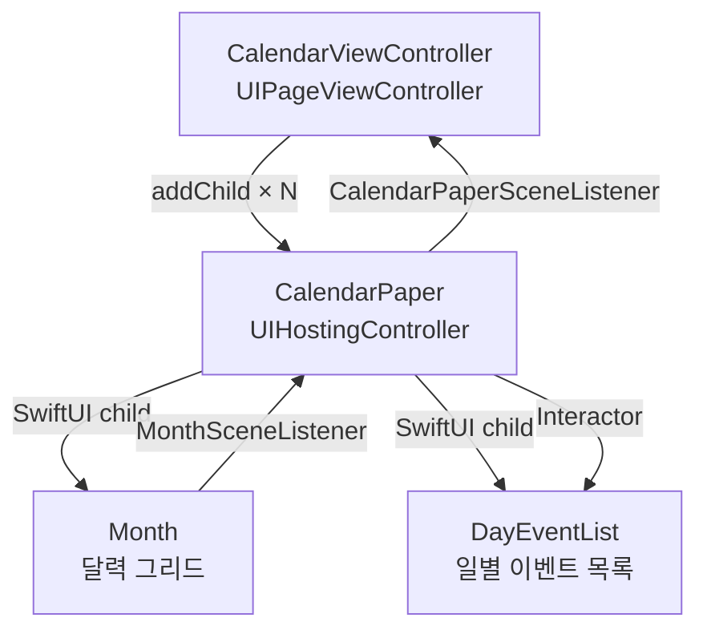
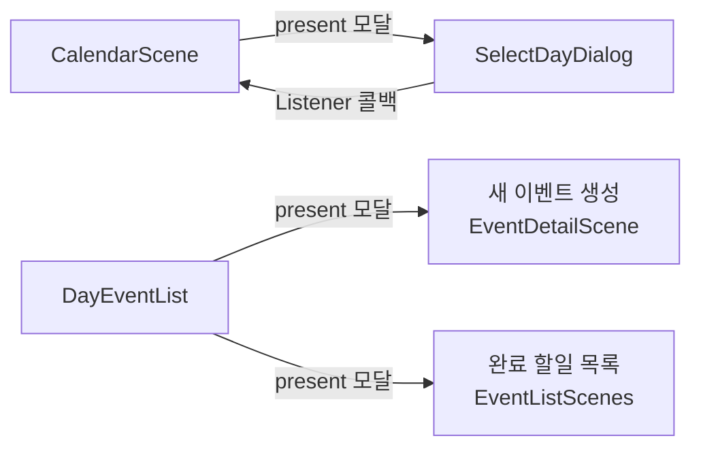
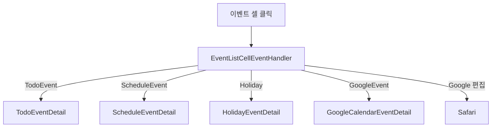
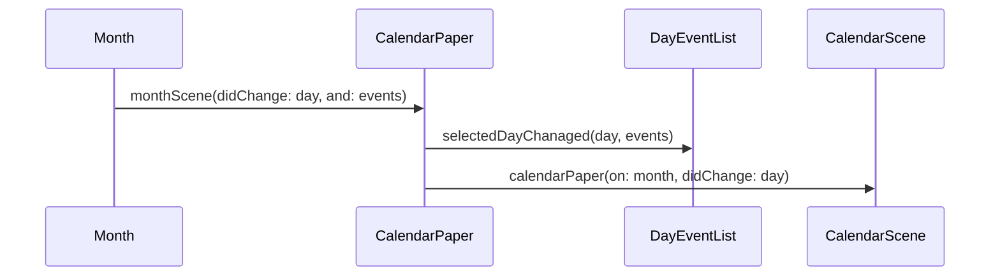
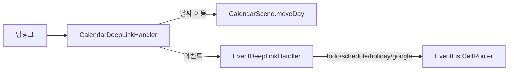

# CalendarScenes Framework — CLAUDE.md

## 개요

캘린더 메인 화면. UIPageViewController 기반 월별 페이징 + 일별 이벤트 목록으로 구성된 복합 Scene 프레임워크.

---

## 폴더 구조

```
CalendarScenes/
├── Sources/
│   ├── CalendarViewController.swift          — UIPageViewController (메인 진입점)
│   ├── CalendarViewModel.swift               — CalendarViewModelImple
│   ├── CalendarViewRouter.swift              — CalendarViewRouterImple
│   ├── CalendarSceneBuilderImple.swift        — 전체 Scene 조립
│   ├── CalendarDeepLinkHandlerImple.swift     — 캘린더 딥링크 처리
│   │
│   ├── CalendarPaper/                        — 단일 월 컨테이너 (Month + DayEventList)
│   │   ├── CalendarPaperScene+Builder.swift
│   │   ├── CalendarPaperBuilderImple.swift
│   │   ├── CalendarPaperViewController.swift  — UIHostingController
│   │   ├── CalendarPaperViewModel.swift
│   │   ├── CalendarPaperView.swift
│   │   ├── CalendarPaperRouter.swift
│   │   ├── ForemostEventView.swift           — 강조 이벤트 뷰
│   │   └── UncompletedTodoView.swift         — 미완료 할일 뷰
│   │
│   ├── Month/                                — 달력 그리드 (Component)
│   │   ├── MonthScene+Builder.swift
│   │   ├── MonthSceneBuilderImple.swift
│   │   ├── MonthViewModel.swift
│   │   ├── MonthView.swift
│   │   └── WeekEventStackBuilder.swift       — 주간 이벤트 스택 계산
│   │
│   ├── DayEventList/                         — 선택일 이벤트 목록 (Component)
│   │   ├── DayEventListScene+Builder.swift
│   │   ├── DayEventListBuilderImple.swift
│   │   ├── DayEventListViewModel.swift
│   │   ├── DayEventListView.swift
│   │   └── DayEventListRouter.swift
│   │
│   ├── SelectDay/                            — 날짜 선택 다이얼로그 (모달)
│   │   ├── SelectDayDialogViewController.swift
│   │   ├── SelectDayDialogViewModel.swift
│   │   ├── SelectDayDialogView.swift
│   │   └── SelectDateDialogRouter.swift
│   │
│   └── Common/
│       ├── CalendarEvents/
│       │   ├── CalendarEvent.swift            — 이벤트 프로토콜 계층
│       │   └── CalendarEventListhUsecase.swift — 통합 이벤트 Usecase
│       └── EventListCell/
│           ├── EventListCellEventHanleViewModelBuilder.swift
│           ├── EventListCellEventHanleViewModel.swift  — 셀 이벤트 처리
│           ├── EventListCellEventHanleRouter.swift      — 이벤트 상세 라우팅
│           ├── EventCellViewModel.swift                 — 셀 UI 모델
│           ├── EventListCellView.swift                  — 셀 SwiftUI 뷰
│           └── EventDeepLinkHandlerImple.swift          — 이벤트 딥링크 처리
│
└── Tests/
```

---

## Scene 구성

### 복합 Scene 계층



Month와 DayEventList는 독립 Scene이 아니라 **Component** (ViewModel만 반환, ViewController 없음). CalendarPaper가 SwiftUI ContainerView 안에서 직접 포함한다.

---

## Scene 상세

### CalendarScene (루트)

UIPageViewController로 월별 페이지를 좌우 스와이프로 전환한다.

| 항목 | 설명 |
|---|---|
| Interactor | `moveFocusToToday()`, `moveDay(_:withClearPresented:)` |
| Listener | `CalendarSceneListener` — 포커스 월 변경 알림 |
| 주요 Usecase | Calendar, Holiday, TodoEvent, ScheduleEvent, GoogleCalendar, ForemostEvent, EventTag, EventSync |

**자동 새로고침 트리거**: 타임존 변경, 앱 포그라운드 복귀, 마이그레이션 완료, 구글 캘린더 연동

### CalendarPaper (월 컨테이너)

한 달치 화면. Month(그리드)와 DayEventList(목록)를 포함하는 오케스트레이터.

| 항목 | 설명 |
|---|---|
| Interactor | `updateMonthIfNeed(_:)`, `selectToday()`, `selectDay(_:)` |
| Listener | `CalendarPaperSceneListener` — 선택일 변경을 부모에 전달 |
| 역할 | Month의 날짜 선택 → DayEventList에 중계 |

### Month (달력 그리드 Component)

| 항목 | 설명 |
|---|---|
| 반환 타입 | `MonthSceneComponent` (viewModel만 포함) |
| Interactor | `updateMonthIfNeed(_:)`, `clearDaySelection()`, `selectDay(_:)` |
| Listener | `MonthSceneListener` — 선택일 + 해당일 이벤트를 부모에 전달 |
| 핵심 로직 | `WeekEventStackBuilder`로 주간 이벤트 바 레이아웃 계산 |

### DayEventList (일별 이벤트 Component)

| 항목 | 설명 |
|---|---|
| 반환 타입 | `DayEventListSceneComponent` (viewModel + router) |
| Interactor | `selectedDayChanaged(_:and:)` — 부모로부터 선택일 수신 |
| 라우팅 | 새 이벤트 생성, 완료 할일 목록 표시 |

### SelectDayDialog (날짜 선택 모달)

| 항목 | 설명 |
|---|---|
| Interactor | `EmptyInteractor` (없음) |
| Listener | `SelectDayDialogSceneListener` — 선택 결과를 CalendarScene에 전달 |

### EventListCellEventHandler (공유 컴포넌트)

모든 이벤트 셀 클릭을 처리하는 공유 컴포넌트. CalendarSceneBuilder에서 한 번 생성하여 여러 Scene에 attach.

---

## 화면 플로우

### 메인 네비게이션



### 이벤트 셀 클릭 라우팅



### Listener/Interactor 통신 흐름



---

## 딥링크



---

## 외부 의존성

| 방향 | 대상 | 용도 |
|---|---|---|
| → | EventDetailScene | 이벤트 상세 화면 (EventDetailSceneBuilder) |
| → | EventListScenes | 완료 할일 목록 (EventListSceneBuilder) |
| ← | TodoCalendarApp | ApplicationRootBuilder에서 생성 |
