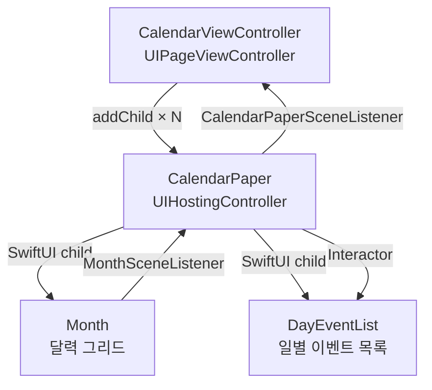
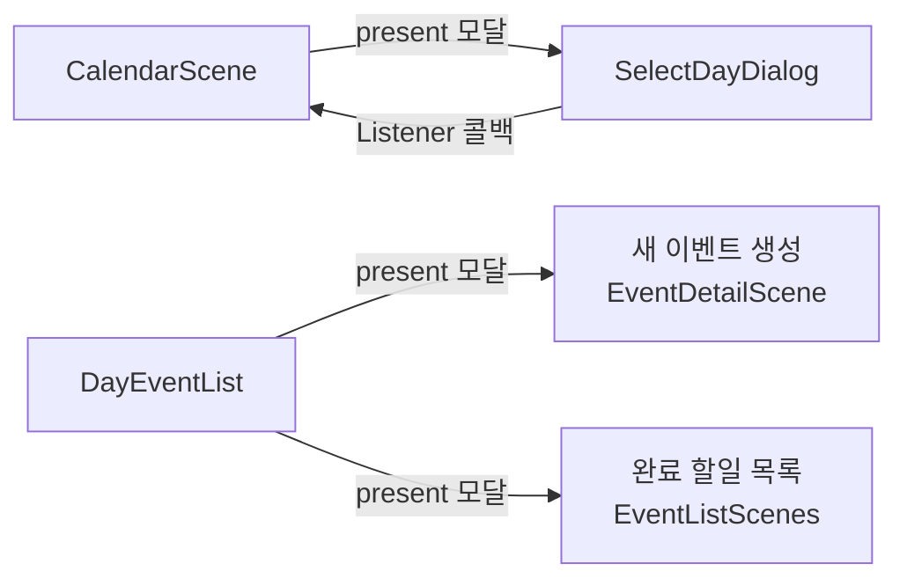
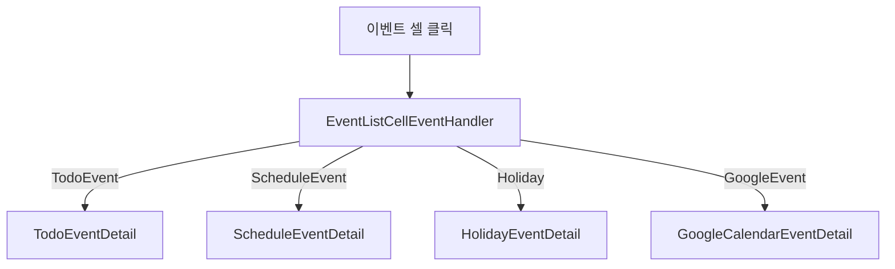
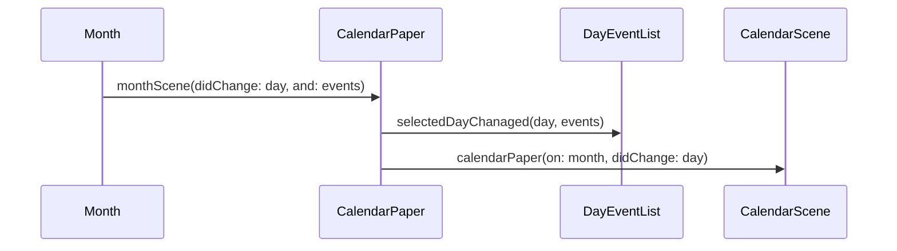
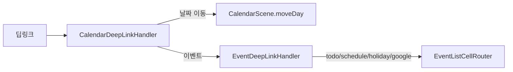

# CalendarScenes Framework — CLAUDE.md

## 개요

캘린더 메인 화면. UIPageViewController 기반 월별 페이징 + 일별 이벤트 목록으로 구성된 복합 Scene 프레임워크.

---

## Scene 구성

### 복합 Scene 계층

```mermaid
graph TD
    CV[CalendarViewController<br/>UIPageViewController] -->|addChild × N| CP[CalendarPaper<br/>UIHostingController]
    CP -->|SwiftUI child| MV[Month<br/>달력 그리드]
    CP -->|SwiftUI child| DEL[DayEventList<br/>일별 이벤트 목록]
    MV -->|MonthSceneListener| CP
    CP -->|CalendarPaperSceneListener| CV
    CP -->|Interactor| DEL
```

Month와 DayEventList는 독립 Scene이 아니라 **Component** (ViewModel만 반환, ViewController 없음). CalendarPaper가 SwiftUI ContainerView 안에서 직접 포함한다.

---

## Scene 상세

### CalendarScene (루트)

UIPageViewController로 월별 페이지를 좌우 스와이프로 전환한다.

| 항목 | 설명 |
|---|---|
| Interactor | `moveDay(_:withClearPresented:)`, `moveToPreviousMonth()`, `moveToNextMonth()`, `requestAIEntry()` |
| Listener | `CalendarSceneListener` — 포커스 월 변경 알림 |
| 주요 Usecase | Calendar, Holiday, TodoEvent, ScheduleEvent, GoogleCalendar, ForemostEvent, EventTag, EventSync |

**자동 새로고침 트리거**: 타임존 변경, 앱 포그라운드 복귀, 마이그레이션 완료, 구글 캘린더 연동

### CalendarPaper (월 컨테이너)

한 달치 화면. Month(그리드)와 DayEventList(목록)를 포함하는 오케스트레이터.

| 항목 | 설명 |
|---|---|
| Interactor | `updateMonthIfNeed(_:)`, `selectToday()`, `selectDay(_:)`, `scrollToVoiceInput()`, `selectedDayIsToday(_:)`, `updateMonthCollapsed(_:)` |
| Listener | `CalendarPaperSceneListener` — 선택일 변경을 부모에 전달 |
| 역할 | Month의 날짜 선택 → DayEventList에 중계 |

### Month (달력 그리드 Component)

| 항목 | 설명 |
|---|---|
| 반환 타입 | `MonthSceneComponent` (viewModel만 포함) |
| Interactor | `updateMonthIfNeed(_:)`, `clearDaySelection()`, `selectDay(_:)`, `updateMonthCollapsed(_:)` |
| Listener | `MonthSceneListener` — 선택일 + 해당일 이벤트를 부모에 전달 |
| 핵심 로직 | `WeekEventStackBuilder`로 주간 이벤트 바 레이아웃 계산 |

### DayEventList (일별 이벤트 Component)

| 항목 | 설명 |
|---|---|
| 반환 타입 | `DayEventListSceneComponent` (viewModel + router) |
| Interactor | `selectedDayChanaged(_:and:)`, `selectedDayIsToday(_:)` — 부모로부터 선택일 수신 |
| 라우팅 | 새 이벤트 생성, 완료 할일 목록 표시 |

### NextDayEventList (다음날 이벤트 섹션 Component)

넓은 창 2단 오른쪽 칸에서 1단 일별 목록 아래에 이어 붙는 부품이다. 화면 연결(조립)은 아직 없다 — 조립하는 쪽이 `NextDayEventListViewModelImple` 과 `NextDayEventListContainerView` 를 직접 만들고, 다음날 날짜 모델과 그날 이벤트를 넣어 준다 (builder 없음).

| 항목 | 설명 |
|---|---|
| Interactor | `nextDayChanged(_:and:)` — 1단 `selectedDayChanaged(_:and:)` 처럼 다음날 `CurrentSelectDayModel` 과 그날 이벤트(공휴일 포함)를 밖에서 받는다. 이벤트를 고르는 일은 달력 쪽 몫이다 |
| 셀 | 받은 이벤트를 1단과 같은 사슬(정렬 → mapper → Foremost 제외 → 등록 반영)로 만든다 |
| 헤더 | 공휴일명·날짜·음력만 그린다. 공유·완료 할일·오늘 복귀 버튼은 1단 헤더에만 있다. 셀이 없으면 "일정 없음" 을 보인다 |
| 셀 액션 | `NextDayEventListViewEventHandler.bind` 가 1단과 같은 `EventListCellEventHanleViewModel` 에 넘긴다 |
| 공유 | 등록 반영 함수(`EventCellViewModel+Registration`)와 `SelectedDayModel` 을 1단 VM 과 함께 쓴다 |

### ContinuousMonths (수직 연속 달력 Component)

넓은 창 2단 왼쪽 칸에 놓이는 부품이다. 화면 연결(조립)은 아직 없다 — 조립하는 쪽이 `ContinuousMonthsViewModelImple` 과 `ContinuousMonthsViewController` 를 직접 만든다 (builder 없음).

| 항목 | 설명 |
|---|---|
| 구성 | `UICollectionView` (섹션 = 달, 아이템 = 주, `UIHostingConfiguration` 셀) + 고정 요일 헤더 |
| 버퍼 | 포커스 월 앞뒤 두 달씩 다섯 섹션. 섹션은 그 달 1일이 든 주부터 다음 달 1일이 든 주 직전까지라 경계 주가 한 번만 나온다 |
| 스크롤 | 제스처당 한 달씩 스냅(`scrollViewWillEndDragging` 이 손 뗀 위치에 관성 거리를 더한 시스템 목표 오프셋을 본다. 이웃 달 높이의 절반을 넘으면 그 달 맨 위로, 아니면 지금 달 맨 위로 바꾼다). 멈춘 뒤 버퍼를 다시 짠다. 셀 높이가 가변이라, 멈춰 있는 동안은 컬렉션 뷰 레이아웃이 끝날 때마다 포커스 섹션 맨 위로 오프셋을 다시 붙인다. 스크롤 중 도착한 섹션은 멈출 때까지 보류한다 |
| Interactor | `changeFocusedMonth(to:)` (버퍼 안이면 애니메이션 이동), `selectDay(_:)` (강조만) |
| Listener | `ContinuousMonthsSceneListener` — 사용자 스냅(`didScrollTo`)·탭(`didSelect`)·공유 범위 요청 |
| 흐림 | 포커스 월 밖 날짜를 화면 단에서 흐리게 그린다 (`WeekRowView` 의 `focusedMonth`). `DayCellViewModel.isNotCurrentMonth` 는 쓰지 않는다 |

### SelectDayDialog (날짜 선택 모달)

| 항목 | 설명 |
|---|---|
| Interactor | `EmptyInteractor` (없음) |
| Listener | `SelectDayDialogSceneListener` — 선택 결과를 CalendarScene에 전달 |

### EventListCellEventHandler (공유 컴포넌트)

모든 이벤트 셀 클릭을 처리하는 공유 컴포넌트. CalendarSceneBuilder에서 한 번 생성하여 여러 Scene에 attach.

---

## 화면 플로우

### 메인 네비게이션

```mermaid
graph LR
    CS[CalendarScene] -->|present 모달| SD[SelectDayDialog]
    SD -->|Listener 콜백| CS

    DEL[DayEventList] -->|present 모달| NE[새 이벤트 생성<br/>EventDetailScene]
    DEL -->|present 모달| DT[완료 할일 목록<br/>EventListScenes]
```

### 이벤트 셀 클릭 라우팅

```mermaid
graph TD
    Cell[이벤트 셀 클릭] --> ECH[EventListCellEventHandler]
    ECH -->|TodoEvent| TD[TodoEventDetail]
    ECH -->|ScheduleEvent| SD[ScheduleEventDetail]
    ECH -->|Holiday| HD[HolidayEventDetail]
    ECH -->|GoogleEvent| GD[GoogleCalendarEventDetail]
```

### Listener/Interactor 통신 흐름

```mermaid
sequenceDiagram
    participant M as Month
    participant CP as CalendarPaper
    participant DEL as DayEventList
    participant CV as CalendarScene

    M->>CP: monthScene(didChange: day, and: events)
    CP->>DEL: selectedDayChanaged(day, events)
    CP->>CV: calendarPaper(on: month, didChange: day)
```

---

## 딥링크

```mermaid
graph LR
    DL[딥링크] --> CDL[CalendarDeepLinkHandler]
    CDL -->|날짜 이동| CS[CalendarScene.moveDay]
    CDL -->|이벤트| EDL[EventDeepLinkHandler]
    EDL -->|todo/schedule/holiday/google| ECR[EventListCellRouter]
```

---

## 프레임워크 스코프 컴포넌트 (`Sources/Common/`)

| 컴포넌트 | 역할 | 사용처 |
|---|---|---|
| `EventListCellView` (`Common/EventListCell/`) | 모든 이벤트(할일/일정/휴일/구글)를 렌더링하는 이벤트 셀 공용 뷰 — 완료 처리·상세 이동·more 액션 콜백 포함. 그리는 UI 모델 `EventCellViewModel` 계열은 `CalendarPresentation` 소관이다 (#1060) | DayEventListView, ForemostEventView, UncompletedTodoView |
| `Common/AIAgentSignInConfirm` | AI 기능 미로그인 시 로그인 유도 confirm 다이얼로그 팩토리 (`ConfirmDialogInfo.aiAgentNeedSignIn`, DayEventList·Calendar VM 공유, #768) | DayEventListViewModelImple, CalendarViewModelImple |
| `WeekRowView` (`Common/WeekRowView.swift`) | 달력 주 한 줄 — 날짜 칸·이벤트 바/점·탭·길게 눌러 공유. 선택일·오늘·포커스 월·주별 이벤트 publisher 를 파라미터로 받는다 | MonthView, ContinuousMonthsWeekCellView |
| `WeekDaysHeaderView` (`Common/WeekDaysHeaderView.swift`) | 요일 헤더 한 줄 | MonthView, ContinuousMonthsHeaderView |
| `CalendarComponent+Range` (`Common/CalendarComponent+Range.swift`) | 달 구성의 조회 범위·공휴일 이벤트·날/주/달 공유 범위 계산 | MonthViewModelImple, ContinuousMonthsViewModelImple |
| `Common/AIAgentSpeechPermissionConfirm` | 마이크·음성인식 권한 거부 시 설정 이동 confirm 다이얼로그 팩토리 (`ConfirmDialogInfo.aiAgentSpeechPermissionDenied`, #809) | CalendarViewModelImple |

`CalendarEvent` 계열·`EventCellViewModel` 계열·Month 표시 모델·`WeekEventStackBuilder`·`EventCellViewModelMapper` 는 `Presentations/CalendarPresentation` 으로 내려갔다 (#1060). 위젯 확장이 같은 모델을 쓰기 때문이다 — 이 프레임워크는 그 모듈을 물어서 쓴다.

주의: `ForemostEventView`·`UncompletedTodoView`는 `CalendarPaper/` 폴더에 있으나 실제 소비는 `DayEventList/` — 배치·사용처 불일치 알려짐 (#659 리스트업 16번 메모).

---

## 외부 의존성

| 방향 | 대상 | 용도 |
|---|---|---|
| → | EventDetailScene | 이벤트 상세 화면 (EventDetailSceneBuilder) |
| → | EventListScenes | 완료 할일 목록 (EventListSceneBuilder) |
| ← | TodoCalendarApp | ApplicationRootBuilder에서 생성 |
