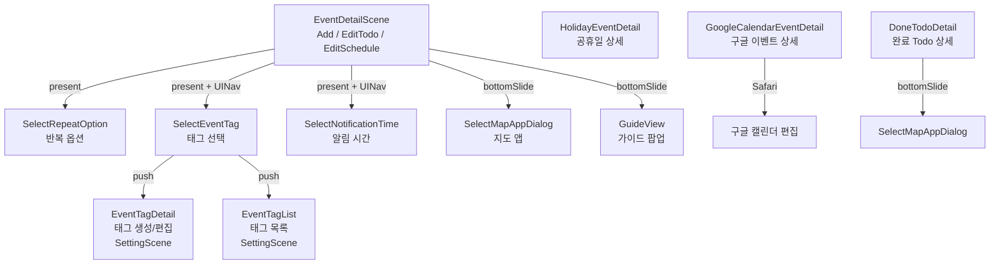
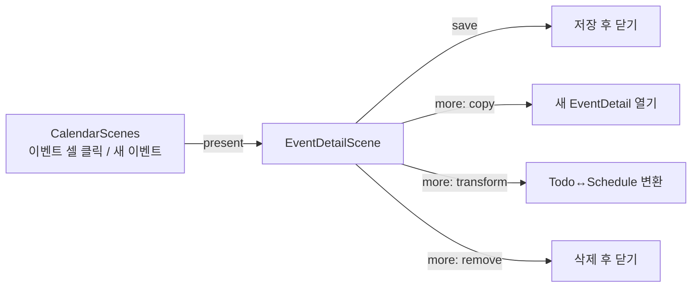
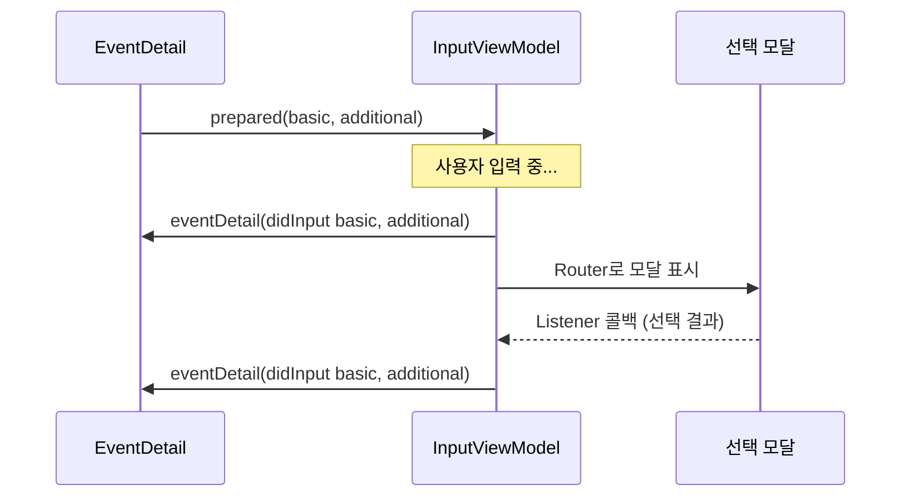
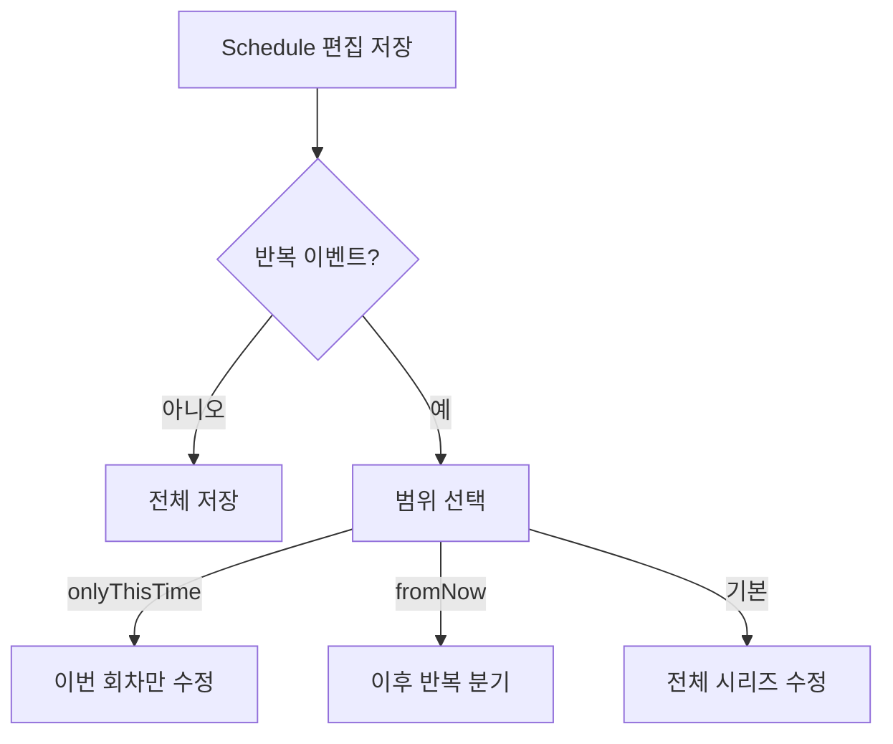

# EventDetailScene Framework — CLAUDE.md

## 개요

이벤트 생성/편집/상세 보기 화면. Todo·Schedule 생성/편집, Holiday·GoogleCalendar·DoneTodo 상세, 반복옵션/태그/알림 선택 모달을 포함한다.

---

## 폴더 구조

```
EventDetailScene/
├── Sources/
│   ├── EventDetailViewController.swift        — UIHostingController (메인 상세 화면)
│   ├── EventDetailRouter.swift                — 모달 Scene 라우팅 허브
│   ├── EventDetailSceneBuilderImple.swift      — 전체 Scene 조립
│   ├── EventDetailViewModel.swift             — 기본 프로토콜 + 데이터 모델
│   │
│   ├── ViewModels/                            — 메인 ViewModel 3종
│   │   ├── AddEventViewModel.swift            — 새 이벤트 생성
│   │   ├── EditTodoEventDetailViewModelImple.swift    — 기존 Todo 편집
│   │   └── EditScheduleEventDetailViewModelImple.swift — 기존 Schedule 편집
│   │
│   ├── EventDetailInput/                      — 입력 폼 로직 (공유)
│   │   ├── EventDetailInputViewModel.swift    — 이름/시간/태그/알림/장소/URL/메모
│   │   └── SelectMapApp/                      — 지도 앱 선택 다이얼로그
│   │
│   ├── Models/                                — 데이터 모델
│   │   ├── EventDetailBasicData.swift
│   │   ├── EventDetailData.swift
│   │   ├── OriginalAndCurrent.swift           — 변경 추적 래퍼
│   │   └── SelectedTime.swift
│   │
│   ├── Selections/                            — 선택 모달 Scene들
│   │   ├── SelectEventRepeatOption/           — 반복 옵션 선택
│   │   ├── SelectEventTag/                    — 태그 선택 (+ 태그 생성/목록)
│   │   └── SelectEventNotificationTime/       — 알림 시간 선택
│   │
│   ├── HolidayDetail/                         — 공휴일 상세 (읽기 전용)
│   ├── ExernalCalendar/Google/                — 구글 캘린더 이벤트 상세
│   ├── DoneTodoDetail/                        — 완료 Todo 상세 + 되돌리기
│   │
│   └── GuideView/                             — 가이드 팝업 (TodoEvent, ForemostEvent)
│
└── Tests/
```

---

## Scene 구성

### Scene 계층도



---

## Scene 상세

### EventDetailScene (메인 — 3가지 ViewModel 변형)

하나의 ViewController + Router를 공유하며, ViewModel만 다르게 생성한다.

| ViewModel | 용도 | 빌더 메서드 |
|---|---|---|
| `AddEventViewModelImple` | 새 이벤트 생성 (Todo/Schedule 전환 가능) | `makeNewEventScene(_:)` |
| `EditTodoEventDetailViewModelImple` | 기존 Todo 편집 | `makeTodoEventDetailScene(_:listener:)` |
| `EditScheduleEventDetailViewModelImple` | 기존 Schedule 편집 | `makeScheduleEventDetailScene(_:_:listener:)` |

**EventDetailInputViewModel** — 입력 폼 로직을 별도 ViewModel로 분리. 메인 ViewModel과 양방향 통신:
- `EventDetailInputInteractor`: 메인 → Input (초기 데이터 전달)
- `EventDetailInputListener`: Input → 메인 (입력 변경 전달)

**Edit ViewModel 공통 기능**:
- `OriginalAndCurrent<T>`로 변경 추적 → `hasChanges` Publisher
- 닫기 시 변경사항이 있으면 확인 다이얼로그
- More 액션: 삭제, 복사, 타입 변환 (Todo↔Schedule), ForemostEvent 토글

**Listener** (`EventDetailSceneListener`):
- `eventDetail(copyFromTodo:detail:)` / `eventDetail(copyFromSchedule:detail:)` — 복사
- `eventDetail(transformTo schedule:)` / `eventDetail(transformTo todo:)` — 타입 변환

### SelectEventRepeatOption (반복 옵션 선택)

| 항목 | 설명 |
|---|---|
| 표시 방식 | present (모달) |
| Listener | `SelectEventRepeatOptionSceneListener` — 선택 결과 / 반복 없음 콜백 |
| 지원 옵션 | EveryDay, EveryWeek, EveryMonth(일자/n번째 요일), EveryYear, 음력 |
| 종료 조건 | `.until(날짜)` 또는 `.count(횟수)` |

### SelectEventTag (태그 선택)

| 항목 | 설명 |
|---|---|
| 표시 방식 | UINavigationController로 present |
| Listener | `SelectEventTagSceneListener` — 선택된 태그 콜백 |
| 라우팅 | 새 태그 생성 → `SettingSceneBuilder.makeEventTagDetailScene()` (push) |
| 라우팅 | 태그 목록 → `SettingSceneBuilder.makeEventTagListScene()` (push) |
| 크로스 모듈 | SettingScene의 Builder를 주입받아 태그 관리 화면을 생성 |

### SelectEventNotificationTime (알림 시간 선택)

| 항목 | 설명 |
|---|---|
| 표시 방식 | UINavigationController로 present |
| Listener | `SelectEventNotificationTimeSceneListener` — 선택된 알림 옵션 배열 |
| 특징 | 기본 옵션 토글 + 커스텀 시간 추가, 시스템 알림 설정 열기 |

### SelectMapAppDialog (지도 앱 선택)

| 항목 | 설명 |
|---|---|
| 표시 방식 | bottomSlide |
| 역할 | 설치된 지도 앱 목록 표시 → 선택 시 바로 열기 |
| 지원 앱 | Google Maps, Apple Maps, Naver, Kakao |

### HolidayEventDetail (공휴일 상세)

| 항목 | 설명 |
|---|---|
| 읽기 전용 | D-Day 카운트, 국가 정보 표시 |
| Listener | 없음 |
| 라우팅 | 없음 (leaf) |

### GoogleCalendarEventDetail (구글 캘린더 상세)

| 항목 | 설명 |
|---|---|
| 표시 내용 | 제목, 시간, 참석자, 회의 링크, 첨부파일, 색상 |
| Listener | 없음 |
| 라우팅 | `routeToEditEventWebView()` → Safari로 구글 캘린더 편집 |

### DoneTodoDetail (완료 Todo 상세)

| 항목 | 설명 |
|---|---|
| 표시 내용 | 원본 시간 vs 완료 시간, 태그, 알림, URL, 메모, 장소 |
| Listener | `DoneTodoDetailSceneListener` — 되돌리기 콜백 |
| 라우팅 | 지도 앱 열기 (SelectMapAppDialog 사용) |

---

## 화면 플로우

### 이벤트 생성/편집 플로우



### 모달 선택 플로우



### 반복 이벤트 편집 범위



---

## 외부 의존성

| 방향 | 대상 | 용도 |
|---|---|---|
| → | SettingScene | 태그 생성/편집/목록 (SettingSceneBuilder) |
| ← | CalendarScenes | 이벤트 상세 진입 (EventDetailSceneBuilder) |
| ← | EventListScenes | DoneTodo 상세 진입 |
