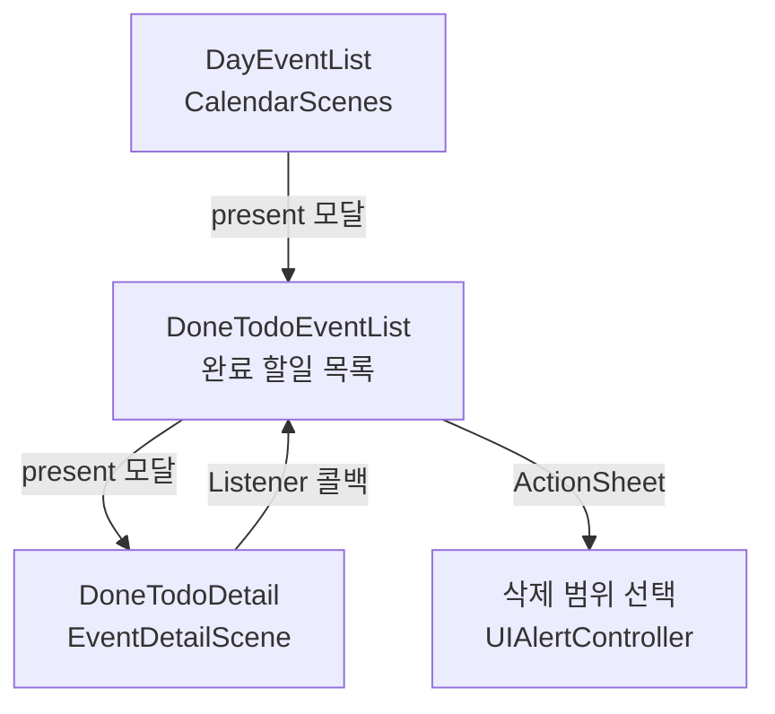
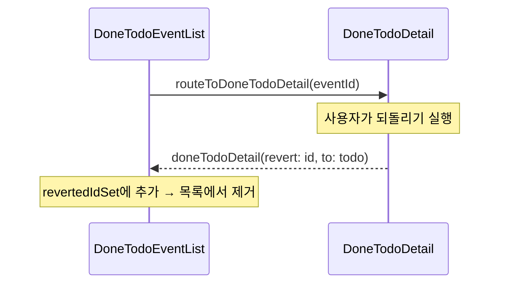

# EventListScenes Framework — CLAUDE.md

## 개요

완료된 할일(DoneTodo) 목록 화면. 단일 Scene 프레임워크로, 완료 할일의 페이지네이션 목록, 되돌리기, 기간별 삭제 기능을 제공한다.

---

## 폴더 구조

```
EventListScenes/
├── Sources/
│   ├── EventListSceneBuilderImple.swift        — 프레임워크 진입점
│   └── DoneTodoList/
│       ├── DoneTodoEventListScene+Builder.swift
│       ├── DoneTodoEventListBuilderImple.swift
│       ├── DoneTodoEventListViewController.swift  — UIHostingController
│       ├── DoneTodoEventListViewModel.swift       — 목록/페이지네이션/되돌리기/삭제
│       ├── DoneTodoEventListView.swift            — SwiftUI 목록 UI
│       └── DoneTodoEventListRouter.swift          — 상세/삭제 범위 선택 라우팅
│
└── Tests/
```

---

## Scene 상세

### DoneTodoEventList

완료일 기준으로 그룹화된 할일 목록. 스크롤 하단 도달 시 자동 페이지네이션.

| 항목 | 설명 |
|---|---|
| 표시 방식 | CalendarScenes의 DayEventList에서 모달 present |
| Interactor | `DoneTodoEventListSceneInteractor` (extends `DoneTodoDetailSceneListener`) |
| Usecase | `TodoEventUsecase`, `DoneTodoEventsPagingUsecase`, `CalendarSettingUsecase`, `UISettingUsecase` |

**주요 기능**:

| 기능 | 설명 |
|---|---|
| 페이지네이션 | `loadList()` / `loadMoreList()` — 스크롤 하단에서 자동 로드 |
| 되돌리기 | 1초 딜레이 후 실행, 딜레이 중 취소 가능 (undo-like UX) |
| 기간별 삭제 | 전체 / 1개월 / 3개월 / 6개월 / 1년 이상 된 항목 삭제 |
| 상세 보기 | DoneTodoDetail로 라우팅 |

**섹션 모델**: `DoneTodoListSectionModel` — 완료일 기준 그룹 (오늘/어제/월별/연도별)

---

## 화면 플로우



### Listener 통신



---

## 외부 의존성

| 방향 | 대상 | 용도 |
|---|---|---|
| → | EventDetailScene | DoneTodoDetail 상세 화면 (EventDetailSceneBuilder) |
| ← | CalendarScenes | DayEventListRouter에서 모달 present |
