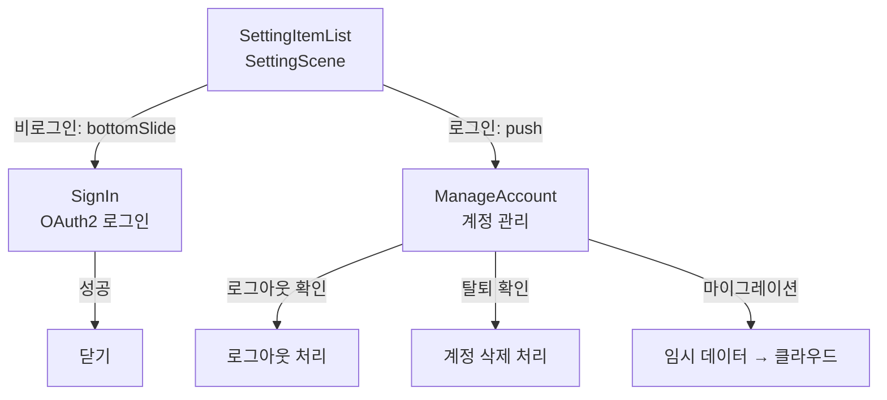
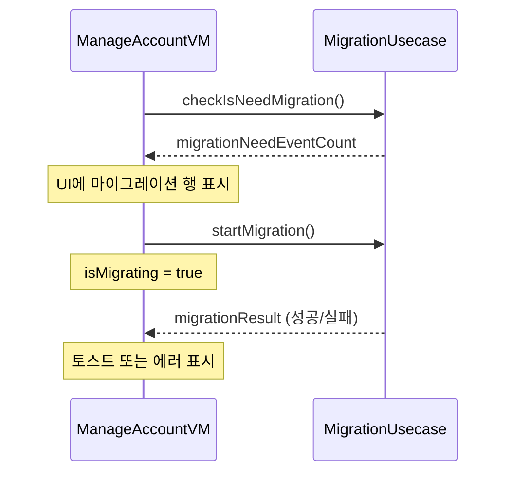

# MemberScenes Framework — CLAUDE.md

## 개요

인증 및 계정 관리 화면. OAuth2 로그인(Google)과 계정 정보/로그아웃/탈퇴/마이그레이션 기능을 제공한다.

---

## 폴더 구조

```
MemberScenes/
├── Sources/
│   ├── MemberSceneBuilderImple.swift           — 프레임워크 진입점
│   │
│   ├── SignIn/                                — OAuth2 로그인
│   │   ├── SignInScene+Builder.swift
│   │   ├── SignInBuilderImple.swift
│   │   ├── SignInViewModel.swift
│   │   ├── SignInViewController.swift          — UIHostingController
│   │   ├── SignInRouter.swift
│   │   └── SignInView.swift
│   │
│   └── ManageAccount/                         — 계정 관리
│       ├── ManageAccountScene+Builder.swift
│       ├── ManageAccountBuilderImple.swift
│       ├── ManageAccountViewModel.swift
│       ├── ManageAccountViewController.swift   — UIHostingController
│       ├── ManageAccountRouter.swift
│       └── ManageAccountView.swift
│
└── Tests/
```

---

## Scene 구성

### 화면 플로우



---

## Scene 상세

### SignIn (로그인)

| 항목 | 설명 |
|---|---|
| 표시 방식 | bottomSlide 모달 |
| OAuth 제공자 | Google (확장 가능) |
| Usecase | `AuthUsecase` |
| 로딩 상태 | `isSigningIn` Publisher |

**플로우**: OAuth 버튼 탭 → `authUsecase.signIn(provider)` → 성공 시 자동 닫기 / 실패 시 에러 표시

### ManageAccount (계정 관리)

| 항목 | 설명 |
|---|---|
| 표시 방식 | NavigationController push |
| 표시 정보 | 로그인 방법, 이메일, 마지막 로그인 시간 |
| Usecase | `AuthUsecase`, `AccountUsecase`, `TemporaryUserDataMigrationUsecase` |

**기능**:

| 기능 | 설명 |
|---|---|
| 로그아웃 | 확인 다이얼로그 → `authUsecase.signOut()` |
| 계정 삭제 | 경고 다이얼로그 → `authUsecase.deleteAccount()` |
| 마이그레이션 | 비로그인 시절 데이터를 클라우드로 이전. `prepare()`에서 필요 여부 확인 |

### ManageAccount 마이그레이션 플로우



---

## 외부 의존성

| 방향 | 대상 | 용도 |
|---|---|---|
| ← | SettingScene | SettingItemListRouter에서 로그인/계정관리 라우팅 |
