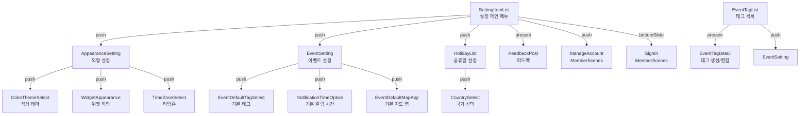
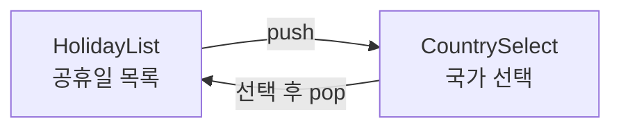
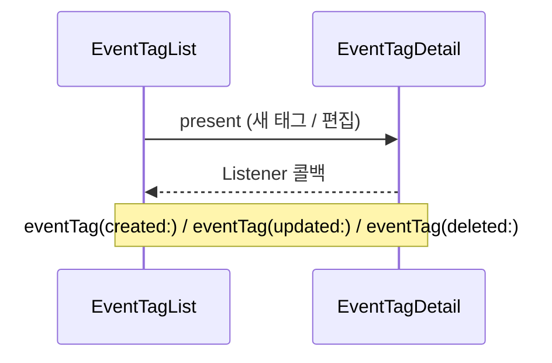
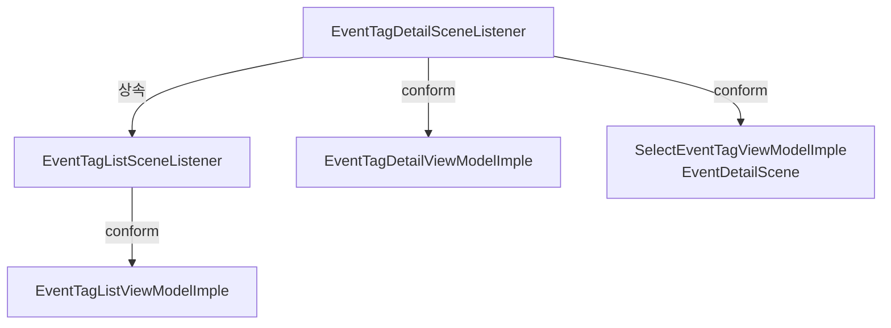
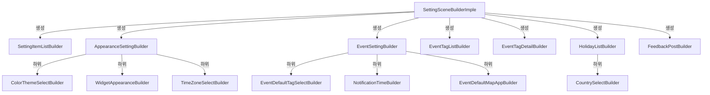

# SettingScene Framework — CLAUDE.md

## 개요

앱 설정 화면. 외형 설정, 이벤트 기본값, 공휴일, 태그 관리, 피드백 등 설정 관련 Scene들을 포함한다.

---

## 폴더 구조

```
SettingScene/
├── Sources/
│   ├── SettingSceneBuilderImple.swift          — 프레임워크 진입점 (전체 Builder 조립)
│   │
│   ├── Setting/                               — 설정 메인 + 외형
│   │   ├── SettingItemList/                   — 설정 메인 메뉴 (루트)
│   │   │   ├── SettingItemListScene+Builder.swift
│   │   │   ├── SettingItemListBuilderImple.swift
│   │   │   ├── SettingItemListViewModel.swift
│   │   │   ├── SettingItemListViewController.swift
│   │   │   ├── SettingItemListRouter.swift     — 모든 설정 하위 화면 라우팅
│   │   │   └── SettingItemListView.swift
│   │   │
│   │   ├── Appearance/                        — 외형 설정
│   │   │   ├── AppearanceSettingScene+Builder.swift
│   │   │   ├── AppearanceSettingBuilderImple.swift
│   │   │   ├── AppearanceSettingViewModel.swift  — 3개 서브 VM 포함
│   │   │   ├── AppearanceSettingViewController.swift
│   │   │   ├── AppearanceSettingRouter.swift
│   │   │   ├── AppearanceSettingView.swift
│   │   │   │
│   │   │   ├── ColorTheme/                    — 색상 테마 선택
│   │   │   ├── Widget/                        — 위젯 외형 설정
│   │   │   └── TimeZone/                      — 타임존 선택
│   │   │
│   │   └── Holiday/                           — 공휴일 설정
│   │       ├── HolidayListScene+Builder.swift
│   │       ├── HolidayListBuilderImple.swift
│   │       ├── HolidayListViewModel.swift
│   │       ├── HolidayListViewController.swift
│   │       ├── HolidayListRouter.swift
│   │       ├── HolidayListView.swift
│   │       │
│   │       └── CountrySelect*/               — 국가 선택
│   │
│   ├── Event/                                 — 이벤트 기본값 설정
│   │   ├── EventSettingScene+Builder.swift
│   │   ├── EventSettingBuilderImple.swift
│   │   ├── EventSettingViewModel.swift
│   │   ├── EventSettingViewController.swift
│   │   ├── EventSettingRouter.swift
│   │   ├── EventSettingView.swift
│   │   │
│   │   ├── EventDefaultTagSelect/                   — 기본 태그 선택
│   │   ├── EventNotificationDefaultTimeOption/ — 기본 알림 시간
│   │   └── EventDefaultMapApp/                — 기본 지도 앱
│   │
│   ├── EventTag/                              — 태그 관리
│   │   ├── EventTagList/                      — 태그 목록 (토글/편집)
│   │   └── EventTagDetail/                    — 태그 생성/편집 (이름/색상)
│   │
│   └── Support/
│       └── Feedback/                          — 피드백 전송
│
└── Tests/
```

---

## Scene 구성

### 전체 화면 플로우



---

## Scene 상세

### SettingItemList (설정 메인 메뉴 — 루트)

모든 설정 하위 화면의 진입점. 네비게이션 허브 역할.

| 항목 | 설명 |
|---|---|
| 표시 항목 | 외형, 이벤트 설정, 공휴일, 계정, 공유, 피드백 |
| 계정 상태 | 로그인 여부에 따라 "로그인" 또는 "계정 관리" 표시 |

### AppearanceSetting (외형 설정)

3개의 서브 ViewModel로 섹션을 나눈다.

| 서브 VM | 섹션 | 설정 항목 |
|---|---|---|
| `CalendarSectionViewModelImple` | 캘린더 | 시작 요일, 주간 표시 수, 한글 달력 등 |
| `EventOnCalendarViewModelImple` | 캘린더 이벤트 | 태그 색상 표시, 할일 표시 등 |
| `EventListAppearnaceSettingViewModelImple` | 이벤트 목록 | 12/24시 형식 등 |

하위 화면: ColorThemeSelect, WidgetAppearanceSetting, TimeZoneSelect (모두 leaf)

### EventSetting (이벤트 기본값)

| 항목 | 설명 |
|---|---|
| 기본 태그 | EventDefaultTagSelect로 선택 |
| 기본 알림 시간 | 일반 이벤트 / 하루종일 이벤트 각각 설정 |
| 기본 지도 앱 | EventDefaultMapApp으로 선택 |

### HolidayList + CountrySelect (공휴일)



### EventTagList + EventTagDetail (태그 관리)



| 항목 | 설명 |
|---|---|
| EventTagList | 커스텀 + 외부 캘린더 태그 목록, 보이기/숨기기 토글 |
| EventTagDetail | 태그 이름/색상 편집, 삭제 |
| Listener | `EventTagDetailSceneListener` — created/updated/deleted 콜백 |
| `isRootNavigation` | true면 모달 dismiss, false면 nav pop |

### FeedbackPost (피드백)

| 항목 | 설명 |
|---|---|
| 표시 방식 | present (모달) |
| 역할 | 사용자 피드백/버그 리포트 전송 |
| 라우팅 | 없음 (leaf) |

---

## Listener 프로토콜



`EventTagDetailSceneListener`는 SettingScene 내부뿐 아니라 EventDetailScene의 SelectEventTag에서도 사용된다.

---

## Builder 조립



---

## 외부 의존성

| 방향 | 대상 | 용도 |
|---|---|---|
| → | MemberScenes | 로그인/계정 관리 (MemberSceneBuilder) |
| ← | TodoCalendarApp | ApplicationRootBuilder에서 생성 |
| ← | EventDetailScene | SelectEventTag에서 태그 관리 화면 사용 (SettingSceneBuilder) |
