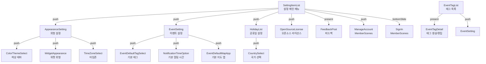
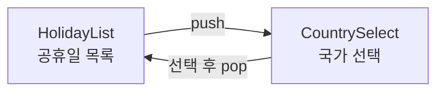
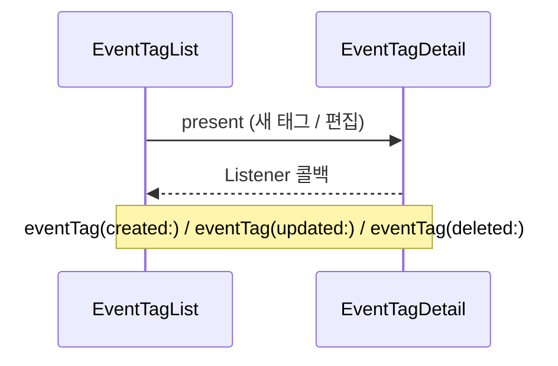
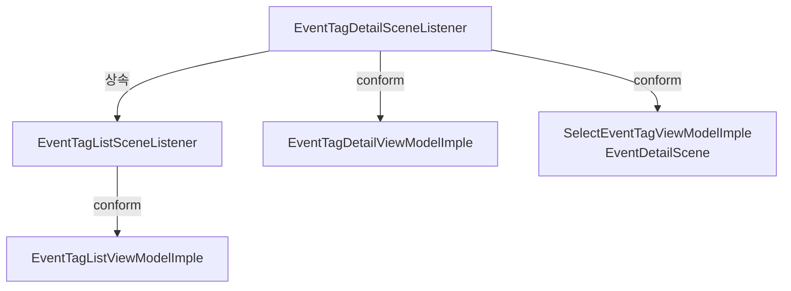
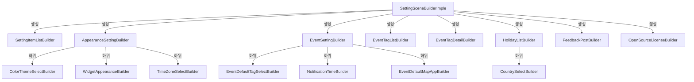

# SettingScene Framework — CLAUDE.md

## 개요

앱 설정 화면. 외형 설정, 이벤트 기본값, 공휴일, 태그 관리, 피드백 등 설정 관련 Scene들을 포함한다.

---

## Scene 구성

### 전체 화면 플로우

```mermaid
graph TD
    SIL[SettingItemList<br/>설정 메인 메뉴] -->|push| AS[AppearanceSetting<br/>외형 설정]
    SIL -->|push| ES[EventSetting<br/>이벤트 설정]
    SIL -->|push| HL[HolidayList<br/>공휴일 설정]
    SIL -->|push| OSL[OpenSourceLicense<br/>오픈소스 라이선스]
    SIL -->|present| FP[FeedbackPost<br/>피드백]
    SIL -->|push| MA[ManageAccount<br/>MemberScenes]
    SIL -->|bottomSlide| SI[SignIn<br/>MemberScenes]

    AS -->|push| CT[ColorThemeSelect<br/>색상 테마]
    AS -->|push| WA[WidgetAppearance<br/>위젯 외형]
    AS -->|push| TZ[TimeZoneSelect<br/>타임존]

    ES -->|push| ETS[EventDefaultTagSelect<br/>기본 태그]
    ES -->|push| ENT[NotificationTimeOption<br/>기본 알림 시간]
    ES -->|push| EMA[EventDefaultMapApp<br/>기본 지도 앱]

    HL -->|push| CS[CountrySelect<br/>국가 선택]

    ETL[EventTagList<br/>태그 목록] -->|present| ETD[EventTagDetail<br/>태그 생성/편집]
    ETL -->|push| ES2[EventSetting]
```

---

## Scene 상세

### SettingItemList (설정 메인 메뉴 — 루트)

모든 설정 하위 화면의 진입점. 네비게이션 허브 역할.

| 항목 | 설명 |
|---|---|
| 표시 항목 | 외형, 이벤트 설정, 공휴일, 계정, 공유, 피드백 |
| 계정 상태 | 로그인 여부에 따라 "로그인" 또는 "계정 관리" 표시 |

### AppearanceSetting (외형 설정)

3개의 서브 ViewModel로 섹션을 나눈다.

| 서브 VM | 섹션 | 설정 항목 |
|---|---|---|
| `CalendarSectionViewModelImple` | 캘린더 | 시작 요일, 주간 표시 수, 한글 달력 등 |
| `EventOnCalendarViewModelImple` | 캘린더 이벤트 | 태그 색상 표시, 할일 표시 등 |
| `EventListAppearnaceSettingViewModelImple` | 이벤트 목록 | 12/24시 형식 등 |

하위 화면: ColorThemeSelect, WidgetAppearanceSetting, TimeZoneSelect (모두 leaf)

### EventSetting (이벤트 기본값)

| 항목 | 설명 |
|---|---|
| 기본 태그 | EventDefaultTagSelect로 선택 |
| 기본 알림 시간 | 일반 이벤트 / 하루종일 이벤트 각각 설정 |
| 기본 지도 앱 | EventDefaultMapApp으로 선택 |

### HolidayList + CountrySelect (공휴일)

```mermaid
graph LR
    HL[HolidayList<br/>공휴일 목록] -->|push| CS[CountrySelect<br/>국가 선택]
    CS -->|선택 후 pop| HL
```

### EventTagList + EventTagDetail (태그 관리)

```mermaid
sequenceDiagram
    participant ETL as EventTagList
    participant ETD as EventTagDetail

    ETL->>ETD: present (새 태그 / 편집)
    ETD-->>ETL: Listener 콜백
    Note over ETD,ETL: eventTag(created:) / eventTag(updated:) / eventTag(deleted:)
```

| 항목 | 설명 |
|---|---|
| EventTagList | 커스텀 + 외부 캘린더 태그 목록, 보이기/숨기기 토글 |
| EventTagDetail | 태그 이름/색상 편집, 삭제 |
| Listener | `EventTagDetailSceneListener` — created/updated/deleted 콜백 |
| `isRootNavigation` | true면 모달 dismiss, false면 nav pop |

### OpenSourceLicense (오픈소스 라이선스)

| 항목 | 설명 |
|---|---|
| 표시 방식 | push (leaf) |
| 데이터 | `Resources/open-source-licenses.json` — `Bundle.module`로 로드. 라이브러리 30개 메타 + 라이선스 종류별 전문 6부 |
| 화면 구성 | 라이브러리 목록(이름·저작권·라이선스명, 탭하면 소스 저장소를 사파리로) + 하단에 종류별 전문 |
| 갱신 | SPM 의존성이 바뀌면 JSON을 손으로 갱신 |

### FeedbackPost (피드백)

| 항목 | 설명 |
|---|---|
| 표시 방식 | present (모달) |
| 역할 | 사용자 피드백/버그 리포트 전송 |
| 라우팅 | 없음 (leaf) |

---

## Listener 프로토콜

```mermaid
graph TD
    ETDL[EventTagDetailSceneListener] -->|상속| ETLL[EventTagListSceneListener]
    ETDL -->|conform| ETD_VM[EventTagDetailViewModelImple]
    ETLL -->|conform| ETL_VM[EventTagListViewModelImple]
    ETDL -->|conform| SET_VM[SelectEventTagViewModelImple<br/>EventDetailScene]
```

`EventTagDetailSceneListener`는 SettingScene 내부뿐 아니라 EventDetailScene의 SelectEventTag에서도 사용된다.

---

## Builder 조립

```mermaid
graph TD
    SSB[SettingSceneBuilderImple] -->|생성| SIL[SettingItemListBuilder]
    SSB -->|생성| ASB[AppearanceSettingBuilder]
    SSB -->|생성| ESB[EventSettingBuilder]
    SSB -->|생성| ETLB[EventTagListBuilder]
    SSB -->|생성| ETDB[EventTagDetailBuilder]
    SSB -->|생성| HLB[HolidayListBuilder]
    SSB -->|생성| FPB[FeedbackPostBuilder]
    SSB -->|생성| OSLB[OpenSourceLicenseBuilder]

    ASB -->|하위| CTB[ColorThemeSelectBuilder]
    ASB -->|하위| WAB[WidgetAppearanceBuilder]
    ASB -->|하위| TZB[TimeZoneSelectBuilder]

    ESB -->|하위| ETSB[EventDefaultTagSelectBuilder]
    ESB -->|하위| ENTB[NotificationTimeBuilder]
    ESB -->|하위| EMAB[EventDefaultMapAppBuilder]

    HLB -->|하위| CSB[CountrySelectBuilder]
```

---

## 프레임워크 내부 공용 컴포넌트

전용 공용 폴더 없이 기능 하위폴더끼리 교차 참조 중 — 새 공용 뷰 추가 시 rules §2 배치 규칙(전용 폴더) 따를 것.

| 컴포넌트 | 위치 | 역할 | 사용처 |
|---|---|---|---|
| `CalendarAppearanceSampleView` | `Setting/Appearance/CalendarSection/CalendarAppearancePreviewView.swift` | 설정 미리보기용 미니 월간 캘린더 샘플 | CalendarAppearancePreviewView, ColorThemeSelectView |
| `ColorThemePreviewView` / `ColorThemeItemView` | `Setting/Appearance/ColorTheme/ColorThemePreviewView.swift` | 색 테마 미리보기 / 선택 아이템 셀 | ColorTheme 내부 + CalendarAppearancePreviewView |

---

## 외부 의존성

| 방향 | 대상 | 용도 |
|---|---|---|
| → | MemberScenes | 로그인/계정 관리 (MemberSceneBuilder) |
| ← | TodoCalendarApp | ApplicationRootBuilder에서 생성 |
| ← | EventDetailScene | SelectEventTag에서 태그 관리 화면 사용 (SettingSceneBuilder) |
