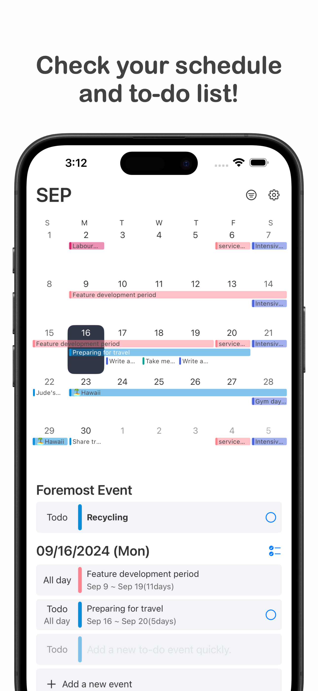
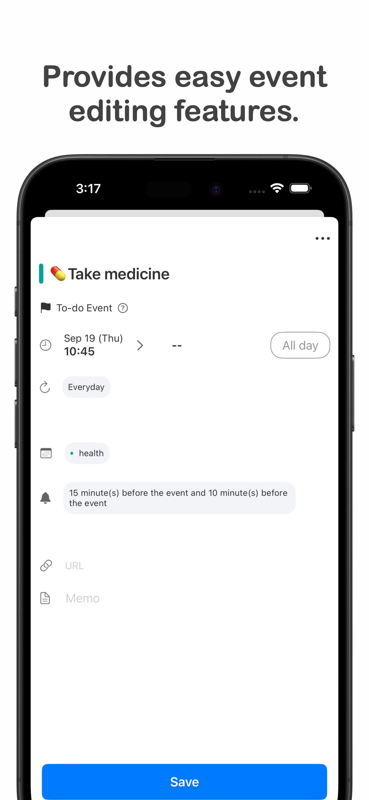
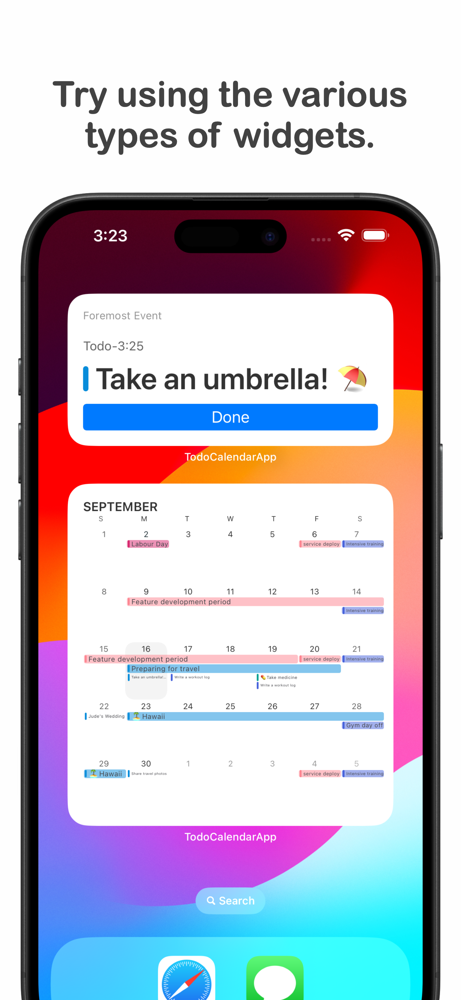
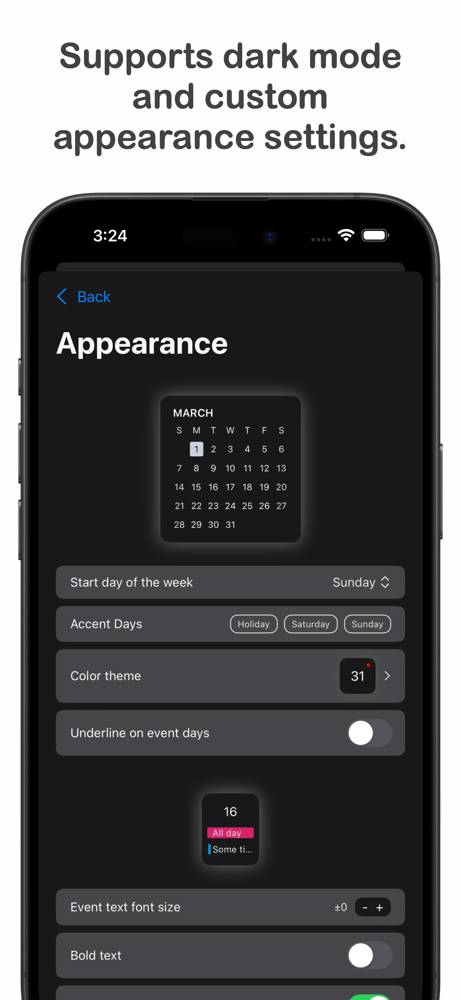

# To-do Calendar
할일 목록이 있는 iOS 달력 앱

  |  |  |  
 ---|---|---|---


## What is To-do Calendar?
To-do Calendar는 할일 목록을 관리할 수 있는 달력 앱 입니다.
앱이 제공하는 다음의 기능들을 이용하여 일정 및 할일을 관리하세요.

- 일반 달력앱과 같이 일정을 달력에 추가하세요.
- 할일도 달력에 추가하여 관리할 수 있습니다.
- 추가한 일정 및 할일에 미리알림을 추가하거나, 이 중 제일 중요한 이벤트를 등록하세요.
- 앱이 제공하는 다양한 종류의 위젯을 사용하여 더 간편하게 일정을 관리하세요.


## Install
1. 이 repository를 클론 받고 develop 브랜치를 checkout 합니다.
   
2. clone 받은 프로젝트 디렉토리로 이동하여 [./install/install.sh](./install/install.sh)를 실행해주세요. 프로젝트 빌드를 위해 필요한 더미 파일들이 필요한 위치로 이동됩니다.

3. [Tuist](https://docs.tuist.io/guides/quick-start/install-tuist)를 설치합니다. v3 버전이 필요합니다.
   
4. 다음을 실행하여 dependency를 fetch하고 Xcode project를 생성하세요
   
   ```bash
   tuist fetch
   tuist generate --no-open
   ```
   
5. 생성된 TodoCalendar.xcworkspace를 사용하여 Xcode를 실행시킵니다.
   
6. `TodoCalendarApp ` Scheme 을 선택하고 앱을 실행시킵니다

   
클론받은 앱은 오프라인 모드로만 사용이 가능합니다.(로그인 및 계정 관련 기능 정상동작 x) 해당 기능을 포함하여 빌드하려는 경우 [문의](mailto:todocalendar.help@gmail.com)해주세요


## 프로젝트 구조


### Domain
```
Domain
├── Models
├── Repositories
├── Usecases
└── Utils
```
서비스 구현을 위한 Model과 Usecase 구현체가 포함됩니다.
`Usecase`의 경우 전체 서비스를 서브도메인에 따라 역할이 나뉘어져있고, 앱 내에서 재사용되기 위한 로직들이 구현되어있습니다.
또한 `Usecase` 구현을 위한 `Repository` 의 인터페이스들을 포함합니다.


### Repository
```
Repository
├── Extensions
├── Local
├── Remote
└── Repository+Imple
```
`Repository` 구현체들을 포하함하며, 이들은 데이터를 저장/조회 하는 역할을 합니다. 구현체가 하나만 있는 경우도 있지만, 온라인(로그인)/오프라인 유저의 데이터를 처리하기 위해 Remote, Local 구현체로 분리되어 구현되는 경우도 있습니다.

### Presentations
```
Presentations
├── CalendarScenes
├── CommonPresentation
├── EventDetailScene
├── EventListScenes
├── MemberScenes
├── Scenes
└── SettingScene
```
Presentation group에는 ui를 구현하는 framework들을 포함합니다. 응집도가 높은 화면들을 묶어 하나의 framework를 구현합니다. 개별 framework들은 다음 화면들을 포함합니다.
- `CalendarScenes`: 달력 및 해당 날짜에 속한 이벤트 리스트를 표현하기 위한 화면을 포함합니다.
- `EventDetailScene`: 이벤트 상세 및 수정/선택 기능을 제공하는 화면들을 포함합니다.
- `EventListScenes`: 달력과 상관없이 이벤트 목록을 노출하는 화면을 포함합니다. 대표적으로 완료된 할일 리스트 화면이 포함됩니다.
- `MemberScenes`: 회원과 관련된 화면을 포함합니다. 대표적으로 로그인 및 회원정보 관련된 화면이 포함됩니다.
- `SettingScene`: 설정과 관련된 화면들이 포함됩니다.

서로 분리된 framework 간 결합도는 낮지만 한 framework에 속한 화면에서 다른 framework에 속한 화면으로의 전환이 필요한 경우가 있습니다. 이 경우 `Scenes` framework에 정의된 `Sceene protocol`을 참조하게 됩니다. 
또한 ui구현을 위한 공통 로직은 `CommonPresentation` framework에 위치합니다.

### TodoCalendarApp
```
TodoCalendarApp/Sources
├── AppDelegate.swift
├── AppEnvironment.swift
├── Factories
├── Main
├── Root
└── SceneDelegate.swift
```
TodoCalendarApp Target은 To-do calendar 앱에 해당합니다. 앱의 구현을 위해 위에 나열된 framework 및 다른 framework를 모두 포함합니다. 이 외 아래와 같은 파일/폴더를 포함합니다.
- `AppEnvironment.swift`: 앱 실행 환경에 관련된 코드를 포함합니다.
- `Factories`: `Scenes` framework에 정의된 usecaseFactory 구현체들을 포함합니다. 구현체는 로그인 여부에 따라 `NonLoginUsecaseFactoryImple`, `LoginUsecaseFactoryImple` 으로 나눠지게되며, 어떤 객체가 사용될지는 로그인/로그아웃 시점에 분기됩니다.
- `Main`: 앱 메인화면에 해당하는 코드 파일을 포함하는 폴더입니다.
- `Root`: 앱 루트에 해당하는 객체를 포함하는 폴더입니다. `AppDelegate`, `SceneDelegate`에서 해당 폴더에 구현된 객체를 사용하여 필요 동작을 수행합니다.


## 화면단위 구조
자세한 내용은 [화면단위구조](./docs/화면단위구조.md) 문서를 참고해주세요.
