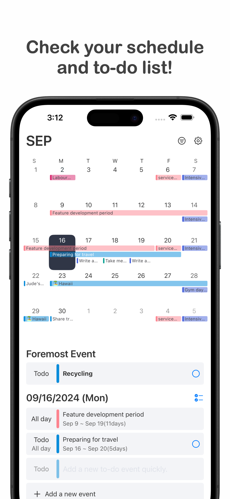
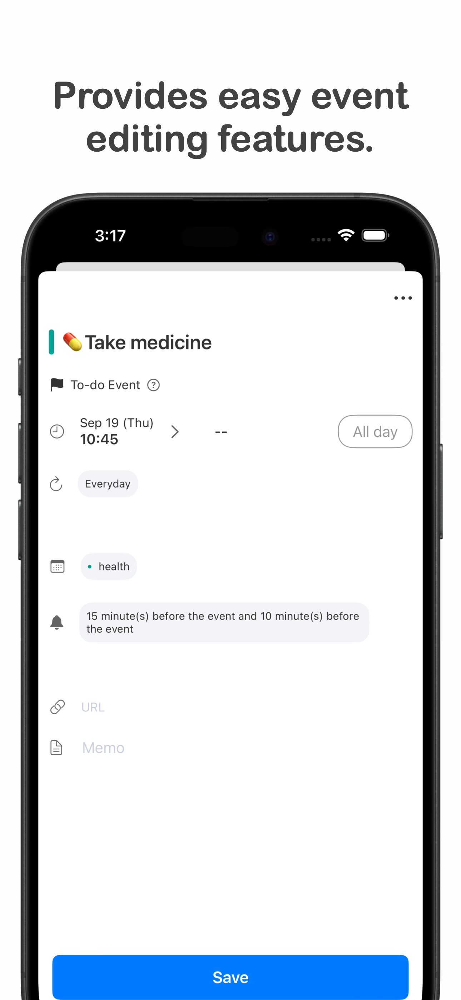
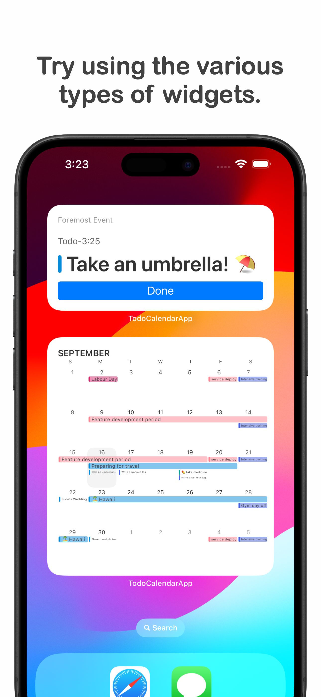
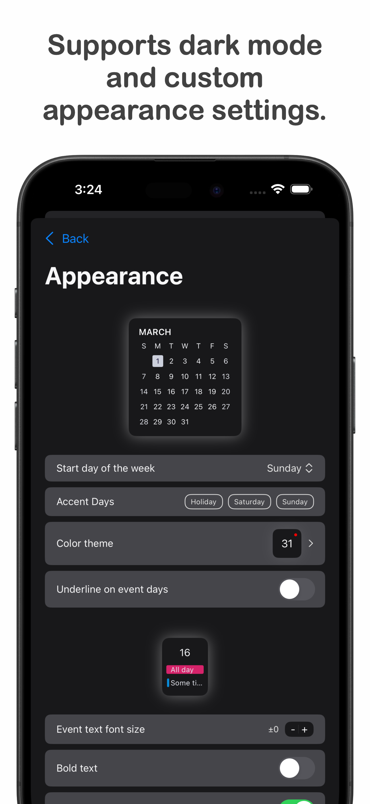

# To-do Calendar
할일 목록이 있는 iOS 달력 앱

  |  |  |  
 ---|---|---|---


## What is To-do Calendar?
일정은 달력에, 할일은 다른 앱에 흩어져 있으면 "이번 달에 뭐가 있고 뭘 아직 못 했는지"를 두 군데서 확인해야 합니다. To-do Calendar는 둘을 같은 달력 위에 올립니다. 일정은 그 날짜에 놓이고, 할일은 완료할 때까지 남습니다.

로그인 없이도 모든 핵심 기능을 쓸 수 있고, 로그인하면 서버 동기화와 AI 입력이 열립니다.

- **하나의 달력, 두 종류의 일** — 일정과 할일을 같은 그리드에 표시합니다. 직접 만든 이벤트 종류(태그)로 색을 구분하고, 기한이 지난 미완료 할일은 과거 날짜에 묻히지 않도록 달력 상단에 고정됩니다.
- **반복 · 강조 · 알림** — 매일/매주/매월/매년/특정일/음력 6가지 반복, 이벤트당 복수 알림, 가장 중요한 이벤트 1개를 고정하는 강조 이벤트를 제공합니다.
- **AI 빠른 입력** — 말하듯 적으면 이벤트가 됩니다. 음성·키보드·이미지(OCR) 세 가지 입력을 받고, Siri·위젯·제어 센터·공유 시트에서 앱을 열지 않고도 보낼 수 있습니다. 추가뿐 아니라 시간 이동·이름 변경·완료·삭제도 처리하며, 무언가를 지우거나 바꾸는 작업은 실행 전 확인을 받습니다.
- **위젯 19종 + 잠금화면 + Live Activity** — 홈 화면 위젯에서 할일을 바로 완료할 수 있고, 곧 시작하는 이벤트는 잠금화면과 다이나믹 아일랜드에서 카운트다운됩니다.
- **외부 캘린더 합산** — Google 캘린더는 여러 계정을 동시에 연결할 수 있고, Apple 캘린더는 기기 권한 한 번으로 붙습니다. 연동을 해제해도 원본 데이터는 지워지지 않습니다.
- **플랜과 크레딧** — 무료/스탠다드/라이프타임 플랜과 크레딧 top-up을 StoreKit으로 구매합니다.


## Install
1. 이 repository를 클론 받고 develop 브랜치를 checkout 합니다.
   
2. clone 받은 프로젝트 디렉토리로 이동하여 [./install/install.sh](./install/install.sh)를 실행해주세요. 프로젝트 빌드를 위해 필요한 더미 파일들이 필요한 위치로 이동됩니다.

3. [mise](https://mise.jdx.dev/)를 설치하고, 프로젝트 루트에서 Tuist를 설치합니다.
   
   ```bash
   brew install mise
   mise install      # mise.toml에 정의된 tuist 버전(4.x) 자동 설치
   ```
   
4. 다음을 실행하여 dependency를 설치하고 Xcode project를 생성하세요
   
   ```bash
   tuist install
   tuist generate --no-open
   ```
   
   파일을 추가하거나 삭제한 뒤에는 `tuist generate --no-open`을 다시 실행해야 합니다.
   
5. 생성된 TodoCalendar.xcworkspace를 사용하여 Xcode를 실행시킵니다.
   
6. `TodoCalendarApp ` Scheme 을 선택하고 앱을 실행시킵니다

   
클론받은 앱은 오프라인 모드로만 사용이 가능합니다.(로그인 및 계정 관련 기능 정상동작 x) 해당 기능을 포함하여 빌드하려는 경우 [문의](mailto:todocalendar.help@gmail.com)해주세요


## 테스트
전체 스킴을 순차 실행합니다. 인자로 스킴 이름을 주면 해당 스킴만 실행합니다.

```bash
./scripts/run-all-tests.sh              # 전체
./scripts/run-all-tests.sh Domain       # 특정 스킴만
```


## 프로젝트 구조


iOS 17+ / Swift 6.0 / SwiftUI + UIKit 하이브리드. 모든 프레임워크는 static framework로 빌드되며, Tuist 4로 워크스페이스를 생성합니다. 의존성 방향은 아래 한 방향입니다.

```
TodoCalendarApp → Presentations → Scenes / CommonPresentation → Domain ← Repository · Services
```

### Domain
```
Domain/Sources
├── Models
├── Repositories
├── Usecases
└── Utils
```
서비스 구현을 위한 Model과 Usecase 구현체가 포함됩니다. `Usecase`는 서브도메인(Events, Calendar, Account, AI, Billing, Notification, Setting, Speech, Ad, ImageText, Support)에 따라 역할이 나뉘어져 있으며, 앱 내에서 재사용되기 위한 로직들이 구현되어있습니다. 또한 `Usecase` 구현을 위한 `Repository`의 인터페이스들을 포함합니다.

Domain은 데이터 소스도, 실행 환경도 모릅니다. 어떤 구현체를 쓸지는 앱 조립 시점(composition root)에 결정됩니다.

### Repository
```
Repository/Sources
├── Extensions
├── Local
├── Remote
└── Repository+Imple
```
`Repository` 구현체들을 포함하며, 이들은 데이터를 저장/조회 하는 역할을 합니다. 구현체가 하나만 있는 경우도 있지만, 온라인(로그인)/오프라인 유저의 데이터를 처리하기 위해 Remote, Local 구현체로 분리되어 구현되는 경우도 있습니다. 외부 캘린더(Google/Apple)는 계정별 Pool로 다중 계정을 처리합니다.

### Presentations
```
Presentations
├── Scenes              # Scene 간 공유 프로토콜 (경계)
├── CommonPresentation  # 공통 UI 컴포넌트 · 테마
├── CalendarScenes
├── EventDetailScene
├── EventListScenes
├── MemberScenes
├── SettingScene
├── AIAgentScene
└── BillingScenes
```
ui를 구현하는 framework들을 포함합니다. 응집도가 높은 화면들을 묶어 하나의 framework를 구현합니다.
- `CalendarScenes`: 달력 및 해당 날짜에 속한 이벤트 리스트를 표현하기 위한 화면을 포함합니다.
- `EventDetailScene`: 이벤트 상세 및 수정/선택 기능을 제공하는 화면들을 포함합니다.
- `EventListScenes`: 달력과 상관없이 이벤트 목록을 노출하는 화면을 포함합니다. 대표적으로 완료된 할일 리스트 화면이 포함됩니다.
- `MemberScenes`: 회원과 관련된 화면을 포함합니다. 대표적으로 로그인 및 회원정보 관련된 화면이 포함됩니다.
- `SettingScene`: 설정과 관련된 화면들이 포함됩니다.
- `AIAgentScene`: AI 입력 화면들을 포함합니다. 음성/키보드/이미지 입력과 진행 상태·확인 요청 표시가 여기에 속합니다.
- `BillingScenes`: 플랜과 크레딧 top-up을 구매하는 paywall 화면을 포함합니다.

Presentation framework끼리는 직접 import 하지 않습니다. 다른 framework에 속한 화면으로 전환해야 하는 경우 `Scenes` framework에 정의된 Scene 프로토콜만 참조합니다. ui구현을 위한 공통 로직은 `CommonPresentation` framework에 위치합니다.

Scene 하나를 구성하는 파일과 컴포넌트 간 관계는 [화면단위 구조](./docs/화면단위구조.md) 문서를 참고해주세요.

### Services
```
Services
├── AuthService         # Google · Apple OAuth2, 외부 캘린더 인증
├── FirstPartyServices  # 로컬 알림(UserNotifications) · 이미지 텍스트 인식(Vision)
├── SpeechService       # 음성 인식 · 마이크 권한
├── PlaceService        # 장소 검색(MapKit)
├── ExternalServices    # 링크 프리뷰
├── StoreKitService     # StoreKit 2 구매 · 구독 관리 시트
└── AdService           # Google Mobile Ads
```
외부 SDK에 결합되는 service 구현체들을 SDK 단위로 분리한 그룹입니다. Usecase는 Domain에 남고 여기 있는 service 프로토콜을 소비하기 때문에, SDK 교체가 Domain으로 번지지 않습니다.

### Supports
```
Supports
├── Extensions          # 공통 확장 · 유틸
├── Common3rdParty      # 공통 3rd party 의존성 재노출
├── UnitTestHelpKit     # 테스트 베이스 클래스 · 헬퍼
├── TestDoubles         # 공유 stub/spy
└── SnapshotTestHelpKit # 스냅샷 테스트 헬퍼
```

### TodoCalendarApp
```
TodoCalendarApp
├── Sources
│   ├── AppDelegate.swift
│   ├── SceneDelegate.swift
│   ├── AppEnvironment.swift
│   ├── AppIntents        # Siri · 단축어 (Add with AI)
│   ├── Factories
│   ├── LiveActivity
│   ├── Main
│   └── Root
└── AppExtensions
    ├── Widget            # 위젯 19종 · Control Widget · Live Activity
    ├── Share             # 공유 시트에서 AI 입력으로 전달
    ├── IntentExtensions   # 위젯 설정 intent 처리
    └── Base              # 확장 공용 조립 코드
```
TodoCalendarApp Target은 To-do calendar 앱에 해당합니다. 앱의 구현을 위해 위에 나열된 framework 및 다른 framework를 모두 포함합니다.
- `AppEnvironment.swift`: DB 버전, App Group ID, 외부 캘린더 서비스 목록 등 앱 실행 환경에 관련된 값을 모아둡니다.
- `Factories`: `Scenes` framework에 정의된 usecaseFactory 구현체들을 포함합니다. 구현체는 로그인 여부에 따라 `NonLoginUsecaseFactoryImple`, `LoginUsecaseFactoryImple` 으로 나눠지게되며, 어떤 객체가 사용될지는 로그인/로그아웃 시점에 분기됩니다.
- `Main`: 앱 메인화면에 해당하는 코드 파일을 포함하는 폴더입니다.
- `Root`: 앱 루트에 해당하는 객체를 포함하는 폴더입니다. `AppDelegate`, `SceneDelegate`에서 해당 폴더에 구현된 객체를 사용하여 필요 동작을 수행합니다. 모든 Repository/Usecase/Factory 조립은 `ApplicationRootBuilder`에서 이루어집니다.
- `AppExtensions`: 위젯·공유 시트·위젯 설정 intent 확장 타겟입니다. 앱과 App Group을 통해 같은 DB를 공유합니다.


## 문서
| 문서 | 내용 |
|---|---|
| [제품 기획서](./docs/product-specification.md) | 기능·정책 전체 명세. 각 영역 상세는 [`docs/spec/`](./docs/spec) |
| [도메인 컨텍스트 지도](./docs/domain-context-map.md) | 서브도메인 경계와 공통 용어 |
| [화면단위 구조](./docs/화면단위구조.md) | Scene 구성 요소·SwiftUI 통합·Scene 간 통신 |
| [코딩 스타일](./docs/coding-style-and-philosophy.md) | 컨벤션과 설계 원칙 |
