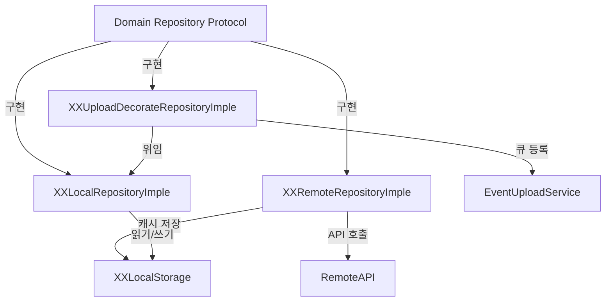
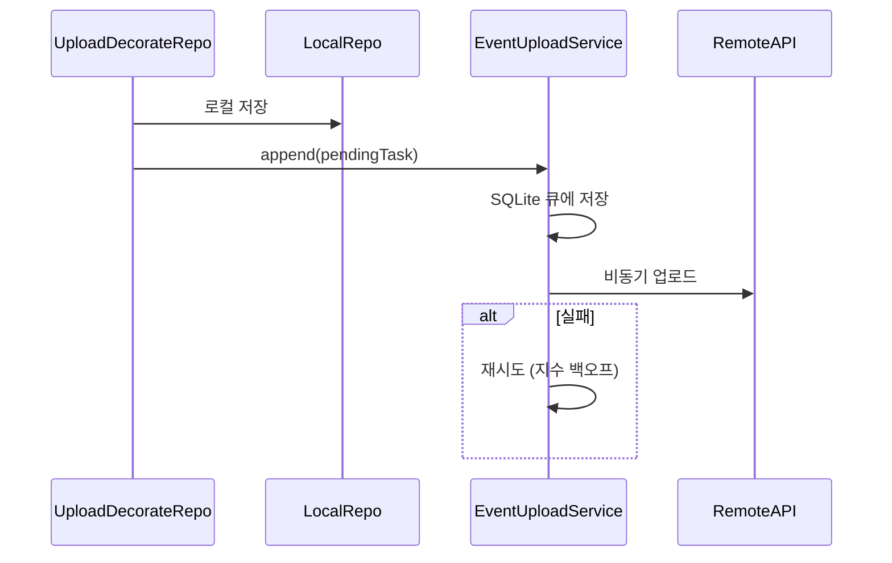

# Repository Framework — CLAUDE.md

## 개요

오프라인 우선(offline-first) 데이터 계층. SQLite 로컬 저장소 + Alamofire 기반 원격 API + 오프라인 싱크 큐로 구성된다.

---

## 폴더 구조

```
Repository/
├── Sources/
│   ├── Local/                          — DB 인프라 (SQLite, Keychain, UserDefaults)
│   │   ├── SQLiteLocalStorage+Migration.swift  — 전체 마이그레이션 오케스트레이터
│   │   ├── EnvironmentStorage.swift    — UserDefaults 기반 앱 설정 저장
│   │   ├── KeyChainStorage.swift       — Keychain 인증 정보 저장
│   │   └── KeyValueTable.swift         — 범용 key-value 테이블
│   │
│   ├── Remote/                         — API 클라이언트 인프라
│   │   ├── RemoteAPI.swift             — Alamofire 세션 래퍼 (프로토콜 + 구현)
│   │   ├── Endpoint.swift              — Enum 기반 API 엔드포인트 정의
│   │   ├── Authenticators/             — OAuth 토큰 리프레시 (Google, Calendar)
│   │   └── Credential+AuthStore/       — 멀티 계정 인증 정보 저장소
│   │
│   ├── Extensions/                     — 매핑 유틸리티
│   │
│   └── Repository+Imple/              — Domain Repository 구현체 (핵심)
│       ├── Event/
│       │   ├── Todo/                   — TodoEvent CRUD
│       │   │   ├── Local/              — Table, LocalStorage
│       │   │   └── Remote/             — Remote 프로토콜, Mapping
│       │   ├── Schedule/              — ScheduleEvent CRUD
│       │   ├── EventTag/              — 커스텀·외부 태그
│       │   ├── EventDetailData/       — 이벤트 상세 메타데이터
│       │   ├── ForemostEvent/         — 강조 이벤트
│       │   ├── ExternalCalendar/      — Google Calendar 연동
│       │   ├── Upload/                — 오프라인 싱크 큐 (EventUploadService)
│       │   ├── Sync/                  — 동기화 타임스탬프
│       │   └── Common/               — EventTime/Repeating 매핑 공유
│       ├── Account/                   — 로그인/로그아웃, 외부 캘린더 연동
│       ├── Calendar/                  — 캘린더 설정, 공휴일 API
│       ├── Notification/              — 이벤트 알림
│       ├── Setting/                   — 앱 설정 (Local/Remote)
│       └── Support/                   — 피드백, 앱 업데이트 체크
│
└── Tests/
    ├── Common/                        — BaseLocalTests, LocalTestable
    ├── Doubles/                       — StubRemoteAPI, FakeEnvironmentStorage
    └── (엔티티별 테스트 파일)
```

---

## 핵심 아키텍처: 3-Layer 패턴

각 주요 엔티티(Todo, Schedule, EventTag 등)는 3개의 Repository 구현체를 가진다.



| 계층 | 클래스 패턴 | 역할 |
|---|---|---|
| **Local** | `XXLocalRepositoryImple` | SQLite 직접 읽기/쓰기. 오프라인 전용 |
| **Remote** | `XXRemoteRepositoryImple` | API 호출 + 결과를 로컬에 캐시 |
| **Upload Decorator** | `XXUploadDecorateRepositoryImple` | 로컬 저장 → `EventUploadService` 큐에 등록 |

**선택 기준**: 로그인 상태에 따라 `ApplicationRootBuilder`에서 Local 또는 UploadDecorator를 주입.

---

## Storage 패턴 (SQLite)

각 엔티티의 로컬 저장은 4개 구성요소로 이루어진다.

```
XXLocalStorage (protocol)       — 쿼리/저장 인터페이스
  └─ XXLocalStorageImple        — SQLiteService 호출 구현
       └─ XXTable: Table        — 스키마 정의 + 마이그레이션
            └─ Entity: RowValueType  — CursorIterator → Entity 변환
```

### 테이블 정의 예시

```swift
struct TodoEventTable: Table {
    enum Columns: String, TableColumn {
        case uuid, name, repeatingTurn, ...
        var dataType: ColumnDataType { ... }
    }
    static func scalar(_ entity: TodoEvent, for column: Columns) -> (any ScalarType)?
}

extension TodoEvent: RowValueType {
    init(_ cursor: CursorIterator) throws { ... }
}
```

### DB 마이그레이션

**두 가지를 반드시 함께 변경:**

1. `AppEnvironment.dbVersion` 증가 (in `TodoCalendarApp`)
2. 해당 `Table`의 `migrateStatement(for version:)`에 case 추가

**중앙 오케스트레이터**: `SQLiteLocalStorage+Migration.swift`가 버전별로 모든 테이블의 마이그레이션을 실행.

```swift
// 예: v5 → v6 (repeatingTurn 컬럼 추가)
static func migrateStatement(for version: Int32) -> String? {
    switch version {
    case 5: return Self.addColumnStatement(.repeatingTurn)
    default: return nil
    }
}
```

---

## Remote 패턴 (Alamofire)

### 구성요소

| 파일 | 역할 |
|---|---|
| `RemoteAPI.swift` | `RemoteAPI` 프로토콜 + Alamofire `Session` 래퍼 구현 |
| `Endpoint.swift` | Enum 기반 엔드포인트 (`TodoAPIEndpoints`, `ScheduleAPIEndpoints` 등) |
| `XXRemote` (protocol) | 엔티티별 원격 API 인터페이스 (예: `TodoRemote`) |
| `XX+Mapping.swift` | JSON 인코딩/디코딩 (`asJson()`, `TodoEventMapper`) |

### 인증

- `APICredential` — accessToken, refreshToken, 만료 정보
- `APIAuthenticator` — Alamofire `Authenticator` 프로토콜 구현 (토큰 리프레시)
- `GoogleAPIAuthenticator` — Google OAuth 전용
- `AuthenticationInterceptorProxy` — 요청 어댑트 + 401 재시도
- `IntegratedAPICredentialStore` — 멀티 서비스 인증 정보 통합
- `GoogleAPICredentialStore` — 멀티 계정 Google 인증 정보

---

## 오프라인 싱크: EventUploadService

`EventUploadServiceImple` (Actor) — 오프라인에서 발생한 변경사항을 큐에 저장하고 백그라운드에서 업로드.



---

## 네이밍 규칙

| 개념 | 패턴 |
|---|---|
| Repository 구현 (Local) | `XXLocalRepositoryImple` |
| Repository 구현 (Remote) | `XXRemoteRepositoryImple` |
| Repository 구현 (Decorator) | `XXUploadDecorateRepositoryImple` |
| Remote 프로토콜 | `XXRemote` |
| Local Storage 프로토콜 | `XXLocalStorage` |
| Local Storage 구현 | `XXLocalStorageImple` |
| 테이블 | `XXTable: Table` |
| 매핑 | `XX+Mapping.swift` |

---

## 외부 캘린더 DB 구조

- 메인 DB (`todo_calendar.db`): 앱 자체 데이터. `AppEnvironment.dbVersion`으로 마이그레이션 관리.
- 외부 캘린더 DB (`google_calendar.db`): 계정별 테이블에 `accountId` 컬럼 포함. `AppEnvironment.googleCalendarDBVersion`으로 별도 관리.
- `AppDataMigrationImple`: 단일 계정 → 다중 계정 1회성 마이그레이션 (플래그 기반 멱등성)
- DB 연결은 `ExternalCalendarDBConnectionPool`이 관리하며, `onFirstOpen` 시 테이블 생성 + 마이그레이션 실행.

| 파일 | 역할 |
|---|---|
| `ExternalCalendarDBConnectionPoolImple.swift` | 참조 카운팅 DB 연결 관리 |
| `ExternalCalendarAccountRemotePool.swift` | 계정별 Remote API + 토큰 갱신 |
| `GoogleCalendarLocalAggregatedRepositoryImple.swift` | 다중 계정 데이터 집계 |
| `AppDataMigrationImple.swift` | 단일→다중 계정 DB 마이그레이션 |

---

## 테스트

### 테스트 인프라 (`Tests/Common/`)

- **`BaseLocalTests: BaseTestCase`** — 테스트용 SQLite DB를 캐시 디렉터리에 별도 파일로 생성하고, 테스트 종료 시 삭제. 실제 앱의 DB에는 영향을 주지 않음.
- **`LocalTestable` 프로토콜** — `runTestWithOpenClose(_:_:)` 헬퍼로 DB 생성→테스트→삭제를 자동화. Swift Testing (`@Suite`) 사용 시 채택.

```swift
// BaseLocalTests: 캐시 디렉터리에 테스트 전용 DB 파일 생성
func testDBPath() -> String {
    return FileManager.default
        .url(for: .cachesDirectory, ...)
        .appendingPathComponent("\(self.fileName).db").path
}
// tearDown 시 DB 파일 삭제 → 앱 데이터와 완전 격리
override func tearDownWithError() throws {
    try? FileManager.default.removeItem(atPath: self.testDBPath())
}
```

### Local Repository 테스트

**실제 SQLite DB를 사용하여 테스트한다.** 단, 앱의 실제 DB와는 별도 파일을 사용하여 격리.

- `BaseLocalTests` 상속 또는 `LocalTestable` 채택
- 테스트마다 캐시 디렉터리에 임시 `.db` 파일을 생성하고 테스트 후 삭제
- 실제 데이터를 저장/조회하여 Table 스키마, RowValueType 변환, 마이그레이션 등을 검증

```swift
// 예: TodoLocalRepositoryImpleTests
class TodoLocalRepositoryImpleTests: BaseLocalTests {
    // setUp: 캐시 디렉터리에 test.db 생성
    // 실제 SQLite에 TodoEvent 저장 → 조회하여 검증
    // tearDown: test.db 파일 삭제
}
```

### Remote Repository 테스트

**Remote 응답은 `StubRemoteAPI`로 스텁하고, 로컬 캐시는 Spy 객체를 사용한다.**

- `StubRemoteAPI` — 엔드포인트+HTTP 메서드 조합에 매핑된 JSON 응답(또는 에러)을 반환
- `SpyXXLocalStorage` (예: `SpyTodoLocalStorage`) — 캐시 저장 호출을 기록 (`did<Action>` 변수로 검증)
- 실제 네트워크 호출 없이 Remote Repository의 로직(매핑, 캐시 저장, 에러 처리)을 검증

```swift
// Remote 테스트 구조
class TodoRemoteRepositoryImpleTests: BaseTestCase, PublisherWaitable {
    private var stubRemote: StubRemoteAPI!        // API 응답 스텁
    private var spyTodoCache: SpyTodoLocalStorage! // 캐시 저장 검증용 Spy

    private func makeRepository() -> TodoRemoteRepositoryImple {
        let remote = TodoRemoteImple(remote: self.stubRemote)
        return TodoRemoteRepositoryImple(
            remote: remote, cacheStorage: self.spyTodoCache
        )
    }
}
```

### 더미 응답값 작성 패턴

각 Remote 테스트 파일 하단에 `private struct DummyResponse`를 정의하여 JSON 응답 문자열을 관리한다.

```swift
private struct DummyResponse {
    // 개별 엔티티 JSON 생성 메서드
    private func dummySingleTodoResponse(_ uuid: String = "new_uuid") -> String {
        return """
        {
            "uuid": "\(uuid)",
            "name": "todo_refreshed",
            "event_time": { "time_type": "allday", ... },
            "repeating": { "start": 300, ... }
        }
        """
    }

    // StubRemoteAPI.Response 배열로 조합
    var responses: [StubRemoteAPI.Response] {
        return [
            .init(method: .post, endpoint: TodoAPIEndpoints.make,
                  resultJsonString: .success(self.dummySingleTodoResponse())),
            .init(method: .get, endpoint: TodoAPIEndpoints.todo("origin"),
                  resultJsonString: .success(self.dummySingleTodoResponse("origin"))),
            // 에러 케이스
            .init(method: .post, endpoint: TodoAPIEndpoints.complete("fail_id"),
                  resultJsonString: .failure(RuntimeError("failed"))),
            ...
        ]
    }
}
```

**`StubRemoteAPI.Response` 구성:**
- `method` — HTTP 메서드 (`.get`, `.post`, `.put`, `.delete`, `.patch`)
- `endpoint` — API 엔드포인트 enum 값
- `resultJsonString` — `Result<String, Error>` (성공: JSON 문자열 / 실패: Error)
- `parameterCompare` — (선택) 파라미터 매칭 조건

### 공유 Test Doubles (`Tests/Doubles/`)

| Double | 용도 |
|---|---|
| `StubRemoteAPI` | 엔드포인트+메서드 조합에 매핑된 응답 반환. `didRequestedPath` 등으로 호출 검증 가능 |
| `FakeEnvironmentStorage` | 인메모리 UserDefaults 대체 |
| `SpyEventUploadService` | 업로드 큐 등록 호출 기록 |

### 테스트 조직

- 각 Repository 구현체(Local/Remote/Decorator)별 테스트 파일
- XCTest (`BaseLocalTests` 상속) 또는 Swift Testing (`@Suite`, `LocalTestable` 채택) 사용
- `PublisherWaitable`로 Combine Publisher 검증
