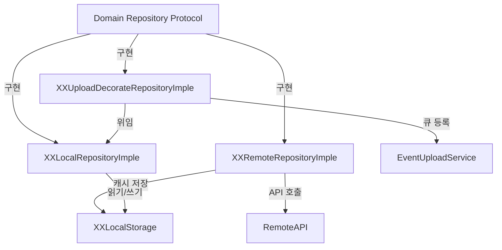
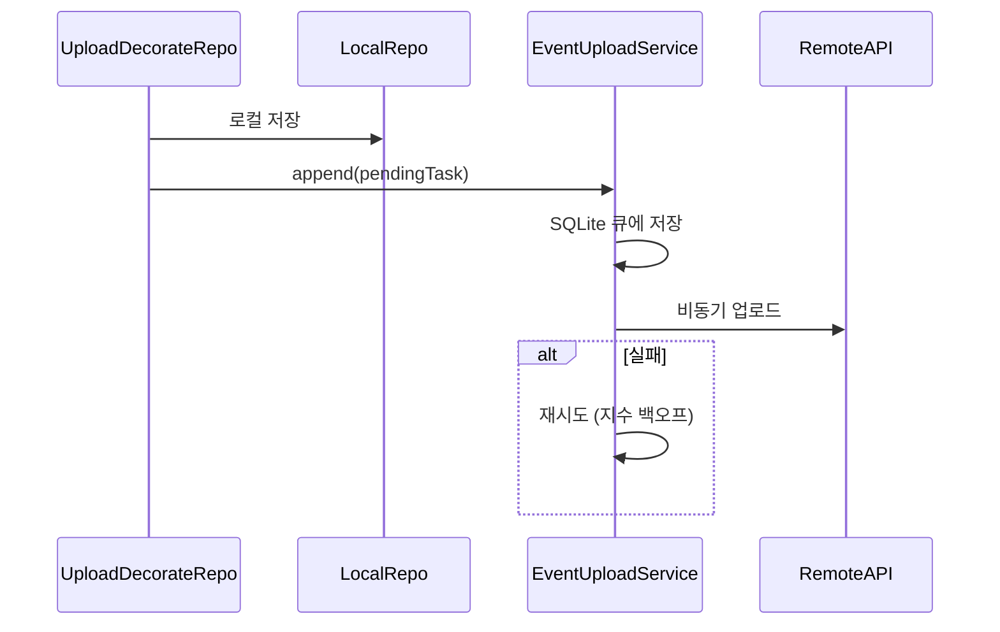

# Repository Framework — CLAUDE.md

## 개요

오프라인 우선(offline-first) 데이터 계층. SQLite 로컬 저장소 + Alamofire 기반 원격 API + 오프라인 싱크 큐로 구성된다.

---

## 핵심 아키텍처: 3-Layer 패턴

각 주요 엔티티(Todo, Schedule, EventTag 등)는 3개의 Repository 구현체를 가진다.


```mermaid
graph TD
    D[Domain Repository Protocol] -->|구현| L[XXLocalRepositoryImple]
    D -->|구현| R[XXRemoteRepositoryImple]
    D -->|구현| U[XXUploadDecorateRepositoryImple]

    U -->|위임| L
    U -->|큐 등록| ES[EventUploadService]
    R -->|API 호출| RM[RemoteAPI]
    R -->|캐시 저장| LS[XXLocalStorage]
    L -->|읽기/쓰기| LS
```

| 계층 | 클래스 패턴 | 역할 |
|---|---|---|
| **Local** | `XXLocalRepositoryImple` | SQLite 직접 읽기/쓰기. 오프라인 전용 |
| **Remote** | `XXRemoteRepositoryImple` | API 호출 + 결과를 로컬에 캐시 |
| **Upload Decorator** | `XXUploadDecorateRepositoryImple` | 로컬 저장 → `EventUploadService` 큐에 등록 |

**선택 기준**: 로그인 상태에 따라 `ApplicationRootBuilder`에서 Local 또는 UploadDecorator를 주입.

---

## Storage 패턴 (SQLite)

각 엔티티의 로컬 저장은 4개 구성요소로 이루어진다.

```
XXLocalStorage (protocol)       — 쿼리/저장 인터페이스
  └─ XXLocalStorageImple        — SQLiteService 호출 구현
       └─ XXTable: Table        — 스키마 정의 + 마이그레이션
            └─ Entity: RowValueType  — CursorIterator → Entity 변환
```

### 테이블 정의 — `@Table` 매크로

`SQLiteServiceMacros` 의 `@Table`·`@Column` 이 `Columns`·`Entity`·`tableName`·`scalar(_:for:)` 와 `Table` 준수를 만든다. 선례는 `TodoEventTable`(전환 표본)과 `KeyValueTable`(변환 레이어가 없는 가장 단순한 형태)이다.

```swift
@Table("TodoEvents")
struct TodoEventTable {

    @Column(.primaryKey(autoIncrement: false), .unique, .notNull)
    let uuid: String

    @Column(name: "create_timestamp")
    var createTimeStamp: Double?
}
```

규약 여섯을 지킨다.

1. **프로퍼티 선언 순서 = 물리 컬럼 순서 = cursor 읽기 순서.** 매크로가 선언 순서대로 `Columns` case 를 내고 `Entity.init(cursor)` 도 그 순서로 읽는다. 기존 테이블을 전환할 땐 옛 `Columns` case 순서를 그대로 옮긴다.
2. **컬럼명이 프로퍼티명과 다르면 `@Column(name:)` 으로 준다.** 인자 순서는 `@Column(_ attributes: ColumnDataAttribute..., name: String? = nil)` 이라, 속성이 없으면 `@Column(name: "tag_id")` 처럼 이름만 준다.
3. **저장 인스턴스 프로퍼티는 `@Column` 유무와 무관하게 전부 컬럼이 된다.** 매크로가 거르는 것은 `static`·`class` 프로퍼티뿐이고, 계산 프로퍼티는 제외가 아니라 `accessorIsNotAllowed` 컴파일 에러다. 그래서 컬럼에서 뺄 저장 프로퍼티를 둘 자리가 없다 — 테이블에 안 실을 값은 이 struct 밖에 둔다. 제약도 별도 컬럼명도 없으면 `@Column()` 을 빈 괄호로 붙인다. 동작은 안 붙인 것과 같고, 어느 프로퍼티가 컬럼인지 읽는 사람에게 드러내려는 표기다.
4. **매크로가 받는 Swift 타입은 다섯뿐이다** — `Int`·`Bool` 은 integer, `String` 은 text, `Double`·`Float` 은 real 로 간다. 그 밖은 `unsupportedColumnType` 컴파일 에러다. JSON 직렬화 컬럼과 도메인 타입 컬럼은 `String?` 으로 선언하고, 직렬화는 변환 레이어가 맡는다. SQLite 타입은 Swift 타입이 정하고, optional 여부는 `Entity` 프로퍼티의 `var`·`let` 과 cursor 읽기 방식만 정한다. **비옵셔널로 선언해도 SQL `NOT NULL` 은 안 붙는다** — 제약은 `@Column` 속성에서만 만들어지므로 `uuid`·`name` 처럼 NOT NULL 이어야 하는 컬럼은 `.notNull` 을 명시한다.
5. **도메인 타입에 `RowValueType` 을 채택시키지 않는다.** 커서를 읽는 것은 매크로 `Entity` 고, 도메인 타입은 변환으로 얻는다. 변환은 테이블과 같은 파일 extension 에 두고 방향 둘을 다 둔다.
6. **변환이 컬럼을 다 채우는지는 테스트가 지킨다.** 손 구현은 `scalar(_:for:)` 가 `Columns` 를 exhaustive switch 해서, 컬럼을 늘리면 컴파일러가 매핑 작성을 강제했다. 매크로는 `scalar` 를 선언에서 내고 `Entity` 의 memberwise init 이 optional 에 `= nil` 을 주므로 그 강제가 사라진다 — 새 컬럼을 `Entity(_ 도메인타입:)` 에서 빠뜨려도 컴파일과 INSERT 가 통과하고 값만 NULL 로 남는다. `Table.serialize(entity:)` 가 `ColumnType.allCases` 순서로 `scalar` 결과를 주니, 값을 다 채운 도메인 객체로 직렬화해 빈 자리가 없는지 단언하는 TC 를 테이블마다 둔다. 상호 배타 컬럼이 있으면(`repeating_end` ↔ `repeating_count`) 변형 둘을 직렬화해 컬럼마다 한쪽이 채워지는지로 본다. 선례는 `TodoEventTableConversionTests.serialize_fromConvertedEntity_leavesNoColumnUnmapped` 다.

```swift
extension TodoEventTable.Entity {
    init(_ todo: TodoEvent) { ... }
    func asTodoEvent() throws -> TodoEvent { ... }
}

// 커서를 읽는 자리 (TodoLocalStorage · PendingDoneTodoEventTable)
let todo = try TodoEventTable.Entity(cursor).asTodoEvent()
```

이렇게 하면 물리 컬럼 순서에 매달리는 자리가 매크로 `Entity` 하나로 준다. 도메인 타입이 직접 커서를 읽으면 `Columns` 와 그 `init(cursor)` 둘이 각각 순서를 이고, 둘이 어긋나도 컴파일은 통과한다. 도메인 타입이 Repository 의 프로토콜을 안 이고 가는 것도 같이 따라온다. **다만 여러 테이블이 한 커서 읽기를 공유하는 위험은 사라지지 않고 `Entity` 로 옮겨간다** — 아래 "컬럼 순서 = 읽기 순서" 절을 본다.

**아직 안 옮긴 자리** — `DoneTodoEvent`(`DoneTodoEventTable.swift:57`)와 `EventDetailData`(`EventDetailDataTable.swift:37`)가 도메인 타입에 `RowValueType` 을 붙이고 있다. 그 테이블을 매크로로 옮길 때 같이 걷는다.

### 버전 선언 — 과거 스키마를 타입으로 세운다

`ColumnDataAttribute` 는 `primaryKey`·`notNull`·`unique`·`default` 넷뿐이라 버전을 표기할 속성이 없다. 버전을 나누려면 타입을 나눈다.

- 타입명은 `<테이블명>V<그 스키마가 선 버전>` 이고 테이블과 같은 파일에 둔다. **최신 스키마도 접미사를 단다** — 버전을 안 단 이름은 지금이 몇 번째인지 말하지 않고, 다음 버전이 서면 그 이름이 가리키는 대상이 조용히 바뀐다.
- 접미사 없는 이름은 **최신을 가리키는 `typealias`** 로 둔다. 선언 바로 위에 두면 현재 버전이 한눈에 읽히고, 호출부는 버전을 모른 채 쓴다.

  ```swift
  typealias TodoEventTable = TodoEventTableV6

  @Table("TodoEvents")
  struct TodoEventTableV6 { ... }
  ```

  버전은 **그 스키마가 선 DB 버전**이다 — `repeating_turn` 이 5→6 마이그레이션에서 붙었으므로 현재 `TodoEvents` 는 V6 이다. `AppEnvironment.dbVersion`(지금 7)과는 다르다. 그 테이블이 안 바뀐 버전에서는 번호가 안 오른다.
- 새 버전이 서면 새 타입을 더하고 `typealias` 를 그리로 옮긴다. **변환 extension 과 `migrateStatement(for:)` extension 은 둘 다 `typealias` 쪽 이름으로 쓴다** — 그래야 alias 를 옮길 때 같이 따라온다.
- `migrateStatement` 를 구체 타입 이름으로 달면 **마이그레이션이 조용히 멈춘다.** `Table` 프로토콜에 `nil` 을 돌려주는 기본 구현이 있어서, alias 가 새 타입으로 옮겨간 뒤 `migrate(TodoEventTable.self, ...)` 가 그 기본값을 집는다. 컴파일도 테스트도 통과하고 옛 스텝만 안 돈다.
- 세 타입이 같은 `tableName` 을 가진다. 한 DB 에서 둘을 만들면 `createTableOrNot` 이 뒤엣것을 무시하므로 **테스트마다 DB 를 가른다.**
- 선언이 실제 마이그레이션 결과와 같은지는 **마이그레이션을 루프에 넣어** 확인한다 — 옛 버전 타입으로 테이블을 만들고 `migrate` 를 태운 뒤, 검증 대상 선언으로 읽어 필드를 단언한다. 같은 선언으로 만들고 같은 선언으로 읽는 형태는 자기비교라 컬럼이 빠지든 순서가 틀리든 늘 초록이다.
- 그 확인이 성립하는 근거는 읽기·쓰기의 비대칭이다. `insert` 는 컬럼명을 적어 이름으로 붙고, `selectAll()` 은 `SELECT *` 를 내 **물리 순서로 위치 결합**한다. 그래서 물리 스키마를 마이그레이션이 만들고 읽기를 선언이 하면, 선언이 어긋난 만큼 값이 밀린다. 픽스처는 컬럼마다 값을 다르게 골라야 그 밀림이 드러난다.

### 아직 전환 안 된 테이블

전환 전 형태는 `Columns` enum 과 `scalar(_:for:)`·`init(cursor)` 를 손으로 쓴다. 실물은 `ScheduleEventTable.swift` 를 본다 — 컬럼 구성이 `TodoEventTable` 과 거의 같아 전환 전후를 나란히 놓고 읽기 좋다. 아직 안 옮긴 테이블을 만질 땐 그 자리에서 위 매크로 형태로 옮긴다.

**이관이 끝나도 이 절은 남는다.** 구체 테이블 25개 중 매크로로 옮길 수 있는 것은 20개다. 나머지 다섯은 구조가 매크로를 못 받는다 — 넷은 다른 테이블과 `Entity` 를 공유하고(`EventDetailDataTable`·`DoneTodoEventDetailTable`·`PendingDoneTodoEventTableV6TempTable`·`EventUploadPendingQueueTableV4TempTable`), `EventTimeTable` 은 `scalar` 가 저장 안 되는 필드를 조합한 계산 파생값을 낸다. 매크로는 테이블마다 자기 `Entity` 를 만들고 프로퍼티와 컬럼을 기계적으로 묶으므로 둘 다 표현할 수 없다.

### 컬럼 순서 = 읽기 순서 (위치 결합)

`Columns` enum의 **case 선언 순서가 곧 물리 컬럼 순서**이고, `init(_ cursor:)`는 `cursor.next()`를 부른 횟수로 위치를 센다. 둘이 어긋나면 크래시가 아니라 **조용한 nil**이다 — 값은 SQLite 저장 타입으로 만들어진 뒤 `as? T`로 캐스팅되므로, 타입이 안 맞거나 컬럼 수를 넘어가면 그냥 nil이 된다.

**한 `RowValueType.init(cursor)`를 여러 테이블이 공유하면 컬럼 추가가 다른 테이블을 깨뜨린다.** `TodoEventTable.Entity(cursor)`는 Todo 조인 조회(`TodoLocalStorage`)와 `PendingDoneTodoEventTable` 둘이 쓴다 — 한쪽에 컬럼을 붙여 그 읽기가 한 칸 늘면 다른 쪽은 이어 읽는 자리가 그만큼 밀린다 (#355·#544 → #835). 컬럼 추가 시 그 `init(cursor)`를 쓰는 **모든 테이블**을 grep해 각각의 `Columns`도 함께 갱신한다.

**매크로로 전환한 테이블은 이 위험이 선언 순서 하나로 모인다.** 손 구현은 `Columns` 와 `init(cursor)` 둘이 따로 순서를 이고 있어 한쪽만 고쳐도 컴파일이 통과하는데, 전환하면 매크로가 그 둘을 같은 선언에서 내므로 어긋날 자리가 사라진다. 대신 프로퍼티 선언 순서 하나가 물리 순서와 읽기 순서를 동시에 정하니, 순서를 바꾸는 것이 곧 스키마 변경이다. 위 공유 경고는 그대로 유효하다 — `TodoEventTable.Entity(cursor)` 가 소비하는 컬럼 수가 바뀌면 `PendingDoneTodoEventTable` 이 이어 읽는 자리가 그만큼 밀린다. 컬럼을 더할 땐 그 `Entity` 를 읽는 자리를 전부 grep 한다.

### DB 마이그레이션

**세 위치를 반드시 함께 변경한다:**

1. `AppEnvironment.dbVersion` 증가 (in `TodoCalendarApp`)
2. 해당 `Table`의 `migrateStatement(for version:)`에 case 추가 — 받는 숫자는 **떠나는 버전**이다 (`case 5`는 5 → 6에서 돈다)
3. `AppDataMigrationImple` — `runDBMigration`의 switch에 case 추가 + `runMigrationVersionNtoM` 메서드 작성

**3번이 빠지면 `migrateStatement`는 호출조차 되지 않는다.** 컴파일도 테스트도 통과하고 마이그레이션만 조용히 안 돈다.

절차 상세·버전 이력·컬럼 순서 변경(temp 테이블 재생성)은 [`docs/spec/infrastructure.md §5`](../docs/spec/infrastructure.md) 정본.

---

## Remote 패턴 (Alamofire)

### 구성요소

| 파일 | 역할 |
|---|---|
| `RemoteAPI.swift` | `RemoteAPI` 프로토콜 + Alamofire `Session` 래퍼 구현 |
| `Endpoint.swift` | Enum 기반 엔드포인트 (`TodoAPIEndpoints`, `ScheduleAPIEndpoints` 등) |
| `XXRemote` (protocol) | 엔티티별 원격 API 인터페이스 (예: `TodoRemote`) |
| `XX+Mapping.swift` | JSON 인코딩/디코딩 (`asJson()`, `TodoEventMapper`) |

### 인증

- `APICredential` — accessToken, refreshToken, 만료 정보
- `APIAuthenticator` — Alamofire `Authenticator` 프로토콜 구현 (토큰 리프레시)
- `GoogleAPIAuthenticator` — Google OAuth 전용
- `AuthenticationInterceptorProxy` — 요청 어댑트 + 401 재시도
- `IntegratedAPICredentialStore` — 멀티 서비스 인증 정보 통합
- `GoogleAPICredentialStore` — 멀티 계정 Google 인증 정보

---

## 오프라인 싱크: EventUploadService

`EventUploadServiceImple` (Actor) — 오프라인에서 발생한 변경사항을 큐에 저장하고 백그라운드에서 업로드.


```mermaid
sequenceDiagram
    participant Repo as UploadDecorateRepo
    participant Local as LocalRepo
    participant Queue as EventUploadService
    participant Remote as RemoteAPI

    Repo->>Local: 로컬 저장
    Repo->>Queue: append(pendingTask)
    Queue->>Queue: SQLite 큐에 저장
    Queue->>Remote: 비동기 업로드
    alt 실패
        Queue->>Queue: 재시도 (지수 백오프)
    end
```

---

## 네이밍 규칙

| 개념 | 패턴 |
|---|---|
| Repository 구현 (Local) | `XXLocalRepositoryImple` |
| Repository 구현 (Remote) | `XXRemoteRepositoryImple` |
| Repository 구현 (Decorator) | `XXUploadDecorateRepositoryImple` |
| Remote 프로토콜 | `XXRemote` |
| Local Storage 프로토콜 | `XXLocalStorage` |
| Local Storage 구현 | `XXLocalStorageImple` |
| 테이블 | `XXTable: Table` |
| 매핑 | `XX+Mapping.swift` |

---

## 외부 캘린더 DB 구조

- 메인 DB (`todo_calendar.db`): 앱 자체 데이터. `AppEnvironment.dbVersion`으로 마이그레이션 관리.
- 외부 캘린더 DB (`google_calendar.db`): 계정별 테이블에 `accountId` 컬럼 포함. `AppEnvironment.googleCalendarDBVersion`으로 별도 관리.
- `AppDataMigrationImple`: 단일 계정 → 다중 계정 1회성 마이그레이션 (플래그 기반 멱등성)
- DB 연결은 `ExternalCalendarDBConnectionPool`이 관리하며, `onFirstOpen` 시 테이블 생성 + 마이그레이션 실행.

| 파일 | 역할 |
|---|---|
| `ExternalCalendarDBConnectionPoolImple.swift` | 참조 카운팅 DB 연결 관리 |
| `ExternalCalendarAccountRemotePool.swift` | 계정별 Remote API + 토큰 갱신 |
| `GoogleCalendarLocalAggregatedRepositoryImple.swift` | 다중 계정 데이터 집계 |
| `AppDataMigrationImple.swift` | 단일→다중 계정 DB 마이그레이션 |

---

## 테스트

### 테스트 인프라 (`Tests/Common/`)

- **`BaseLocalTests: BaseTestCase`** — 테스트용 SQLite DB를 캐시 디렉터리에 별도 파일로 생성하고, 테스트 종료 시 닫은 뒤 삭제. 실제 앱의 DB에는 영향을 주지 않음.
- **`LocalTestable` 프로토콜** — `runTestWithOpenClose(_:_:)` 헬퍼로 DB 생성→테스트→삭제를 자동화. Swift Testing (`@Suite`) 사용 시 채택.

**DB 파일명은 `fileName`에 테스트마다 다른 UUID를 붙이고, tearDown은 커넥션을 닫은 뒤 파일을 지운다.** 고정 파일명 + 미close 조합이면 앞 테스트의 커넥션이 살아 있는 채로 뒤 테스트가 같은 vnode를 열어 프로세스가 죽는다 (원인·측정치는 `docs/troubleshooting/2026-08-24-local-db-tests-random-crash.md`).

`fileName` 지정은 `super.setUpWithError()` **앞**에 둔다 — 뒤에 두면 파일명이 기본값으로 남아 로그에서 어느 테스트의 DB인지 추적이 안 된다 (UUID 덕에 충돌 자체는 안 난다).

### Local Repository 테스트

**실제 SQLite DB를 사용하여 테스트한다.** 단, 앱의 실제 DB와는 별도 파일을 사용하여 격리.

- `BaseLocalTests` 상속 또는 `LocalTestable` 채택
- 테스트마다 캐시 디렉터리에 임시 `.db` 파일을 생성하고 테스트 후 삭제
- 실제 데이터를 저장/조회하여 Table 스키마, RowValueType 변환, 마이그레이션 등을 검증

```swift
// 예: TodoLocalRepositoryImpleTests
class TodoLocalRepositoryImpleTests: BaseLocalTests {
    // setUp: 캐시 디렉터리에 todos_<UUID>.db 생성
    // 실제 SQLite에 TodoEvent 저장 → 조회하여 검증
    // tearDown: 커넥션 close 후 그 파일 삭제
}
```

### Remote Repository 테스트

**Remote 응답은 `StubRemoteAPI`로 스텁하고, 로컬 캐시는 Spy 객체를 사용한다.**

- `StubRemoteAPI` — 엔드포인트+HTTP 메서드 조합에 매핑된 JSON 응답(또는 에러)을 반환
- `SpyXXLocalStorage` (예: `SpyTodoLocalStorage`) — 캐시 저장 호출을 기록 (`did<Action>` 변수로 검증)
- 실제 네트워크 호출 없이 Remote Repository의 로직(매핑, 캐시 저장, 에러 처리)을 검증

```swift
// Remote 테스트 구조
class TodoRemoteRepositoryImpleTests: BaseTestCase, PublisherWaitable {
    private var stubRemote: StubRemoteAPI!        // API 응답 스텁
    private var spyTodoCache: SpyTodoLocalStorage! // 캐시 저장 검증용 Spy

    private func makeRepository() -> TodoRemoteRepositoryImple {
        let remote = TodoRemoteImple(remote: self.stubRemote)
        return TodoRemoteRepositoryImple(
            remote: remote, cacheStorage: self.spyTodoCache
        )
    }
}
```

### 더미 응답값 작성 패턴

각 Remote 테스트 파일 하단에 `private struct DummyResponse`를 정의하여 JSON 응답 문자열을 관리한다.

```swift
private struct DummyResponse {
    // 개별 엔티티 JSON 생성 메서드
    private func dummySingleTodoResponse(_ uuid: String = "new_uuid") -> String {
        return """
        {
            "uuid": "\(uuid)",
            "name": "todo_refreshed",
            "event_time": { "time_type": "allday", ... },
            "repeating": { "start": 300, ... }
        }
        """
    }

    // StubRemoteAPI.Response 배열로 조합
    var responses: [StubRemoteAPI.Response] {
        return [
            .init(method: .post, endpoint: TodoAPIEndpoints.make,
                  resultJsonString: .success(self.dummySingleTodoResponse())),
            .init(method: .get, endpoint: TodoAPIEndpoints.todo("origin"),
                  resultJsonString: .success(self.dummySingleTodoResponse("origin"))),
            // 에러 케이스
            .init(method: .post, endpoint: TodoAPIEndpoints.complete("fail_id"),
                  resultJsonString: .failure(RuntimeError("failed"))),
            ...
        ]
    }
}
```

**`StubRemoteAPI.Response` 구성:**
- `method` — HTTP 메서드 (`.get`, `.post`, `.put`, `.delete`, `.patch`)
- `endpoint` — API 엔드포인트 enum 값
- `resultJsonString` — `Result<String, Error>` (성공: JSON 문자열 / 실패: Error)
- `parameterCompare` — (선택) 파라미터 매칭 조건

### 공유 Test Doubles (`Tests/Doubles/`)

| Double | 용도 |
|---|---|
| `StubRemoteAPI` | 엔드포인트+메서드 조합에 매핑된 응답 반환. `didRequestedPath` 등으로 호출 검증 가능 |
| `FakeEnvironmentStorage` | 인메모리 UserDefaults 대체 |
| `SpyEventUploadService` | 업로드 큐 등록 호출 기록 |

### 테스트 조직

- 각 Repository 구현체(Local/Remote/Decorator)별 테스트 파일
- XCTest (`BaseLocalTests` 상속) 또는 Swift Testing (`@Suite`, `LocalTestable` 채택) 사용
- `PublisherWaitable`로 Combine Publisher 검증
