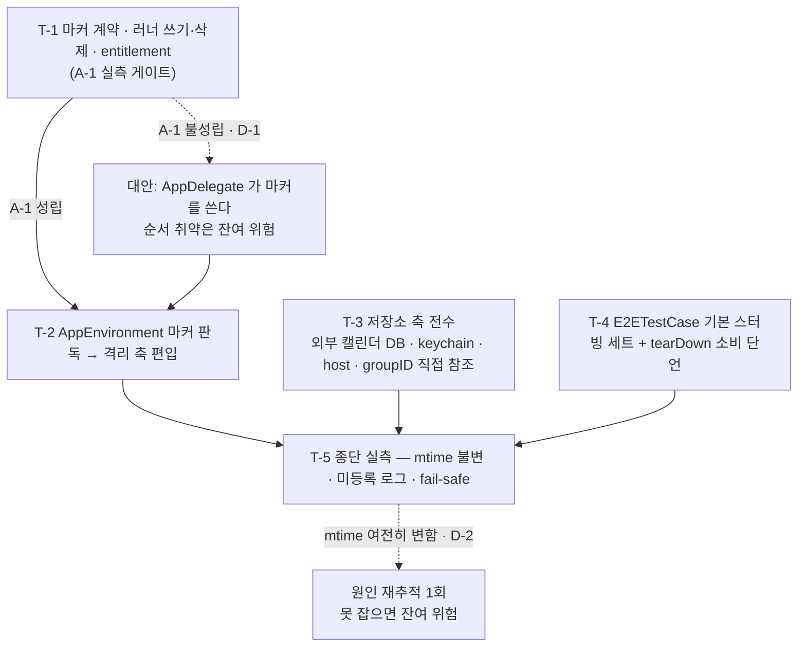

# 작전명령 — #1063 확장 프로세스 격리와 저장소 축 전수

```
작전명령 — #1063 확장 프로세스 격리와 저장소 축 전수    초안: 에이전트   재가: 유저   일자: 2026-09-09
상위: campaign.md #826 / LOE-1·LOE-2 / 1단계 / DP-1.3 / 선행 DP-1.2 (머지 e5b3e6ea)
```

## ■ 확인보고

**임무 내 말로** — e2e 실행이 실 저장소를 하나도 안 건드리게 만든다. 격리 축에 아직 안 매달린 것들(외부 캘린더 DB·keychain·확장 쪽 host)을 전부 그 축에 태우고, 축 자체가 확장 프로세스에서도 켜지도록 러너가 남기는 마커를 인지 수단으로 세운다. 겸해서 콜드런치 API 세트를 e2e 베이스가 기본 스터빙하게 올린다.

**의도** — "확장도 막는다"가 목적이 아니라 **저장소·외부 의존을 가르는 축이 코드 어디에도 구멍 없이 하나로 서는 것**이 목적이다. 지금은 같은 판단이 `AppEnvironment`·`ApplicationBase`·`AppExtensionBase`·`AICommandIntentFactory` 네 곳에 흩어져 있고 그중 셋이 축을 안 탄다. 축을 하나로 모으면 확장 격리는 그 축에 인지 수단 하나를 더 얹는 일로 끝난다.

**자율로 정할 것** — 마커 파일의 내부 표현(키 이름·직렬화 형태), 마커 판독 값 타입의 형태, 기본 스터빙 세트의 등록 코드 구조, 태스크 순서·커밋 시퀀스 조정.

**묻는 것** — 없음. 유저 결심 3건(인지 수단은 러너가 쓰는 마커 파일 / 확장 host 는 마커에 실은 스텁 주소 / fail-safe 는 TTL + tearDown 삭제 둘 다)을 받아 반영했다.

---

## 1. 상황

### 가. 정찰 결과

아래 실측은 develop `5137f4ee` 에서 e2e 스킴을 1회 실행(TEST SUCCEEDED, 67초)하고 전후를 비교한 값이다.

- **실 `models.db-shm` 의 mtime 이 실행 중에 바뀐다** (`01:01:35 → 01:29:50`). `.db` 와 `-wal` 은 각각 5월 3일·5월 31일 그대로다 — 쓰기 없이 열기만 한 흔적이다.
- **같은 실행에서 이번 설치분 번들(`46C95590`)의 위젯 확장 프로세스가 앱과 같은 샘플에 함께 떠 약 10초 살아 있었다.** 앱 프로세스는 DB 경로가 전부 `AppEnvironment.dbFilePath(for:)` 를 타 `test_dummy` 로 가고 그 파일은 `AppDelegate.resetStateForUITestRunIfNeeded`(`TodoCalendarApp/Sources/AppDelegate.swift:69-88`)가 실행 시작에 지운다. 소거법으로 실 `models.db` 를 여는 주체는 `AppExtensionBase.commonSqliteService`(`TodoCalendarApp/AppExtensions/Base/AppExtensionBase.swift:36-42`, `openWithReadOnly: true`) 다.
- **확장 프로세스에서는 격리 축이 켜질 수단이 없다.** `AppEnvironment.isUITestRun`(`TodoCalendarApp/Sources/AppEnvironment.swift:23-28`)은 `-uiTest` 실행 인자로만, `isTestBuild`(:16-21)는 `XCTestConfigurationFilePath` 환경변수로만 판정한다. 확장은 둘 다 못 받아 `isExternalDependencyBlocked`(:30-32)가 언제나 거짓이다.
- **같은 실행에서 `google_calendar.db-shm` 의 mtime 도 바뀐다.** `AppEnvironment.externalCalendarDBPaths()`(`AppEnvironment.swift:70-77`)가 파일명을 `google_calendar`·`apple__calendar` 로 박아 test/production 분기가 아예 없고, `ApplicationBase.swift:54` 가 그 경로를 그대로 받는다 — 앱 프로세스도 실 외부 캘린더 DB 를 연다. DP-1.2 진행 파일의 "PIR-3 불성립(외부 캘린더 DB 미생성)" 기록은 오판이었다.
- **KeyChain 에도 분기가 없다.** `AppEnvironment.keyChainStoreName`(:85)이 상수이고, 앱(`ApplicationBase.swift:35-36`)과 확장(`AppExtensionBase.swift:23-27`)이 같은 identifier 로 실 저장소를 연다.
- **API host 판단이 세 곳에 흩어져 있고 그중 둘이 축을 안 탄다.** `ApplicationBase.readAPIHost`(`TodoCalendarApp/Sources/Factories/ApplicationBase.swift:87-96`)만 격리를 보고 `E2E_API_HOST` → `blockedAPIHost` 로 떨어진다. `AppExtensionBase.remoteEnvironment`(`AppExtensionBase.swift:84-104`)와 `AICommandIntentFactory.makeRemoteAPI`(`TodoCalendarApp/Sources/AppIntents/AICommandIntentFactory.swift:73-108`)는 `secrets.json` 의 실 host 를 그냥 읽는다.
- **`groupID` 직접 참조가 남아 DP-1.2 의 suite 분리를 안 탄다.** `AppExtensionBase.userDefaultEnvironmentStorage`(:19-21)와 `AICommandIntentFactory.init`(:23-25)이 `AppEnvironment.groupID` 를 그대로 넘긴다. 정본은 `AppEnvironment.userDefaultSuiteName`(`AppEnvironment.swift:50-56`)이다.
- **확장의 Firebase 차단만 술어가 다르다.** `AppExtensionBase.firebaseAuthService`(:67-82)가 `isTestBuild` 만 본다 — 앱 쪽(`ApplicationBase.swift:109`)은 이미 `isExternalDependencyBlocked` 다.
- **확장 소스는 `<확장>Tests` 유닛테스트 타겟에 다시 컴파일된다** (`Tuist/ProjectDescriptionHelpers/Project+Templates.swift:402-425`, `sources: extensionSources + [...]`). 그 타겟에서는 `isTestBuild` 가 참이라, 축 배선만으로도 확장 유닛테스트의 실 저장소 접근이 그 자리에서 막힌다.
- **`Sources/AppEnvironment.swift` 는 확장 타겟 소스 glob 에 들어 있다** (`Project+Templates.swift:366-375`). 여기를 고치면 앱과 확장 셋이 같이 받는다.
- **E2E 타겟엔 entitlements 가 없다** (`makeE2ETarget`, `Project+Templates.swift:144-160`). 러너는 현재 App Group 컨테이너에 접근할 수 없다. 확장 타겟은 `Entitlements.file(path:)` 로 타겟별 파일을 지정하는 선례가 있다 (`Project+Templates.swift:390`).
- **콜드런치(미로그인) RemoteAPI 호출은 2건뿐이다** — `HolidayRepositoryImple.swift:42`(`supportCountry`, gist 절대 URL 이라 실호출 수용 — campaign 0항 결심) 과 `:145`(`holidays`). 현재 등록은 시나리오(`TodoCalendarApp/E2E/AppLaunchE2ETests.swift`)가 holidays 하나만 한다.

### 나. 장애·마찰

- **유력한 양상** — 러너(uiTests 번들)에 App Group entitlement 를 줘도 시뮬레이터에서 공유 컨테이너에 실제로 쓸 수 있는지가 미검증이다. 못 쓰면 인지 수단의 전제가 무너진다. 그래서 T-1 을 실측 게이트로 앞에 둔다.
- **가장 위험한 양상** — 마커가 남아 일반 실행을 오염시키는 것. 확장이 남은 마커를 믿으면 유저가 Xcode 로 앱을 띄웠을 때 위젯이 빈 테스트 DB 를 읽어 빈 화면으로 뜬다. 테스트가 초록이어도 안 드러나고, 유저가 위젯을 볼 때에야 나타난다.

### 다. 상위 인용

- **최종상태 관련 관점** (campaign 4항·7항) — 1단계 종료 조건이 "앱·확장 어느 프로세스도 실 API host·Firebase·AdMob 로 요청을 안 내보내며 실 DB 를 열지 않는다"이고, 이 명령이 그 조건의 마지막 미충족분이다.
- **노력선 중간 목표** — LOE-1 격리 종단(확장 프로세스 + 저장소 축 전수)과 LOE-2 픽스처 공급(기본 스터빙 세트)을 함께 담당한다.
- **인접 DP 관계·인터페이스 계약** (campaign 8항) — DP-1.2 가 만든 스텁 서버 미등록 요청 로그와 `E2ETestCase`·`E2EFixture` 가 이 명령의 기반이다. 시나리오가 쓰던 등록을 베이스로 올려 로그 노이즈를 걷은 뒤, 그 로그와 실 DB mtime 두 축으로 격리를 판정한다. 이 명령이 마지막 DP 라 넘길 인터페이스는 없다.

### 라. 가정

| ID | 가정 | 출처 | 깨지면 |
|---|---|---|---|
| A-1 | uiTests 러너가 App Group entitlement 로 시뮬레이터 공유 컨테이너에 파일을 쓸 수 있다 | 신규 — 미검증. T-1 에서 실측한다 | FFIR-1 → D-1 (앱이 마커를 쓰는 안으로 전환) |
| A-2 | 러너가 `app.launch()` 전에 마커를 쓰므로, 위젯이 앱보다 먼저 떠도 마커는 이미 있다 | 신규 — A-1 이 서면 순서 무관이 따라온다 | A-1 과 함께 무너진다 → D-1 |
| A-3 | 실 `models.db` 를 여는 주체는 `AppExtensionBase` 를 쓰는 확장 프로세스다 | 신규 — 정찰 소거법(앱 경로는 전부 `test_dummy`) | T-5 에서 mtime 이 여전히 변한다 → D-2 |
| A-4 | KeyChain 은 `identifier` 만 갈라도 실 자격과 분리된다 (access group 은 entitlement 로 고정이라 그대로 둔다) | 신규 — `KeyChainStorageImple.init(identifier:)` 가 `keyPrefix` 로 쓰인다 (`Repository/Sources/Local/KeyChainStorage.swift:25-27`) | 테스트가 실 자격을 읽어 로그인 상태로 뜬다 → PIR-1 |
| A-5 | `<확장>Tests` 타겟에서 `isTestBuild` 가 참이라 축 배선이 그 자리에서 효력을 갖는다 | 신규 — 정찰 확인 (`Project+Templates.swift:402-425`) | 확장 유닛테스트가 여전히 실 저장소를 연다 — 이 명령 안에서 술어를 재점검 |
| A-6 | 미로그인 콜드런치가 타는 RemoteAPI 호출은 `supportCountry`·`holidays` 2건뿐이다 | 상속 (campaign A-4, DP-1.2 확인) | PIR-1 → D-2 |

### 마. 인접 작업

`docs/` 하네스 정비 작업이 다른 워크트리에서 진행 중이다(#1061 계열). 소유 범위가 `.claude/` 와 `docs/operations/templates/` 라 이 명령의 소유 범위(`TodoCalendarApp/**`, `Tuist/ProjectDescriptionHelpers/Project+Templates.swift`)와 겹치지 않는다. 다만 develop 이 그쪽 커밋으로 앞서 나가므로, 브랜치를 딸 때와 PR 올릴 때 각각 최신 develop 을 받는다.

---

## 2. 임무

이 작업은 **e2e 실행이 실 저장소를 하나도 안 건드림이 실측으로 드러날 때까지** 격리 축에 안 매달린 저장소·host 판단을 전부 그 축에 태우고 러너 마커로 확장 프로세스까지 축을 켜며 콜드런치 응답 세트를 e2e 베이스로 올려, **1단계 종료 조건을 충족하고 캠페인을 종결 가능 상태로 만든다.**

---

## 3. 실시

### 가. 의도

**목적** — 저장소·외부 의존을 가르는 축을 코드 전체에 구멍 없이 하나로 세우고, 그 축이 앱뿐 아니라 확장 프로세스에서도 켜지게 한다.

**핵심과업** (성립 조건)

1. 격리 판단의 정본이 `AppEnvironment` 하나다 — `groupID`·`keyChainStoreName`·`secrets.json` host 를 다른 곳에서 직접 잡는 자리가 남지 않는다.
2. 확장 프로세스가 e2e 실행을 인지하고, 그 인지가 실행 순서에 의존하지 않는다.
3. 인지 표식이 남아도 일반 실행이 오염되지 않는다 — 정상 종료와 비정상 종료 양쪽에 각각 해소 경로가 있다.
4. 콜드런치가 무엇을 부르는지가 e2e 베이스 한 곳에 적혀 있고, 시나리오는 그 지식을 다시 쓰지 않는다.
5. 격리가 실제로 도는 것이 실측으로 드러난다 — 실행 전후 실 저장소 파일이 안 변한다.

**최종상태**

- 동작 — `TodoCalendarAppE2E` 스킴 실행 전후로 실 `models.db*`·`google_calendar.db*`·`apple__calendar.db*` 의 mtime 이 안 변한다. 실 UserDefaults suite 와 실 keychain 도 안 열린다.
- 코드 — 프로덕션의 e2e 관련 개입이 `AppEnvironment` 의 격리 축(판정 술어 + 그에 매달린 저장소 이름·host) 한 자리로 수렴한다. `AppExtensionBase`·`AICommandIntentFactory`·`ApplicationBase` 는 축을 소비만 하고 자기 판단을 갖지 않는다.
- 구조 — 마커를 쓰는 쪽은 `TodoCalendarApp/E2E/**` 소유이고 앱 번들에 안 들어간다. 읽는 쪽은 `AppEnvironment` 한 곳이다.
- 검증 — 콜드런치 응답 세트가 `E2ETestCase` 에 등록돼 있고, 그 세트의 소비가 베이스 tearDown 에서 단언된다. 미등록 요청 로그에 실 host 행 요청이 없다.
- 외부 — 일반 실행(Xcode Run)에서는 확장이 그대로 실 저장소를 연다.

### 나. 개념

**결정적 행동** — 러너가 `app.launch()` 전에 App Group 컨테이너에 마커를 쓰고, `AppEnvironment` 가 그 마커를 격리 축의 세 번째 입력으로 받는다. 이 하나가 서면 나머지는 이미 축에 매달린 것들의 배선 정리로 끝난다.

**여건 조성** — T-1 이 A-1(러너 쓰기 가능)을 실측으로 확정한 뒤에 T-2 이후가 의미를 갖는다. T-3(저장소 축 전수)은 인지 수단과 독립이라 A-1 이 깨져도 그대로 수행한다.

**대안 경로 + 전환 조건** — A-1 이 깨지면(러너가 컨테이너에 못 쓴다) 마커를 쓰는 주체를 앱(`AppDelegate`)으로 옮긴다. 이때 위젯이 앱보다 먼저 뜨는 순간은 못 막으므로, 그 취약을 종결보고 4항 잔여 위험으로 기록하고 최종상태의 "동작" 판정을 "앱 실행 이후 구간에서 실 저장소 미변경" 으로 좁힌다.

**단계** (상태 조건)

1. 인지 수단이 선다 — 러너가 쓴 마커를 확장 프로세스가 읽어 격리 축이 켜진다.
2. 축의 구멍이 메워진다 — 저장소·host 직접 참조가 남지 않는다.
3. 실측으로 드러난다 — 실행 전후 실 저장소 미변경, 일반 실행 fail-safe 확인.

**요도**



### 다. 과업

- **T-1**: e2e 마커 파일의 계약을 정하고 러너가 그것을 쓰고 지우게 배선하여, 확장 프로세스에 실행 사실과 스텁 host 를 전달할 통로를 연다.
- **T-2**: `AppEnvironment` 가 마커를 읽어 격리 축에 편입하게 하여, 확장 프로세스에서도 축이 켜지게 한다.
- **T-3**: 외부 캘린더 DB·keychain·API host·UserDefaults suite 의 판단을 `AppEnvironment` 축으로 모으고 직접 참조를 걷어, 격리 판단의 정본을 하나로 만든다.
- **T-4**: `E2ETestCase` 가 콜드런치 응답 세트를 기본 스터빙하고 소비를 tearDown 에서 단언하게 하여, 시나리오가 그 지식을 다시 쓰지 않게 한다.
- **T-5**: e2e 실행 전후 실 저장소 파일과 미등록 요청 로그를 실측하고 일반 실행 fail-safe 를 확인하여, 최종상태 충족을 증명한다.

### 라. 협조지시

**개시 조건** — 최신 develop 에서 `features/1063-e2e-extension-isolation` 을 딴다. 파일 추가 뒤에는 `mise exec -- tuist generate --no-open` 을 돌린 뒤 테스트한다.

**인터페이스 계약** (상속 + 추가)

- 상속 — `-uiTest` 실행 인자(DP-1.1), `E2E_API_HOST` 환경변수(DP-1.1), 스텁 서버 미등록 요청 로그(DP-1.2), `E2ETestCase`·`E2EFixture`(DP-1.2).
- 추가 — **마커 파일 계약**. 위치는 App Group 컨테이너 루트의 `e2e-run.marker`, 내용은 `host`(스텁 서버 주소)와 `expiresAt`(만료 epoch 초) 두 값을 담은 JSON 이다. **쓰는 쪽(E2E 타겟)과 읽는 쪽(`AppEnvironment`)이 서로 타입을 공유할 수 없다** — uiTests 타겟은 앱 모듈을 import 하지 못하고, 확장 셋이 공통으로 의존하는 프레임워크에 이 타입을 두면 배포 번들에 테스트 전용 코드가 들어간다. 그래서 **파일명과 두 키 이름이 짝지어진 두 위치**다. 한쪽을 바꾸면 다른 쪽도 반드시 바꾼다.

**제한**

- `isTestBuild`·`isUITestRun` 의 이름과 동작을 바꾸지 않는다 — DP-1.1 이 확정한 축이고 소비처가 7곳이다 (campaign 15항 상속).
- 마커를 읽는 코드는 `AppEnvironment` 밖에 두지 않는다 — 판정이 흩어지는 것이 이번 명령이 없애려는 상태 자체다.
- 실 keychain 항목을 지우는 코드를 넣지 않는다 — 실 사용자 자격을 날린다. 분리는 identifier 를 가르는 것으로만 한다.
- `AppDelegate.resetStateForUITestRunIfNeeded` 의 접두 매칭 청소 방식을 바꾸지 않는다 — 외부 캘린더 테스트 DB 를 `test_dummy` 접두로 맞추면 그 청소가 그대로 커버한다.
- CI 배선을 하지 않는다 (campaign 0항 범위 밖).

**위임 범위** (좁히는 것만) — `Tuist/ProjectDescriptionHelpers/Project+Templates.swift` 는 `makeE2ETarget` 의 entitlements 추가에만 손댄다. 다른 타겟 팩토리는 건드리지 않는다.

**수용 위험** — 마커 TTL 안에 유저가 Xcode Run 으로 앱을 띄우면 그 사이 확장이 테스트 저장소를 본다. TTL 을 10분으로 잡아 창을 좁히고, 정상 종료 시에는 tearDown 이 즉시 지운다.

**버퍼** — 실행자 재량은 자율 등급 "사후보고"다. 태스크 순서·커밋 시퀀스 조정, 마커 내부 표현, 판독 값 타입 형태는 반문 없이 정하고 종결보고 7항에 한 줄로 누적한다.

**즉시보고 조건**

- **FFIR-1** (아군·내부) — 러너가 App Group 컨테이너에 파일을 못 쓴다 → **D-1**
- **PIR-1** (환경·외부) — 스텁 미등록 요청 로그에 실 API host 행 요청이나 Firebase·AdMob 요청이 남는다 (gist `supportCountry` 는 제외) → **D-2**
- **FFIR-2** (아군·내부) — T-5 에서 실 저장소 파일 mtime 이 여전히 변한다 → **D-2**

**결정지점**

| ID | 결정 | 판단 정보 | 시한(조건) | 미결 시 기본 행동 |
|---|---|---|---|---|
| D-1 | 마커를 쓰는 주체를 러너로 유지하나, 앱(`AppDelegate`)으로 옮기나 | FFIR-1 — T-1 실측 결과 | T-1 종료 시점 | 앱으로 옮긴다. 위젯 선행 실행 구간을 못 막는 취약을 종결보고 4항에 기록하고 최종상태 "동작" 판정을 앱 실행 이후 구간으로 좁힌다 |
| D-2 | 남은 누출의 원인 추적을 이 명령 안에서 하나, 잔여 위험으로 넘기나 | PIR-1 / FFIR-2 — T-5 실측 결과 | T-5 종료 시점 | 이 명령 안에서 1회 재추적한다 (프로세스 샘플 + 미등록 로그 대조). 그래도 주체가 안 잡히면 잔여 위험으로 기록하고 종결한다 |

**우발계획**

| 조건 | 행동 | 결심자 | 상향 |
|---|---|---|---|
| E2E 타겟에 entitlements 를 붙였더니 빌드·서명이 깨진다 | 확장 타겟의 서명 설정 선례(`Project+Templates.swift:390`, `debugWidgetSigningSetting`)에 맞춘다. 그래도 안 되면 D-1 로 넘긴다 | 실행자 | 사후보고 |
| 마커 TTL 이 실행 도중 만료돼 확장이 중간에 실 저장소로 넘어간다 | TTL 을 30분으로 올린다 | 실행자 | 사후보고 |
| 축 배선 후 기존 유닛 테스트 스킴이 깨진다 | 깨진 스킴의 원인을 확인하고, 테스트가 실 저장소를 전제하던 것이면 테스트를 고친다. 프로덕션 판정이 뒤집힌 것이면 즉시보고 후 중단한다 | 실행자 / 유저 | 후자는 즉시보고 |

---

## 4. 검증·자원

**테스트 스킴** — `TodoCalendarApp`(앱 유닛), `TodoCalendarAppWidget`·`TodoCalendarAppShare`(확장 유닛), `TodoCalendarAppE2E`(e2e). 스킴 목록 정본은 run-tests 스킬이다.

**검증 사다리** — 개별 TC → 관련 TC 파일 → 해당 모듈 스킴 → `impact-check.sh` 산출 전체 순으로, 변경 파급이 요구하는 최소 범위에서 멈춘다. TC·파일 단위는 `xcodebuild test -only-testing:<테스트타겟>/<클래스>[/<메서드>]`. 파일 추가·삭제 직후에는 `mise exec -- tuist generate --no-open` 을 먼저 돌린다. `xcodebuild clean`·DerivedData 삭제·`-derivedDataPath` 신설은 금지다(증분 빌드 유지).

**실측** — T-5 는 유닛 테스트가 못 덮는 계약이라 실물로 확인한다. 절차는 (1) 실행 전 App Group 컨테이너의 `models.db*`·`google_calendar.db*`·`apple__calendar.db*` mtime 기록 (2) e2e 스킴 1회 실행 (3) 실행 후 같은 파일 mtime 재확인 (4) 스텁 미등록 요청 로그 확인 (5) 마커를 남긴 채 일반 실행으로 앱을 띄워 만료 후 확장이 실 저장소로 돌아오는지 확인. 컨테이너 경로는 `xcrun simctl` 로 부팅된 기기를 찾아 `data/Containers/Shared/AppGroup/*` 중 `MCMMetadataIdentifier` 가 `group.sudo.park.todo-calendar` 인 디렉토리다.

**스냅샷·실기** — 없음. 실기기 불요, 시뮬레이터로 충분하다.

**모델 티어·병렬 슬롯·워크트리** — 부록 C. 병렬 슬롯 없음, 이 워크트리에서 단일 세션 인라인 실행.

**외부 자원** — 없음.

**적용 rules 발췌** (실행자가 서브에이전트면 path 매칭 자동 로드를 못 받는다)

- `static func` 금지 (CLAUDE.md §1, swift-style §2·§3) — 단 `AppEnvironment` 는 §3 예외인 "전역 설정값 정본" 이고 `dbFilePath(for:)`·`externalCalendarDBPaths()` 라는 기존 선례가 있다. 이 명령이 추가하는 `calendarAPIHost(secrets:)` 도 같은 자리다. 그 밖의 신규 `static func` 는 만들지 않는다.
- 주석은 안 다는 게 기본이다 (swift-style §5). 다는 경우는 읽어서 파악이 안 되는 비자명한 제약의 *why* 한두 줄뿐이다 — 이번 명령에서 그에 해당하는 건 마커 TTL 의 근거와 "깨진 마커는 격리를 켜지 않는다" 는 fail-closed 의도다. PR 전 `python3 .claude/scripts/check-comments.py` 로 검토한다.
- 테스트 더블은 입력을 기록만 하고 검증은 테스트 케이스가 한다 (CLAUDE.md 테스트 원칙, testability.md). stub 안에 `throw`·`assert` 를 넣지 않는다.
- 값 타입 업데이트는 렌즈 체인(`|>`·`.~`)을 쓰고 `var` 선언 후 프로퍼티 대입을 하지 않는다 (domain-rules §5).
- 짝지어진 두 위치 — `Sources/` 에 파일을 추가하면 `Project+Templates.swift` 의 `extensionSources` glob 에도 넣어야 확장 타겟이 컴파일한다 (T-2 Step 3). 마커 파일명·키 이름은 쓰는 쪽과 읽는 쪽 둘 다 갱신한다 (3-라 인터페이스 계약).

---

## 5. 보고

- **즉시** — FFIR-1·PIR-1·FFIR-2 발생 시, 가정 A-1~A-6 중 하나가 깨질 때, rules·플랜 갭을 만났을 때. `report-immediate.md` 서식으로 이슈에 봇 코멘트 + `@sudopark` 멘션.
- **정기** — 태스크 완료마다 진행 파일(`.operations/1063/progress.md`)의 태스크 표를 갱신하고 이슈 본문 미러를 재조립한다. 단계 전환(위 3-나의 3단계) 시 정기보고를 게시한다.
- **유저 부재 시** — 의도(3-가) 안이면 기본안으로 계속한다. D-1·D-2 는 위 표의 "미결 시 기본 행동" 으로 진행한다. 다만 **프로덕션 판정이 뒤집혀 기존 유닛 테스트가 깨지는 경우에는 중단한다** — 격리 축은 앱 전체가 매달린 자리라 임의 판단으로 넘어가면 안 된다.
- **종결 조건** — 최종상태 5항목이 전부 충족되고 T-5 실측이 mtime 불변을 보이면 PR 을 생성하고 종결보고(`report-debrief.md`)를 낸다. D-2 가 잔여 위험 기록으로 끝난 경우에도 나머지가 충족되면 종결한다.

---

## 부록 A. 태스크 상세

### Task 1: 마커 계약과 러너 쓰기·삭제 배선

App Group 컨테이너에 e2e 마커를 쓰는 쪽을 세우고, 러너가 그 컨테이너에 실제로 쓸 수 있는지를 실측한다. 이 태스크의 산출은 코드만이 아니라 **A-1 판정**이다.

**Files**
- Create: `TodoCalendarApp/E2E/TodoCalendarAppE2E.entitlements`, `TodoCalendarApp/E2E/Stub/E2ERunMarkerWriter.swift`, `TodoCalendarApp/E2E/Stub/E2ERunMarkerWriterTests.swift`
- Modify: `Tuist/ProjectDescriptionHelpers/Project+Templates.swift` (`makeE2ETarget` 에 entitlements 추가), `TodoCalendarApp/E2E/E2ETestCase.swift`

**Interfaces**
- Produces: `E2ERunMarkerWriter` — `func write(host: String, ttl: TimeInterval) throws`, `func remove()`. 마커 파일명 상수와 두 키 이름(`host`·`expiresAt`)을 이 타입이 쥔다.
- Consumes: `E2ETestCase.stubServerPort`(DP-1.2 산출).

**참고 동형 구현**
- entitlements 지정 선례 — `Project+Templates.swift:390` (`entitlements: Entitlements.file(path: "./AppExtensions/\(extensionName)/\(targetName).entitlements")`).
- 기존 entitlements 파일 내용 — `TodoCalendarApp/AppExtensions/Widget/TodoCalendarAppWidget.entitlements`.
- 컨테이너 URL 해석 — `AppEnvironment.dbPath(fileName:)`(`AppEnvironment.swift:79-83`)가 `FileManager.default.containerURL(forSecurityApplicationGroupIdentifier:)` 를 쓴다. 러너 쪽도 같은 API 를 쓰되 그룹 ID 문자열은 E2E 타겟이 자기 상수로 갖는다 (앱 모듈을 import 할 수 없다).
- E2E 타겟의 로컬 에러 타입 선례 — `TodoCalendarApp/E2E/Stub/StubHTTPServer.swift` 의 `StubHTTPServerFailure` (`RuntimeError` 는 `Extensions` 에 있어 uiTests 타겟에서 못 쓴다).

**엣지 케이스**
- 컨테이너 URL 이 nil 이면(entitlement 미적용) `write` 가 throw 한다. 이 throw 가 A-1 불성립 신호다 — 삼키지 않는다.
- `remove` 는 파일이 없어도 성공으로 취급한다 (tearDown 이 중복 호출될 수 있다).
- 이미 마커가 있으면 덮어쓴다 — 앞 실행이 비정상 종료로 남긴 것이다.

**테스트 케이스 이름** (`E2ERunMarkerWriterTests`)
- `test_whenWrite_markerFileContainsHostAndExpiry`
- `test_whenWriteTwice_latterOverwritesFormer`
- `test_whenRemoveWithoutMarker_doesNotThrow`

**Steps**
- [ ] Step 1 — entitlements 파일을 만들고 `makeE2ETarget` 에 지정한 뒤 `tuist generate` → e2e 스킴 빌드가 통과하는지 확인한다.
- [ ] Step 2 — `E2ERunMarkerWriter` 와 위 3개 TC 를 작성한다. TC 가 실제로 컨테이너에 쓰므로, 이 TC 통과 자체가 A-1 실측이다.
- [ ] Step 3 — `E2ETestCase.setUp` 에서 스텁 기동 직후 `write(host:ttl:)`, `tearDown` 에서 `remove()` 를 부른다. TTL 은 10분.
- [ ] Step 4 — A-1 판정을 유저에게 보고한다. 불성립이면 D-1 대로 전환한다.
- [ ] Step 5 — 커밋 (부록 B 커밋 1)

### Task 2: AppEnvironment 마커 판독과 격리 축 편입

**Files**
- Create: `TodoCalendarApp/Sources/E2ERunMarker.swift`, `TodoCalendarApp/TodoCalendarAppTests/E2ERunMarkerTests.swift`
- Modify: `TodoCalendarApp/Sources/AppEnvironment.swift`, `Tuist/ProjectDescriptionHelpers/Project+Templates.swift` (`extensionSources` 에 새 파일 추가)

**Interfaces**
- Produces: `struct E2ERunMarker { let host: String; let expiresAt: Date; init?(data: Data); func isValid(at now: Date) -> Bool }`, `AppEnvironment.e2eStubAPIHost: String?`.
- Consumes: T-1 이 정한 파일명·키 이름.

**신설 근거** — `AppEnvironment` 는 전역 설정값 정본이라 주입 지점이 없다. 파싱과 만료 판정을 그 안에 두면 TC 를 붙일 자리가 없으므로, 그 둘만 값 타입으로 분리해 순수 함수로 만든다. 컨테이너 URL 해석과 캐싱은 `AppEnvironment` 에 남는다. 소비자는 `AppEnvironment` 하나지만, 분리 근거는 재사용이 아니라 검증 가능성이다.

**참고 동형 구현**
- 격리 축 술어 — `AppEnvironment.isExternalDependencyBlocked`(`AppEnvironment.swift:30-32`). 여기에 마커 술어를 `||` 로 더한다.
- 축에 매달린 값 — `dbFileName`(:37-43), `userDefaultSuiteName`(:50-56).

**엣지 케이스**
- 마커 파일이 없으면 `nil` — 격리 축에 영향이 없다.
- JSON 이 깨졌거나 키가 빠졌으면 `init?` 이 nil 을 낸다 — 격리를 켜지 않는다 (fail-open 이 아니라 "없는 것" 으로 취급한다. 깨진 마커를 믿고 격리를 켜면 일반 실행이 오염된다).
- `expiresAt` 이 과거면 `isValid` 가 거짓 — TTL fail-safe 다.
- 마커 판독을 캐싱하지 않는다 (FRAGO-2) — 확장이 앱보다 먼저 떠 마커 생성 이전에 판정하는 경우가 실측됐고, 캐싱하면 그 프로세스가 뒤늦게 생긴 마커를 영영 못 본다. `#if DEBUG` 안에서만 읽으므로 배포 빌드에는 비용이 없다.
- `#if DEBUG` 로 감싼다 — `isUITestRun`(:23-28)과 같은 처리다. Release 빌드에서는 마커를 아예 안 읽는다.

**테스트 케이스 이름** (`E2ERunMarkerTests`)
- `test_whenDataHasHostAndExpiry_parses`
- `test_whenDataIsMalformed_returnsNil`
- `test_whenExpiryKeyMissing_returnsNil`
- `test_whenExpiresAtIsPast_isNotValid`
- `test_whenExpiresAtIsFuture_isValid`

**Steps**
- [ ] Step 1 — `E2ERunMarker` 와 위 5개 TC 를 작성한다.
- [ ] Step 2 — `AppEnvironment` 에 마커 로드(캐싱)와 `e2eStubAPIHost` 를 넣고 `isExternalDependencyBlocked` 에 편입한다.
- [ ] Step 3 — `extensionSources` 에 새 파일을 더한 뒤 `tuist generate` → 확장 타겟 빌드 통과를 확인한다.
- [ ] Step 4 — 커밋 (부록 B 커밋 1)

### Task 3: 저장소 축 전수

격리 판단이 흩어진 자리를 전부 `AppEnvironment` 축으로 모은다.

**Files**
- Modify: `TodoCalendarApp/Sources/AppEnvironment.swift`, `TodoCalendarApp/AppExtensions/Base/AppExtensionBase.swift`, `TodoCalendarApp/Sources/Factories/ApplicationBase.swift`, `TodoCalendarApp/Sources/AppIntents/AICommandIntentFactory.swift`
- Test: `TodoCalendarApp/TodoCalendarAppTests/AppEnvironmentTests.swift` (신규 파일이면 Create)

**Interfaces**
- Produces: `AppEnvironment.calendarAPIHost(secrets:) -> String?` — 격리 시 `E2E_API_HOST` 환경변수 → 마커 host → `blockedAPIHost` 순으로 떨어지고, 아니면 `useEmulator` 분기로 `secrets` 에서 읽는다. 소비자가 셋(`ApplicationBase`·`AppExtensionBase`·`AICommandIntentFactory`)이라 신설 근거가 선다 (Rule of Three).
- Produces: `externalCalendarDBPaths()` 반환 파일명이 격리 시 `test_dummy_google_calendar`·`test_dummy_apple__calendar` 가 된다. 시그니처는 그대로다.
- Produces: `keyChainStoreName` 이 격리 시 `TodoCalendar.test` 가 된다.

**변경 지점 목록** (전수 — 하나라도 남으면 축에 구멍이 남는다)

| 파일:줄 | 지금 | 바꿀 것 |
|---|---|---|
| `AppEnvironment.swift:70-77` | `externalCalendarDBPaths()` 가 이름을 그대로 씀 | 격리 시 `test_dummy` 접두를 붙인다 (`AppDelegate` 의 접두 청소가 자동 커버) |
| `AppEnvironment.swift:85` | `keyChainStoreName` 이 상수 | 격리 시 `.test` 접미를 붙인다. `setupSharedGroup` 인자는 그대로 둔다 (A-4) |
| `AppExtensionBase.swift:19-21` | `suiteName: AppEnvironment.groupID` | `AppEnvironment.userDefaultSuiteName` |
| `AppExtensionBase.swift:24` | `identifier: AppEnvironment.keyChainStoreName` | 그대로 두되 위 축 변경으로 값이 갈린다 (확인만) |
| `AppExtensionBase.swift:67-82` | `if AppEnvironment.isTestBuild` | `isExternalDependencyBlocked` |
| `AppExtensionBase.swift:84-104` | `secrets` 에서 host 직독 | `AppEnvironment.calendarAPIHost(secrets:)` |
| `ApplicationBase.swift:85-96` | 로컬 `readAPIHost` 가 판단 | `AppEnvironment.calendarAPIHost(secrets:)` 로 옮기고 로컬 함수 제거 |
| `AICommandIntentFactory.swift:23-25` | `suiteName: AppEnvironment.groupID` | `AppEnvironment.userDefaultSuiteName` |
| `AICommandIntentFactory.swift:84-86` | `secrets` 에서 host 직독 | `AppEnvironment.calendarAPIHost(secrets:)` |

**엣지 케이스**
- `AppEnvironment.deviceId(_:)`(:119-127)는 넘겨받은 storage 를 쓰므로, 위 suite 교체만으로 따라온다. 별도 수정 대상이 아니다.
- `firebaseAuthService` 의 `appGroupId:` 인자(`AppExtensionBase.swift:76`, `ApplicationBase.swift:113`)는 격리 시 Dummy 로 갈려 안 쓰인다 — 건드리지 않는다.
- `AICommandIntentFactory` 는 격리 시에도 `FirebaseAuthServiceImple` 을 만든다(`:31-35`). 이 자리도 `isExternalDependencyBlocked` 로 갈라야 e2e 에서 Firebase 가 안 뜬다.

**테스트 케이스 이름** (`AppEnvironmentTests` — 유닛테스트 프로세스에서 `isTestBuild` 가 참이라 격리 분기가 그대로 검증된다)
- `test_inTestBuild_externalCalendarDBPathsUseTestPrefix`
- `test_inTestBuild_keyChainStoreNameIsSeparatedFromProduction`
- `test_inTestBuild_calendarAPIHostDoesNotReadSecrets`

**Steps**
- [ ] Step 1 — `AppEnvironment` 에 `calendarAPIHost(secrets:)` 를 만들고 위 3개 TC 를 작성한다.
- [ ] Step 2 — 위 표의 9개 지점을 전부 바꾼다. 바꾼 뒤 `grep -rn "AppEnvironment.groupID\|keyChainStoreName\|caleandar_api_host" --include='*.swift' TodoCalendarApp` 으로 잔여를 확인한다 — 남아야 할 것은 `AppEnvironment` 내부 정의와 `firebaseAuthService` 의 `appGroupId:` 뿐이다.
- [ ] Step 3 — 앱·확장 유닛 스킴을 돌려 A-5 를 확인한다.
- [ ] Step 4 — 커밋 (부록 B 커밋 2)

### Task 4: 기본 스터빙 세트

**Files**
- Modify: `TodoCalendarApp/E2E/E2ETestCase.swift`, `TodoCalendarApp/E2E/AppLaunchE2ETests.swift`

**Interfaces**
- Produces: `E2ETestCase` 가 setUp 에서 콜드런치 응답 세트를 일괄 등록하고, tearDown 에서 그 세트의 소비를 단언한다.
- Consumes: `E2EFixture`(DP-1.2), `StubHTTPServer.handledRequestPaths`·`unhandledRequestPaths`(DP-1.2).

**설계 요건**
- 콜드런치 세트는 현재 `/v2/holiday` 하나다 (A-6). 세트 정의가 베이스 한 곳에 있고 "콜드런치가 무엇을 부르는가"라는 지식이 시나리오에 흩어지지 않는 것이 요점이다.
- 실행마다 달라야 하는 값(holiday 이름의 유니크 생성)은 현행을 유지한다 — 캐시로 초록이 나는 것을 막는 장치라 없애면 DP-1.2 가 세운 판정이 죽는다.
- 시나리오는 세트에 없는 것만 추가로 등록한다. `AppLaunchE2ETests` 에서 holiday 등록과 소비 단언을 걷어낸다.
- tearDown 단언은 미등록 요청 로그도 함께 본다 — 실 host 행 요청이 없어야 한다 (PIR-1 의 상시 감시 자리다).

**엣지 케이스**
- tearDown 단언이 실패해도 마커 삭제(T-1)는 반드시 수행된다 — 삭제를 단언보다 먼저 하거나 `defer` 로 건다. 순서가 뒤집히면 실패한 실행이 마커를 남긴다.

**테스트 케이스 이름** — 신규 TC 없음. 이 태스크의 검증은 기존 `AppLaunchE2ETests` 가 여전히 통과하는 것과 tearDown 단언이 실제로 걸리는 것이다.

**Steps**
- [ ] Step 1 — `E2ETestCase` 에 세트 등록과 tearDown 단언을 넣는다.
- [ ] Step 2 — `AppLaunchE2ETests` 에서 중복 등록·단언을 걷어낸다.
- [ ] Step 3 — e2e 스킴을 돌려 통과를 확인한다.
- [ ] Step 4 — 커밋 (부록 B 커밋 3)

### Task 5: 종단 실측

**Files** — 없음 (실측만). 결과는 진행 파일과 종결보고에 기록한다.

**Interfaces**
- Consumes: T-1~T-4 의 산출 전부.
- Produces: 최종상태 판정 데이터 (mtime 전후, 미등록 요청 로그, fail-safe 확인 결과).

**Steps**
- [ ] Step 1 — 실행 전 실 저장소 파일 mtime 을 기록한다 (`models.db*`·`google_calendar.db*`·`apple__calendar.db*`).
- [ ] Step 2 — e2e 스킴을 1회 실행한다.
- [ ] Step 3 — 같은 파일 mtime 을 재확인한다. 변했으면 FFIR-2 → D-2.
- [ ] Step 4 — 스텁 미등록 요청 로그를 확인한다. 실 host 행 요청이 있으면 PIR-1 → D-2.
- [ ] Step 5 — 마커를 남긴 상태에서 일반 실행으로 앱을 띄우고, 만료 후 확장이 실 저장소로 돌아오는지 확인한다 (fail-safe).
- [ ] Step 6 — 결과를 진행 파일에 기록하고 PR·종결보고로 넘어간다.

---

## 부록 B. 커밋 시퀀스

| 커밋 | 대응 태스크 | 메시지 초안 |
|---|---|---|
| 1 | T-1 + T-2 | `[#1063] 러너가 남긴 마커로 확장 프로세스도 e2e 격리 축을 켠다` — 러너가 App Group 컨테이너에 실행 사실과 스텁 host 를 적고, AppEnvironment 가 그것을 읽어 격리 축에 편입. 만료 시각과 tearDown 삭제로 잔존 마커가 일반 실행을 오염시키지 않게 한다 |
| 2 | T-3 | `[#1063] 저장소·host 판단을 AppEnvironment 축 하나로 모은다` — 외부 캘린더 DB·keychain 에 테스트 분기를 넣고, AppExtensionBase·AICommandIntentFactory·ApplicationBase 의 직접 참조를 걷어 축 소비자로 바꾼다 |
| 3 | T-4 | `[#1063] E2ETestCase 가 콜드런치 응답 세트를 기본 스터빙하고 소비를 tearDown 에서 단언한다` — 시나리오가 쥐고 있던 "콜드런치가 무엇을 부르는가" 지식을 베이스로 올린다 |

T-5 는 실측이라 커밋을 만들지 않는다. 결과는 종결보고가 담는다.

---

## 부록 C. 모델 티어

| 태스크 | 티어 | 근거 |
|---|---|---|
| T-1 | 표준 | 타겟 설정·entitlement·러너 배선이 얽히고 실측 판정이 붙는다 |
| T-2 | 표준 | 값 타입 설계와 캐싱·만료 판정이 있고 확장 타겟 소스 glob 짝을 맞춰야 한다 |
| T-3 | 표준 | 9개 지점 전수 치환에 잔여 grep 검산이 붙는다. 지점은 확정됐지만 파일이 넷이다 |
| T-4 | 하위 | 등록 위치 이동과 단언 이관으로, 결정이 이미 확정돼 있다 |
| T-5 | 표준 | 실측 절차 수행과 D-2 판정 |

---

## 부록 D. 단편명령 누적

```
FRAGO-1     발령: 에이전트   시각: 2026-09-09   승인: 사후 (D-1 미결 시 기본 행동)
사유:      즉시보고 FFIR-1 — 가정 A-1 붕괴. uiTests 러너가 App Group 컨테이너에 접근하지 못한다
변경 항목: 3-다 T-1 / 3-라 수용 위험 / 부록 A Task 1 / 부록 B 커밋 1
변경:      마커를 쓰는 주체가 러너(E2ERunMarkerWriter + E2E 타겟 entitlements) → 앱(AppDelegate.syncE2ERunMarker)
           마커를 지우는 경로가 러너 tearDown → 일반 실행(비 -uiTest) 앱 시작 시 삭제
           마커 계약이 쓰는 쪽·읽는 쪽 두 위치에 사는 짝 → 앱 모듈 안 단일 타입(E2ERunMarker)이 기록·판독을 겸함
           수용 위험에 "앱이 뜨기 전 구간의 확장 실행은 못 막는다" 추가
변경 없음: 나머지 전부
상향:      없음
```

**근거 실측** — E2E 타겟에 `CODE_SIGN_ENTITLEMENTS` 가 걸리는 것은 확인했으나(`project.pbxproj:6134`), 그것은 `.xctest` 번들에 붙는다. 프로세스 샌드박스를 정하는 것은 Xcode 가 템플릿에서 만들어 서명하는 `TodoCalendarAppE2E-Runner.app` 이고, 그 앱의 서명 entitlements 는 비어 있다(`codesign -d --entitlements` 결과 `<dict/>`). 플러그인 번들의 entitlement 는 호스트 프로세스에 권한을 주지 않는다. 우발계획 C-1(확장 서명 설정 선례에 맞춤)로 풀리는 종류가 아니다.

**대안이 잃는 것과 지키는 것** — 앱이 쓰면 `app.launch()` 이전에 이미 떠 있던 확장 프로세스는 못 막는다(잔여 위험). 다만 fail-safe 는 유지된다 — 만료 시각이 창을 10분으로 묶고, 일반 실행이 앱을 띄우는 즉시 마커가 걷힌다. 러너 tearDown 삭제보다 오히려 넓게 걸린다(테스트가 강제 종료돼도 다음 일반 실행이 치운다).

```
FRAGO-2     발령: 에이전트   시각: 2026-09-09   승인: 사후 (D-2 재추적 결과)
사유:      즉시보고 FFIR-2 — T-5 실측에서 실 models.db-shm mtime 이 여전히 변한다
변경 항목: 부록 A Task 2 엣지 케이스
변경:      마커 판독을 static let 캐싱 → 접근마다 판독 (DEBUG 한정)
변경 없음: 나머지 전부
상향:      없음
```

**근거 실측** — 1초 간격 프로세스·파일 샘플링에서 위젯 확장 프로세스(pid 33822)가 `02:11:57` 에 시작했고 마커는 `02:11:58` 에 생겼다. 위젯이 1초 앞선다. 캐싱하면 그 프로세스는 마커 없는 시점의 판정을 붙들어, 앱이 종료된 `02:12:03` 에도 실 DB 를 만진다. 순서 차이 자체는 1초라 회복 가능한 폭인데 캐시가 회복을 막고 있었다.

**남는 창** — 확장이 마커 생성보다 먼저 DB 를 여는 순간은 여전히 못 막는다. 다만 연속 실행에서는 앞 실행의 마커가 만료(10분) 전까지 남아 이 창이 열리지 않는다. 창이 열리는 것은 첫 실행이나 10분 이상 유휴 뒤의 실행뿐이다.
