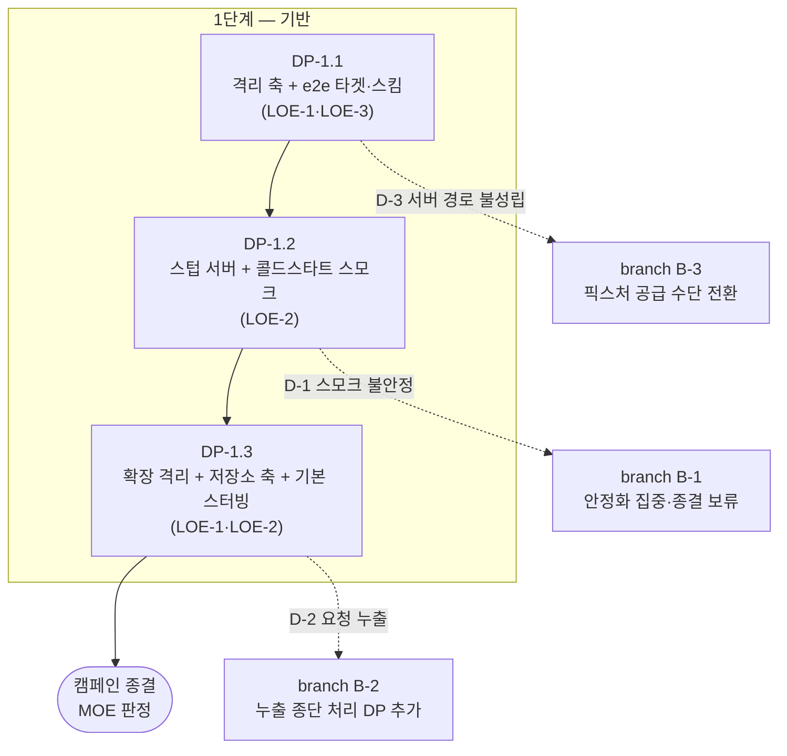

# 작전계획 — #826 e2e 하네스 구성

> 용어 — DP: 결정적 지점(작전명령 하나 = PR 하나) · LOE: 노력선(최종상태 한 관점을 담당하는 줄기) · FRAGO: 단편명령 · MOP / MOE: 과업 수행 여부 / 효과 발생 여부 · PIR / FFIR: 즉시보고 조건 중 환경·외부 정보 / 아군·내부 정보 · branch / sequel: 결정지점에서 발동하는 단계 안 대체 경로 / 단계 종료 상태별 후속 경로

작전계획 — #826 e2e 하네스 구성        작성: 유저   개정: 4회 (재가 전 결심 3건 / DP-1.1 에 host 종단 편입 / 확장 프로세스 격리 DP-1.3 신설 / DP-1.4 를 DP-1.3 에 흡수)

## 0. 전략 지침

- 목적: #826 — 앱 UI 자동화(XCUITest) 종단을 세운다. 상위 strategy.md 없음(단독 캠페인).
- 수단·제한 출처: 유저 직접 지시 3건 — (1) 뼈대가 아니라 **확장 가능한 기반**을 까는 게 주 목표, 시나리오는 이번엔 콜드스타트 하나만 (2) 분기 로직을 프로덕션 코드에 덕지덕지 붙이지 않는다 — 종단만 깔끔하게 분리 (3) e2e 실행 중 실제 API 를 호출하지 않는다. HTTP 뿐 아니라 Firebase 같은 SDK 도 기본 앱 실행에 필수가 아니면 돌지 않는다.
- **재가 전 결심된 사항** (계획에 확정 반영, 결정지점 아님):
  - `supportCountry` gist(`Endpoint.swift:380` 하드코딩)는 **실호출을 수용한다.** 공개 정적 파일이고 인증·서버 상태 변경이 없으며, 실패가 `CalendarViewModel.swift:317` 의 `try?` 로 삼켜져 스모크에 영향이 없다. 지시 (3) 의 취지(서버 오염·인증·과금·SDK 부작용)에 걸리지 않는다.
  - 스텁 서버는 **SPM 의존 없이 자체 구현**한다.
  - CI 배선은 **이번 범위 밖**이다. 실행은 로컬 수동. 배포 파이프라인이 생기면 그때 별도 이슈로 배치한다.
- 위임 상한: delegation.md 상속. 좁히는 것은 15항.

## 1. 상황

**정찰 요약** (kickoff 탐색 재사용 + 스텁 서버 결정에 따른 추가 정찰)

- `AppEnvironment.isTestBuild` (`TodoCalendarApp/Sources/AppEnvironment.swift:16`) 는 `XCTestConfigurationFilePath` 환경변수로 테스트 실행을 판정한다. **XCUITest 는 러너와 앱이 별개 프로세스라 앱 프로세스엔 이 변수가 없다** — 현 상태로 e2e 를 돌리면 앱이 실제 `models.db` 를 열고 실제 네트워크를 탄다.
- `isTestBuild` 소비처는 7곳이고 성격이 둘로 갈린다:
  - **외부 의존 차단** (e2e 에서도 참이어야 함) — `AppDelegate.swift:30` (Firebase configure·FCM·푸시 등록), `ApplicationBase.swift:100` (FirebaseAuth → `DummyFirebaseAuthService`), `ApplicationBase.swift:180` (AdMob → `DummyMobileAdService`), `AppEnvironment.swift:22` (DB 파일명 `test_dummy`)
  - **화면 억제** (e2e 에서는 거짓이어야 함 — 화면이 떠야 검증한다) — `ApplicationRootRouter.swift:294` (`guard !AppEnvironment.isTestBuild else { return nil }`), `AppExtensionBase.swift:68` (확장 타겟, 이번 범위 밖)
- Firebase·FCM·푸시·AdMob 차단 배선은 **이미 존재한다.** 신규 분기가 아니라 위 술어만 바꾸면 된다.
- 실제 API host 는 `RemoteEnvironment.calendarAPIHost` (`Repository/Sources/Remote/Endpoint.swift:355`) 하나로 수렴하고, 조립은 `ApplicationBase.swift:77-97` 한 곳뿐이다. host 는 `install/secrets.json` 에서 읽고 `AppEnvironment.useEmulator` (`AppEnvironment.swift:14`) 로 갈린다 — **환경 스위치로 host 를 갈아끼우는 선례가 이미 있다.**
- `install/secrets.json` 의 `emulator_caleandar_api_host` 는 `http://127.0.0.1:5001/dummy/api` 다. 로컬 평문 HTTP 를 타는 경로가 이미 전제돼 있다.
- 앱 타겟 Info.plist 에 `NSAppTransportSecurity.NSAllowsArbitraryLoads = true` 가 이미 있다 (`Tuist/ProjectDescriptionHelpers/Project+Templates.swift:225`). 로컬 스텁 서버 접속에 ATS 설정 추가가 필요 없다.
- 콜드런치(미로그인)가 타는 RemoteAPI 호출은 2건뿐이다 — `HolidayRepositoryImple.swift:42` (`supportCountry`), `:145` (`holidays`).
- `supportCountry` 는 `calendarAPIHost` 를 안 탄다 — `RemoteEnvironment.path` 의 첫 case (`Endpoint.swift:380`) 가 gist URL 을 하드코딩한다. 진입 경로는 `HolidayUsecaseImple.prepare()` → `loadLatestSelectedCountryOrDefaultValueByCurrentLocale()` (`HolidayUsecase.swift:92,106`) 이고, 최종 호출자가 `CalendarViewModel.swift:317` 의 `try? await` 라 **실패가 삼켜져 캘린더 렌더를 깨지 않는다.** 0항 결심의 근거다.
- Tuist `makeAppTargets` (`Project+Templates.swift:207`) 는 app 타겟과 `<name>Tests` (`.unitTests`) 만 만든다. uiTests product 타겟이 프로젝트에 하나도 없다.
- Tuist 스킴 접기 — `<Target>Tests` 이름은 `<Target>` 스킴의 TestAction 으로 접히고, 다른 이름(예: `<Target>Snapshots`)은 독립 스킴이 된다.
- SPM 의존은 루트 `Package.swift` 한 곳에서 관리한다.

**장애·마찰 — 유력한 양상**

- UI 테스트는 타이밍 의존이라 첫 시나리오부터 플레이키가 붙기 쉽다. 이 레포는 이미 병렬 실행 전용 플레이키 이력이 있다.
- 스텁 서버를 러너 프로세스에 띄우면 포트 점유·수명 관리가 새로 생긴다. 고정 포트·수동 종료는 이 레포의 DB 파일명 충돌 플레이키와 같은 부류의 실패를 부른다.
- 격리 축을 넓히다 `isTestBuild` 소비처 7곳의 판정이 뒤바뀌면 기존 유닛 테스트가 조용히 깨질 수 있다 — 특히 화면 억제(`ApplicationRootRouter.swift:294`) 를 잘못 건드리면 유닛 테스트에서 실제 화면이 뜬다.

**가장 위험한 양상**

기반을 깔았는데 확장 시점(두 번째 시나리오)에 프로덕션 코드를 또 고쳐야 하는 상태로 끝나는 것. 그러면 이번 캠페인의 주 목표(확장 가능한 기반)가 무산된다.

## 2. 문제 정의

- **현 상태**: UI 자동화 테스트 종단이 없다. 억지로 XCUITest 를 붙이면 앱이 실제 DB·실제 API·실제 SDK 를 물고 뜬다.
- **원하는 상태**: e2e 실행임을 앱이 인지해 외부 의존을 끊고, 러너가 준 픽스처로만 동작하며, 콜드스타트 스모크 1건이 로컬 e2e 스킴에서 돈다. 시나리오 추가 시 프로덕션 코드를 안 건드린다.
- **막는 것**: 테스트 실행 판정축이 XCUITest 를 못 본다는 것, uiTests 타겟 부재, 픽스처 공급 수단 부재.
- **범위 밖**: CI 배선(0항 결심 — 배포 파이프라인 신설 시 별도 이슈), 이벤트 CRUD·로그인·설정·외부 캘린더 시나리오, 확장 타겟(`AppExtensionBase.swift:68`), 스냅샷 테스트, 기존 유닛 테스트 스킴 구성 변경, `supportCountry` gist 종단 처리(0항 결심).

## 3. 종결·중단 기준

- **성공 종결**: 4항 최종상태 전 항목 도달.
- **중단·축소 조건**: 스텁 서버 경로가 시뮬레이터에서 성립하지 않으면(A-1·A-2 붕괴) 캠페인을 재검토한다 — 픽스처 공급 수단 자체가 바뀌면 DP 배열이 무의미해진다. 스모크가 작전한계점(12항)에 걸리면 D-1 로 간다.
- **중단 시 수습**: 머지된 DP 는 되돌리지 않는다 — DP-1.1 까지 머지된 상태는 그 자체로 "격리 축은 서 있고 시나리오만 없는" 유효한 중간 상태다. 열린 브랜치는 닫고 잔여를 후속 이슈로 넘긴다.

## 4. 최종상태 (완료형 + 판정 방법)

| 관점 | 상태 | 판정 |
|---|---|---|
| 동작 | e2e 스킴으로 콜드스타트 스모크를 돌리면 앱이 실행돼 캘린더 루트가 렌더된 것을 단언하고 통과한다 | `xcodebuild test -scheme <e2e 스킴>` 통과 |
| 코드 | 프로덕션 코드의 e2e 관련 개입이 판정축 1개 · host 주입 1곳 · 청정 상태 초기화 1곳 · 접근성 식별자 카탈로그 1개(캘린더 월 그리드 1건 등재)로 끝나 있다 | 브랜치 전체 diff 에서 프로덕션 파일 변경 라인 열거 |
| 구조 | e2e 타겟이 독립 스킴을 갖고 기존 유닛 테스트 스킴(`TodoCalendarApp`)에 섞이지 않는다 | `xcodebuild -list` 로 스킴 분리 확인 |
| 검증 | e2e 실행 중 **앱과 확장 프로세스 둘 다** 실 API host·Firebase·AdMob 로 내보낸 요청이 0 이고 실 DB 를 열지 않는다 (gist `supportCountry` 는 0항 결심으로 수용) | 스텁 서버 미등록 요청 카운트 + 실행 로그 + App Group DB 파일 mtime |
| 품질 | 시나리오를 하나 더 추가할 때 픽스처·시나리오 파일만 늘면 되고, 단언 대상은 식별자 카탈로그 한 파일에서 화면별로 찾는다 — 프로덕션 변경은 새 화면을 카탈로그에 등재할 때만 발생한다 | DP-1.2 종결보고의 확장 경로 서술 + 픽스처·시나리오 파일만으로 구성됨을 diff 로 확인 |
| 외부 | 없음 (CI 배선은 범위 밖) | — |

## 5. 중심 분석

- **힘의 원천**: 이미 서 있는 환경 스위치 선례 두 개 — `AppEnvironment.isTestBuild` 가 외부 SDK 차단을 4곳에서 이미 끊고 있고, `useEmulator` 가 host 를 갈아끼우는 경로를 이미 보여준다. 새 격리 기제를 발명하는 게 아니라 기존 축을 e2e 까지 넓히는 일이다.
- **장애의 중심 + 취약점**: 장애의 중심은 "테스트 실행 판정이 XCUITest 를 못 본다"는 단일 사실이다. 취약점은 그 판정이 `AppEnvironment` 한 파일의 계산 프로퍼티라는 것 — 여기만 고치면 소비처 7곳이 따라온다.
- **접근 — 잠식**: 판정축을 쪼개 e2e 를 기존 차단 배선에 편입시키고(직접 개입 최소), host 주입만 새로 뚫는다. 직접 접근(각 SDK 호출부마다 e2e 분기 추가)은 유저 지시 (2) 를 정면으로 어기고, 우회 접근(별도 e2e 전용 앱 타겟 신설)은 프로덕션과 다른 조립을 검증하게 돼 e2e 의 의미가 사라진다.

## 6. 노력선

- **LOE-1 격리 종단**: 담당 관점 = 코드·검증. 중간 목표 ① 앱이 e2e 실행을 인지한다 → ② 외부 SDK 가 e2e 에서 돌지 않는다 → ③ 외부 HTTP 가 e2e 에서 나가지 않는다
- **LOE-2 픽스처 공급**: 담당 관점 = 동작·품질. 중간 목표 ① 러너가 스텁 서버를 띄우고 앱이 붙는다 → ② 콜드런치가 타는 응답이 픽스처로 공급된다 → ③ 시나리오 추가가 픽스처 추가만으로 된다
- **LOE-3 실행 배선**: 담당 관점 = 구조. 중간 목표 ① e2e 타겟·독립 스킴이 생긴다 → ② 로컬에서 스킴 하나로 실행된다

## 7. 단계

단일 단계다 — CI 배선이 범위에서 빠져 국면 전환이 없다.

| 단계 | 진입 조건 | 종료 조건 | 주노력 LOE | 목적 |
|---|---|---|---|---|
| 1단계 기반 | 작전계획 재가 | 콜드스타트 스모크가 로컬 e2e 스킴에서 통과하고, 앱·확장 어느 프로세스도 실 API host·Firebase·AdMob 로 요청을 안 내보내며 실 DB 를 열지 않는다 | LOE-1 → LOE-2 → LOE-1 | 격리된 e2e 종단을 세운다 |

sequel — 1단계 종료 상태별 후속:
- 충족 → 캠페인 종결 (평가 모드에서 MOE 판정 후 상위 이슈 클로즈)
- 부분(스모크는 통과하나 요청이 새어나감) → D-2 발동
- 미충족(스모크가 불안정) → D-1 발동

## 8. 작전 배열

**격자 (노력선 × 단계 → DP 좌표)**

| | 1단계 기반 |
|---|---|
| LOE-1 격리 종단 | DP-1.1 (앱 프로세스) · DP-1.3 (확장 프로세스 + 저장소 축 전수) |
| LOE-2 픽스처 공급 | DP-1.2 (스텁 종단) · DP-1.3 (기본 스터빙 세트) |
| LOE-3 실행 배선 | DP-1.1 (타겟·스킴) |

**시퀀스** — 직렬 사슬: DP-1.1 → DP-1.2 → DP-1.3.

근거: DP-1.1 이 만드는 판정축·타겟이 DP-1.2 의 전제이자 검증 수단이다 — 타겟 없이는 격리가 도는지 확인할 방법이 없다. DP-1.3 이 DP-1.2 뒤인 것은 스텁 서버가 서야 "확장이 실 host 로 안 나간다"를 미등록 요청 카운트로 실제 검증할 수 있기 때문이다. 구 DP-1.4(기본 스터빙 세트)는 DP-1.3 에 흡수했다 — 미등록 요청 로그가 판정축이 되려면 앱이 부르는 요청이 먼저 전부 등록돼 있어야 하고, 그 세트를 채우는 실측이 곧 DP-1.3 이 돌릴 실측이라 나누면 같은 실행을 두 번 돈다. 병렬 슬롯 대응 없음 — 유저가 단일 세션 연속 실행(orchestrate)을 지정했다.

**통제수단** (인접 DP 사이 인터페이스 계약)

- DP-1.1 → DP-1.2: 앱이 e2e 를 인지하는 **실행 인자 키**(`-uiTest`)와, 러너가 host 를 주입하는 **환경변수 키**(`E2E_API_HOST`) 두 이름을 DP-1.1 이 확정하고 **양쪽 다 구현까지 한다**. DP-1.2 는 후자에 값을 채우고, 단언·재실행 가능성이 요구하는 프로덕션 개입 둘(접근성 식별자·청정 상태 초기화)을 `-uiTest` 축 위에 얹는다.
- DP-1.2 → DP-1.3: DP-1.2 가 만든 **스텁 서버 미등록 요청 로그**와 `E2ETestCase`·`E2EFixture` 가 DP-1.3 의 기반이다. DP-1.3 은 시나리오가 쓰던 등록을 베이스로 올려 로그 노이즈를 걷은 뒤, 그 로그와 실 DB mtime 두 축으로 격리를 판정한다.
- 머지 순서 = 시퀀스 순서. stacked 없음.

**요도**

## 9. DP 목록

| DP | LOE | 단계 | 내용 | 선행 DP | 소유 범위 (모듈·파일) | 사이즈 |
|---|---|---|---|---|---|---|
| DP-1.1 | LOE-1, LOE-3 | 1 | `isTestBuild` 를 "외부 의존 차단"과 "화면 억제" 두 축으로 분리하고 e2e 실행 인지를 전자에 편입. **host 종단도 같은 축에 넣어 미주입 시 도달 불가 주소로 떨어뜨린다** (안 그러면 스모크 첫 실행이 실 API 를 탄다). uiTests 타겟·독립 스킴 신설 + 앱이 뜨는지만 확인하는 최소 테스트 | 없음 | `TodoCalendarApp/Sources/AppEnvironment.swift`, `TodoCalendarApp/Sources/AppDelegate.swift`, `TodoCalendarApp/Sources/Factories/ApplicationBase.swift`, `TodoCalendarApp/Project.swift`, `Tuist/ProjectDescriptionHelpers/Project+Templates.swift`, `TodoCalendarApp/E2E/**` (신규) | M |
| DP-1.2 | LOE-2 | 1 | 러너 프로세스에 스텁 HTTP 서버(자체 구현)를 띄우고 그 주소를 `E2E_API_HOST` 로 넘긴다. 콜드런치 픽스처(`holidays`) 공급 + 캘린더 루트 렌더 단언까지 스모크 완성. **프로덕션 개입 둘을 동반한다** — 접근성 식별자 카탈로그 신설과 월 그리드 등재(단언 대상이 없다: 코드베이스에 식별자 0개. 뷰마다 리터럴을 흩뿌리지 않고 모듈 간 공유 계약 자리인 `Scenes` 정본에 모아 e2e 가 심볼로 쓴다), `-uiTest` 시 DB·UserDefaults 청정화(안 하면 2회차부터 캐시로 통과해 스텁 공급을 검증 못 한다) | DP-1.1 | `TodoCalendarApp/E2E/**`, `TodoCalendarApp/Sources/AppDelegate.swift`, `Presentations/Scenes/Sources/AccessibilityID.swift`, `Presentations/CalendarScenes/Sources/Month/MonthView.swift`, `Tuist/ProjectDescriptionHelpers/Project+Templates.swift`, `.claude/rules/presentations-rules.md` | M |
| DP-1.3 | LOE-1, LOE-2 | 1 | 격리 축의 구멍을 전부 메우고 확장 프로세스까지 태운다. (가) **저장소 축 전수** — `externalCalendarDBPaths()` 와 keychain 은 test/production 분기가 아예 없어 앱 프로세스도 실 저장소를 연다(실측: e2e 1회 실행에 `google_calendar.db-shm` mtime 변화). `AppExtensionBase` 와 `AICommandIntentFactory` 의 `groupID`·`keyChainStoreName`·host 직접 참조도 `AppEnvironment` 축으로 통일한다. (나) **확장 인지 수단** — 확장은 `launchArguments` 를 못 받아 인지 축이 앱과 다르다. 위젯 확장이 앱과 같은 시점에 떠 실 `models.db` 를 읽기 전용으로 연다는 게 실측됐고(DP-1.3 정찰), XCUITest 가 앱을 강제 종료해 인지 표식 정리가 보장 안 되니 일반 실행 오염을 막을 fail-safe 가 함께 필요하다. (다) **기본 스터빙 세트** — 콜드런치 API 응답을 `E2ETestCase` 가 기본 스터빙하고 소비 단언을 베이스 tearDown 으로 올린다. 미등록 요청 로그가 (나)의 판정축이 되려면 이 노이즈가 먼저 걷혀야 한다 | DP-1.2 | `TodoCalendarApp/Sources/AppEnvironment.swift`, `TodoCalendarApp/AppExtensions/Base/AppExtensionBase.swift`, `TodoCalendarApp/Sources/AppIntents/AICommandIntentFactory.swift`, `TodoCalendarApp/E2E/**`, 인지 수단이 요구하는 타겟 정의·entitlements | M |

## 10. 결정지점·branch

| ID | 판단 정보 PIR/FFIR | 결정 | 시한 (조건) | 미결 시 기본 |
|---|---|---|---|---|
| D-1 | FFIR-1 — 로컬 연속 실행 통과율과 1회 소요 시간이 작전한계점(12항)에 걸리는가 | 안정화에 집중해 종결을 보류하나, 스모크 단언을 낮춰(예: 루트 렌더 대신 프로세스 생존) 종결하나 | DP-1.2 스모크 완성 직후 5회 연속 실행 결과가 나온 시점 | 안정화 집중 — 불안정한 e2e 는 확장 기반이 못 되고, 주 목표가 기반이다 |
| D-2 | PIR-1 — 스텁 서버 미등록 요청 로그에 실 API host·Firebase·AdMob 행 요청이 남는가 (gist 는 제외) | 누출 종단을 DP 하나로 추가해 처리하나, 해당 호출을 스텁 대상에 편입하나 | DP-1.2 스모크 최초 통과 직후 로그 확인 시점 | 스텁 대상 편입 — 픽스처 추가로 끝나면 프로덕션 개입이 안 늘어난다. 프로덕션 변경이 필요한 누출이면 DP 추가로 올린다 |
| D-3 | FFIR-2 — 러너 프로세스의 로컬 서버에 시뮬레이터 앱이 접속되는가 (A-1·A-2) | 픽스처 공급 수단을 유지하나 전환하나(`URLProtocol` 주입·파일 경로 주입 등) | DP-1.2 최초 스텝 실측 시점 | 재검토 상향 — 3항 중단 조건이고, 수단이 바뀌면 DP 배열이 무의미해져 계획 개정 대상이다 |

| branch | 발동 결정지점 | 내용 | 결심자 |
|---|---|---|---|
| B-1 | D-1 | 캠페인 종결을 보류하고 안정화에 자원을 돌린다. 단언 완화로 종결하면 "확장 가능한 기반" MOE 를 미달로 기록한다 | 유저 |
| B-2 | D-2 | 누출 종단 처리를 DP-1.3 으로 추가한다. 프로덕션 개입이 4항 코드 관점(판정축 1개 + host 주입 1곳)을 넘으면 최종상태를 함께 개정한다 | 유저 |
| B-3 | D-3 | 픽스처 공급 수단을 전환하고 DP-1.2 를 재작성한다. 계획 개정 후 재가를 다시 받는다 | 유저 |

## 11. 가정

| ID | 가정 | 검증 방법 | 검증 결과 | 깨지면 |
|---|---|---|---|---|
| A-1 | 시뮬레이터 앱이 `http://127.0.0.1:<port>` 로 접속 가능하다 (ATS `NSAllowsArbitraryLoads` 이미 참, loopback) | DP-1.2 최초 스텝에서 실측 | **확인** (DP-1.2) — 스텁이 `/v2/holiday` 를 수신 | D-3 → B-3 |
| A-2 | UITest 러너 프로세스에서 띄운 서버에 앱 프로세스가 붙는다 (같은 시뮬레이터 호스트 네트워크 스택) | DP-1.2 최초 스텝에서 A-1 과 함께 실측 | **확인** (DP-1.2) — 5회 연속 전부 수신 | D-3 → B-3 |
| A-3 | `Tests` 로 끝나지 않는 이름의 테스트 타겟은 Tuist 가 독립 스킴으로 만든다 (`<Name>Snapshots` 선례) | DP-1.1 에서 `tuist generate` 후 `xcodebuild -list` 확인 | **확인** (DP-1.1) | DP-1.1 안에서 스킴을 명시 정의로 전환 — branch 불요 |
| A-4 | 미로그인 콜드런치가 타는 RemoteAPI 호출은 `supportCountry`·`holidays` 2건뿐이다 | DP-1.2 에서 스텁 서버 미등록 요청 로그로 확인 | **확인** (DP-1.2) — 미등록 로그에 실 host 행 요청 없음 | D-2 |
| A-5 | 판정축 분리 후에도 기존 유닛 테스트 스킴이 전건 통과한다 (화면 억제 판정이 안 뒤집힘) | DP-1.1 에서 영향 스킴 테스트 실행 | **확인** (DP-1.1) | DP-1.1 안에서 축 분리 재설계 — branch 불요 |
| A-6 | GET 소수 응답만 다루므로 HTTP 파싱을 자체 구현해도 면적이 작다 | DP-1.2 스텁 서버 구현 시점 | **확인** (DP-1.2) — `StubHTTPServer` 134줄, SPM 의존 0 | 유저에게 즉시보고 후 SPM 의존 도입 재결심 (15항이 자율 추가를 금지) |
| A-7 | 확장 프로세스에 e2e 실행을 알릴 수단이 존재하고, 그 수단이 일반 실행을 오염시키지 않게 정리할 수 있다 | DP-1.3 설계·실측 | **부분** — 오염 주체까지 특정됐다 (DP-1.3 정찰: e2e 1회 실행 전후 실 `models.db-shm` mtime 변화 + 이번 설치분 번들의 위젯 확장이 앱과 같은 시점에 약 10초 실행. 앱 경로는 전부 `test_dummy` 라 소거법으로 `AppExtensionBase.commonSqliteService`). 알릴 수단 존재 여부는 DP-1.3 미확인 | 확장 격리를 포기하고 12항 수용 위험으로 되돌린다 — 그때 최종상태 4항 검증 관점을 앱 프로세스 기준으로 개정 |

## 12. 위험

| 위험 | 영향 LOE | 수용·완화·회피 | 근거 |
|---|---|---|---|
| UI 테스트 플레이키로 e2e 가 확장 기반 구실을 못 한다 | LOE-2 | 완화 — 작전한계점 지표로 게이트하고 D-1 로 결심 | 이 레포는 병렬 실행 전용 플레이키 이력이 있어 신규 테스트 종단의 안정성을 실측 없이 못 믿는다 |
| 스텁 서버 포트 충돌·수명 누수로 연속 실행이 깨진다 | LOE-2 | 완화 — 포트 0 바인딩(OS 할당) + tearDown 종료를 DP-1.2 작전명령에 과업으로 박는다 | 고정 포트·수동 종료는 이 레포 DB 파일명 충돌 플레이키와 같은 부류의 실패다 |
| 판정축 분리가 화면 억제 판정을 뒤집어 기존 유닛 테스트가 조용히 깨진다 | LOE-1 | 완화 — A-5 검증을 DP-1.1 완료 조건에 넣고, 15항이 `isTestBuild` 이름·동작 변경을 금지 | 소비처가 7곳이고 두 성격이 한 이름에 얹혀 있어 오분류 여지가 크다 |
| gist `supportCountry` 실호출이 실패하면 국가가 안 정해져 홀리데이 요청 자체가 안 나가고 스모크가 깨진다 | LOE-2 | 수용 — 0항이 gist 실호출을 결심했고, 실패 시 스텁 미수신 로그로 원인이 즉시 드러난다 | `HolidayUsecaseImple.prepare` 가 로컬 저장 국가가 없을 때만 gist 를 타고, 청정화 때문에 e2e 는 항상 이 경로다 |

**작전한계점** — 콜드스타트 스모크를 로컬에서 5회 연속 실행해 통과율이 5/5 가 아니거나 1회 실행이 3분을 넘으면, 종결 보고를 내지 않고 안정화에 집중한다(D-1). 지표: 연속 통과율, 1회 실행 소요.

## 13. 자원

| 단계 | 주노력 자원 | 부노력 자원 |
|---|---|---|
| 1단계 | 이 세션이 orchestrate 로 DP-1.1 → DP-1.2 연속 실행. 병렬 슬롯·워크트리 없음 | 유저 시간 — DP 별 작전명령 재가 2회, D-1~D-3 발동 시 결심 |

외부 계정 불요. CI 러너 불요(CI 배선 범위 밖).

## 14. 평가

**MOP** — 각 DP 종결보고 1항의 최종상태 대조로 완료 판정.

**MOE**

| 관점 | 지표 | 판정 데이터 출처 |
|---|---|---|
| 격리 (LOE-1) | e2e 실행 중 앱·확장 어느 프로세스도 실 API host·Firebase·AdMob 로 요청을 안 내보내고 실 저장소를 안 연다 | 스텁 서버 미등록 요청 카운트 + 실행 전후 실 DB 파일 mtime |
| 기반 (LOE-2) | 시나리오 추가에 프로덕션 코드 변경이 필요 없다 | DP-1.2 종결보고의 확장 경로 서술 + 픽스처·시나리오 파일만으로 구성됨을 diff 로 확인 |
| 실행 (LOE-3) | 로컬에서 e2e 스킴 하나로 실행되고 기존 유닛 테스트 스킴이 전건 통과한다 | `xcodebuild -list` + 영향 스킴 테스트 결과 |

**평가 시점** — DP 종결보고 접수 시(MOP·해당 LOE 의 MOE), DP-1.2 종결 시(단계 종료 조건 대조 + 캠페인 종결 판정).

## 15. 위임

delegation.md 상속. 좁히는 것만:

- **프로덕션 코드 수정은 계획에 명시된 파일·목적으로 한정한다.** DP 소유 범위(9항) 밖의 프로덕션 파일을 고쳐야 하면 자율 진행하지 않고 즉시보고 후 재가.
- 기존 `isTestBuild` 의 **이름과 동작을 바꾸지 않는다** — 축을 추가하는 방식으로만 확장한다. 이름 변경은 소비처 7곳과 확장 타겟까지 번져 범위를 벗어난다.
- SPM 의존 추가는 자율 사항이 아니다 — 0항이 자체 구현으로 결심했고, 뒤집으려면 A-6 경로로 즉시보고 후 재결심.

## 16. 상시 제한

**해야**

- e2e 관련 프로덕션 코드 변경은 매 DP 종결보고에서 변경 라인을 열거한다 (이유: 4항 코드 관점이 "판정축 1개 + host 주입 1곳"이라는 정량 상태라, 누적을 안 세면 판정이 불가능하다).
- 픽스처·시나리오는 e2e 타겟 소유로 둔다 (이유: 유저 지시 — 앱 번들에 포함돼 배포되면 안 된다).
- DP-1.1 완료 전 영향 스킴 유닛 테스트를 실행한다 (이유: A-5·12항 세 번째 위험. 판정축 분리는 소비처 7곳에 동시 작용한다).

**하지 말아야**

- 각 SDK·API 호출부마다 e2e 분기를 개별 추가하지 않는다 (이유: 유저 지시 (2). 기존 차단 배선의 술어 교체로 해결된다).
- e2e 를 기존 `TodoCalendarApp` 스킴 TestAction 에 넣지 않는다 (이유: 유닛 테스트 소요·안정성에 UI 테스트를 섞으면 기존 회귀 감지가 같이 흔들린다).
- 시나리오를 콜드스타트 밖으로 넓히지 않는다 (이유: 유저가 이번 범위를 명시 한정. 기반이 목표고 커버리지는 후속이다).
- CI 워크플로우 파일을 건드리지 않는다 (이유: 0항 결심 — CI 배선은 배포 파이프라인 신설 시 별도 이슈다).

## 17. 상시 즉시보고 조건

| 조건 | 대응 결정지점 |
|---|---|
| 로컬 연속 실행이 작전한계점(12항)에 걸림 | D-1 |
| 스모크 실행 중 실 API host·Firebase·AdMob 로 요청이 나간 흔적 발견 | D-2 |
| 콜드런치가 A-4 밖의 RemoteAPI 호출을 탐 | D-2 |
| 시뮬레이터 앱이 러너의 로컬 서버에 못 붙음 | D-3 |
| 스텁 서버 자체 구현 면적이 커져 SPM 의존이 필요하다는 판단 | A-6 → 재가 상향 |
| 프로덕션 코드 변경이 9항 소유 범위 밖으로 번져야 하는 상황 | 재가 상향 |
| 제한·위임 판단이 갈리는데 대응 rules 조항이 없음 → 하네스 갭 | 재가 상향 |

## 18. 원장

→ `.operations/826/campaign-progress.md` (커밋되지 않음, 이슈 본문 `<!-- progress -->` 블록으로 미러)
