# Scene Navigation Flow Graph

앱 내 화면(VC) 간 네비게이션 플로우.

- **실선 화살표**: push / attach (Navigation 스택)
- **점선 화살표**: present / modal (모달 표시)
- **이중선 화살표**: 외부 앱 연동

---

## 전체 플로우

```mermaid
graph TD
    subgraph Root
        AppRoot[ApplicationRoot]
        Main[MainScene]
    end

    subgraph Calendar["CalendarScenes"]
        CalendarView[CalendarView]
        CalendarPaper[CalendarPaper]
        Month[MonthScene]
        DayEventList[DayEventList]
        SelectDateDialog[SelectDateDialog]
    end

    subgraph EventDetail["EventDetailScene"]
        EventDetailInput[EventDetail\nTodo·Schedule 생성/편집]
        TodoDetail[TodoEventDetail]
        ScheduleDetail[ScheduleEventDetail]
        HolidayDetail[HolidayEventDetail]
        GoogleDetail[GoogleCalendarEventDetail]
        AppleDetail[AppleCalendarEventDetail]
        DoneTodoDetail[DoneTodoDetail]
        SelectRepeat[SelectEventRepeatOption]
        SelectTag[SelectEventTag]
        SelectNotification[SelectEventNotificationTime]
        SelectMapApp[SelectMapAppDialog]
        Guide[GuideScene]
    end

    subgraph EventList["EventListScenes"]
        DoneTodoList[DoneTodoEventList]
    end

    subgraph Setting["SettingScene"]
        SettingList[SettingItemList]
        AppearanceSetting[AppearanceSetting]
        ColorTheme[ColorThemeSelect]
        WidgetAppearance[WidgetAppearanceSetting]
        TimeZoneSelect[TimeZoneSelect]
        EventSetting[EventSetting]
        EventTagSelect[EventTagSelect]
        NotificationDefault[EventNotificationDefaultTimeOption]
        DefaultMapApp[EventDefaultMapApp]
        EventTagList[EventTagList]
        EventTagDetail[EventTagDetail]
        HolidayList[HolidayList]
        CountrySelect[CountrySelect]
        FeedbackPost[FeedbackPost]
    end

    subgraph Member["MemberScenes"]
        SignIn[SignIn]
        ManageAccount[ManageAccount]
    end

    External_Safari([Safari])
    External_MapApp([지도 앱])
    External_AppleCal([Apple Calendar])
    External_Settings([시스템 설정])

    %% Root flow
    AppRoot --> Main
    Main --> CalendarView
    Main --> SettingList
    Main -.-> SelectDateDialog
    Main --> EventTagList

    %% Calendar flow
    CalendarView --> CalendarPaper
    CalendarPaper --> Month
    CalendarPaper --> DayEventList

    %% DayEventList navigation
    DayEventList -.-> EventDetailInput
    DayEventList -.-> TodoDetail
    DayEventList -.-> ScheduleDetail
    DayEventList -.-> HolidayDetail
    DayEventList -.-> GoogleDetail
    DayEventList -.-> AppleDetail
    DayEventList -.-> DoneTodoList

    %% EventDetail sub-navigation
    EventDetailInput -.-> SelectRepeat
    EventDetailInput -.-> SelectTag
    EventDetailInput -.-> SelectNotification
    EventDetailInput -.-> SelectMapApp
    EventDetailInput -.-> Guide

    TodoDetail -.-> SelectRepeat
    TodoDetail -.-> SelectTag
    TodoDetail -.-> SelectNotification
    TodoDetail -.-> SelectMapApp
    TodoDetail -.-> Guide

    ScheduleDetail -.-> SelectRepeat
    ScheduleDetail -.-> SelectTag
    ScheduleDetail -.-> SelectNotification
    ScheduleDetail -.-> SelectMapApp

    SelectTag -.-> EventTagDetail
    SelectTag --> EventTagList

    DoneTodoDetail -.-> SelectMapApp

    GoogleDetail ==> External_Safari
    AppleDetail ==> External_AppleCal
    SelectMapApp ==> External_MapApp

    %% DoneTodoList navigation
    DoneTodoList -.-> DoneTodoDetail

    %% Setting flow
    SettingList --> AppearanceSetting
    SettingList --> EventSetting
    SettingList --> HolidayList
    SettingList --> ManageAccount
    SettingList -.-> FeedbackPost
    SettingList -.-> SignIn

    AppearanceSetting --> ColorTheme
    AppearanceSetting --> WidgetAppearance
    AppearanceSetting --> TimeZoneSelect

    EventSetting --> EventTagSelect
    EventSetting --> NotificationDefault
    EventSetting --> DefaultMapApp
    EventSetting ==> External_Settings

    EventTagList -.-> EventTagDetail
    EventTagList --> EventSetting

    HolidayList --> CountrySelect
```

---

## 모듈별 요약

| 모듈 | 화면 수 | 역할 |
|---|---|---|
| **Root** | 2 | 앱 진입점, 메인 컨테이너 |
| **CalendarScenes** | 5 | 월별 캘린더, 일별 이벤트 목록 |
| **EventDetailScene** | 11 | 이벤트 생성/편집/상세 + 선택 다이얼로그 |
| **EventListScenes** | 1 | 완료된 할일 목록 |
| **SettingScene** | 11 | 설정 전체 (외형, 이벤트, 태그, 휴일, 피드백) |
| **MemberScenes** | 2 | 로그인, 계정 관리 |

## 네비게이션 패턴

| 패턴 | 설명 | 예시 |
|---|---|---|
| **Push** (실선) | Navigation 스택에 push | SettingList → AppearanceSetting |
| **Modal** (점선) | bottomSlide / present | DayEventList → EventDetail |
| **Attach** (실선) | 부모에 자식 embed | CalendarView → CalendarPaper |
| **External** (이중선) | 외부 앱 열기 | GoogleDetail → Safari |
