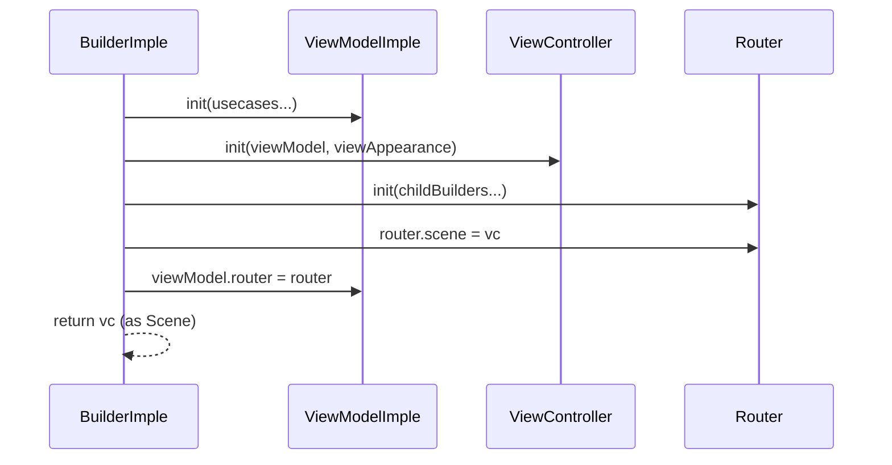
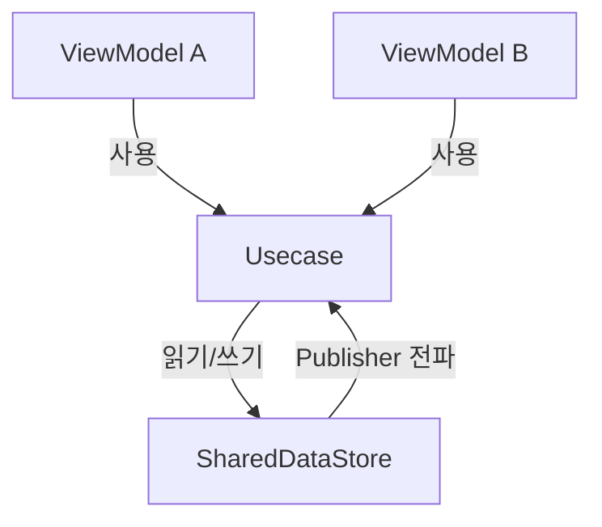
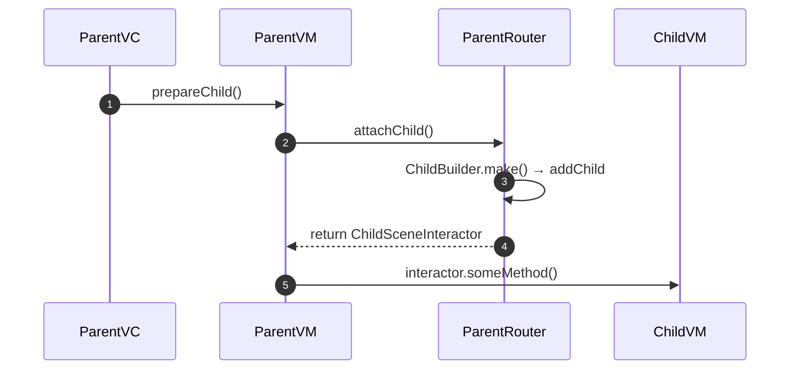
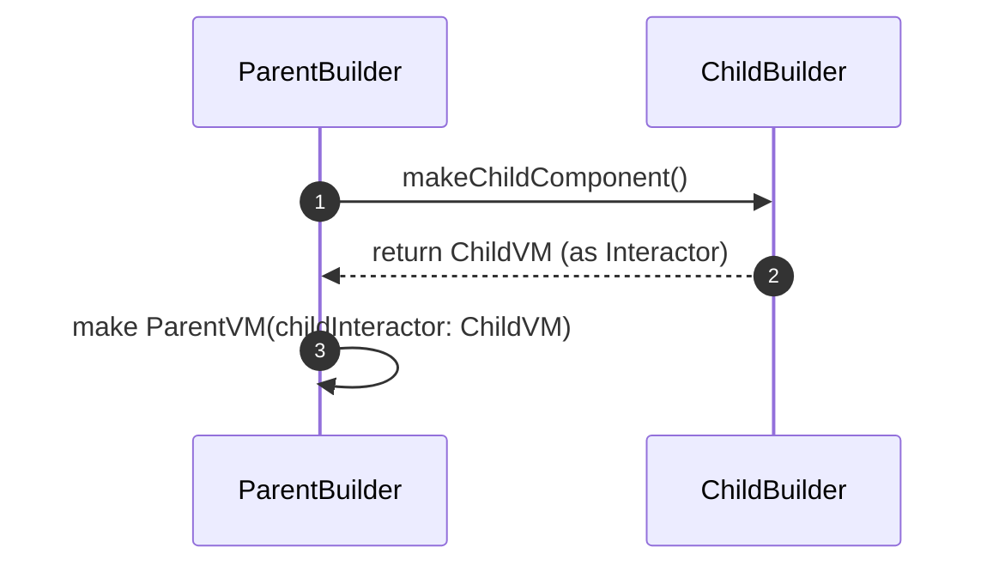
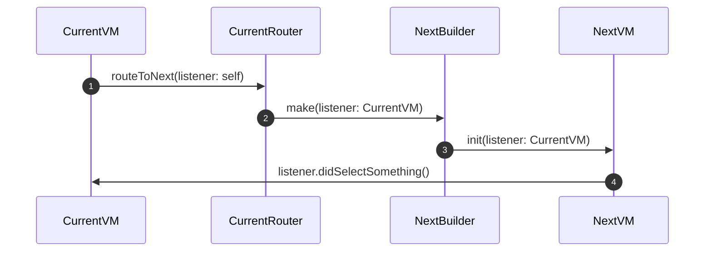
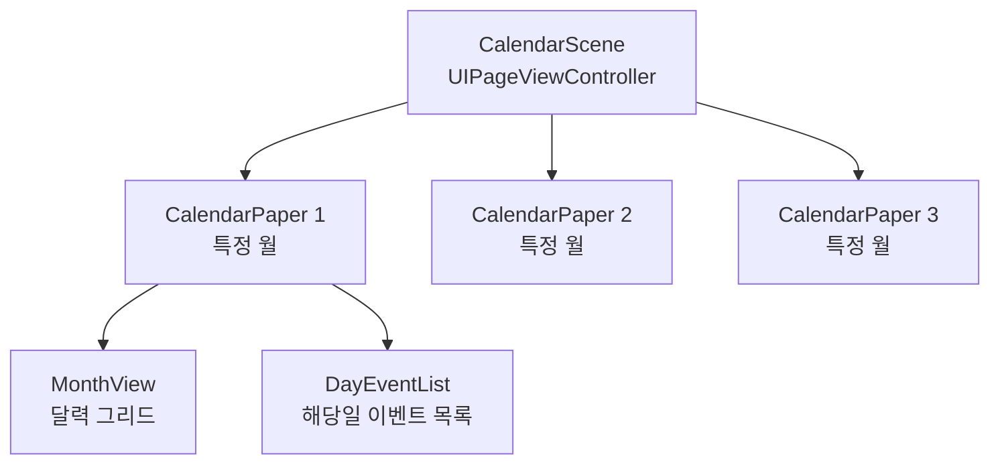
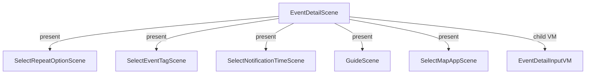

# Scene 스펙

화면(Scene) 단위 작업의 기준이 되는 스펙 문서.

---

## 1. Scene 구성 요소

하나의 Scene은 아래 파일들로 구성된다.

| 파일 | 역할 |
|---|---|
| `XXXScene+Builder.swift` | Scene/Interactor/Listener/Builder 프로토콜 정의 |
| `XXXViewModel.swift` | ViewModel 프로토콜 + `XXXViewModelImple` 구현 |
| `XXXViewController.swift` | UIHostingController 또는 UIViewController |
| `XXXRouter.swift` | `BaseRouterImple` 상속, `XXXRouting` 프로토콜 구현 |
| `XXXBuilderImple.swift` | Builder 구현체 — 모든 의존성 조립 |
| `XXXView.swift` | (SwiftUI 사용 시) ViewState, ViewEventHandler, ContainerView, View |

### 생성 순서 (BuilderImple 내부)

```
1. ViewModel 생성 (Usecase 주입)
2. ViewController 생성 (ViewModel + ViewAppearance 주입)
3. 자식 Scene Builder 생성
4. Router 생성 (자식 Builder 주입)
5. 연결: router.scene = vc, viewModel.router = router
```



---

## 2. 컴포넌트 상세

### 2-1. Scene + Builder 프로토콜 (`XXXScene+Builder.swift`)

```swift
// Scene Interactor — 외부에서 이 Scene에 메시지를 보낼 인터페이스
protocol XXXSceneInteractor: AnyObject { }

// Scene Listener — 이 Scene이 부모에게 메시지를 보낼 인터페이스 (필요 시)
// protocol XXXSceneListener: AnyObject { }

// Scene — UIViewController + Interactor
protocol XXXScene: Scene where Interactor == any XXXSceneInteractor { }

// Builder — Scene 생성 팩토리
protocol XXXSceneBuilder: AnyObject {
    @MainActor func makeXXXScene() -> any XXXScene
}
```

**공유 Scene 프로토콜**: 다른 Presentation 모듈에서 참조해야 하는 Scene은 `Scenes` 프레임워크의 `Scenes+*.swift`에 정의한다. 모듈 내부에서만 쓰이는 Scene은 해당 모듈 내에 정의한다.

| 파일 | 포함 Scene |
|---|---|
| `Scenes+Calendar.swift` | CalendarScene, SelectDayDialogScene |
| `Scenes+EventDetail.swift` | EventDetailScene, HolidayEventDetailScene, GoogleCalendarEventDetailScene, DoneTodoDetailScene |
| `Scenes+EventList.swift` | DoneTodoEventListScene |
| `Scenes+Member.swift` | SignInScene, ManageAccountScene |
| `Scenes+Setting.swift` | SettingItemListScene, EventTagDetailScene 등 |

### 2-2. ViewModel (`XXXViewModel.swift`)

```swift
// 프로토콜: interactor 메서드 + presenter Publisher
protocol XXXViewModel: AnyObject, Sendable, XXXSceneInteractor {
    // interactor
    func doSomething()
    // presenter
    var someState: AnyPublisher<SomeType, Never> { get }
}

// 구현체
final class XXXViewModelImple: XXXViewModel, @unchecked Sendable {

    var router: (any XXXRouting)?
    weak var listener: (any XXXSceneListener)?  // 필요 시

    private struct Subject {
        let someState = CurrentValueSubject<SomeType?, Never>(nil)
    }
    private let subject = Subject()
    private var cancellables: Set<AnyCancellable> = []

    init(someUsecase: any SomeUsecase) { ... }
}

// Interactor 구현 (extension)
extension XXXViewModelImple { ... }

// Presenter 구현 (extension)
extension XXXViewModelImple { ... }
```

**핵심 규칙**:
- `Subject` struct에 내부 상태(CurrentValueSubject/PassthroughSubject)를 모아둔다.
- Interactor 메서드에서 상태를 변경하고, Presenter에서 Subject를 변환하여 Publisher로 노출한다.
- Router를 통해 화면 전환을 위임한다. VM이 직접 navigation하지 않는다.

### 2-3. Router (`XXXRouter.swift`)

```swift
protocol XXXRouting: Routing, Sendable, AnyObject {
    func routeToNextScene(with param: SomeParam)
}

final class XXXRouter: BaseRouterImple, XXXRouting {
    private let nextSceneBuilder: any NextSceneBuilder

    init(nextSceneBuilder: any NextSceneBuilder) {
        self.nextSceneBuilder = nextSceneBuilder
    }

    func routeToNextScene(with param: SomeParam) {
        Task { @MainActor in
            let next = self.nextSceneBuilder.makeNextScene(param)
            self.scene?.present(next, animated: true)
        }
    }
}
```

**BaseRouterImple 제공 메서드**: `showError`, `showToast`, `closeScene`, `showConfirm`, `showActionSheet`, `openSafari`, `showBottomSlide`, `dismissPresented`

### 2-4. SwiftUI 통합 (`XXXView.swift`)

SwiftUI 사용 시 View와 ViewModel 사이에 **ViewState**와 **ViewEventHandler**를 둬서 직접 참조를 끊는다.

```mermaid
graph LR
    VM[ViewModel] -->|Publisher 구독| VS[ViewState]
    VM -->|메서드 바인딩| EH[ViewEventHandler]
    VS -->|@Environment| V[View]
    EH -->|@Environment| V
    CV[ContainerView] -->|소유| VS
    CV -->|소유| EH
    CV -->|body| V
    VC[ViewController] -->|rootView| CV
```

```swift
// ViewState — ViewModel Publisher를 구독하여 View용 상태로 변환
@Observable final class XXXViewState {
    @ObservationIgnored private var didBind = false
    @ObservationIgnored private var cancellables: Set<AnyCancellable> = []

    var someValue: String = ""

    func bind(_ viewModel: any XXXViewModel) {
        guard !didBind else { return }
        didBind = true
        viewModel.someState
            .receive(on: RunLoop.main)
            .sink { [weak self] in self?.someValue = $0 }
            .store(in: &cancellables)
    }
}

// ViewEventHandler — 사용자 액션을 ViewModel 메서드에 매핑
final class XXXViewEventHandler: Observable {
    var onAppear: () -> Void = { }
    var close: () -> Void = { }
    var doSomething: () -> Void = { }

    func bind(_ viewModel: any XXXViewModel) {
        self.doSomething = viewModel.doSomething
    }
}

// ContainerView — ViewState/EventHandler 소유, View에 Environment로 주입
struct XXXContainerView: View {
    @State private var state: XXXViewState = .init()
    private let viewAppearance: ViewAppearance
    private let eventHandlers: XXXViewEventHandler
    var stateBinding: (XXXViewState) -> Void = { _ in }

    var body: some View {
        XXXView()
            .onAppear {
                self.stateBinding(self.state)
                self.eventHandlers.onAppear()
            }
            .environment(viewAppearance)
            .environment(state)
            .environment(eventHandlers)
    }
}

// View — 순수 SwiftUI, Environment로 상태/이벤트 접근
struct XXXView: View {
    @Environment(ViewAppearance.self) private var appearance
    @Environment(XXXViewState.self) private var state
    @Environment(XXXViewEventHandler.self) private var eventHandlers

    var body: some View { ... }
}
```

**분리 이유**:
- ViewModel이 SwiftUI 전용 구조(`@Published` 등)에 의존하지 않는다.
- Preview 시 fake ViewModel 없이 ViewState만 직접 설정하면 된다.

---

## 3. Scene 간 통신

### 3-1. 데이터 공유 — SharedDataStore (Usecase 경유)

서로 다른 Scene의 ViewModel이 같은 Usecase를 사용하면, SharedDataStore를 통해 상태가 자동으로 동기화된다. 별도의 메시징 없이 데이터가 공유되는 기본 방식.



### 3-2. Parent → Child — Interactor

Parent가 Child에게 명령을 내릴 때 사용한다. Child Scene의 `interactor`를 Parent ViewModel이 보관하고 호출한다.

#### UIKit 방식 (Child를 addChild로 추가)



1. ParentVC의 viewDidLoad에서 ParentVM에게 child 준비 요청
2. ParentVM → ParentRouter를 통해 child 생성 및 addChild
3. Router가 ChildScene의 interactor를 반환
4. ParentVM이 interactor 레퍼런스를 보관하고, 필요 시 호출

#### SwiftUI 방식 (ParentView 안에 ChildView 포함)



1. ParentBuilder가 ChildBuilder를 통해 ChildVM 생성
2. ParentVM 생성 시 ChildVM을 Interactor로 주입
3. ParentView body에서 ChildContainerView를 직접 포함

### 3-3. Child → Parent — Listener

Child가 Parent에게 이벤트를 알릴 때 사용한다. Delegate 패턴과 동일하며, **weak reference**로 연결한다.



1. CurrentVM이 Router에 라우팅 요청 시 자기 자신을 Listener로 전달
2. NextScene 생성 시 NextVM이 Listener를 weak로 보관
3. NextVM이 특정 시점에 listener 메서드를 호출하여 Parent에게 메시지 전달

**규칙**: CurrentVM이 NextSceneListener 프로토콜을 conform해야 한다.

---

## 4. 복잡한 화면 분할 전략

### 분할 기준

| 기준 | 예시 |
|---|---|
| **독립적인 데이터 소스** | 캘린더 그리드 vs 일별 이벤트 목록 |
| **재사용 가능성** | 태그 선택 다이얼로그 (여러 곳에서 사용) |
| **페이지/탭 단위** | 월별 페이지 (UIPageViewController child) |
| **모달/시트** | 반복 옵션 선택, 알림 시간 선택 |

### 분할 예시: CalendarScene



- **CalendarScene**: UIPageViewController로 월간 페이지 전환 관리
- **CalendarPaper**: 한 달치 화면 — MonthView(그리드)와 DayEventList(목록) 포함
- 각 Paper는 독립 ViewModel을 갖고, CalendarScene의 ViewModel과 Interactor/Listener로 통신

### 분할 예시: EventDetailScene



- **EventDetailScene**: 이벤트 생성/편집 메인 화면
- **EventDetailInputVM**: 입력 폼 로직을 별도 ViewModel로 분리 (같은 VC 내)
- 나머지는 모달로 present되는 독립 Scene — Router에서 Builder를 보관하여 생성

---

## 5. UsecaseFactory

모든 Scene Builder는 `UsecaseFactory`를 주입받아 Usecase를 획득한다.

```swift
public protocol UsecaseFactory:
    AccountUsecaseFactory,
    CalendarUsecaseFactory,
    EventUsecaseFactory,
    NotificationUsecaseFactory,
    SettingUsecaseFactory,
    CommonUsecaseFactory,
    SupportUsecaseFactory,
    ExternalCalendarUsecaseFactory
{
    var eventNotifyService: SharedEventNotifyService { get }
}
```

**구현체**: `TodoCalendarApp/Sources/Factories/` 내의 `LoginUsecaseFactoryImple`, `NonLoginUsecaseFactoryImple`

**규칙**:
- Usecase 인스턴스는 Factory가 생성하며, ViewModel은 Factory를 직접 참조하지 않는다.
- Builder가 Factory에서 Usecase를 꺼내 ViewModel에 주입한다.

---

## 6. ViewAppearance

앱 전체의 시각적 속성(폰트, 색상, 캘린더 설정 등)을 관리하는 싱글 인스턴스.

- Builder가 ViewController/ContainerView에 주입
- SwiftUI View에서 `@Environment(ViewAppearance.self)`로 접근
- 설정 변경 시 Combine Publisher로 전파 → 모든 View 자동 갱신

---

## 7. 새 Scene 추가 체크리스트

1. **템플릿 설치** (최초 1회): `sudo swift Template/install.swift`
2. **Xcode에서 파일 추가**: `Todo-Calendar-Scene` 템플릿 선택, Scene 이름 입력
3. **생성된 파일 확인**:
   - `XXXScene+Builder.swift` — Interactor/Listener 프로토콜 정의
   - `XXXViewModel.swift` — VM 프로토콜 + Imple 구현
   - `XXXViewController.swift` — VC 구현
   - `XXXRouter.swift` — 라우팅 구현
   - `XXXBuilderImple.swift` — 의존성 조립
   - `XXXView.swift` — (SwiftUI 선택 시) ViewState/EventHandler/ContainerView/View
4. **Scene 프로토콜 공유 여부 결정**:
   - 다른 모듈에서 참조 필요 → `Scenes/Sources/Scenes+*.swift`에 정의
   - 모듈 내부만 사용 → 해당 모듈 내 `XXXScene+Builder.swift`에 정의
5. **Builder를 부모 Router에 주입**: 부모 Scene에서 이 Scene으로 전환하려면 부모 Router가 Builder를 소유해야 함
6. **`tuist generate --no-open`** 실행 (파일 추가/삭제 시 필수)
