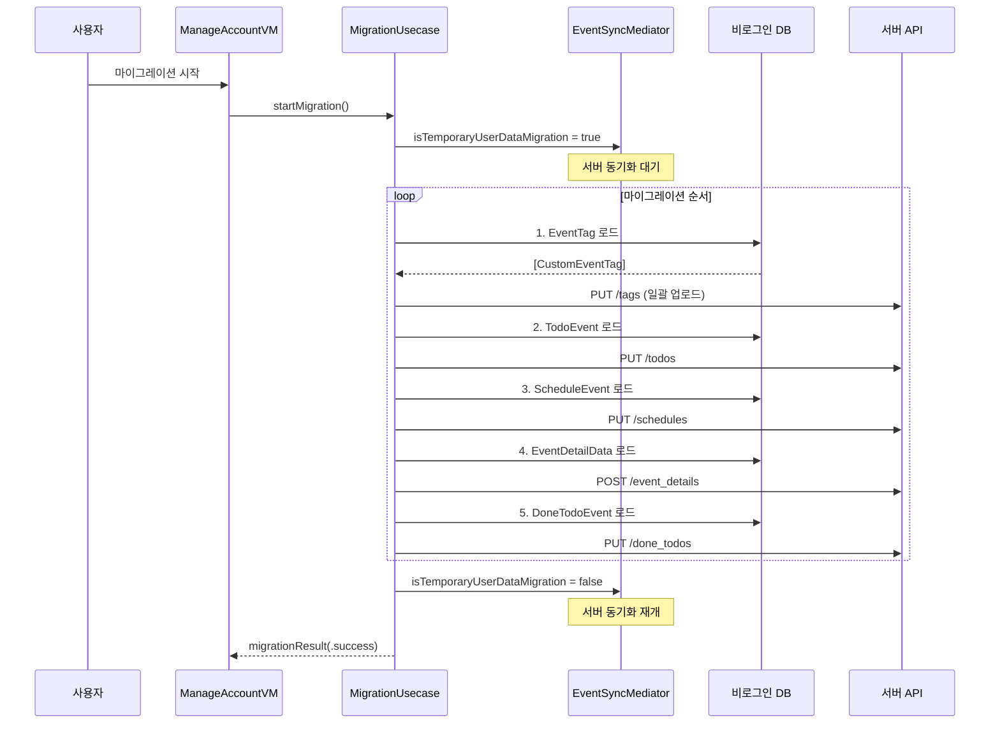

# 계정 & 인증 상세 스펙

> 메인 기획서 [섹션 10](../product-specification.md) 참조

---

### 1. 인증 방식

| 방식 | 프로토콜 | 설명 |
|---|---|---|
| 오프라인 (비로그인) | — | 로컬 DB만 사용. 모든 핵심 기능 사용 가능 |
| 구글 로그인 | `GoogleOAuth2ServiceProvider` | OAuth2 → Firebase Auth → 서버 동기화 활성화 |
| 애플 로그인 | `AppleOAuth2ServiceProvider` | Apple Sign In → Firebase Auth → 서버 동기화 활성화 |

**OAuth2 자격증명 모델**

| 제공자 | 자격증명 | 주요 필드 |
|---|---|---|
| Google | `GoogleOAuth2Credential` | idToken, accessToken, refreshToken, accessTokenExpirationDate, email |
| Apple | `AppleOAuth2Credential` | provider(`"apple.com"`), idToken, nonce |

**인증 플로우 상세**

```
사용자 → SignInView → OAuth2ServiceUsecase.requestAuthentication()
                          ↓
                   [Google: Firebase Google Sign-In SDK / Apple: ASAuthorizationController]
                          ↓
                   OAuth2Credential 반환
                          ↓
                   AuthRepository.signIn(credential)
                          ↓
                   Firebase Auth 인증 → Auth(uid, idToken, refreshToken) 획득
                          ↓
                   서버 API로 AccountInfo 로드
                          ↓
                   Auth + AccountInfo → Keychain 저장 (AuthStore)
                          ↓
                   RemoteAPI에 credential 설정
                          ↓
                   Account(auth + info) 반환
```

**Google 추가 스코프**: Google Calendar 연동 시 추가 OAuth2 스코프 요청 가능 (`GoogleOAuth2ServiceProvider.scopes`)

**URL 핸들링**: Google OAuth는 앱 복귀 시 `handle(open url:)` 호출 필요. Apple은 URL 핸들링 불필요.

### 2. 계정 상태 전환

```
[비로그인] ──로그인──→ [로그인]
    ↑                     │
    └──로그아웃/삭제──────┘
```

**로그인 시** (`AccountUsecaseImple.signIn` → `ApplicationRootViewModel.handleUserSignedIn`):
1. OAuth2 자격증명 획득 (Google/Apple)
2. Firebase Auth 인증 → uid + 토큰 획득
3. 서버에서 AccountInfo 로드 → Keychain 저장
4. SharedDataStore에 AccountInfo 저장
5. `AccountChangedEvent.signedIn` 이벤트 발행
6. `ApplicationPrepareUsecase.prepareSignedIn(auth)`:
   - SharedDataStore 초기화 (accountInfo, externalCalendarAccounts 키는 유지)
   - 비로그인 DB close → 100ms 대기
   - 사용자별 DB open (`todocal_<uid>.db`)
7. `ApplicationRootRouter.changeUsecaseFactroy(auth)`:
   - `LoginUsecaseFactoryImple` 생성 (Remote + Upload 인프라 포함)
   - `backgroundEventSyncUsecase.change(factory:)` 호출
   - `refreshRoot()` → 전체 UI 계층 재구성
8. FCM 토큰 등록
9. 서버 동기화 시작

**로그아웃 시** (`AccountUsecaseImple.signOut` → `ApplicationRootViewModel.handleUserSignedOut`):
1. 사용자 알림 등록 해제
2. Firebase signOut + Keychain에서 Auth/AccountInfo 삭제
3. RemoteAPI credential 해제
4. SharedDataStore 초기화 (externalCalendarAccounts 키만 유지)
5. `AccountChangedEvent.signOut` 이벤트 발행
6. `ApplicationPrepareUsecase.prepareSignedOut()`:
   - 사용자 DB close → 100ms 대기
   - 비로그인 DB open (`todocal.db` — uid 없음)
7. `NonLoginUsecaseFactoryImple`로 전환 → UI 재구성

**계정 삭제 시** (`AccountUsecaseImple.deleteAccount`):
- 로그아웃과 동일 + 서버에 `DELETE /account` API 호출 → 서버 데이터 삭제
- Firebase 계정 삭제

**UsecaseFactory 전환 영향 범위**

| 영역 | NonLogin (비로그인) | Login (로그인) |
|---|---|---|
| Todo Repository | `TodoLocalRepositoryImple` | `TodoUploadDecorateRepositoryImple` (Local + 오프라인 큐) |
| Schedule Repository | Local only | `ScheduleEventUploadDecorateRepositoryImple` |
| EventTag Repository | Local only | `EventTagUploadDecorateRepositoryImple` |
| EventDetail Repository | Local only | `EventDetailUploadDecorateRepositoryImple` |
| ForemostEvent Repository | Local only | `ForemostEventRemoteRepositoryImple` |
| AppSetting Repository | `AppSettingLocalRepositoryImple` | `AppSettingRemoteRepositoryImple` (userId 기반) |
| EventSync Usecase | `NotNeedEventSyncUsecase` (no-op) | `EventSyncUsecaseImple` (실제 동기화) |
| EventUpload Service | `NotNeedEventUploadService` (no-op) | `EventUploadServiceImple` (오프라인 큐) |
| 데이터 마이그레이션 | `NotNeedTemporaryUserDataMigrationUescaseImple` | `TemporaryUserDataMigrationUescaseImple` |

**DB 분리 정책**

| 상태 | DB 경로 | 설명 |
|---|---|---|
| 비로그인 | `todocal.db` | 공용 로컬 DB |
| 로그인 (uid: abc123) | `todocal_abc123.db` | 사용자별 격리 DB |
| 외부 캘린더 | `google_calendar.db` | 서비스별 별도 DB (ExternalCalendarDBConnectionPool) |

### 3. 데이터 마이그레이션

로그인 전 로컬에 쌓인 데이터를 클라우드로 업로드. `TemporaryUserDataMigrationUescaseImple`이 담당.

**마이그레이션 대상 및 순서**:
1. 이벤트 태그 (EventTag) — 태그가 이벤트에 선행해야 참조 무결
2. 할일 (TodoEvent)
3. 일정 (ScheduleEvent)
4. 이벤트 상세 (EventDetailData)
5. 완료 할일 (DoneTodoEvent)

**UI 상태 Publishers**:
- `isNeedMigration: AnyPublisher<Bool, Never>` — 마이그레이션 필요 여부
- `migrationNeedEventCount: AnyPublisher<Int, Never>` — 마이그레이션 필요 건수 (ManageAccount 화면에 표시)
- `isMigrating: AnyPublisher<Bool, Never>` — 진행 중 로딩 표시
- `migrationResult: AnyPublisher<Result<Void, Error>, Never>` — 완료/실패 결과

**동기화와의 조율**: `EventSyncMediator`가 마이그레이션 진행 중에는 서버 동기화를 대기시킴 (`isTemporaryUserDataMigration` 플래그 확인).

**마이그레이션 소스 경로**: `LoginUsecaseFactoryImple` 생성 시 `temporaryUserDataFilePath`로 비로그인 DB 경로 전달 → 해당 DB에서 데이터 읽기.

**앱 재시작 시 복원**: 마이그레이션이 중간에 중단되면 다음 앱 실행 시 `ManageAccountViewModel.prepare()`에서 다시 체크하여 재시도 유도.

---

## 상태 전이 다이어그램

### 로그인/로그아웃 Factory 전환

```mermaid
stateDiagram-v2
    [*] --> NonLogin: 앱 시작 (비로그인)

    state NonLogin {
        note right of NonLogin
            DB: todocal.db
            Repository: Local only
            Sync: no-op
            Upload: no-op
        end note
    }

    state Login {
        note right of Login
            DB: todocal_{uid}.db
            Repository: Upload Decorator
            Sync: EventSyncUsecaseImple
            Upload: EventUploadServiceImple
        end note
    }

    NonLogin --> Login: OAuth 성공\nFactory 교체\nDB 전환
    Login --> NonLogin: 로그아웃\nFactory 역전환\nSharedDataStore 초기화
    Login --> [*]: 계정 삭제\nDB 삭제 + 서버 데이터 삭제
```

### 데이터 마이그레이션 플로우



---

## 엣지 케이스

### Factory 전환 시 SharedDataStore 상태

```
상황: 비로그인 상태에서 로그인 성공

전환 과정:
  1. OAuth 완료 → uid 획득
  2. LoginUsecaseFactory 생성 (todocal_{uid}.db)
  3. SharedDataStore 초기화:
     - todos: [:] (비로그인 할일 제거)
     - schedules: MemorizedEventsContainer() (빈 컨테이너)
     - tags: [:] (비로그인 태그 제거)
     - uncompletedTodos: []
  4. 새 DB에서 데이터 로드 → SharedDataStore 채움

주의: 비로그인 데이터는 SharedDataStore에서 즉시 사라짐.
     마이그레이션하지 않으면 비로그인 DB에만 남아있음.
     사용자가 마이그레이션 안내를 무시하면 데이터 접근 불가.
```

### 마이그레이션 중단 후 재시도

```
상황: 마이그레이션 중 네트워크 끊김 (3. ScheduleEvent 업로드 중)

결과:
  1. 태그, 할일: 서버에 이미 업로드 완료 ✓
  2. 일정: 일부만 업로드 → 에러 반환
  3. 이벤트 상세, 완료 할일: 미처리

재시도 시:
  - 다음 앱 실행 시 ManageAccountVM.prepare()에서 체크
  - isNeedMigration == true → 사용자에게 재시도 안내
  - 전체 마이그레이션 다시 실행
  - 이미 업로드된 태그/할일: 서버가 upsert → 중복 없음
  - 일정: 일부 중복 가능성 → 서버 upsert로 처리
```
