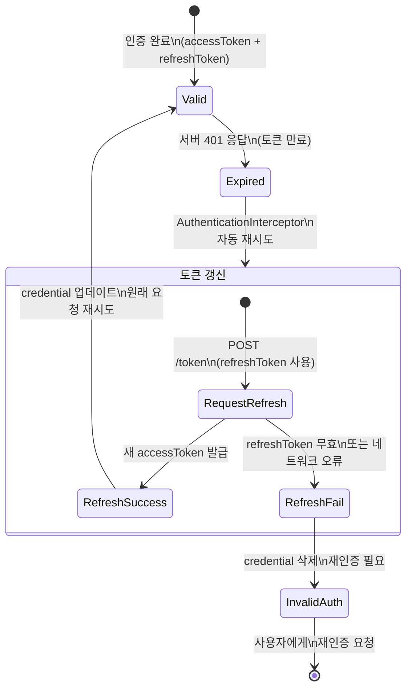
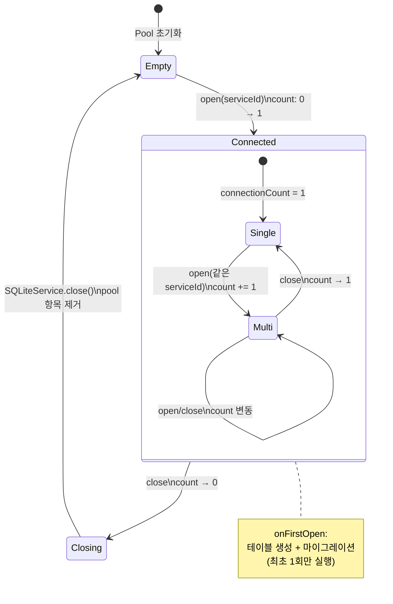
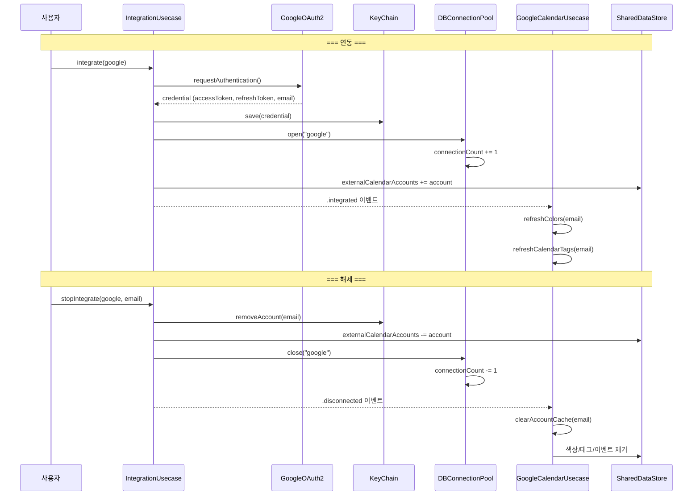
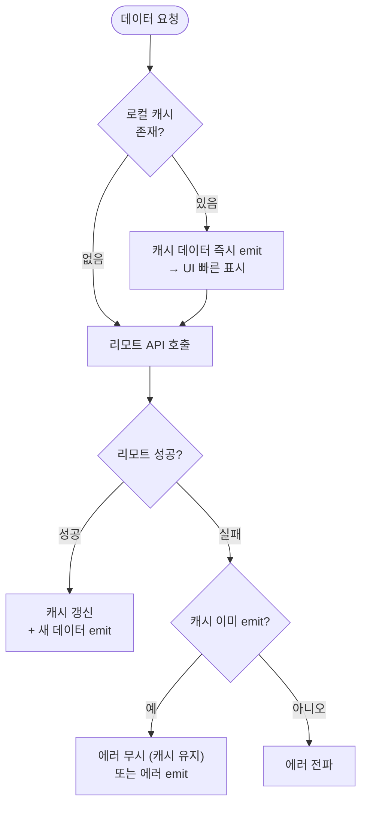

# 구글 캘린더 연동 상세 스펙

> Phase 4 고도화: 섹션 8(구글 캘린더 연동)의 L1 상세

---

## 1. 개요

- **읽기 전용** 연동 (조회만 가능, 이벤트 편집 불가)
- **다중 계정** 동시 지원 (구글 계정 여러 개를 동시에 연동)
- Google OAuth2 인증, Firebase GoogleSignIn SDK 사용
- 연동 후 캘린더 목록/이벤트/색상 자동 동기화

---

## 2. OAuth 인증

### 2.1 인증 프로바이더

```
GoogleOAuth2ServiceProvider
├── identifier: "google"
├── scopes: ["https://www.googleapis.com/auth/calendar.readonly"]
└── 인증 SDK: GIDSignIn (Firebase GoogleSignIn)
```

### 2.2 자격증명 구조 (GoogleOAuth2Credential)

| 필드 | 타입 | 설명 |
|---|---|---|
| `idToken` | String | OpenID Connect ID 토큰 |
| `accessToken` | String | API 접근 토큰 |
| `refreshToken` | String | 토큰 갱신용 |
| `accessTokenExpirationDate` | Date? | 액세스 토큰 만료 시점 |
| `refreshTokenExpirationDate` | Date? | 리프레시 토큰 만료 시점 |
| `email` | String? | 구글 계정 이메일 (accountId로 사용) |

### 2.3 인증 플로우

```
사용자: 설정 → 구글 캘린더 연동 → 계정 추가
  → GoogleOAuth2ServiceUsecaseImple.requestAuthentication()
  → GIDSignIn.sharedInstance.signIn() (시스템 OAuth UI)
  → GoogleOAuth2Credential 반환 (idToken, accessToken, refreshToken, email)
```

### 2.4 토큰 갱신 전략

- **자동 갱신**: Alamofire `AuthenticationInterceptor` (GoogleAPIAuthenticator) 기반
- **트리거**: HTTP 401 응답 수신 시
- **갱신 엔드포인트**: POST `GoogleAuthEndpoint.token`
- **요청 파라미터**: `client_id`, `refresh_token`, `grant_type="refresh_token"`
- **응답**: 새 `accessToken` + `expiresIn` (초 단위)
- **갱신 후**: 자격증명 저장소 업데이트 → 원래 요청 재시도

### 2.5 토큰 만료 처리

| 시나리오 | 동작 |
|---|---|
| 액세스 토큰 만료 → 갱신 성공 | 새 토큰으로 원래 요청 재시도 |
| 액세스 토큰 만료 → 갱신 실패 | 자격증명 제거, `AutenticatorTokenRefreshListener` 통지 |
| 리프레시 토큰 만료 | 재인증 필요 (사용자에게 다시 OAuth 요청) |

---

## 3. 다중 계정 아키텍처

### 3.1 핵심 Pool 패턴

세 개의 Pool이 계정별 리소스를 독립적으로 관리한다.

#### ExternalCalendarDBConnectionPool (DB 연결 풀)

```
ExternalCalendarSQLiteConnectionPoolImple (Actor)
├── connectionCount: [serviceId: Int]    — 참조 카운팅
├── connections: [serviceId: DBConnection] — DB 연결 인스턴스
├── open(serviceId) → connectionCount + 1, 첫 open 시 DB 생성
├── close(serviceId) → connectionCount - 1, 0이면 DB 연결 해제
└── connection(serviceId) → SQLiteService 반환
```

**참조 카운팅**:
- 같은 서비스("google")의 모든 계정이 하나의 `google_calendar.db` 공유
- 첫 계정 연동 시 DB 생성 + 테이블 생성 + 마이그레이션 실행 (`onFirstOpen`)
- 마지막 계정 해제 시에만 DB 연결 종료

#### GoogleCalendarRepositoryPool (Repository 캐싱)

```
GoogleCalendarRepositoryPool
├── repository(for accountId) → GoogleCalendarRepository (lazy 생성, 캐시)
└── removeRepository(for accountId) → 캐시에서 제거
```

- accountId(이메일)별 `GoogleCalendarRepositoryImple` 인스턴스 캐싱
- 없으면 새로 생성, 있으면 재사용

#### ExternalCalendarAccountRemotePool (API 클라이언트)

```
ExternalCalendarAccountRemotePoolImple (NSLock 기반)
├── 키: "{serviceId}-{accountId}"
├── setup(serviceId, accountId, credential) → RemoteAPI 생성 + 자격증명 적용
├── remove(serviceId, accountId) → 자격증명 nil + 풀에서 제거
└── remote(serviceId, accountId) → RemoteAPI 반환
```

- 토큰 갱신 리스너를 모든 Remote에 공유

### 3.2 데이터 격리

- **DB 레벨**: 모든 테이블에 `account_id` 컬럼으로 계정별 데이터 파티셔닝
- **메모리 레벨**: SharedDataStore에서 계정별 키로 구분
- **ID 충돌 방지**: 구글 이벤트 ID는 자체적으로 유니크, accountId와 함께 저장

---

## 4. 데이터 모델

### 4.1 GoogleCalendar.Colors (계정별 색상 맵)

```
GoogleCalendar.Colors
├── ownerId: String (이메일)
├── calendars: [colorId: ColorSet]  — 캘린더별 색상
└── events: [colorId: ColorSet]     — 이벤트별 색상
    └── ColorSet: foregroundHex + backgroundHex
```

### 4.2 GoogleCalendar.Tag (캘린더 = 태그)

| 필드 | 타입 | 설명 |
|---|---|---|
| `tagId` | `EventTagId` | `.externalCalendar(serviceId: "google", id)` |
| `id` | String | 구글 캘린더 ID (e.g., "primary") |
| `ownerId` | String | 계정 이메일 |
| `name` | String | 캘린더 이름 |
| `description` | String? | 캘린더 설명 |
| `backgroundColorHex` | String? | 배경 색상 |
| `foregroundColorHex` | String? | 전경 색상 |
| `colorId` | String? | 구글 색상 ID |
| `isSelected` | Bool? | 구글 계정에서의 선택 상태 |

### 4.3 GoogleCalendar.Event (정규화된 이벤트)

| 필드 | 타입 | 설명 |
|---|---|---|
| `eventId` | String | 구글 이벤트 ID |
| `calendarId` | String | 소속 캘린더 ID |
| `accountId` | String | 계정 이메일 |
| `name` | String | 이벤트 이름 |
| `eventTagId` | EventTagId? | 필터링/그룹핑용 태그 |
| `colorId` | String? | 이벤트별 색상 오버라이드 |
| `eventTime` | EventTime | `.period` 또는 `.allDay` |
| `htmlLink` | String? | 구글 캘린더 웹 링크 |
| `status` | EventStatus? | confirmed/tentative/cancelled |
| `location` | String? | 장소 |
| `nextRepeatingTimes` | [RepeatingTimes] | 반복 인스턴스 |
| `repeatingTimeToExcludes` | Set<String> | 제외된 인스턴스 |

### 4.4 GoogleCalendar.EventOrigin (API 원본)

Google Calendar API v3 응답 전체 구조. RFC 5545 호환.

| 주요 필드 | 설명 |
|---|---|
| `id` | 이벤트 ID |
| `summary` | 제목 |
| `start` / `end` | 시작/종료 (date 또는 dateTime) |
| `recurrence` | RRULE 문자열 배열 |
| `recurringEventId` | 반복 시리즈의 부모 ID |
| `status` | confirmed / tentative / cancelled |
| `visibility` | default / public / private / confidential |
| `creator` / `organizer` | 생성자/주최자 |
| `attendees` | 참석자 배열 (이름, 이메일, 응답 상태) |
| `conferenceData` | 회의 링크 (Google Meet 등) |
| `attachments` | 첨부파일 |
| `location` | 장소 |
| `description` | 설명 |

---

## 5. 계정 연동 플로우

### 5.1 연동 단계

```
1. OAuth 인증
   → GIDSignIn.sharedInstance.signIn()
   → GoogleOAuth2Credential 획득

2. 자격증명 저장
   → IntegratedAPICredentialStore에 Keychain 저장
   → 키: "{serviceId}-{email}-account" + 별도 credential 키
   → 계정 목록(accountIds) 업데이트

3. Remote Pool 설정
   → remotePool.setup("google", accountId: email, credential:)
   → RemoteAPI 인스턴스 생성 + 자격증명 적용
   → 토큰 갱신 리스너 등록

4. DB 연결 Pool 열기
   → dbConnectionController.open("google")
   → 첫 계정이면: google_calendar.db 생성, 테이블 생성, 마이그레이션
   → 참조 카운트 +1

5. SharedDataStore 업데이트
   → externalCalendarAccounts 키에 새 계정 추가
   → integrationStatusChangedSubject.send(.integrated("google", account))

6. GoogleCalendarUsecase.prepare() 반응
   → 연동 상태 변경 감지
   → refreshColors(): 계정 색상 맵 로드 → AppearanceStore 적용
   → refreshCalendarTags(isNew: true): 캘린더 목록 로드
     → isSelected != true인 캘린더를 offTagIds에 추가 (기본 숨김)
```

### 5.2 해제 단계

```
1. 자격증명 삭제
   → IntegratedAPICredentialStore에서 Keychain 제거
   → 계정 목록에서 제거

2. Remote Pool 정리
   → remotePool.remove("google", accountId)
   → 자격증명 nil 설정 → 풀에서 제거

3. DB 연결 Pool 닫기
   → dbConnectionController.close("google")
   → 참조 카운트 -1
   → 0이면 DB 연결 종료

4. SharedDataStore 정리
   → externalCalendarAccounts에서 계정 제거
   → integrationStatusChangedSubject.send(.disconnected)

5. GoogleCalendarUsecase.clearAccountCache()
   → 계정 태그 목록 조회 (삭제 전)
   → appearanceStore.clearColors(for: accountId)
   → appearanceStore.clearCalendarTags(for: accountId)
   → SharedDataStore에서 googleCalendarTags, googleCalendarEvents 제거
   → EventTagUsecase에서 해당 서비스 offTagIds 정리
   → Repository.resetCache(): SQL DELETE로 DB 캐시 전부 삭제
```

---

## 6. 이벤트 로딩 플로우

### 6.1 로딩 시퀀스

```
1. 캐시 먼저 (Async, Fire-and-Forget)
   → cacheStorage.loadEvents(calendarId, period, accountId)
   → 캐시 있으면 subscriber에 즉시 emit

2. Remote API 호출
   → GET /calendars/{calendarId}/events
   → 파라미터: timeMin, timeMax, singleEvents=true, pageToken
   → singleEvents=true: 반복 이벤트를 개별 인스턴스로 전개

3. 페이지네이션
   → nextPageToken 있는 동안 반복 호출
   → 모든 페이지의 items + timeZone 누적

4. 파싱 & 정규화
   → EventOrigin → GoogleCalendar.Event 변환
   → timezone 인식 시간 → EventTime (.period 또는 .allDay) 매핑

5. 캐시 저장
   → SQLite에 EventOrigin(JSON) + 정규화된 Event 저장

6. SharedDataStore 업데이트
   → googleCalendarEvents 키에 머지
   → 기존 범위 외 이벤트 유지 + 범위 내 이벤트 교체
```

### 6.2 RRULE 처리

- `singleEvents=true` 파라미터로 서버가 반복 이벤트를 개별 인스턴스로 전개
- 앱에서 별도 RRULE 계산 불필요 (조회 시)
- 이벤트 상세에서 반복 정보 표시 시:
  - `recurringEventId` 있으면 부모 이벤트 로드
  - `RRuleParser.parse()`로 RFC 5545 RRULE 파싱
  - 지원: FREQ (DAILY/WEEKLY/MONTHLY/YEARLY), INTERVAL, BYDAY, UNTIL, COUNT

### 6.3 캐시 무효화 & 교체

**갱신 트리거**:

| 트리거 | 동작 |
|---|---|
| 계정 연동 시 | 전체 색상/캘린더/이벤트 로드 |
| `refreshGoogleCalendarEventTags()` | 캘린더 목록 재로드 |
| `refreshEvents(in:)` | 지정 기간 이벤트 재로드 |
| 앱 시작 시 | `prepareIntegratedAccounts()` → DB 연결 복원 |

**캐시 교체 전략**:

```
기존 캐시 중 조회 범위 내 이벤트 추출
  → 서버 응답에 없는 이벤트 = 삭제된 것 (제거)
  → 범위 외 기존 이벤트 유지
  → 서버 응답 이벤트로 교체/추가
  → SharedDataStore에 머지
```

---

## 7. 캘린더 보이기/숨기기

### 7.1 기본 가시성

- 구글 캘린더 API의 `isSelected` 필드 반영
- `isSelected != true` → 기본 숨김 (offTagIds에 추가)
- 사용자가 명시적으로 활성화 필요

### 7.2 필터링 적용

```
activeCalendars() = 전체 캘린더 - offTagIds에 포함된 캘린더
  → 활성 캘린더만 이벤트 로드 대상
```

- 캘린더 토글 시 `EventTagUsecase.toggleTagIsOn()` 호출
- 토글 결과가 즉시 SharedDataStore에 반영 → 캘린더/이벤트 목록 실시간 갱신

---

## 8. 이벤트 상세 (읽기 전용)

### 8.1 표시 항목

| 항목 | 소스 |
|---|---|
| 이벤트명 | `summary` |
| 시간 | `start`/`end` (period 또는 allDay) |
| 위치 | `location` |
| 참석자 목록 | `attendees[]` (이름, 이메일, 응답 상태) |
| 회의 링크 | `conferenceData.entryPoints[].uri` |
| 첨부파일 | `attachments[]` (title, fileUrl, mimeType) |
| 설명 | `description` |
| 색상 | calendarId → 캘린더 색상 + eventColorId 오버라이드 |
| 상태 | confirmed / tentative / cancelled |
| 공개 범위 | default / public / private / confidential |

### 8.2 편집 버튼

"구글 캘린더에서 편집" → `htmlLink` URL을 Safari로 열기.

---

## 9. 데이터 집계 (Read-Only 컨텍스트)

### GoogleCalendarLocalAggregatedRepositoryImple

위젯 등 네트워크 불가 환경에서 사용. 모든 연동 계정의 로컬 캐시를 투명하게 합산.

```
loadColors()
  → 모든 활성 계정 이메일 조회
  → 각 계정의 로컬 캐시에서 Colors 로드
  → calendars/events 색상 맵 머지 (후순위 계정이 덮어씀)

loadCalendarTags()
  → 각 계정별 Tag 로드 + 합산

loadEvents(calendarId, in: range)
  → 각 계정의 해당 캘린더 이벤트 로드 + 합산
```

- Remote 호출 없음 — 순수 오프라인 집계
- App Group을 통한 SQLite 직접 접근 (위젯에서 사용)

---

## 10. UI 반영 (GoogleCalendarViewAppearanceStore)

```
GoogleCalendarViewAppearanceStore protocol
├── applyColors(Colors, for accountId)     — 계정별 색상 적용
├── clearColors(for accountId)             — 계정 색상 제거
├── applyCalendarTags([Tag], for accountId) — 계정별 태그 적용
└── clearCalendarTags(for accountId)       — 계정 태그 제거
```

- `ViewAppearance.googleCalendarColors[accountId]`에 저장
- `@MainActor`로 UI 스레드 안전
- Combine으로 모든 구독자에게 실시간 전파

---

## 11. 에러 처리

| 시나리오 | 처리 |
|---|---|
| 토큰 만료 (401) | Alamofire Authenticator가 자동 갱신 시도 → 성공 시 재요청 |
| 토큰 갱신 실패 | 자격증명 제거, `AutenticatorTokenRefreshListener` 통지 |
| 네트워크 오류 | 캐시 값 먼저 emit → 에러를 subscriber에 전달 |
| API 제한 (429) | 별도 재시도 로직 없음 (Alamofire 기본 동작) |
| 캐시 폴백 | 로컬 캐시가 있으면 Remote 실패와 무관하게 먼저 표시 |

---

## 12. DB 구조 (google_calendar.db)

### 테이블

#### google_calendar_colors

| 컬럼 | 타입 | 설명 |
|---|---|---|
| `account_id` | TEXT NOT NULL | 계정 이메일 |
| `color_type` | TEXT NOT NULL | "calendar" 또는 "event" |
| `color_key` | TEXT NOT NULL | 구글 colorId |
| `background` | TEXT NOT NULL | 배경색 hex |
| `foreground` | TEXT NOT NULL | 전경색 hex |

#### google_calendar_event_tag

| 컬럼 | 타입 | 설명 |
|---|---|---|
| `account_id` | TEXT NOT NULL | 계정 이메일 |
| `id` | TEXT PRIMARY KEY | 캘린더 ID |
| `summary` | TEXT NOT NULL | 캘린더 이름 |
| `description` | TEXT | 설명 |
| `backgroundColor` | TEXT | 배경색 |
| `foregroundColor` | TEXT | 전경색 |
| `colorId` | TEXT | 구글 색상 ID |
| `isSelected` | INTEGER | 선택 상태 |

#### google_calendar_event_origin

| 컬럼 | 타입 | 설명 |
|---|---|---|
| `account_id` | TEXT NOT NULL | 계정 이메일 |
| `calendar_id` | TEXT NOT NULL | 캘린더 ID |
| `id` | TEXT PRIMARY KEY UNIQUE | 이벤트 ID |
| `summary` | TEXT NOT NULL | 제목 |
| `html_link` | TEXT | 웹 링크 |
| `description` | TEXT | 설명 |
| `location` | TEXT | 장소 |
| `color_id` | TEXT | 이벤트 색상 ID |
| `creator` | TEXT | JSON (생성자) |
| `organizer` | TEXT | JSON (주최자) |
| `start` / `end` | TEXT | JSON (GoogleEventTime) |
| `recurrence` | TEXT | JSON (RRULE 배열) |
| `recurring_event_id` | TEXT | 반복 시리즈 부모 ID |
| `attendees` | TEXT | JSON (참석자 배열) |
| `conference_data` | TEXT | JSON (회의 데이터) |
| `status` | TEXT | confirmed/tentative/cancelled |
| `visibility` | TEXT | default/public/private/confidential |

### 자격증명 저장 (Keychain)

| 키 패턴 | 내용 |
|---|---|
| `{serviceId}-{accountId}-account` | ExternalServiceAccountMapper (계정 정보) |
| `{serviceId}-account-list` | [String] (계정 ID 목록) |

### 마이그레이션

- `AppEnvironment.googleCalendarDBVersion`으로 스키마 버전 관리
- `onFirstOpen` 콜백에서 테이블 생성 + 마이그레이션 실행
- 단일 계정 → 다중 계정 마이그레이션: `AppDataMigrationImple` (1회성, 플래그 기반 멱등성)

---

## 상태 전이 다이어그램

### OAuth 토큰 갱신 상태 전이



### DB Connection Pool 참조 카운팅



### 계정 연동/해제 시퀀스



---

## 결정 트리

### API 에러 처리 결정 트리

```mermaid
flowchart TD
    Start([API 요청 실패]) --> Status{HTTP 상태 코드?}

    Status -->|401| Refresh[AuthenticationInterceptor\n토큰 갱신 시도]
    Refresh --> RefreshResult{갱신 성공?}
    RefreshResult -->|성공| Retry[새 토큰으로\n원래 요청 재시도]
    RefreshResult -->|실패| RemoveCred[credential 삭제\n→ 재인증 필요]

    Status -->|"429 (Rate Limit)"| Fail429[즉시 실패\n재시도 없음]
    Status -->|"500 (Server Error)"| Fail500[즉시 실패\n재시도 없음]
    Status -->|네트워크 오류| FailNet[즉시 실패\n캐시 데이터는 유지]

    Status -->|200~299| Parse{응답 파싱 성공?}
    Parse -->|성공| Success([데이터 반환])
    Parse -->|실패| FailParse[ServerErrorModel로\n디코딩 시도 → 에러]

    note right of Fail429
        현재 제한사항:
        - 429/500 재시도 없음
        - 지수 백오프 없음
    end note
```

### 캐시 전략 결정 트리



---

## 엣지 케이스

### RRULE 표시 vs 앱 반복 모델

```
상황: 구글 캘린더에서 "RRULE:FREQ=WEEKLY;BYDAY=MO,WE,FR;UNTIL=20261231T235959Z"

앱에서의 처리:
  1. RRULE 문자열은 DB에 raw로 저장
  2. 이벤트 상세 화면에서 RRULE을 텍스트로 파싱하여 표시
     → "매주 월, 수, 금 반복 (2026.12.31까지)"
  3. 앱의 EventRepeatingOption(EveryWeek 등)으로 변환하지 않음
  4. → 구글 이벤트는 앱 내에서 반복 수정 불가 (읽기 전용)

RRuleParser 지원 범위:
  ✓ FREQ (DAILY/WEEKLY/MONTHLY/YEARLY)
  ✓ INTERVAL, BYDAY (서수 포함), UNTIL, COUNT
  ✗ BYMONTH, BYMONTHDAY, BYYEARDAY → 무시됨
  → "매월 15일 반복" 같은 RRULE은 BYMONTHDAY가 필요하므로
    반복 표시가 불완전할 수 있음
```

### 다중 계정 — 같은 캘린더 ID 충돌

```
상황: user1@gmail.com과 user2@gmail.com이 모두 "primary" 캘린더 사용

DB 저장:
  google_calendar_event_origin 테이블:
    - account_id = "user1@gmail.com", calendar_id = "primary", event_id = "abc"
    - account_id = "user2@gmail.com", calendar_id = "primary", event_id = "xyz"

조회:
  GoogleCalendarLocalAggregatedRepositoryImple.loadEvents("primary", period)
    → 모든 계정의 "primary" 이벤트를 합산 반환
    → 두 계정의 이벤트가 섞여서 표시

이벤트 상세:
  loadEventDetail(eventId: "abc")
    → 모든 계정을 순회하며 검색
    → user1에서 발견 → 반환

의미: calendar_id가 같아도 account_id로 구분됨.
     UI에서는 합산되어 하나의 "primary" 캘린더 이벤트처럼 보임.
```

### 토큰 갱신 중 동시 요청

```
상황: 401 응답 후 토큰 갱신 중에 다른 API 요청 발생

Alamofire AuthenticationInterceptor 동작:
  1. 첫 번째 요청: 401 → 갱신 시작
  2. 두 번째 요청: Bearer 토큰 적용 시도
     → AuthenticationInterceptor가 갱신 진행 중임을 감지
     → 두 번째 요청 대기 (suspend)
  3. 갱신 완료: 새 토큰으로 두 요청 모두 재시도

의미: Alamofire의 AuthenticationInterceptor가 자동으로
     동시 요청의 직렬화를 처리. 토큰 갱신은 1회만 수행.
```

### 계정 해제 시 캐시 정리 범위

```
상황: user1@gmail.com 연동 해제

정리 범위:
  1. KeyChain: credential 삭제
  2. SharedDataStore:
     - googleCalendarTags[user1] 제거
     - googleCalendarEvents에서 user1의 이벤트 필터링
  3. ViewAppearance:
     - 색상 맵에서 user1 제거
  4. offEventTagIds:
     - user1 관련 외부 캘린더 태그 off 상태 정리
  5. DB Connection Pool:
     - connectionCount -= 1
     - 다른 계정이 없으면 (count=0) DB 연결 종료
  6. Repository Pool:
     - user1의 Repository 인스턴스 제거

주의: DB 데이터 자체는 삭제하지 않음.
     DB 파일은 남아있으며, 같은 계정 재연동 시 재사용.
```
