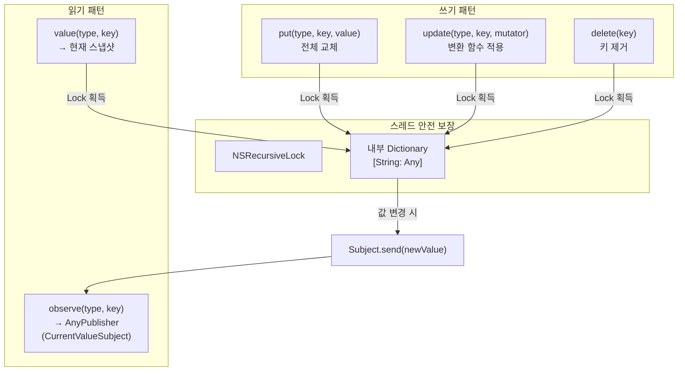
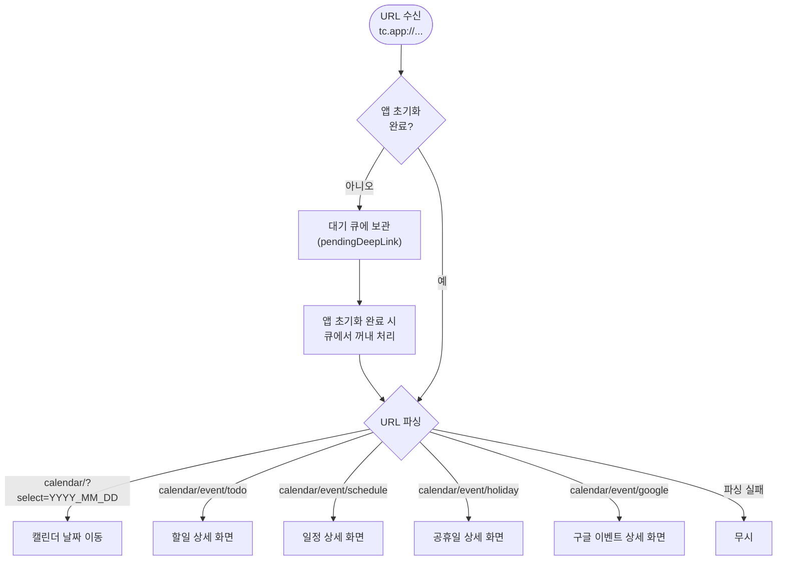

# 인프라 & 기타 상세 스펙

> 메인 기획서 [섹션 13, 14, 15, 17, 18, 19](../product-specification.md) 참조

---

## 1. 공유 상태 관리 (SharedDataStore)

모든 Usecase가 하나의 `SharedDataStore` 싱글톤을 통해 상태를 공유. Combine 기반 실시간 전파.

### 1.1 구현 상세

```swift
public final class SharedDataStore: @unchecked Sendable {
    private let lock = NSRecursiveLock()
    private var memorizedDataSubjects: [String: CurrentValueSubject<Any?, Never>] = [:]
    private let serialEventQeueu: DispatchQueue?
}
```

**스레드 안전성**:
- `NSRecursiveLock`으로 모든 `memorizedDataSubjects` 접근 보호
- 모든 public 메서드에서 `lock.lock(); defer { lock.unlock() }` 패턴
- `@unchecked Sendable` — 수동 스레드 안전 보장

**메모리 관리**:
- Subject는 키별 lazy 생성: 첫 `observe()` 또는 `put()` 시 `CurrentValueSubject` 생성
- 한번 생성된 Subject는 영구 유지 (구독자 수와 무관)
- `clearAll(filter:)`: 조건에 맞는 키의 Subject 값을 nil로 설정 (Subject 자체는 유지)

**Combine API**:

| 메서드 | 동작 |
|---|---|
| `observe<V>(type, key)` → `AnyPublisher<V?, Never>` | 현재 값 즉시 방출 + 변경 시 push. Optional serial queue 전달. |
| `put<V>(type, key, value)` | Subject에 값 설정 (즉시 구독자에게 전파) |
| `update<V>(type, key, mutating:)` | 현재 값을 읽어 변환 후 put (atomic update) |
| `value<V>(type, key)` → `V?` | 동기적 현재 값 읽기 |
| `clearAll(filter:)` | 조건부 전체 초기화 |

### 1.2 주요 키

| 키 | 타입 | 관리 주체 |
|---|---|---|
| `accountInfo` | `AccountInfo?` | AccountUsecase |
| `todos` | `[String: TodoEvent]` | TodoEventUsecase |
| `uncompletedTodos` | `[TodoEvent]` | TodoEventUsecase |
| `schedules` | `MemorizedEventsContainer<ScheduleEvent>` | ScheduleEventUsecase |
| `tags` | `[EventTagId: any EventTag]` | EventTagUsecase |
| `offEventTagSet` | `Set<EventTagId>` | EventTagUsecase |
| `defaultEventTagColor` | `[EventTagId: String]` | EventTagUsecase |
| `foremostEventId` | `ForemostEventId` | ForemostEventUsecase |
| `foremostMarkingStatus` | `ForemostMarkingStatus` | ForemostEventUsecase |
| `googleCalendarTags` | `[String: [GoogleCalendar.Tag]]` | GoogleCalendarUsecase |
| `googleCalendarEvents` | `[String: GoogleCalendar.Event]` | GoogleCalendarUsecase |
| `externalCalendarAccounts` | `[String: [ExternalServiceAccountinfo]]` | ExternalCalendarIntegrationUsecase |
| `calendarAppearance` | `CalendarAppearanceSettings` | UISettingUsecase |
| `eventSetting` | `EventSettings` | EventSettingUsecase |
| `timeZone` | `TimeZone` | CalendarSettingUsecase |
| `firstWeekDay` | `DayOfWeeks` | CalendarSettingUsecase |
| `currentCountry` | `String` | HolidayUsecase |
| `availableCountries` | `[String]` | HolidayUsecase |
| `holidays` | `[Int: [Holiday]]` | HolidayUsecase |

**로그인/로그아웃 시 초기화 범위**:

| 전환 | 초기화 범위 | 유지 키 |
|---|---|---|
| 로그인 | 대부분 초기화 | `accountInfo`, `externalCalendarAccounts` |
| 로그아웃 | 전체 초기화 | `externalCalendarAccounts` |

### 1.3 화면 간 통신

| 방향 | 메커니즘 | 용도 |
|---|---|---|
| 간접 공유 | SharedDataStore (Usecase 경유) | 같은 데이터를 구독하는 독립 화면 간 |
| Parent → Child | Interactor | 부모가 자식에게 명령 |
| Child → Parent | Listener (weak) | 자식이 부모에게 이벤트 전달 |

**간접 공유 예시**: 이벤트 상세 화면에서 할일 완료 → `TodoEventUsecase`가 SharedDataStore의 `todos` 업데이트 → 캘린더 그리드, 이벤트 목록, 위젯이 각각 독립적으로 변경 수신.

---

## 2. 딥링크

### 2.1 URL 스펙

| 항목 | 값 |
|---|---|
| 스킴 | `tc.app` (`AppEnvironment.appScheme`) |
| 호스트 | `calendar` |
| 처리 | `ApplicationDeepLinkHandlerImple` |

**지원 딥링크 형식**

| 용도 | URL 패턴 | 쿼리 파라미터 |
|---|---|---|
| 날짜 이동 | `tc.app://calendar/?select=YYYY_MM_DD` | `select`: `year_month_day` 형식 |
| 이벤트 상세 | `tc.app://calendar/event/?id=<eventId>&type=<eventType>` | `id`, `type` |

### 2.2 딥링크 처리 구조

```
URL 수신 (앱 실행 / 위젯 탭)
    ↓
PendingDeepLink 파싱:
    - URLComponents로 scheme, host, path, queryItems 추출
    - pathComponents: "/" 기준 분할
    - queryParams: percent-decoding 적용
    ↓
ApplicationDeepLinkHandlerImple:
    - scheme == "tc.app" 확인
    - host별 라우팅:
        └── "calendar" → CalendarDeepLinkHandlerImple
            ├── path에 "event" → EventDeepLinkHandlerImple
            └── path 없음 → handleMoveDate() (날짜 이동)
    ↓
미지원 링크 → .needUpdate → 앱 업데이트 안내 다이얼로그
```

**Pending 링크 처리**:
- 대상 핸들러가 아직 초기화되지 않은 경우 `pendingCalendarLink`에 보관
- 핸들러 초기화 시 `attach()` 호출 → 보관된 링크 즉시 처리

---

## 3. 피드백

### 3.1 입력 데이터

| 필드 | 필수 | 설명 |
|---|---|---|
| 연락처 이메일 | 선택 | 사용자 입력 |
| 피드백 메시지 | 필수 | 사용자 입력 |

### 3.2 자동 수집 데이터

| 필드 | 소스 |
|---|---|
| userId | 현재 로그인 사용자 ID (비로그인 시 `"null"`) |
| osVersion | `UIDevice` (예: `"18.3.1"`) |
| appVersion | `Bundle.main` (예: `"1.0.0"`) |
| deviceModel | `UIDevice` (예: `"iPhone 15"`) |
| isIOSAppOnMac | `ProcessInfo` Mac Catalyst 여부 |

### 3.3 전송 방식

`FeedbackRepositoryImple` → `FeedbackEndpoints.post` (서버 API)

**페이로드 형식**: Slack Incoming Webhook JSON

```json
{
  "attachments": [{
    "fallback": "incomming cs from: <email>",
    "pretext": "incomming cs from: <email>",
    "color": "good",
    "fields": [
      { "title": "message", "value": "사용자 메시지" },
      { "title": "user id", "value": "abc123" },
      { "title": "os version", "value": "18.3.1" },
      { "title": "app version", "value": "1.0.0" },
      { "title": "device model", "value": "iPhone 15" },
      { "title": "is ios app on Mac?", "value": "false" }
    ]
  }]
}
```

피드백 전송은 async/await 기반. Usecase에서 DeviceInfo 수집 → FeedbackMakeParams 조립 → Repository 전송.

---

## 4. D-Day 카운트다운

`DaysIntervalCountUsecase` — 이벤트/공휴일까지 남은 일수를 실시간 계산.

### 4.1 계산 공식

```
1. 현재 시각(Date)과 대상 시각(Date)을 Gregorian Calendar로 가져옴
2. Calendar의 timeZone을 현재 설정 타임존으로 설정
3. 양쪽 모두 startOfDay()로 00:00:00 정규화
4. dateComponents([.day], from:to:).day → 일수 차이 (Int)
```

**예시**:
- 현재: 2025-03-31 14:30 → 정규화: 2025-03-31 00:00
- 대상: 2025-04-05 09:15 → 정규화: 2025-04-05 00:00
- 결과: **5일** (양수 = 미래, 음수 = 과거)

### 4.2 타임존 처리

- `Calendar(identifier: .gregorian)`에 `CalendarSettingUsecase.currentTimeZone` 적용
- 사용자가 타임존을 변경하면 D-Day 값도 즉시 재계산
- 하루종일 이벤트의 경우 `Range<TimeInterval>.shiftting(secondsFromGMT:to:)` 변환 후 대상 날짜 결정

**하루종일 이벤트 타임존 변환**:
```
원본 범위 (이벤트 타임존) → +secondsFromGMT → UTC 범위 → -targetTimeZone.secondsFromGMT → 대상 타임존 범위
```

### 4.3 실시간 업데이트

- 1초 간격 타이머 (`secondTicks`) + 타임존 변경 Publisher를 `CombineLatest`
- `removeDuplicates()`: 일수가 실제로 변경될 때만 UI 갱신
- 사용 화면: 공휴일 상세, 이벤트 상세 등

---

## 5. DB 마이그레이션

### 5.1 메인 DB (`todo_calendar.db`)

**현재 버전**: `AppEnvironment.dbVersion = 6`

**마이그레이션 메커니즘** (`SQLiteService`):
1. 앱 시작 시 `AppDataMigrationImple.runDBMigration()` 호출
2. `mainDB.async.migrate(upto: dbVersion, steps:finalized:)`
3. SQLite `user_version` pragma로 현재 버전 확인
4. 현재 → 목표까지 1단계씩 순차 실행
5. 각 단계에서 `Table.migrateStatement(for: version)` → SQL 실행
6. 성공 시 `user_version` 증가
7. 최종 단계 후 `finalized` 콜백 (WAL 모드 설정)

**버전별 변경 이력**

| 버전 | 변경 내용 | 영향 테이블 | SQL |
|---|---|---|---|
| 0→1 | 반복 종료 횟수 컬럼 추가 | `TodoEvents`, `Schedules`, `PendingDoneTodoEvent` | `ALTER TABLE ... ADD COLUMN repeating_count INTEGER` |
| 1→2 | 구글 캘린더 이벤트 상태 컬럼 | `google_calendar_event_origin` (레거시) | `ALTER TABLE ... ADD COLUMN status TEXT` |
| 2→3 | 구글 캘린더 태그 선택 컬럼 | `google_calendar_list` (레거시) | `ALTER TABLE ... ADD COLUMN is_selected INTEGER` |
| 3→4 | 구글 캘린더 이벤트 가시성 컬럼 | `google_calendar_event_origin` (레거시) | `ALTER TABLE ... ADD COLUMN visibility TEXT` |
| 4→5 | 업로드 큐 테이블 재구성 | `event_upload_pending_queue` | 임시 테이블 생성 → 데이터 이동 → 원본 삭제 → 이름 변경 |
| 5→6 | 할일 반복 회차 컬럼 추가 | `TodoEvents` | `ALTER TABLE ... ADD COLUMN repeating_turn INTEGER` |

**전체 테이블 목록** (`prepareTables()` 순서):

1. `KeyValueTable`
2. `HolidayTable`
3. `EventTimeTable`
4. `EventDetailDataTable`
5. `CustomEventTagTable`
6. `ScheduleEventTable`
7. `EventSyncTimestampTable`
8. `DoneTodoEventTable`
9. `DoneTodoEventDetailTable`
10. `PendingDoneTodoEventTable`
11. `TodoEventTable`
12. `TodoToggleStateTable`
13. `EventUploadPendingQueueTable`
14. `EventNotificationIdTable`

### 5.2 실패 처리 전략

**테이블별 개별 try-catch**:
- 각 테이블 마이그레이션이 독립적으로 에러 처리
- 마이그레이션 실패 시 → 해당 테이블 drop → 다음 앱 실행의 `prepareTables()`에서 재생성 (데이터 손실 감수)

**버전별 에러 강도**:

| 버전 | 에러 처리 | 이유 |
|---|---|---|
| 0→1, 1→2, 2→3, 3→4 | `try` (hard fail) | 핵심 스키마 변경 |
| 4→5, 5→6 | `try?` (soft fail) | 큐 재구성/부가 컬럼, 실패해도 앱 동작에 큰 영향 없음 |

**전체 실패 시**: 최상위 try-catch에서 에러 로깅만 수행, 앱 크래시 방지.

### 5.3 외부 캘린더 DB (`google_calendar.db`)

**현재 버전**: `AppEnvironment.googleCalendarDBVersion = 0`

- DB 연결은 `ExternalCalendarDBConnectionPool`이 관리 (참조 카운팅, lazy open)
- `onFirstOpen` 시 테이블 생성 + 마이그레이션 실행
- 현재 v0이므로 마이그레이션 없음 (모든 테이블이 최신 스키마로 생성)

**테이블**: `GoogleCalendarColorsTable`, `GoogleCalendarEventOriginTable`, `GoogleCalendarEventTagTable` — 모두 `account_id` 컬럼으로 다중 계정 지원.

### 5.4 레거시 데이터 이관

구글 캘린더 데이터가 메인 DB(레거시 테이블)에서 별도 DB로 이동하는 일회성 마이그레이션:
- 플래그: `"google_calendar_migrated"` (한번 실행 후 스킵)
- DB Pool 연결이 없으면 스킵 (플래그 미설정 → 다음에 재시도)
- 읽기/쓰기 실패 시 soft fail (`try?`) → 플래그는 설정하여 재시도 방지

### 5.5 새 마이그레이션 추가 절차

1. `AppEnvironment.dbVersion` (또는 `googleCalendarDBVersion`) 증가
2. 해당 `Table` 타입의 `migrateStatement(for version:)`에 새 case 추가
3. `AppDataMigrationImple.runDBMigration()`의 switch에 새 version case 추가
4. 두 곳을 반드시 함께 변경해야 마이그레이션이 실행됨

---

## 6. 주요 외부 의존성

| 라이브러리 | 버전 | 용도 | 빌드 타입 |
|---|---|---|---|
| Alamofire | 5.7.1 | HTTP 클라이언트 (Remote API) | dynamic framework |
| Kingfisher | 7.10.0 | 이미지 캐싱 & 다운로드 | dynamic framework |
| swift-prelude | main | 함수형 프로그래밍 연산자 (`\|>`, `.~` 렌즈) | dynamic framework |
| swift-async-algorithms | 0.1.0 | Async sequence 연산 | dynamic framework |
| publisher-async-bind | 0.0.2 | Combine ↔ async/await 브릿지 | dynamic framework |
| SQLiteService | 0.2.0 | SQLite DB 래퍼 (Table 프로토콜, 마이그레이션) | dynamic framework |
| CombineCocoa | 0.4.1 | UIKit + Combine 확장 | dynamic framework |
| Pulse | 4.0.3 | 네트워크 로깅 & 디버깅 | dynamic framework |
| Firebase (Messaging) | — | 푸시 알림 (FCM 토큰 등록/해제) | — |
| AppAuth | — | Google OAuth2 인증 플로우 | — |
| Combine | 시스템 | 반응형 스트림 (메인 상태 관리) | 시스템 프레임워크 |

**의존성 관리**: Tuist v3 + SPM. `Tuist/Dependencies.swift`에서 모든 외부 패키지 선언. 모두 dynamic framework로 컴파일.

---

## 상태 전이 다이어그램

### SharedDataStore 동시성 모델



### 딥링크 처리 플로우



---

## 엣지 케이스

### D-Day 계산과 타임존

```
상황: KST(+9) 기준 이벤트 날짜 = 4/15
현재: 4/13 23:00 KST (= 4/13 14:00 UTC)

D-Day 계산:
  daysIntervalCountUsecase.countDays(from: now, to: eventDate)
  → Calendar(timeZone: 설정 타임존).dateComponents([.day], ...)
  → KST 기준: 4/13 → 4/15 = D-2

타임존 변경 (PST -8):
  같은 절대 시각, PST 기준: 4/13 06:00
  → PST 기준: 4/13 → 4/15 = D-2 (같은 결과)

하루종일 이벤트의 경우:
  이벤트가 KST 4/15로 저장되었으나,
  PST 기준으로는 4/14~4/15에 걸침.
  D-Day는 "이벤트 시작 날짜"(원본 타임존) 기준으로 계산.
```

### SharedDataStore — 로그인/로그아웃 시 조건부 초기화

```
상황: 로그인 → 로그아웃

초기화 대상:
  ✓ todos: [:] (전체 초기화)
  ✓ schedules: .init() (빈 컨테이너)
  ✓ uncompletedTodos: []
  ✓ tags: [:] (커스텀 태그)
  ✓ foremostEventId: nil
  ✓ googleCalendarEvents/Tags: 초기화

유지 대상:
  ✓ offEventTagIds: 유지 (태그 가시성은 계정 독립)
  ✓ timeZone: 유지
  ✓ defaultEventTagColor: 유지
  ✓ holidays: 유지 (공휴일은 계정 독립)

이유: 설정/외형 관련 데이터는 계정 전환에도 유지.
     이벤트/태그 데이터만 초기화하여 새 계정의 데이터로 교체.
```
