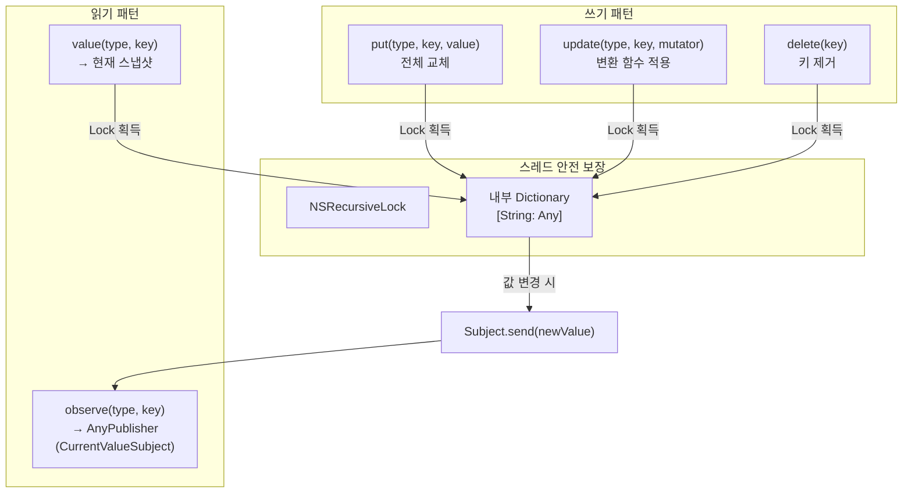
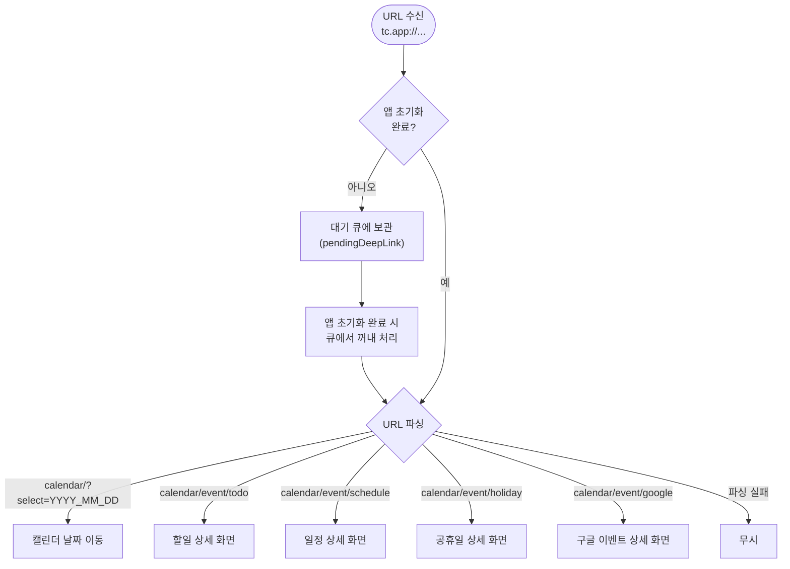

# 인프라 & 기타 상세 스펙

> 메인 기획서 [섹션 13, 14, 15, 17, 18, 19](../product-specification.md) 참조

---

## 1. 공유 상태 관리 (SharedDataStore)

모든 Usecase가 하나의 `SharedDataStore` 싱글톤을 통해 상태를 공유. Combine 기반 실시간 전파.

### 1.1 구현 상세

```swift
public final class SharedDataStore: @unchecked Sendable {
    private let lock = NSRecursiveLock()
    private var memorizedDataSubjects: [String: CurrentValueSubject<Any?, Never>] = [:]
    private let serialEventQeueu: DispatchQueue?
}
```

**스레드 안전성**:
- `NSRecursiveLock`으로 모든 `memorizedDataSubjects` 접근 보호
- 모든 public 메서드에서 `lock.lock(); defer { lock.unlock() }` 패턴
- `@unchecked Sendable` — 수동 스레드 안전 보장

**메모리 관리**:
- Subject는 키별 lazy 생성: 첫 `observe()` 또는 `put()` 시 `CurrentValueSubject` 생성
- 한번 생성된 Subject는 영구 유지 (구독자 수와 무관)
- `clearAll(filter:)`: 조건에 맞는 키의 Subject 값을 nil로 설정 (Subject 자체는 유지)

**Combine API**:

| 메서드 | 동작 |
|---|---|
| `observe<V>(type, key)` → `AnyPublisher<V?, Never>` | 현재 값 즉시 방출 + 변경 시 push. Optional serial queue 전달. |
| `put<V>(type, key, value)` | Subject에 값 설정 (즉시 구독자에게 전파) |
| `update<V>(type, key, mutating:)` | 현재 값을 읽어 변환 후 put (atomic update) |
| `value<V>(type, key)` → `V?` | 동기적 현재 값 읽기 |
| `clearAll(filter:)` | 조건부 전체 초기화 |

### 1.2 주요 키

| 키 | 타입 | 관리 주체 |
|---|---|---|
| `accountInfo` | `AccountInfo?` | AccountUsecase |
| `todos` | `[String: TodoEvent]` | TodoEventUsecase |
| `uncompletedTodos` | `[TodoEvent]` | TodoEventUsecase |
| `schedules` | `MemorizedEventsContainer<ScheduleEvent>` | ScheduleEventUsecase |
| `tags` | `[EventTagId: any EventTag]` | EventTagUsecase |
| `offEventTagSet` | `Set<EventTagId>` | EventTagUsecase |
| `defaultEventTagColor` | `[EventTagId: String]` | EventTagUsecase |
| `foremostEventId` | `ForemostEventId` | ForemostEventUsecase |
| `foremostMarkingStatus` | `ForemostMarkingStatus` | ForemostEventUsecase |
| `googleCalendarTags` | `[String: [GoogleCalendar.Tag]]` | GoogleCalendarUsecase |
| `googleCalendarEvents` | `[String: GoogleCalendar.Event]` | GoogleCalendarUsecase |
| `externalCalendarAccounts` | `[String: [ExternalServiceAccountinfo]]` | ExternalCalendarIntegrationUsecase |
| `calendarAppearance` | `CalendarAppearanceSettings` | UISettingUsecase |
| `eventSetting` | `EventSettings` | EventSettingUsecase |
| `timeZone` | `TimeZone` | CalendarSettingUsecase |
| `firstWeekDay` | `DayOfWeeks` | CalendarSettingUsecase |
| `currentCountry` | `String` | HolidayUsecase |
| `availableCountries` | `[String]` | HolidayUsecase |
| `holidays` | `[Int: [Holiday]]` | HolidayUsecase |

**로그인/로그아웃 시 초기화 범위**:

| 전환 | 초기화 범위 | 유지 키 |
|---|---|---|
| 로그인 | 대부분 초기화 | `accountInfo`, `externalCalendarAccounts` |
| 로그아웃 | 전체 초기화 | `externalCalendarAccounts` |

### 1.3 화면 간 통신

| 방향 | 메커니즘 | 용도 |
|---|---|---|
| 간접 공유 | SharedDataStore (Usecase 경유) | 같은 데이터를 구독하는 독립 화면 간 |
| Parent → Child | Interactor | 부모가 자식에게 명령 |
| Child → Parent | Listener (weak) | 자식이 부모에게 이벤트 전달 |

**간접 공유 예시**: 이벤트 상세 화면에서 할일 완료 → `TodoEventUsecase`가 SharedDataStore의 `todos` 업데이트 → 캘린더 그리드, 이벤트 목록, 위젯이 각각 독립적으로 변경 수신.

---

## 2. 딥링크

### 2.1 URL 스펙

| 항목 | 값 |
|---|---|
| 스킴 | `tc.app` (`AppDeepLink.scheme`) |
| 호스트 | `calendar` |
| 처리 | `ApplicationDeepLinkHandlerImple` |

**지원 딥링크 형식**

| 용도 | URL 패턴 | 쿼리 파라미터 |
|---|---|---|
| 날짜 이동 | `tc.app://calendar/?select=YYYY_MM_DD` | `select`: `year_month_day` 형식 |
| 이벤트 상세 | `tc.app://calendar/event/?id=<eventId>&type=<eventType>` | `id`, `type` |
| AI 입력 진입 | `tc.app://calendar/ai` | 없음 |

### 2.2 딥링크 처리 구조

```
URL 수신 (앱 실행 / 위젯 탭)
    ↓
PendingDeepLink 파싱:
    - URLComponents로 scheme, host, path, queryItems 추출
    - pathComponents: "/" 기준 분할
    - queryParams: percent-decoding 적용
    ↓
ApplicationDeepLinkHandlerImple:
    - scheme == "tc.app" 확인
    - host별 라우팅:
        └── "calendar" → CalendarDeepLinkHandlerImple
            ├── path에 "event" → EventDeepLinkHandlerImple
            └── path 없음 → handleMoveDate() (날짜 이동)
    ↓
미지원 링크 → .needUpdate → 앱 업데이트 안내 다이얼로그
```

**Pending 링크 처리**:
- 대상 핸들러가 아직 초기화되지 않은 경우 `pendingCalendarLink`에 보관
- 핸들러 초기화 시 `attach()` 호출 → 보관된 링크 즉시 처리

---

## 3. 피드백

### 3.1 입력 데이터

| 필드 | 필수 | 설명 |
|---|---|---|
| 연락처 이메일 | 선택 | 사용자 입력 |
| 피드백 메시지 | 필수 | 사용자 입력 |

### 3.2 자동 수집 데이터

| 필드 | 소스 |
|---|---|
| userId | 현재 로그인 사용자 ID (비로그인 시 `"null"`) |
| osVersion | `UIDevice` (예: `"18.3.1"`) |
| appVersion | `Bundle.main` (예: `"1.0.0"`) |
| deviceModel | `UIDevice` (예: `"iPhone 15"`) |
| isIOSAppOnMac | `ProcessInfo` Mac Catalyst 여부 |

### 3.3 전송 방식

`FeedbackRepositoryImple` → `FeedbackEndpoints.post` (서버 API)

**페이로드 형식**: Slack Incoming Webhook JSON

```json
{
  "attachments": [{
    "fallback": "incomming cs from: <email>",
    "pretext": "incomming cs from: <email>",
    "color": "good",
    "fields": [
      { "title": "message", "value": "사용자 메시지" },
      { "title": "user id", "value": "abc123" },
      { "title": "os version", "value": "18.3.1" },
      { "title": "app version", "value": "1.0.0" },
      { "title": "device model", "value": "iPhone 15" },
      { "title": "is ios app on Mac?", "value": "false" }
    ]
  }]
}
```

피드백 전송은 async/await 기반. Usecase에서 DeviceInfo 수집 → FeedbackMakeParams 조립 → Repository 전송.

---

## 4. D-Day 카운트다운

`DaysIntervalCountUsecase` — 이벤트/공휴일까지 남은 일수를 실시간 계산.

### 4.1 계산 공식

```
1. 현재 시각(Date)과 대상 시각(Date)을 Gregorian Calendar로 가져옴
2. Calendar의 timeZone을 현재 설정 타임존으로 설정
3. 양쪽 모두 startOfDay()로 00:00:00 정규화
4. dateComponents([.day], from:to:).day → 일수 차이 (Int)
```

**예시**:
- 현재: 2025-03-31 14:30 → 정규화: 2025-03-31 00:00
- 대상: 2025-04-05 09:15 → 정규화: 2025-04-05 00:00
- 결과: **5일** (양수 = 미래, 음수 = 과거)

### 4.2 타임존 처리

- `Calendar(identifier: .gregorian)`에 `CalendarSettingUsecase.currentTimeZone` 적용
- 사용자가 타임존을 변경하면 D-Day 값도 즉시 재계산
- 하루종일 이벤트의 경우 `Range<TimeInterval>.shiftting(secondsFromGMT:to:)` 변환 후 대상 날짜 결정

**하루종일 이벤트 타임존 변환**:
```
원본 범위 (이벤트 타임존) → +secondsFromGMT → UTC 범위 → -targetTimeZone.secondsFromGMT → 대상 타임존 범위
```

### 4.3 실시간 업데이트

- 1초 간격 타이머 (`secondTicks`) + 타임존 변경 Publisher를 `CombineLatest`
- `removeDuplicates()`: 일수가 실제로 변경될 때만 UI 갱신
- 사용 화면: 공휴일 상세, 이벤트 상세 등

---

## 5. DB 마이그레이션

### 5.1 메인 DB (`models.db`)

**파일**: 비로그인은 `models.db`, 로그인 계정이 있으면 `models_{userId}.db` 로 갈린다 (`AppEnvironment.dbFilePath(for:)`).

**현재 버전**: `AppEnvironment.dbVersion = 7`

**마이그레이션 메커니즘** (`SQLiteService`):
1. 앱 시작 시 `AppDataMigrationImple.runDBMigration()` 호출
2. `mainDB.async.migrate(upto: dbVersion, steps:finalized:)`
3. SQLite `user_version` pragma로 현재 버전 확인
4. 현재 → 목표까지 1단계씩 순차 실행
5. 각 단계의 스텝 함수가 `migrate(_:version:)` 를 불러 `Table.migrateStatement(for: version)` 의 SQL 을 실행한다. 스텝이 테이블을 먼저 세우는지, 세운다면 어느 선언으로 세우는지는 스텝마다 다르다 — 규칙과 예외는 §5.5 에 있다
6. 스텝 함수가 돌아오면 `user_version` 이 증가한다 — 스텝 안에서 실패를 삼키므로 실패해도 전진한다 (§5.2)
7. 최종 단계 후 `finalized` 콜백 (WAL 모드 설정)

**버전별 변경 이력**

| 버전 | 변경 내용 | 영향 테이블 | SQL |
|---|---|---|---|
| 0→1 | 반복 종료 횟수 컬럼 추가 | `TodoEvents`, `Schedules`, `PendingDoneTodoEvent` | `ALTER TABLE ... ADD COLUMN repeating_count INTEGER` |
| 1→2 | 구글 캘린더 이벤트 상태 컬럼 | `google_calendar_event_origin` (레거시) | `ALTER TABLE ... ADD COLUMN status TEXT` |
| 2→3 | 구글 캘린더 태그 선택 컬럼 | `google_calendar_list` (레거시) | `ALTER TABLE ... ADD COLUMN is_selected INTEGER` |
| 3→4 | 구글 캘린더 이벤트 가시성 컬럼 | `google_calendar_event_origin` (레거시) | `ALTER TABLE ... ADD COLUMN visibility TEXT` |
| 4→5 | 업로드 큐 테이블 재구성 | `event_upload_pending_queue` | 임시 테이블 생성 → 데이터 이동 → 원본 삭제 → 이름 변경 |
| 5→6 | 할일 반복 회차 컬럼 추가 | `TodoEvents` | `ALTER TABLE ... ADD COLUMN repeating_turn INTEGER` |
| 6→7 | 완료 처리 중 원본 보관 테이블의 컬럼 순서 교정 + 회차 컬럼 추가 | `PendingDoneTodoEvent` | 임시 테이블 생성 → 데이터 이동 → 원본 삭제 → 이름 변경 |

**전체 테이블 목록** (`prepareTables()` 순서):

1. `KeyValueTable`
2. `HolidayRepositoryImple.HolidayTable`
3. `EventTimeTable`
4. `EventDetailDataTable`
5. `CustomEventTagTable`
6. `ScheduleEventTable`
7. `EventSyncTimestampTable`
8. `DoneTodoEventTable`
9. `DoneTodoEventDetailTable`
10. `PendingDoneTodoEventTable`
11. `TodoEventTable`
12. `TodoToggleStateTable`
13. `EventUploadPendingQueueTable`
14. `EventNotificationIdTable`
15. `ProcessingAICommandTable`
16. `CustomColorThemeTable`

### 5.2 실패 처리 전략

**테이블별 개별 try-catch**:
- 각 테이블 마이그레이션이 독립적으로 에러 처리
- 마이그레이션 실패 시 → 해당 테이블 drop → 같은 실행의 `prepareTables()`에서 재생성 (데이터 손실 감수). `runDBMigration()` 바로 뒤에 `prepareTables()` 가 붙어 있어 다음 실행을 기다리지 않는다 (`ApplicationPrepareUsecase.swift:207-208`)
- 재생성되는 것은 `prepareTables()` 목록에 있는 테이블뿐이다. 1→2·2→3·3→4 가 드롭하는 메인 DB 의 구글 레거시 테이블은 그 목록에 없어 다시 서지 않는다

**일곱 스텝의 실패 강도는 같다.** 전부 `do`/`catch` 로 감싸 에러를 로그로 삼키고 대상 테이블을 `try? dropTable` 한 뒤 정상 반환한다 (`AppDataMigrationImple.swift:87-176`). 버전에 따라 hard fail·soft fail 로 갈리는 구분은 없다.

**그래서 `user_version` 은 실패해도 전진한다.** 라이브러리는 스텝 클로저가 던지지 않으면 `updateUserVersion(현재+1)` 을 하고 다음 스텝으로 재귀한다 (`SQLiteService.swift:177-190`). 스텝이 에러를 삼키므로 드롭된 테이블을 남긴 채 목표 버전까지 올라간다 — 그 테이블이 `prepareTables()` 목록에 있으면 같은 실행에서 최신 스키마로 다시 선다.

**전체 실패 시**: `runDBMigration()` 최상위 try-catch 가 에러 로깅만 수행해 앱 크래시를 막는다 (`AppDataMigrationImple.swift:55-57`).

### 5.3 외부 캘린더 DB — 서비스마다 따로

**파일과 버전**은 서비스별이다. 구글은 `google_calendar.db` 에 `AppEnvironment.googleCalendarDBVersion = 1`, 애플은 `apple__calendar.db` 에 `appleCalendarDBVersion = 1` 이다 (`AppEnvironment.swift:128-139`·`:209-211`). **애플의 1 은 어떤 스키마 변경에도 대응하지 않는 빈 번호다** — 구글 스텝이 모든 외부 DB 에 돌던 시절 올라간 값이고, 애플 선언은 V0 이다.

- DB 연결은 `ExternalCalendarSQLiteConnectionPoolImple` 이 관리한다 (참조 카운팅, lazy open).
- **`onFirstOpen` 은 서비스별 마이그레이션만 돌린다** (`ApplicationBase.swift:52-63` → `ExternalCalendarDBMigrationImple.runMigration(serviceId:dbService:)`). 테이블은 거기서 안 만든다 — 각 `LocalStorage` 가 처음 접근할 때 `createTableOrNot` 으로 세운다.
- 구글은 0→1 스텝이 있다 — `google_calendar_list` 에 `access_role` 을 붙인다 (`ExternalCalendarDBMigrationImple.swift:39-52`). 애플은 `steps` switch 가 비어 있어 도는 스텝이 없다 (`:54-66`).

**구글 DB 테이블**: `GoogleCalendarColorsTable`(`google_calendar_colors`), `GoogleCalendarEventTagTable`(`google_calendar_list`), `GoogleCalendarEventOriginTable`(`google_calendar_event_origin`) 셋은 `account_id` 컬럼으로 다중 계정을 지원하고, 여기에 `EventTimeTable`(`EventTimes`)이 함께 선다 (`GoogleCalendarLocalStorage.swift:57-58`·`:131-132`·`:166-167`). `EventTimeTable` 은 메인 DB 와 같은 선언을 쓰므로 `account_id` 가 없다.

**애플 DB 테이블**: `AppleCalendarTagTable`(`apple_calendar_tags`), `AppleCalendarEventTable`(`apple_calendar_events`), `EventTimeTable`(`EventTimes`) 셋이다 (`AppleCalendarLocalStorage.swift:42-44`). 애플은 단일 계정 서비스라 `account_id` 컬럼을 두지 않는다.

### 5.4 레거시 데이터 이관

구글 캘린더 데이터가 메인 DB(레거시 테이블)에서 별도 DB로 이동하는 일회성 마이그레이션:
- 플래그: `"google_calendar_migrated"` (한번 실행 후 스킵)
- DB Pool 연결이 없으면 스킵 (플래그 미설정 → 다음에 재시도)
- 읽기/쓰기 실패 시 soft fail (`try?`) → 플래그는 설정하여 재시도 방지

### 5.5 새 마이그레이션 추가 절차

**0. 바뀐 스키마를 새 버전 타입으로 선언한다.** 타입명은 `<테이블명>V<그 스키마가 선 버전>` 이고 테이블과 같은 파일에 둔다. 접미사 없는 이름은 최신을 가리키는 `typealias` 라, 새 타입을 더한 뒤 alias 를 그리로 옮긴다. 상세 규약은 [`Repository/CLAUDE.md`](../../Repository/CLAUDE.md) "버전 선언" 절이 정본이다.

**메인 DB 는 세 위치를 반드시 함께 변경한다:**

1. `AppEnvironment.dbVersion` 증가
2. 해당 `Table` 타입의 `migrateStatement(for version:)`에 새 case 추가 — **`typealias` 쪽 이름에 단다**
3. `AppDataMigrationImple` — `runDBMigration`의 switch에 case 추가 + `runMigrationVersionNtoM` 메서드 작성

**외부 캘린더 DB 는 같은 짝을 서비스별로 가진다** — `googleCalendarDBVersion`·`appleCalendarDBVersion` 중 해당 상수를 올리고, 그 테이블의 `migrateStatement` case 를 더하고, `ExternalCalendarDBMigrationImple` 의 서비스별 `steps` switch 에 case 와 스텝 메서드를 더한다. 스텝 메서드 이름이 `runMigrationVersionNtoM` 패턴이 아니라 대상 테이블을 담아서(`runGoogleCalendarEventTagMigration`), 메인 DB 짝을 이름으로 훑으면 이쪽은 안 걸린다.

**2번을 구체 타입 이름에 달면 마이그레이션이 조용히 멈춘다.** `Table` 프로토콜에 `nil` 을 돌려주는 기본 구현이 있고(`Table.swift:106-108`), `migrate(_:version:)` 는 `migrateStatement` 가 `nil` 이면 아무것도 하지 않고 돌아온다(`SQLiteDataBase.swift:280-292`). alias 가 새 타입으로 옮겨간 뒤 그 기본값이 집히므로 옛 스텝만 안 돈다. 예외는 alias 가 영영 안 가리키는 얼린 선언이다 — 메인 DB 의 구글 테이블 둘이 그 경우고, 스텝도 구체 이름을 부른다.

**3번이 빠지면 `migrateStatement`는 호출조차 되지 않는다.** 컴파일은 통과하고, 마이그레이션 회귀 테스트를 안 쓰면 테스트도 통과한다 — 스텝별 회귀가 `AppDataMigrationImpleTests` 에 있으니 새 스텝에도 케이스를 둔다.

**스텝 안에서 만드는 쪽은 출발 버전, 옮기는 쪽은 최신이다.** 생성 뒤 ALTER 가 따르는 스텝은 `createTableOrNot` 에 출발 시점 스키마 선언을 준다. `typealias` 를 주면 테이블이 아직 없는 신선 설치에서 최신 스키마가 서고, 뒤따르는 ALTER 가 중복 컬럼으로 던져 스텝 catch 가 그 테이블을 드롭한다.

**이 규칙의 대상이 아닌 스텝이 셋이다.** temp 테이블로 복사·교체하는 스텝(`modfiyColumns`)은 원본을 통째로 갈아끼우므로 `createTableOrNot` 에 출발 선언이 아니라 temp 테이블을 준다 (`AppDataMigrationImple.swift:146` · `:168-169`). 메인 DB 의 구글 스텝 셋(1→2·2→3·3→4)은 `V0` 선언이 이미 ALTER 를 거친 뒤의 스키마라 주면 중복 컬럼으로 던지고, 출발 스키마를 주려면 중간 선언을 새로 만들어야 하는데 그러면 구글을 안 붙이는 사용자의 메인 DB 에 빈 테이블 셋이 영영 남는다. 외부 DB 의 구글 0→1 은 그 테이블을 `LocalStorage` 가 접근할 때 만들어 신선 설치엔 생성 자체가 없다. 뒤 둘은 `createTableOrNot` 을 아예 부르지 않는다 (`AppDataMigrationImple.swift:114-142` · `ExternalCalendarDBMigrationImple.swift:73-81`).

`migrateStatement(for:)`가 받는 숫자는 **떠나는 버전**이다 — `case 5`는 5 → 6 스텝에서 돈다.

메인 DB 면 §5.1 의 버전별 변경 이력 표에 새 행을 추가하고 "현재 버전"도 함께 올린다. 외부 DB 면 §5.3 의 버전·스텝 서술과 [`google-calendar.md`](google-calendar.md) 의 마이그레이션 절을 갱신한다.

### 5.6 컬럼 순서 변경·삭제 — temp 테이블 재생성

SQLite의 `ALTER TABLE ADD COLUMN`은 **맨 뒤에 붙이는 것만** 된다. 순서 교정·컬럼 제거는 `modfiyColumns(tempTable:to:from:)`로 간다 — `INSERT INTO temp SELECT ... FROM 원본` → 원본 DROP → temp를 원본 이름으로 RENAME, 세 문장을 만들어준다.

- **temp 테이블은 라이브러리가 안 만든다.** 마이그레이션 스텝에서 `createTableOrNot(<Temp>Table.self)`로 직접 생성한다. 새 컬럼 순서는 이 temp 테이블의 `Columns` 정의가 결정한다.
- `to`/`from`은 컬럼 **이름** 매핑 표다. 각 이름은 해당 테이블에서 이름으로 해석되고, 두 리스트끼리는 위치로 짝지어진다. 이름이 안 바뀌면 같은 배열을 양쪽에 넘긴다.
- **새로 추가하는 컬럼은 두 리스트에서 뺀다.** 원본에 없어 SELECT가 실패한다. 빠진 컬럼은 NULL로 남는다.
- **temp 테이블의 `Columns`는 그 버전 스키마로 동결한다.** 살아있는 원본 `Columns`를 typealias·참조로 끌어쓰면, 이후 컬럼을 추가하는 순간 과거 마이그레이션의 복사 목록에 그 버전 원본엔 없는 이름이 실려 SELECT가 깨진다. 그러면 위 예시의 실패 경로를 타 원본 테이블이 드롭되고 사용자 데이터가 사라진다. 컬럼 나열이 중복돼 보여도 각 temp 테이블은 자기 case를 통째로 적는다.
- 선례: `EventUploadPendingQueueTableV4TempTable`(v4 → v5), `PendingDoneTodoEventTableV6TempTable`(v6 → v7)
- **큐 쪽 선례는 위 동결 규칙을 아직 안 따른다.** `EventUploadPendingQueueTable.migrateStatement` 의 `case 4` 가 복사 목록 `to`·`from` 을 살아있는 alias 의 `Columns.allCases` 로 만든다 (`EventUploadPendingQueueTable.swift:46-48`). 현재 컬럼 구성에서는 같은 결과가 나오지만, 그 테이블에 컬럼을 더하는 순간 v4 원본에 없는 이름이 SELECT 에 실린다. 따라 쓸 선례는 `PendingDoneTodoEventTableV6TempTable` 쪽이다

```swift
private func runMigrationVersion6to7(_ database: any DataBase) throws {
    do {
        try database.createTableOrNot(PendingDoneTodoEventTable.self)
        try database.createTableOrNot(PendingDoneTodoEventTableV6TempTable.self)
        try database.migrate(PendingDoneTodoEventTable.self, version: 6)
    } catch {
        try? database.dropTable(PendingDoneTodoEventTable.self)   // 실패 시 드롭 — prepareTables가 새 스키마로 재생성
    }
}
```

> 컬럼 순서가 곧 cursor 읽기 순서라는 위치 결합은 [`Repository/CLAUDE.md`](../../Repository/CLAUDE.md) 참조.

---

## 6. 주요 외부 의존성

**버전은 루트 [`Package.swift`](../../Package.swift) 가 정본이다** — 여기 적지 않는다. 버전 제약의 사유(핀·exact)도 그 파일의 주석이 담는다.

| 라이브러리 | 용도 |
|---|---|
| Alamofire | HTTP 클라이언트 (Remote API) |
| Kingfisher | 이미지 캐싱 & 다운로드 |
| swift-prelude | 함수형 프로그래밍 연산자 (`\|>`, `.~` 렌즈) |
| swift-async-algorithms | Async sequence 연산 |
| publisher-async-bind | Combine ↔ async/await 브릿지 |
| SQLiteService | SQLite DB 래퍼 (Table 프로토콜, 마이그레이션) |
| CombineCocoa | UIKit + Combine 확장 |
| Pulse | 네트워크 로깅 & 디버깅 |
| Firebase (Messaging) | 푸시 알림 (FCM 토큰 등록/해제) |
| AppAuth | Google OAuth2 인증 플로우 (GoogleSignIn-iOS 의 전이 의존) |
| Combine | 반응형 스트림 (메인 상태 관리) — 시스템 프레임워크 |

**의존성 관리**: Tuist v4 + SPM (`mise.toml` 이 버전을 못박는다). 외부 패키지는 루트 `Package.swift` 에서 선언한다. 이 레포의 자체 프레임워크는 전부 `.staticFramework` 로 빌드한다 (`Project+Templates.swift:175`·`:219`) — 외부 패키지의 빌드 타입은 Tuist 기본값을 따르고 여기서 지정하지 않는다.

---

## 7. 앱 버전 체크 (강제 / 권장 업데이트)

서버 API 브레이킹 체인지나 치명적 결함 발생 시 구버전 사용자를 새 버전으로 유도하는 통로. 가벼운 안내는 같은 채널로 "권장" 수준으로 내린다.

### 7.1 원격 설정

**위치**: `sudopark/TodoCalendar-Terms` 레포 `main` 브랜치의 `app-config/update-info.json`
**서빙**: `https://raw.githubusercontent.com/sudopark/TodoCalendar-Terms/main/app-config/update-info.json` (GitHub raw URL)
**포맷**:
```json
{
  "force_update_version": "2.0.0",
  "recommend_update_version": "1.9.0",
  "latest_version": "2.1.0"
}
```

- 세 필드 모두 선택적. null이면 해당 판정 비활성.
- `force_update_version` / `recommend_update_version` — 업데이트 **강제·권장 하한선**. 팝업 트리거용.
- `latest_version` — **스토어에 올라간 최신 배포 버전**. 설정 화면의 "업데이트 가능" 안내(비강제) 판정용.
- 디코딩은 Repository 레이어의 `AppUpdateInfoMapper`가 담당. Domain 모델 `AppUpdateInfo`는 Decodable 채택하지 않음.
- 이 저장소 루트의 `app-config/update-info.json`은 2.9.6 이하 구버전 앱이 여전히 바라보는 옛 경로다 (#983). 구버전을 2.9.7 이상으로 밀어낼 때까지 함께 갱신해야 하며, 그 전에 이 저장소를 비공개로 돌리면 구버전은 §7.6대로 업데이트 안내를 전혀 못 받는다.

### 7.2 판정 알고리즘

`AppUpdateRequirement.init?(current:appUpdateInfo:)`:

```
1. forceUpdateVersion 존재 + current < forceVersion → .forceRequired (우선)
2. recommendUpdateVersion 존재 + current < recommendVersion → .recommended
3. 그 외 → nil (정상, 업데이트 불필요)
```

**버전 비교** (`String.isVersionLessThan`):

1. 양쪽 문자열을 `.`로 split
2. 짧은 쪽을 `"0"`으로 zero-padding (`2.0` → `2.0.0`)
3. 다시 `.`로 join한 뒤 `compare(_:options: .numeric)` 호출
4. `.orderedAscending` 반환 시 current가 더 낮음

이로써:
- `1.10 > 1.9` 정확히 판정 (numeric 옵션)
- `2.0 == 2.0.0` 동일 취급 (zero-padding)
- `major.minor.patch` 순수 숫자 포맷만 가정 — `1.0-beta` 같은 semver pre-release는 미대응

#### 7.2.1 업데이트 가능 여부 판정 (`isUpdateAvailable`)

`AppUpdateCheckUsecase.isUpdateAvailable: AnyPublisher<Bool, Never>` — 설정 화면의 비강제 안내용 판정:

```
1. latest_version이 없으면 → false
2. current < latest_version → true
3. 그 외 → false
```

`force_update_version` / `recommend_update_version`과 **독립**으로 판정. 두 축은 "업데이트 강제·권장 하한선"을 표현하고, `latest_version`은 "스토어에 올라간 최신 배포 버전"을 표현하는 서로 다른 축이다. 세 값이 동시에 존재해도 각자 독립적으로 평가된다.

내부 구현: `AppUpdateCheckUsecaseImple.Subject.currentUpdateInfo: CurrentValueSubject<AppUpdateInfo?, Never>`에 `loadUpdateInfo` 결과를 사이드이펙트로 저장하고, 여기서 `map`으로 파생. `String.isVersionLessThan` extension은 force/recommended 판정과 공유.

### 7.3 체크 트리거

`AppUpdateCheckUsecase.checkUpdateIsNeed()` 호출 시점:

| 시점 | 트리거 지점 |
|---|---|
| 앱 시작 | `ApplicationRootViewModelImple.setupInitialScene`의 초기 바인딩 경로 |
| 포그라운드 복귀 | `UIApplication.willEnterForegroundNotification` 구독 |

`updateRequirement` Publisher가 `forceRequired` / `recommended`를 방출하면 `ApplicationRootViewModelImple.bindUpdateRequirement`의 sink가 `router?.showUpdatePopup(requirement)`를 호출.

설정 화면(`SettingItemListViewModelImple`)은 `isUpdateAvailable`을 **구독만** 하고 `checkUpdateIsNeed()`를 호출하지 않는다. 앱 시작·포그라운드 복귀에서 이미 트리거되며, `currentUpdateInfo` CurrentValueSubject가 마지막 값을 보관해 Setting 진입 즉시 현재값을 받을 수 있다. Setting에서 추가 트리거하면 force/recommended 팝업이 설정 화면 위로 겹쳐 뜰 여지가 있어 기존 팝업 흐름 간섭을 피하기 위한 정책.

### 7.4 팝업 동작

`ApplicationRootRouter.showUpdatePopup(_:)` — 루트 레벨 `UIHostingController`를 `overFullScreen`으로 present.

- 중복 노출 방지: 현재 팝업 VC 참조(`updatePopupViewController`, `weak`)를 보관하고 nil일 때만 새로 present.
- `isModalInPresentation = true` — **force/recommended 모두** 스와이프 dismiss 차단.
- 배경은 clear(딤은 SwiftUI 내부), 전환 애니메이션은 present `animated: false` + SwiftUI opacity 페이드(0.25s)로 통일.

**View (`UpdatePopupView`/`ForceUpdatePopupView`) 구조**:
- `switch requirement`로 `forceRequiredContent` / `recommendedContent` 서브뷰 분기.
- 공통 카드 컨테이너는 `popupCard` 헬퍼로 추출. 배경은 `appearance.colorSet.bg0`.

| 요구 | 버튼 | "업데이트" 탭 시 |
|---|---|---|
| forceRequired | "업데이트"만 | App Store 이동. **팝업 유지** (`closePopup` 호출 안 함 → opacity 1 유지) |
| recommended | "나중에" + "업데이트" | App Store 이동 + `closePopup`으로 페이드아웃. "나중에"는 Router의 `onClose`가 host VC `dismiss`. |

### 7.5 관련 파일

| 레이어 | 파일 |
|---|---|
| Domain Model | `Domain/Sources/Models/AppUpdateInfo.swift` |
| Domain Repo | `Domain/Sources/Repositories/AppRepository.swift` |
| Domain Usecase | `Domain/Sources/Usecases/Support/AppUpdateCheckUsecase.swift` |
| Repository Impl | `Repository/Sources/Repository+Imple/Support/AppRemoteRepositoryImple.swift` |
| Mapper | `Repository/Sources/Repository+Imple/Support/AppUpdateInfo+Mapping.swift` |
| Endpoint | `Repository/Sources/Remote/Endpoint.swift` (`AppEndpoints.updateInfo`) |
| Root View | `TodoCalendarApp/Sources/Root/ForceUpdatePopupView.swift` |
| Root Router | `TodoCalendarApp/Sources/Root/ApplicationRootRouter.swift`의 `showUpdatePopup` |
| Root VM | `TodoCalendarApp/Sources/Root/ApplicationRootViewModel.swift`의 `bindUpdateRequirement` + `handleWillEnterForeground` |
| Setting VM | `Presentations/SettingScene/Sources/Setting/SettingItemListViewModel.swift`의 `isUpdateAvailable` 구독 + `openAppUpdate()` |
| Factory | `Presentations/Scenes/Sources/Factories.swift` `SupportUsecaseFactory.appUpdateCheckUsecase` (단일 인스턴스 공유 계약) |
| 원격 설정 | `sudopark/TodoCalendar-Terms` 레포의 `app-config/update-info.json` |

### 7.6 한계 / 후속 과제

- **recommended 재노출 억제 없음**: 포그라운드 복귀마다 같은 조건이면 매번 팝업이 뜬다. "나중에" 선택 후 일정 기간 억제하려면 마지막 dismiss 시점을 로컬(UserDefaults 등)에 저장하고 `checkUpdateIsNeed`에서 참조하는 정책이 필요.
- **semver pre-release 미대응**: `1.0-beta`, `2.0.0-rc.1` 같은 접미사는 현재 비교 로직이 예측 불가 동작. 필요 시 `isVersionLessThan`에 pre-release 파싱 추가.
- **원격 실패 시 조용한 무효화**: `AppUpdateCheckUsecaseImple.loadUpdateInfoWithoutError`가 에러를 nil로 삼켜 JSON 디코딩 실패·네트워크 오류가 운영 지표에 드러나지 않음. 로그/텔레메트리 추가 검토 여지.

---

## 8. 약관·개인정보처리방침 개정 고지 (법적 배너)

사용자에게 중요한 개정(요금·이용 한도 축소·책임 제한 확대·개인정보 수집 항목·제3자 제공처 추가)을 원격 설정으로 푸시하고, 메인 화면 배너로 고지한다. 약관과 방침은 각자 독립적으로 개정되고 확인되므로, 모델·저장·UI 전부 **문서 단위**로 분리돼 있다 — 배너는 미확인 문서 수만큼(0~2줄) 뜨고 줄마다 개별로 확인한다.

### 8.1 원격 설정

**위치**: `sudopark/TodoCalendar-Terms` 레포 `main` 브랜치의 `app-config/legal-notice.json`
**서빙**: `https://raw.githubusercontent.com/sudopark/TodoCalendar-Terms/main/app-config/legal-notice.json` (GitHub raw URL, §7.1과 동일 prefix)
**포맷**:
```json
{
  "terms":   { "id": "2026-09-01-terms",   "effective_date": "2026-09-01" },
  "privacy": { "id": "2026-09-15-privacy", "effective_date": "2026-09-15" }
}
```

- 최상위 키가 `LegalDocumentType`(`terms` / `privacy`) raw value다.
- 고지 없음은 `{}` (빈 객체).
- 디코딩은 Repository 레이어의 `LegalNoticeMapper`(`Decodable`)가 담당하고, Domain 모델(`LegalDocumentType` / `LegalNoticeUpdateInfo` / `LegalNoticeUpdates = [LegalDocumentType: LegalNoticeUpdateInfo]`)은 Decodable 미채택. `LegalNoticeMapper.init(from:)`는 `LegalDocumentType.allCases`를 순회하며 문서별로 독립 디코딩해 **항목 단위로 흡수**한다 — 한 문서가 깨져도 나머지는 산다.
- 시행일 파싱은 `dateFormat = "yyyy-MM-dd"`, `timeZone = TimeZone(secondsFromGMT: 0)`, `locale = Locale(identifier: "en_US_POSIX")` 고정.

**항목 단위 흡수 — 엣지 케이스**:

| 입력 | 결과 |
|---|---|
| `{}` | 빈 딕셔너리 |
| `{"terms": {...}, "privacy": {...}}` | 두 항목 모두 반영 |
| `{"unknown": {...}}` | 빈 딕셔너리 — 모르는 문서 종류는 무시 (forward compatibility) |
| `{"terms": {...}, "unknown": {...}}` | `terms`만 반영 |
| 항목의 `id` 누락 | 그 문서만 버림 |
| 항목의 `effective_date` 파싱 실패 | 그 문서만 버림 |
| 네트워크 실패 | `loadNoticeUpdates`가 throw — 삼키는 건 usecase 책임(§8.2) |

### 8.2 판정 알고리즘

```swift
protocol LegalNoticeRepository: Sendable {
    func loadNoticeUpdates() async throws -> LegalNoticeUpdates
    func fetchConfirmedNoticeId(_ documentType: LegalDocumentType) -> String?
    func updateConfirmedNoticeId(_ id: String, for documentType: LegalDocumentType)
}
```

확인 이력은 `LegalNoticeRepositoryImple`이 `EnvironmentStorage`(UserDefaults 백엔드)에 문서별 키 `"confirmed_legal_notice_id_\(documentType.rawValue)"`로 저장·조회한다.

`LegalNoticeUsecaseImple.checkNoticeIsNeed()` 호출 시:

```
1. checkTrigger 발생 → 원격 loadNoticeUpdates() 실행 (실패 시 빈 딕셔너리로 삼킴)
2. LegalDocumentType.allCases 순서로 순회하며 각 문서의 원격 id와 fetchConfirmedNoticeId(documentType)를 비교
3. 다르면 pending 목록에 포함, 같으면 제외
4. pendingNoticeUpdates: AnyPublisher<[LegalNoticeUpdateInfo], Never>로 방출
```

- **정렬 근거**: `LegalNoticeUpdates`는 딕셔너리라 순서가 없다. `LegalDocumentType.allCases`(선언 순서 terms → privacy)로 순회해 배열을 만들기 때문에 방출 순서가 고정되고, 이 순회가 없으면 배너 줄 순서가 실행마다 흔들린다.
- 초기값·조회 실패·고지 없음은 전부 **빈 배열**이다. `pendingUpdates`가 `CurrentValueSubject<[LegalNoticeUpdateInfo], Never>([])`라 무방출이나 empty completion이 아니라 명시적 빈 배열로 표현된다.
- `confirmNotice(_ documentType:)` — pending 배열에서 그 문서의 항목을 찾아 `updateConfirmedNoticeId(info.id, for: documentType)`를 호출한 뒤, pending 에서 그 항목만 뺀 배열을 재방출한다. pending 에 없는 문서를 넘기면 아무 일도 하지 않는다.

### 8.3 체크 트리거

`LegalNoticeUsecase.checkNoticeIsNeed()` 호출 시점:

| 시점 | 트리거 지점 |
|---|---|
| 앱 시작 | `MainViewModelImple.prepare()` |
| 포그라운드 복귀 | `MainViewModelImple.internalBinding()`의 `UIApplication.willEnterForegroundNotification` 구독 |

내부는 `Subject.checkTrigger: PassthroughSubject<Void, Never>`를 send. `flatMapLatest`로 원격 조회(§8.2 1번)에 연결하고, 문서별 비교를 거친 배열이 `Subject.pendingUpdates: CurrentValueSubject<[LegalNoticeUpdateInfo], Never>([])`에 저장되어 `pendingNoticeUpdates` Publisher로 노출된다. `PassthroughSubject`가 아니라 `CurrentValueSubject`인 이유 — `confirmNotice(_:)`가 갱신된 배열을 재방출해야 그 줄이 내려가기 때문이다.

`MainViewModelImple.legalNoticeBanners`는 별도 상태로 미러링하지 않고, `legalNoticeUsecase.pendingNoticeUpdates`를 매번 직접 `map`해 `[LegalNoticeBannerModel]`로 변환한다.

**Usecase 공급**: `SupportUsecaseFactory.makeLegalNoticeUsecase()` (`NonLoginUsecaseFactoryImple` / `LoginUsecaseFactoryImple` 둘 다 구현). 소비자가 `MainViewModel` 하나뿐이라 단일 인스턴스 공유 계약은 없다 — 호출마다 새 인스턴스를 만든다.

### 8.4 노출 동작

**위치**: `MainViewController.headerAreaStackView`의 `addArrangedSubview` 순서상 `loadingAllEventsLabel` 아래, `compositeLoadingBarView` 위 (`headerView` → `loadingAllEventsLabel` → `legalNoticeBannerView` → `compositeLoadingBarView`). 초기 `isHidden = true`.

배너는 `LegalNoticeBannerView` — 세로 `UIStackView` 컨테이너다. `MainViewModel.legalNoticeBanners: AnyPublisher<[LegalNoticeBannerModel], Never>`가 방출하면 `update(_:)`가 행을 재구성한다:
- 모델이 0개면 `isHidden = true`
- 1개 이상이면 문서마다 행(`LegalNoticeBannerRowView`)을 하나씩 만들어 채운다
- 행 사이에는 1px 구분선(`colorSet.line`)을 넣는다. 첫 행 위·마지막 행 아래에는 없다.

`LegalNoticeBannerModel`(`documentType` / `message` / `effectiveDateText`)의 `message`는 문서 종류에 따라 `legal_notice.message::terms` 또는 `legal_notice.message::privacy`로 분기하고, `effectiveDateText`는 `legal_notice.effectiveDate`(en `Effective %@` / ko `시행일 %@`)에 `date_form.yyyy_MM_dd` 패턴(en `MM/dd/yyyy` / ko `yyyy.MM.dd`)으로 UTC 고정 포맷한 날짜를 채운다. 문서가 한 줄에 하나이므로 한 줄에 두 문서를 담는 문구는 없다.

**행 구성**(`LegalNoticeBannerRowView`): 아이콘(`doc.text`, 18×18, `colorSet.accentInfo`) · 세로 스택(메시지 `fontSet.normal`/`colorSet.text0`, `numberOfLines = 0` · 시행일 `fontSet.subNormal`/`colorSet.text2`) · 닫기 버튼(`xmark`, 24×24, `colorSet.text2`). 좌우 16 / 상하 10 padding.

**주요 설계**: 배너는 modal present가 아니라 `headerAreaStackView`에 포함된 subview다 — 업데이트 팝업(강제·권장 모달)·UMP 동의 폼·ATT 프롬프트·전면 광고와 노출 순서를 다투지 않는다.

**사용자 액션**:
- **행 탭** — `LegalNoticeBannerView.documentTapped: AnyPublisher<LegalDocumentType, Never>`를 거쳐 `MainViewModelImple.openLegalNoticeDocument(_:)` → `router?.showWebView(documentType.linkPath)`로 그 문서 웹뷰를 바로 연다. 문서가 한 줄에 하나뿐이라 액션시트 분기는 없다.
  - 탭 제스처는 행(`LegalNoticeBannerRowView`)이 직접 소유하고 닫기 버튼 위 터치는 받지 않는다 — 상위 뷰의 제스처는 버튼 터치까지 받아 두 액션이 함께 발화하는 게 UIKit 기본 동작이다.
- **닫기 버튼** — `LegalNoticeBannerView.closeTapped: AnyPublisher<LegalDocumentType, Never>` → `MainViewModelImple.closeLegalNoticeBanner(_:)` → `legalNoticeUsecase.confirmNotice(documentType)`. 그 문서의 확인 id가 `EnvironmentStorage`에 저장되고 `pendingNoticeUpdates`가 그 문서를 뺀 배열을 재방출한다 — 그 줄만 사라지고 나머지 줄은 유지된다.

### 8.5 고지 등급 정책

**원격에 올리는 것** (중요 변경만):
- 요금 인상·변경 (플랜 전환, 신규 가격 정책)
- 이용 한도 축소 (AI Agent 일일 한도 감소, 저장소 용량 제한 신설 등)
- 책임 제한 확대 (서비스 중단 면책 조건 추가 등)
- 개인정보 수집 항목 추가 (위치, 연락처 등 신규 항목)
- 제3자 제공처 추가 (외부 서비스 통합 시)

**원격에 안 올리는 것**: 오탈자·표현 정리 — 웹 게시 + 시행일 갱신만으로 끝낸다.

**개인정보 수집 항목·제공처 추가 시 유의**:
약관 또는 개인정보 수집 동의서 개정만으로는 부족할 수 있다 — 법령에 따라 별도 명시적 동의가 필요한 경우가 있다. 이 경우 배너 고지는 선언 목적이고, 실제 수집은 동의 폼으로 별도 처리한다.

**시행 시점 정책**: 약관·개인정보처리방침 §12는 "중요한 변경은 시행 전에 앱에서 안내합니다"로 규정한다 — 시행 **전**에만 고지하면 되고 구체적인 일수는 박지 않는다. 시행일이 지나도 배너 줄은 자동으로 내려가지 않는다. 문서별 줄이 사라지는 경로는 (a) 유저가 그 줄의 닫기 버튼을 눌러 `confirmNotice(documentType)`가 그 문서의 확인 id를 저장하거나, (b) 원격 `legal-notice.json`에서 그 문서 항목을 내려 다음 체크에서 pending 목록에서 빠지는 두 가지뿐이다.

### 8.6 관련 파일

| 레이어 | 파일 |
|---|---|
| Domain Model | `Domain/Sources/Models/LegalNotice.swift` |
| Domain Repo | `Domain/Sources/Repositories/LegalNoticeRepository.swift` |
| Domain Usecase | `Domain/Sources/Usecases/Support/LegalNoticeUsecase.swift` |
| Repository Impl | `Repository/Sources/Repository+Imple/Support/LegalNoticeRepositoryImple.swift` |
| Mapper | `Repository/Sources/Repository+Imple/Support/LegalNotice+Mapping.swift` |
| Endpoint | `Repository/Sources/Remote/Endpoint.swift` (`AppEndpoints.legalNotice`) |
| Main View | `TodoCalendarApp/Sources/Main/LegalNoticeBannerView.swift` |
| Main ViewController | `TodoCalendarApp/Sources/Main/MainViewController.swift` (배너 layout) |
| Main VM | `TodoCalendarApp/Sources/Main/MainViewModel.swift` (`openLegalNoticeDocument` / `closeLegalNoticeBanner` / `legalNoticeBanners` publisher) |
| Factory | `Presentations/Scenes/Sources/Factories.swift` / `TodoCalendarApp/Sources/Factories/Factories+Usecase.swift` (`SupportUsecaseFactory.makeLegalNoticeUsecase`) |
| 원격 설정 | `sudopark/TodoCalendar-Terms` 레포의 `app-config/legal-notice.json` |

---

## 9. 앱 정책 (`app-policy.json`)

앱 코드를 바꾸지 않고 도메인별 정책 값과 기능 스위치를 내려 보내는 통로다. 정책 값은 코드 상수로 두지 않는다.

### 9.1 원격 설정

**위치**: `sudopark/TodoCalendar-Terms` 레포 `main` 브랜치의 `app-config/app-policy.json`
**서빙**: `https://raw.githubusercontent.com/sudopark/TodoCalendar-Terms/main/app-config/app-policy.json` (GitHub raw URL)
**포맷**:
```json
{
  "color_theme_license": { "enabled": true, "license_days": 7 },
  "feature_switches": {
    "<기능키>": { "enabled": true, "min_app_version": "3.1.0", "rollout_percentage": 30 }
  }
}
```

- `color_theme_license` — 테마 사용권 게이트다. `enabled` 가 `false` 이면 게이트를 끈다. `enabled`·`license_days` 는 각각 읽는다. 없거나 `license_days` 가 0 이하인 속성은 그 속성만 비워 두고(nil), 기본값은 `PaidFeatureGateUsecaseImple` 이 채운다. 항목이 없어도 파일 전체를 버리지 않는다.
- `feature_switches` — 기능 키별 스위치다. `min_app_version` 은 없을 수 있다. `rollout_percentage`(0~100)가 없으면 전체 배포로 본다. 범위 밖 값은 읽을 때 0~100 으로 맞춘다 — 150 은 전체, -5 는 배포 안 함이다. 이 절은 모델과 저장까지만 다룬다. 기능 플래그 연결과 실제 사용은 각 기능 작업이 한다.
- 디코딩은 Repository 의 `AppPolicyMapper` 가 맡고, Domain 모델 `AppPolicy`·`FeatureSwitch` 는 Decodable 을 채택하지 않는다.

### 9.2 읽는 순서

Repository 는 받아 둔 원격 정책(캐시)만 돌려준다. 캐시가 없으면 정책 없음이다. 번들 기본값 파일은 없다.

`refreshPolicy()` 가 원격을 받아 캐시에 쓴다. 요청이나 디코딩이 실패하면 throw 하고 캐시를 그대로 둔다. 호출은 앱 시작 쪽 작업이 맡는다.

기본 정책은 앱이 정의해 정책을 쓰는 usecase 에 주입하고, usecase 가 원격 정책에서 판단할 수 없는 속성만 기본값으로 채운다. 사용권은 `color-themes.md` §4 가 다룬다. 기능 스위치의 속성별 기본값은 그 스위치를 쓰는 작업이 정한다.

### 9.3 관련 파일

| 레이어 | 파일 |
|---|---|
| Domain Model | `Domain/Sources/Models/AppPolicy.swift` |
| Domain Repo | `Domain/Sources/Repositories/AppPolicyRepository.swift` |
| Repository Impl | `Repository/Sources/Repository+Imple/Support/AppPolicyRepositoryImple.swift` |
| Mapper | `Repository/Sources/Repository+Imple/Support/AppPolicy+Mapping.swift` |
| Endpoint | `Repository/Sources/Remote/Endpoint.swift` (`AppEndpoints.appPolicy`) |
| 기본 정책 | `TodoCalendarApp/Sources/AppEnvironment.swift` (`defaultAppPolicy`) |

---

## 상태 전이 다이어그램

### SharedDataStore 동시성 모델


```mermaid
flowchart TD
    subgraph "스레드 안전 보장"
        Lock["NSRecursiveLock"]
        Dict["내부 Dictionary\n[String: Any]"]
    end

    subgraph "쓰기 패턴"
        Put["put(type, key, value)\n전체 교체"]
        Update["update(type, key, mutator)\n변환 함수 적용"]
        Delete["delete(key)\n키 제거"]
    end

    subgraph "읽기 패턴"
        Observe["observe(type, key)\n→ AnyPublisher\n(CurrentValueSubject)"]
        Value["value(type, key)\n→ 현재 스냅샷"]
    end

    Put -->|Lock 획득| Dict
    Update -->|Lock 획득| Dict
    Delete -->|Lock 획득| Dict

    Dict -->|값 변경 시| Subject["Subject.send(newValue)"]
    Subject --> Observe

    Value -->|Lock 획득| Dict
```

### 딥링크 처리 플로우


```mermaid
flowchart TD
    Start([URL 수신\ntc.app://...]) --> Q1{앱 초기화\n완료?}

    Q1 -->|아니오| Queue["대기 큐에 보관\n(pendingDeepLink)"]
    Queue --> Init[앱 초기화 완료 시\n큐에서 꺼내 처리]
    Init --> Parse

    Q1 -->|예| Parse{URL 파싱}

    Parse -->|"calendar/?select=YYYY_MM_DD"| MoveCal[캘린더 날짜 이동]
    Parse -->|"calendar/event/todo"| TodoDetail[할일 상세 화면]
    Parse -->|"calendar/event/schedule"| SchedDetail[일정 상세 화면]
    Parse -->|"calendar/event/holiday"| HolidayDetail[공휴일 상세 화면]
    Parse -->|"calendar/event/google"| GoogleDetail[구글 이벤트 상세 화면]
    Parse -->|파싱 실패| Ignore[무시]
```

---

## 엣지 케이스

### D-Day 계산과 타임존

```
상황: KST(+9) 기준 이벤트 날짜 = 4/15
현재: 4/13 23:00 KST (= 4/13 14:00 UTC)

D-Day 계산:
  daysIntervalCountUsecase.countDays(from: now, to: eventDate)
  → Calendar(timeZone: 설정 타임존).dateComponents([.day], ...)
  → KST 기준: 4/13 → 4/15 = D-2

타임존 변경 (PST -8):
  같은 절대 시각, PST 기준: 4/13 06:00
  → PST 기준: 4/13 → 4/15 = D-2 (같은 결과)

하루종일 이벤트의 경우:
  이벤트가 KST 4/15로 저장되었으나,
  PST 기준으로는 4/14~4/15에 걸침.
  D-Day는 "이벤트 시작 날짜"(원본 타임존) 기준으로 계산.
```

### SharedDataStore — 로그인/로그아웃 시 조건부 초기화

```
상황: 로그인 → 로그아웃

초기화 대상:
  ✓ todos: [:] (전체 초기화)
  ✓ schedules: .init() (빈 컨테이너)
  ✓ uncompletedTodos: []
  ✓ tags: [:] (커스텀 태그)
  ✓ foremostEventId: nil
  ✓ googleCalendarEvents/Tags: 초기화

유지 대상:
  ✓ offEventTagIds: 유지 (태그 가시성은 계정 독립)
  ✓ timeZone: 유지
  ✓ defaultEventTagColor: 유지
  ✓ holidays: 유지 (공휴일은 계정 독립)

이유: 설정/외형 관련 데이터는 계정 전환에도 유지.
     이벤트/태그 데이터만 초기화하여 새 계정의 데이터로 교체.
```
