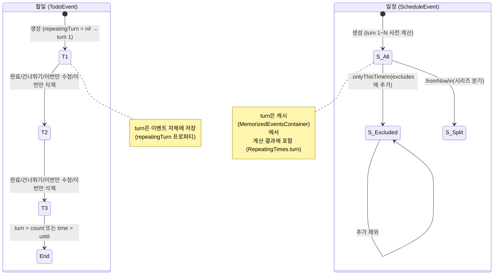
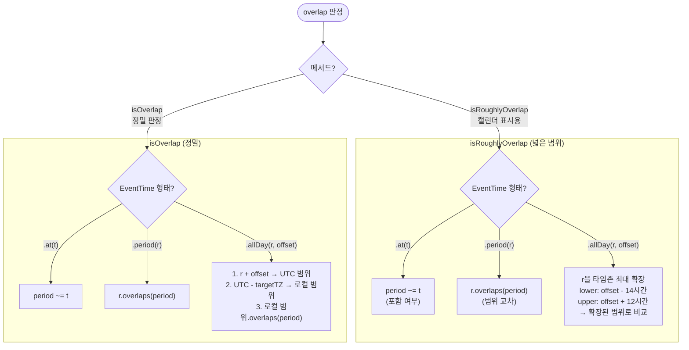

# 반복 이벤트 상세 스펙

> 메인 기획서 [섹션 4](../product-specification.md#4-반복-이벤트) 참조

---

## 상태 전이 다이어그램

### 다음 반복 시간 계산 플로우 (EventRepeatTimeEnumerator)

```mermaid
flowchart TD
    Start([nextEventTime 호출\nfrom: RepeatingTimes]) --> Extract[현재 시간에서\n날짜 컴포넌트 추출]
    Extract --> Switch{반복 옵션 타입?}

    Switch -->|EveryDay| Day["calendar.addDays(interval)"]
    Switch -->|EveryWeek| Week["같은 주 다음 요일 탐색\n→ 없으면 다음 주 첫 요일\n(+interval×7일)"]
    Switch -->|EveryMonth.days| MonthD["같은 달 다음 일자 탐색\n→ 없으면 다음 달(+interval)\n첫 반복 일자"]
    Switch -->|EveryMonth.week| MonthW["같은 주 탐색 → 같은 달\n다음 주 탐색 → 다음 달\n(+interval) 첫 서수+요일"]
    Switch -->|EveryYear| Year["같은 주 → 같은 달\n다음 주 → 다음 달\n→ 다음 해(+interval)"]
    Switch -->|EveryYearSomeDay| YearSD["calendar.addYear(interval)"]
    Switch -->|LunarEveryYear| Lunar["Chinese calendar\naddYear(1)"]

    Day --> Shift
    Week --> Shift
    MonthD --> Shift
    MonthW --> Shift
    Year --> Shift
    YearSD --> Shift
    Lunar --> Shift

    Shift[EventTime.shift(interval)\n형태 유지: at→at, period→period\nallDay→allDay] --> ExcludeCheck{customKey ∈\n제외 목록?}

    ExcludeCheck -->|"예 (제외됨)"| Recurse[재귀 호출:\nnextEventTime\n(turn 유지, 다음 시간)]
    Recurse --> Switch

    ExcludeCheck -->|아니오| EndCheck{종료 조건\n체크}

    EndCheck -->|".until: upperBound > endTime"| Nil1([nil — 종료])
    EndCheck -->|".count: turn+1 > endCount"| Nil2([nil — 종료])
    EndCheck -->|통과| Result(["RepeatingTimes\n(time: next, turn: +1)"])
```

### Turn 생명주기 — 할일 vs 일정



### EventTime overlap 판정 결정 트리



### 종료 조건 판정 플로우

```mermaid
flowchart TD
    Start([다음 반복 시간 계산 완료]) --> Q1{endOption?}

    Q1 -->|nil 무한 반복| Pass([유효 — 반환])

    Q1 -->|".until(endTime)"| Q2{"nextTime.upperBoundWithFixed\n> endTime?"}
    Q2 -->|예| Stop1([nil — 시리즈 종료])
    Q2 -->|아니오| Q3

    Q1 -->|".count(endCount)"| Q3{"next.turn\n> endCount?"}
    Q3 -->|예| Stop2([nil — 횟수 종료])
    Q3 -->|아니오| Pass

    note right of Q2
        allDay 이벤트는
        latestTimeZoneInterval로
        상한 확장 후 비교
    end note
```

---

## 1. 반복 옵션 (6가지)

### 1.1 매일 (EveryDay)

| 파라미터 | 범위 | 설명 |
|---|---|---|
| interval | 1~999 | N일 간격 |

- **타임존**: 불필요 (Gregorian 캘린더 기본)
- **다음 시간 계산**: 현재 날짜 + interval일, 시/분/초 유지
- **예시**: interval=3 → 1/1, 1/4, 1/7, 1/10, ...

---

### 1.2 매주 (EveryWeek)

| 파라미터 | 범위 | 설명 |
|---|---|---|
| interval | 1~5 | N주 간격 |
| dayOfWeeks | [DayOfWeeks] | 반복할 요일 (일=1, 월=2, ..., 토=7) |
| timeZone | TimeZone | **필수** (주 경계 판단) |

- **다음 시간 계산**:
  1. 같은 주 내에서 다음 반복 요일 검색
  2. 없으면 → 다음 주(+interval 주)의 첫 반복 요일
- **헬퍼**: `isEveryWeekDays` — 월~금 전체 선택 시 `true`
- **예시**: interval=2, dayOfWeeks=[월,수,금]
  ```
  1주차: 월, 수, 금
  2주차: (건너뜀)
  3주차: 월, 수, 금
  4주차: (건너뜀)
  ...
  ```

---

### 1.3 매월 (EveryMonth)

| 파라미터 | 범위 | 설명 |
|---|---|---|
| interval | 1~11 | N개월 간격 |
| selection | DateSelector | 일자 또는 요일 서수 |
| timeZone | TimeZone | **필수** (월 경계 판단) |

#### 모드 A: 일자 지정 (`days([Int])`)

- 1~31 중 복수 선택 가능
- **월 끝자리 처리**: 해당 월에 없는 일자는 마지막 날로 내림
  - 예: day=31 + 2월 → 28일 (윤년이면 29일)
  - 예: day=30 + 2월 → 28일
- **다음 시간 계산**:
  1. 같은 달 내 다음 반복 일자 검색
  2. 없으면 → 다음 달(+interval 개월)의 첫 반복 일자

**예시**: interval=1, days=[15, 31]
```
1월: 15일, 31일
2월: 15일, 28일 (31→28 내림)
3월: 15일, 31일
4월: 15일, 30일 (31→30 내림)
```

#### 모드 B: 요일 서수 지정 (`week([WeekOrdinal], [DayOfWeeks])`)

- **WeekOrdinal**: `.seq(1)` ~ `.seq(4)` 또는 `.last`
- 복수 서수 + 복수 요일 조합 가능
- **다음 시간 계산**:
  1. Calendar의 `weekdayOrdinal` 컴포넌트로 판정
  2. 같은 달 내 다음 서수/요일 조합 검색
  3. 없으면 → 다음 달(+interval 개월)의 첫 조합

**예시**: interval=1, ordinals=[.seq(1)], weekDays=[.tuesday]
```
매월 첫째 화요일: 1/7, 2/4, 3/4, 4/1, ...
```

**예시**: interval=1, ordinals=[.last], weekDays=[.friday]
```
매월 마지막 금요일: 1/31, 2/28, 3/28, 4/25, ...
```

---

### 1.4 매년 (EveryYear)

| 파라미터 | 범위 | 설명 |
|---|---|---|
| interval | 1~99 | N년 간격 |
| months | [Months] | 반복할 월 (1월=1, 12월=12) |
| weekOrdinals | [WeekOrdinal] | 월 내 요일 서수 |
| dayOfWeek | [DayOfWeeks] | 반복할 요일 |
| timeZone | TimeZone | **필수** |

- 월 + 서수 + 요일의 3단계 조합
- **다음 시간 계산**: 같은 해 → 다음 해(+interval 년) 순서로 검색
- **예시**: months=[3], weekOrdinals=[.last], dayOfWeek=[.friday], interval=1
  ```
  매년 3월 마지막 금요일
  ```

---

### 1.5 매년 특정일 (EveryYearSomeDay)

| 파라미터 | 범위 | 설명 |
|---|---|---|
| interval | 1~99 | N년 간격 |
| month | Int | 월 (고정) |
| day | Int | 일 (고정) |
| timeZone | TimeZone | **필수** |

- 고정된 월/일 조합
- **다음 시간 계산**: 같은 날짜 + interval년
- **예시**: month=12, day=25, interval=1 → 매년 12월 25일

---

### 1.6 음력 매년 (LunarCalendarEveryYear)

| 파라미터 | 범위 | 설명 |
|---|---|---|
| month | Int | 음력 월 |
| day | Int | 음력 일 |
| timeZone | TimeZone | **필수** |

- **interval**: 항상 1 (설정 불가, 매년 고정)
- **달력**: Chinese Calendar (`Calendar(identifier: .chinese)`) 사용
- 음력 날짜 → 양력 날짜 변환하여 반복 시간 결정
- **예시**: month=1, day=1 → 음력 설날
  ```
  2025: 1/29 (양력)
  2026: 2/17 (양력)
  2027: 2/6 (양력)
  ```

---

## 2. 종료 조건 (RepeatEndOption)

| 조건 | 설명 | 종료 판정 |
|---|---|---|
| 없음 (nil) | 무한 반복 | 수동 삭제 전까지 |
| `.until(TimeInterval)` | 특정 시점까지 | `nextTime.upperBoundWithFixed > endTime` |
| `.count(Int)` | 총 N회 | `turn > endCount` |

- `.until`과 `.count`는 **상호 배타적**
- 하루종일 이벤트의 `.until` 판정: `latestTimeZoneInterval` 사용하여 타임존 확장

### count 동작 예시

```
count=3:
  turn 1 → 1번째 발생 (유효)
  turn 2 → 2번째 발생 (유효)
  turn 3 → 3번째 발생 (유효)
  turn 4 → 종료 (4 > 3)
```

### until 동작 예시

```
until=2026-06-30, 매월 15일 반복:
  1/15 → 유효
  2/15 → 유효
  ...
  6/15 → 유효 (upperBound <= until)
  7/15 → 종료 (7/15 > 6/30)
```

---

## 3. 다음 반복 시간 계산 (EventRepeatTimeEnumerator)

### 입력/출력

| | 타입 | 설명 |
|---|---|---|
| 입력 | `RepeatingTimes` | 현재 EventTime + turn 번호 |
| 출력 | `RepeatingTimes?` | 다음 EventTime + turn+1, 또는 nil (종료) |

### 초기화

```
EventRepeatTimeEnumerator(
  option: EventRepeatingOption,    // 6가지 중 하나
  endOption: RepeatEndOption?,     // 종료 조건
  without: Set<String>             // 제외할 시간의 customKey 집합
)
```

- 반복 옵션에 따라 적절한 Calendar 설정 (Gregorian or Chinese)
- TimeZone을 옵션에서 가져와 Calendar에 적용

### 계산 절차

```
1. 현재 시간(lowerBoundWithFixed)에서 시작
2. 옵션 타입별 다음 날짜 계산
3. 제외 시간 체크:
   if 계산된 시간의 customKey ∈ 제외 목록:
     → 재귀적으로 그 다음 시간 계산 (이 시간을 건너뜀)
4. turn 증가: turn + 1
5. 종료 조건 체크:
   if .until: nextTime.upperBoundWithFixed > endTime → nil
   if .count: newTurn > endCount → nil
6. → RepeatingTimes(time: nextTime, turn: newTurn)
```

### 제외 시간 재귀 처리

`.onlyThisTime`으로 제외된 시간은 자동으로 건너뜀:

```
매주 월요일, 3/17 제외됨:
  현재: 3/10 (turn=2)
  → 계산: 3/17 → customKey가 제외 목록에 있음
  → 재귀: 3/24 → 제외 아님 → turn=3
  결과: 3/24 (turn=3)
```

여러 연속 시간이 제외된 경우에도 재귀적으로 유효한 시간까지 탐색.

### EventTime 시프트

다음 시간 계산 시 원본 EventTime의 **형태를 유지**:
- `.at(t)` → `.at(newT)`
- `.period(range)` → `.period(newRange)` (duration 유지)
- `.allDay(range, offset)` → `.allDay(newRange, offset)` (offset 유지)

---

## 4. EventTime 겹침 판정

### isRoughlyOverlap (대략적 판정)

캘린더 표시용으로 사용. 하루종일 이벤트의 타임존을 **최대한 넓게** 잡음.

| EventTime | 판정 방식 |
|---|---|
| `.at(t)` | `period ~= t` (포함 여부) |
| `.period(r)` | `r.overlaps(period)` (범위 교차) |
| `.allDay(r, offset)` | 범위를 타임존 전 세계 커버로 확장 후 비교 |

**하루종일 확장 범위**:
- 하한: `offset - 14시간` (UTC+14 대응, 키리바시 등)
- 상한: `offset + 12시간` (UTC-12 대응, 베이커 섬 등)

### isOverlap (정밀 판정)

특정 타임존 기준으로 정확하게 판정.

| EventTime | 판정 방식 |
|---|---|
| `.at(t)` | `period ~= t` |
| `.period(r)` | `r.overlaps(period)` |
| `.allDay(r, offset)` | `r`을 저장된 offset → 대상 타임존으로 시프트 후 비교 |

**시프트 공식**:
```
UTC 범위 = r.lower + offset ..< r.upper + offset
대상 TZ 범위 = UTC.lower - targetOffset ..< UTC.upper - targetOffset
```

### EventRepeating.isOverlap

반복 시리즈 전체가 기간과 겹치는지 판정:
- 반복 시작 시간 ~ 반복 종료 시간 범위로 겹침 체크
- 종료 시간 없음(무한) → 시작 시간 < period.upperBound 이면 겹침

---

## 5. EventTime.customKey (고유 키)

반복에서 특정 회차를 식별하는 문자열 키:

| EventTime | customKey 형식 | 예시 |
|---|---|---|
| `.at(1710000000)` | `"1710000000"` | 시점의 정수부 |
| `.period(100..<200)` | `"100..<200"` | 범위의 정수부 |
| `.allDay(100..<200, +32400)` | `"100..<200+32400"` | 범위 + 오프셋 |

- `repeatingTimeToExcludes: Set<String>`에 저장
- `EventRepeatTimeEnumerator`에서 제외 체크에 사용

---

## 6. Turn 규칙 — 전체 생명주기

### 기본 규칙

- turn은 **1부터 시작** (첫 번째 발생 = turn 1)
- `TodoEvent.repeatingTurn`: nil은 turn 1로 취급 (`origin.repeatingTurn ?? 1`)
- `ScheduleEvent`: `RepeatingTimes(time:, turn: 1)`로 첫 번째 표현
- 다음 반복 계산 시 turn은 항상 `+1`

### Turn 변경 시점

| 이벤트 타입 | 액션 | Turn 변화 |
|---|---|---|
| 할일 | 완료 (completeTodo) | 다음 할일의 turn = 현재 + 1 |
| 할일 | 건너뛰기 (.next) | turn + 1 |
| 할일 | 이번만 삭제 | 다음 회차로 전진, turn + 1 |
| 할일 | 이번만 수정 | 원본 다음으로 전진, turn + 1 |
| 일정 | 시간 제외 (exclude) | turn 변화 없음 (제외 목록으로 관리) |

### Count 종료와의 상호작용

건너뛰기(skip)도 turn을 소비:

```
count=5 반복 할일:
  turn 1 → 완료 (실행)
  turn 2 → 건너뛰기 (미실행, turn 소비)
  turn 3 → 완료 (실행)
  turn 4 → 건너뛰기 (미실행, turn 소비)
  turn 5 → 완료 (실행)
  turn 6 → 종료
  결과: 실제 실행 3회, 건너뜀 2회, 총 5회 소비
```

### 일정과 할일의 Turn 관리 차이

| | 할일 (TodoEvent) | 일정 (ScheduleEvent) |
|---|---|---|
| Turn 저장 | `repeatingTurn` 프로퍼티 | `RepeatingTimes.turn` (계산 결과에 포함) |
| Turn 추적 | 이벤트 자체에 현재 turn 저장 | 캐시(MemorizedEventsContainer)에서 계산 |
| 이번만 제외 | turn 전진 | `repeatingTimeToExcludes`에 추가 |
| Count 종료 | turn > endCount | turn > endCount (계산 시 체크) |

---

## 7. 수정 범위 비교 — 할일 vs 일정

| 범위 | 할일 (TodoEvent) | 일정 (ScheduleEvent) |
|---|---|---|
| 전체 (.all) | 원본 직접 수정 | 원본 직접 수정 |
| 이번만 (.onlyThisTime) | 새 할일 생성 + 원본 다음 turn으로 전진 | 새 이벤트 생성 + 원본 excludes에 추가 |
| 이후 (.fromNow) | **없음** | 원본 until 종료 + 새 시리즈 생성 |

**핵심 차이**: 할일은 "단일 인스턴스"를 추적(현재 turn)하므로 전진으로 처리. 일정은 "전체 시리즈"를 관리하므로 제외 목록으로 처리.

---

## 8. 엣지 케이스

### 8.1 매월 31일 반복 — 월 끝자리 연속 처리

```
설정: EveryMonth(interval=1, days=[31])

1월: 31일 ✓
2월: 31일 → 존재하지 않음 → Calendar API가 nil 반환
     → findEventDateOnSameMonth에서 day != 31 검증 실패 → 건너뜀
     → findEventDateOnNextMonth: 3/1에서 +30일 = 3/31
3월: 31일 ✓
4월: 31일 → 존재하지 않음 → 건너뜀 → 5/31
5월: 31일 ✓
...

실제 동작: 31일이 없는 달(2, 4, 6, 9, 11월)은 자동으로 건너뜀.
          내림(28일/30일로 대체)이 아니라 해당 달을 skip.

검증 로직: compareIsNotFloored
  - Calendar가 반환한 날짜의 day가 요청한 day와 일치하는지 확인
  - 일치하지 않으면 nil → 다음 달로 넘어감
```

### 8.2 윤년과 EveryYearSomeDay

```
설정: EveryYearSomeDay(month=2, day=29, interval=1)

2024: 2/29 ✓ (윤년)
2025: Calendar.addYear(1) → 2/28 (Calendar API 자동 조정)
2026: 2/28
2027: 2/28
2028: 2/29 ✓ (윤년)

주의: 한번 2/28로 조정되면, 이후 계산은 2/28 기준으로 +1년.
     즉, 2024/2/29 → 2025/2/28 → 2026/2/28 → ...
     원래 의도한 "매년 2/29"와 점진적으로 달라질 수 있음.
     (Calendar API의 date(byAdding:) 동작에 의존)
```

### 8.3 음력 윤달 처리

```
설정: LunarCalendarEveryYear(month=4, day=15)

Chinese Calendar를 사용하여 음력 → 양력 변환.
윤달(leapMonth)이 있는 해에는 Calendar API가 자동으로
윤달을 건너뛰고 정상 월을 반환.

음력 4/15의 양력 변환:
  2025: 양력 5/12
  2026: 양력 5/1
  2027: 양력 5/21
  → 매년 양력 날짜가 달라짐 (음력 기반이므로 정상)
```

### 8.4 DST(서머타임) 전환 시 시간 유지

```
설정: EveryDay(interval=1), time = .at(2024-03-09 14:00 EST)
미국 동부: 3/10 02:00 → 03:00 (DST 시작)

동작:
  calendar.addDays(1, from: 3/9 14:00 EST)
  → 3/10 14:00 EDT (Calendar API가 DST 자동 조정)
  → TimeInterval은 실제로 23시간 후 (1시간 점프)

EventTime.shift(interval):
  shift 값은 Date 기준이 아닌 TimeInterval 차이
  → 3/9 14:00의 epoch + (3/10 14:00의 epoch - 3/9 14:00의 epoch)
  → 정확히 3/10 14:00 epoch

결론: Calendar API 사용으로 DST를 자동 처리.
     시계 시간(14:00)은 유지됨.
```

### 8.5 매주 반복 + interval > 1 + 복수 요일

```
설정: EveryWeek(interval=2, dayOfWeeks=[월, 수, 금])
시작: 1주차 월요일

1주차: 월 ✓, 수 ✓, 금 ✓
2주차: (건너뜀)
3주차: 월 ✓, 수 ✓, 금 ✓
4주차: (건너뜀)

같은 주 내에서는 다음 요일로 이동 (interval 무시):
  월 → 수: 같은 주이므로 바로 다음 요일
  금 → 다음 반복 주 월: 금 → (+2주×7일) → 다음 반복 주 월요일

알고리즘:
  1. findEventDateOnSameWeek: 현재 주에서 다음 요일 찾기
  2. 없으면: 다음 주 첫 요일 + interval×7일
```

### 8.6 연속 제외로 인한 재귀 탐색

```
설정: EveryWeek(interval=1, dayOfWeeks=[월])
제외: 3/10, 3/17, 3/24 (3주 연속)
현재: 3/3 (turn=1)

nextEventTime(from: 3/3):
  → 계산: 3/10 → customKey ∈ 제외 → 재귀
  → 계산: 3/17 → customKey ∈ 제외 → 재귀
  → 계산: 3/24 → customKey ∈ 제외 → 재귀
  → 계산: 3/31 → customKey ∉ 제외 → 반환

결과: RepeatingTimes(time: 3/31, turn=2)

주의: 재귀 시 turn은 제외된 시간에서 증가하지 않음.
     제외된 시간은 "없는 것"으로 취급.
     단, count 종료 판정은 최종 반환 시점의 turn으로 체크.
```

### 8.7 allDay 이벤트의 타임존 교차 overlap

```
설정: .allDay(3/15 00:00..<3/16 00:00, secondsFromGMT: +32400) (KST, UTC+9)

isRoughlyOverlap (캘린더 표시용):
  확장 범위: lower = 3/15 + 9시간 - 14시간 = 3/14 19:00 UTC
             upper = 3/16 + 9시간 + 12시간 = 3/16 21:00 UTC
  → 매우 넓은 범위로 비교 (거의 2.5일)
  → 다른 타임존의 캘린더에서도 표시 보장

isOverlap(in: US/Eastern, UTC-5):
  UTC 범위: 3/15 + 9h = 3/15 09:00..<3/16 09:00 UTC
  EST 범위: 3/15 09:00 - (-5h) = 3/15 14:00..<3/16 14:00 EST
  → 미국 동부 기준 3/15 오후~3/16 오후 범위로 판정

의미: 한국에서 "3/15 하루종일"로 설정한 이벤트가
     미국 동부에서는 3/15 14:00~3/16 14:00으로 표시.
```

### 8.8 EveryMonth.week에서 .last 서수의 월 경계

```
설정: EveryMonth(interval=1, ordinals=[.last], weekDays=[.friday])

2월 (28일): 마지막 금요일 = 4주차 금요일 (2/28 또는 이전)
3월 (31일): 마지막 금요일 = 5주차 금요일일 수도 있음

.last 서수 처리:
  WeekOrdinal.weekOrdinal(calendar, in: date)
  → .last는 calendar.lastOfSameWeekDay(_:)로 계산
  → 해당 월의 마지막 주 해당 요일을 반환
  → 월마다 4주차 또는 5주차가 될 수 있음

주의: .seq(5)와 .last는 다름.
     .seq(5)는 정확히 5주차 (5주차가 없으면 건너뜀).
     .last는 항상 마지막 주 (4주차든 5주차든).
```

---

## 9. 크로스 시나리오 워크스루

### 시나리오 A: 반복 할일의 전체 생명주기

> 관련 스펙: [할일](todo-event.md), [미완료 할일](uncompleted-todos.md)

```
=== 1. 생성 ===
makeTodoEvent("운동", time=3/3 07:00, repeating=EveryWeek(월), count=5)
→ TodoEvent(uuid=A, name="운동", time=3/3 07:00, turn=nil, repeating={매주 월, count=5})

SharedDataStore:
  todos[A] = TodoEvent(A)
  uncompletedTodos: [] (3/3 07:00 > now=3/1이면 미래 → 미완료 아님)

=== 2. 시간 경과 후 미완료 진입 ===
현재: 3/4 10:00 (3/3 07:00 이미 과거)
refreshUncompletedTodos 호출

SharedDataStore:
  uncompletedTodos: [TodoEvent(A)] (3/3 07:00 <= 3/4 10:00 → 미완료)

=== 3. 1회차 완료 ===
completeTodo(A)

Repository:
  1. loadTodoEvent(A) → turn=nil (=1)
  2. removeTodo(A) from DB
  3. DoneTodoEvent(uuid=D1, originId=A, doneTime=3/4 10:00)
  4. nextEventTime(from: turn=1) → turn=2, time=3/10 07:00
  5. 원본 A: time=3/10, turn=2 → DB 저장

SharedDataStore:
  todos[A] = TodoEvent(A, time=3/10, turn=2) ← 다음 회차로 갱신
  uncompletedTodos: [] (3/10 > 3/4 → 미래)

=== 4. 건너뛰기 (2회차) ===
현재: 3/11 (3/10 경과, A가 미완료 진입)
skipRepeatingTodo(A, .next)

Repository:
  nextEventTime(from: turn=2) → turn=3, time=3/17 07:00
  원본 A: time=3/17, turn=3

SharedDataStore:
  todos[A] = TodoEvent(A, time=3/17, turn=3)
  uncompletedTodos: [] (3/17 > 3/11 → 미래)

count 소비: turn 1(완료) + turn 2(건너뜀) = 2회 소비, 3회 남음

=== 5. 이번만 수정 (3회차) ===
현재: 3/17
updateTodoEvent(A, params={name:"수영"}, scope=.onlyThisTime)

Repository:
  1. replaceRepeatingTodo(A, newParams={name:"수영", time=3/17})
  2. removeTodo(A)
  3. makeTodoEvent(newParams) → TodoEvent(uuid=B, name="수영", time=3/17, 반복 없음)
  4. nextEventTime(from: turn=3) → turn=4, time=3/24
  5. 원본 A: time=3/24, turn=4

SharedDataStore:
  todos[A] = TodoEvent(A, name="운동", time=3/24, turn=4)
  todos[B] = TodoEvent(B, name="수영", time=3/17, 반복 없음)

=== 6. 4회차 완료 ===
completeTodo(A) (turn=4)

Repository:
  nextEventTime(from: turn=4) → turn=5, time=3/31

SharedDataStore:
  todos[A] = TodoEvent(A, time=3/31, turn=5)

=== 7. 5회차 완료 → 시리즈 종료 ===
completeTodo(A) (turn=5)

Repository:
  nextEventTime(from: turn=5) → turn=6 > count=5 → nil (종료)
  DoneTodoEvent 생성
  상세 데이터 삭제 (다음 회차 없으므로)

SharedDataStore:
  todos[A] = nil (제거)
  uncompletedTodos: A 제거

최종 결과:
  총 5회 소비 (turn 1~5)
  실제 실행: 3회 (turn 1 완료, turn 4 완료, turn 5 완료)
  건너뜀: 1회 (turn 2)
  이번만 수정: 1회 (turn 3 → 별도 할일 B로 분리)
```

### 시나리오 B: 반복 일정의 수정→분기→삭제

> 관련 스펙: [일정](schedule-event.md)

```
=== 1. 생성 ===
makeScheduleEvent("주간 회의", time=3/3 10:00, repeating=EveryWeek(월))
→ ScheduleEvent(uuid=A, name="주간 회의", time=3/3 10:00, excludes={})

MemorizedEventsContainer:
  caches[A] = {event: A, calculatedRanges: []}  ← 미계산 상태

=== 2. 캘린더에서 3월 조회 ===
scheduleEvents(in: 3/1..<4/1)

Cache:
  events(in: 3/1..<4/1) → Enumerator 실행
  → [3/3, 3/10, 3/17, 3/24, 3/31] 계산
  caches[A].calculatedRanges += [(3/1..<4/1, [turn1~5])]

=== 3. .onlyThisTime 수정 (3/17만 14:00으로) ===
updateScheduleEvent(A, params={time: 3/17 14:00}, scope=.onlyThisTime(3/17 10:00))

Repository:
  1. 새 이벤트 B 생성 (uuid=B, time=3/17 14:00, 반복 없음)
  2. 원본 A: excludes += {"3/17 10:00 customKey"}

MemorizedEventsContainer:
  invalidate(A) → caches[A] 전체 삭제 (3월 캐시 포함)
  append(A) → 새 캐시 항목 (미계산)
  append(B) → 새 캐시 항목 (단독, 반복 없음)

다시 3월 조회 시:
  A: [3/3, 3/10, ~~3/17~~, 3/24, 3/31] (3/17 제외)
  B: [3/17 14:00] (단독)

=== 4. .fromNow 분기 (4/7부터 시간 변경) ===
updateScheduleEvent(A, params={time: 4/7 14:00, repeating=EveryWeek(월)},
                    scope=.fromNow(4/7))

Repository:
  1. 원본 A: repeating.endOption = .until(4/6 23:59:59)
  2. 새 이벤트 C 생성 (uuid=C, time=4/7 14:00, repeating=EveryWeek(월))

MemorizedEventsContainer:
  invalidate(A) → 모든 캐시 삭제
  append(A_ended) → 종료된 원본
  append(C) → 새 시리즈

3월 조회:
  A: [3/3, 3/10, ~~3/17~~, 3/24, 3/31] (3/17 제외, 3/31까지)
  B: [3/17 14:00]

4월 조회:
  A: [] (4/6 이전에 더 이상 반복 없음 — 3/31이 마지막)
  C: [4/7, 4/14, 4/21, 4/28]

=== 5. 새 시리즈에서 단일 회차 삭제 ===
removeScheduleEvent(C, onlyThisTime: 4/14 14:00)

Repository:
  C: excludes += {"4/14 14:00 customKey"}

MemorizedEventsContainer:
  replace(C, updated_C) → 캐시 무효화 + 재추가

4월 조회:
  C: [4/7, ~~4/14~~, 4/21, 4/28]

=== 6. 원본 시리즈 전체 삭제 ===
removeScheduleEvent(A, onlyThisTime: nil)

Repository:
  A 완전 삭제 (DB + 상세 데이터)

MemorizedEventsContainer:
  replace(A, nil) → caches[A] 제거

최종 상태:
  B: 3/17 14:00 (단독 이벤트)
  C: 4/7~, 매주 월 14:00 (4/14 제외)
  원본 A: 삭제됨
```
