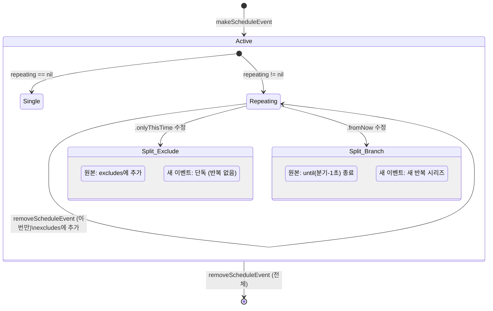
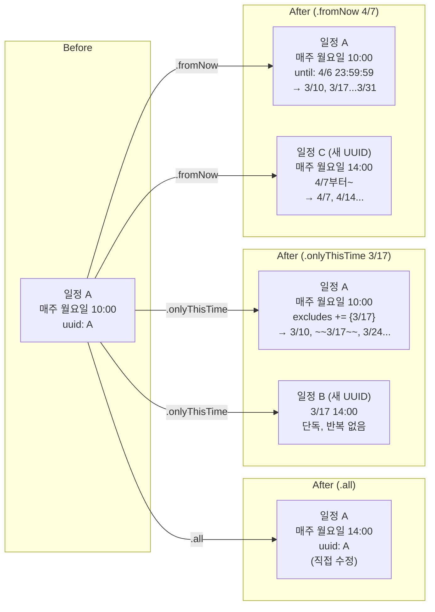
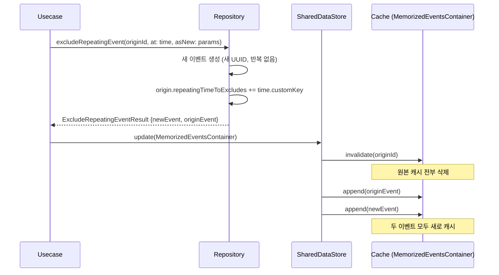
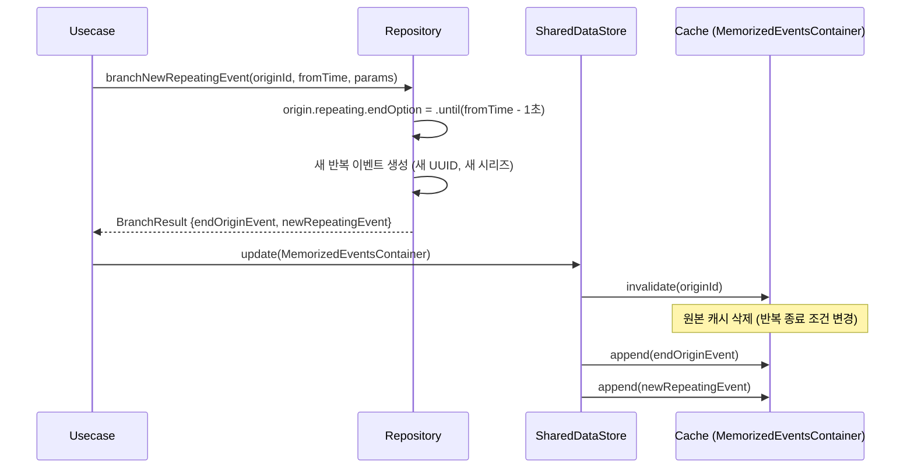
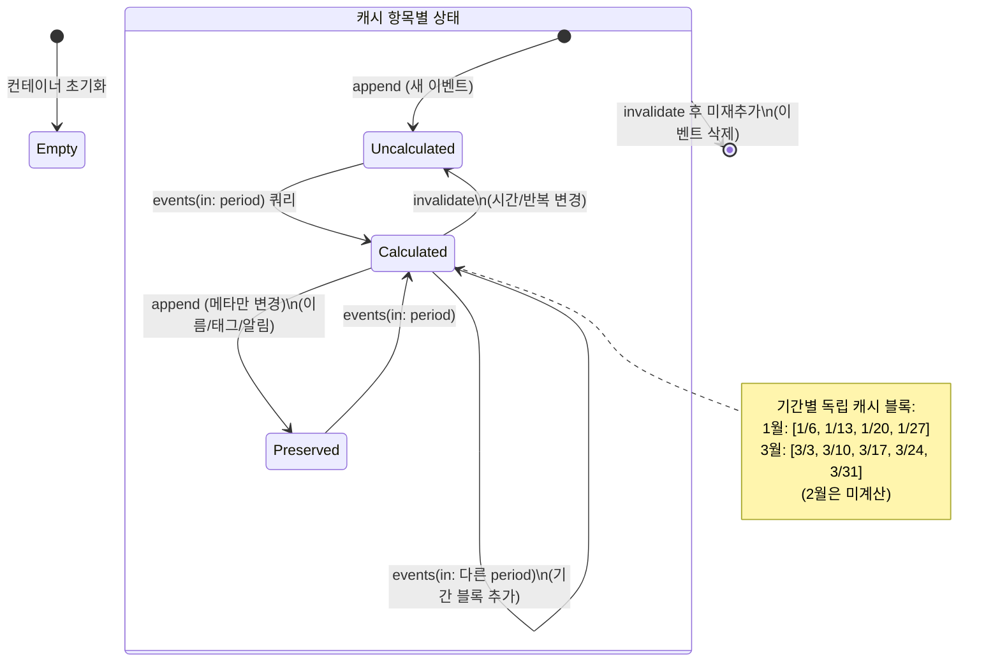
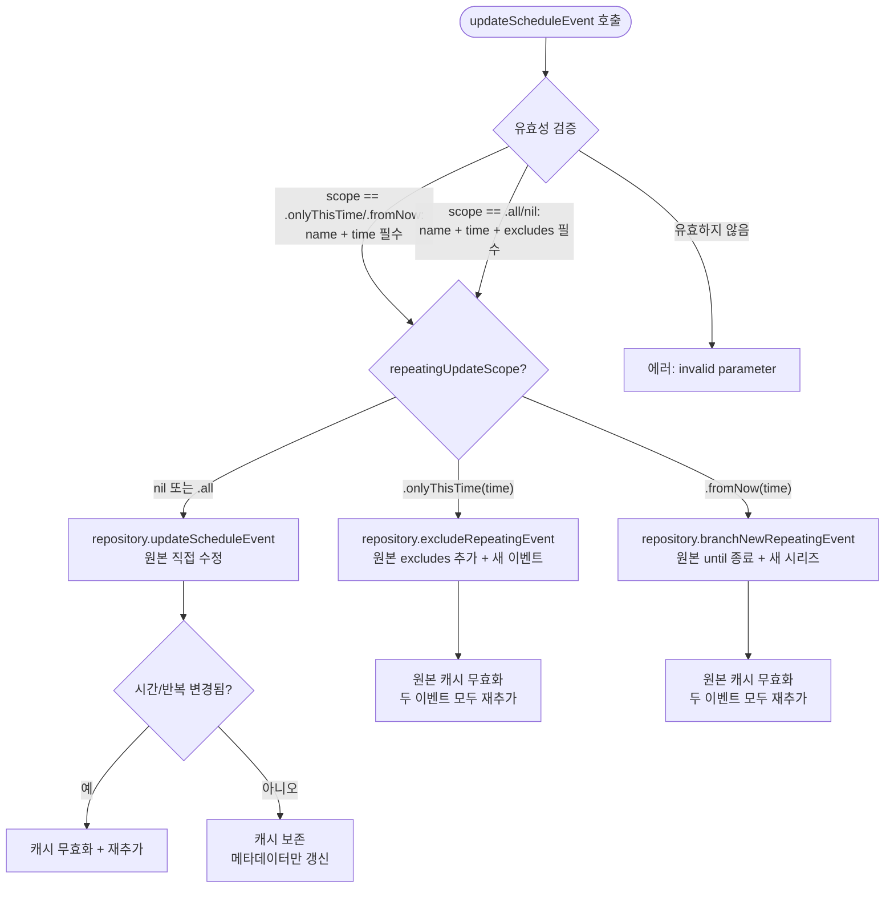
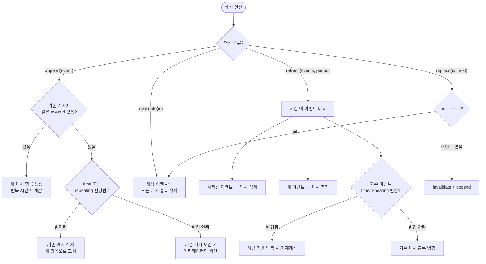

# 일정 (ScheduleEvent) 상세 스펙

> 메인 기획서 [섹션 3.2](../product-specification.md#32-일정-scheduleevent) 참조

---

## 상태 전이 다이어그램

### 일정 전체 생명주기



### 수정 범위별 데이터 변환 플로우



### 수정 시퀀스 다이어그램 (.onlyThisTime)



### 수정 시퀀스 다이어그램 (.fromNow)



### 캐시(MemorizedEventsContainer) 생명주기



---

## 1. 데이터 구조

| 속성 | 타입 | 설명 | 기본값 |
|---|---|---|---|
| uuid | String | 고유 식별자 | 자동 생성 |
| name | String | 이벤트 이름 | (필수) |
| time | EventTime | 시간 | (필수) |
| eventTagId | EventTagId? | 태그/색상 | nil |
| repeating | EventRepeating? | 반복 설정 | nil |
| showTurn | Bool | 회차 표시 여부 | false |
| notificationOptions | [EventNotificationTimeOption] | 알림 시간 목록 | [] |
| nextRepeatingTimes | [RepeatingTimes] | 사전 계산된 반복 시간들 | [] |
| repeatingTimeToExcludes | Set\<String\> | 제외된 반복 시간의 customKey 집합 | {} |

**할일과의 핵심 차이점**:
- `time`이 **필수** (할일은 선택)
- 완료 개념 **없음** (삭제만 가능)
- 반복 시간을 `nextRepeatingTimes`로 **사전 계산**
- 특정 회차 제외를 `repeatingTimeToExcludes`로 관리

---

## 2. 일정 생성

### 유효성 검증

| 조건 | 결과 |
|---|---|
| `name`이 nil이거나 빈 문자열 | 에러 |
| `time`이 nil | 에러 |
| `name`이 비어있지 않고 `time`이 존재 | 유효 |

- 에러 메시지: `"invalid parameter for make Schedule Event"`
- `eventTagId`, `repeating`, `showTurn`, `notificationOptions`는 모두 선택

### 생성 결과

1. UUID 자동 생성
2. `showTurn` 미지정 시 `false`
3. `notificationOptions` 미지정 시 빈 배열
4. `repeatingTimeToExcludes` 항상 빈 Set으로 초기화
5. MemorizedEventsContainer에 추가 (캐시 시스템)

---

## 3. 일정 수정 — 범위별 상세

### 유효성 검증 (수정 범위에 따라 다름)

| 수정 범위 | 유효성 조건 |
|---|---|
| `.all` (기본) | name 비어있지 않음 + time 존재 + **repeatingTimeToExcludes가 nil이 아닐 것** |
| `.onlyThisTime(EventTime)` | name 비어있지 않음 + time 존재 (생성 검증과 동일) |
| `.fromNow(EventTime)` | name 비어있지 않음 + time 존재 (생성 검증과 동일) |

- `.all` 범위에서 `repeatingTimeToExcludes`가 nil이면 유효하지 않음 (빈 Set은 허용)
- 에러 메시지: `"invalid parameter for update Schedule event"`

---

### 3.1 `.all` — 전체 시리즈 수정

모든 반복 인스턴스에 일괄 적용.

**데이터 변환**:
- 원본 이벤트의 모든 필드를 새 값으로 대체
- `repeatingTimeToExcludes`는 파라미터에서 전달받은 값으로 교체

**캐시 영향**:
| 변경 내용 | 캐시 | 이유 |
|---|---|---|
| 이름, 태그, 알림만 변경 | **유지** | 시간 계산에 영향 없음 |
| 시간(time) 변경 | **무효화** | 반복 기점이 바뀜 |
| 반복 옵션 변경 | **무효화** | 패턴이 바뀜 |

**예시**:
```
Before: "주간 회의" 매주 월요일 10:00 (uuid: A)
Action: 시간을 14:00으로 변경 (.all)
After:  "주간 회의" 매주 월요일 14:00 (uuid: A, 캐시 무효화 → 재계산)
```

---

### 3.2 `.onlyThisTime(EventTime)` — 이번만 수정

해당 회차만 분리하여 새 이벤트로 만들고, 원본 시리즈에서는 제외.

**데이터 변환**:
1. **원본 이벤트**: `repeatingTimeToExcludes`에 해당 시간의 `customKey` 추가 (union 연산, 기존 제외 유지)
2. **새 이벤트**: 수정 파라미터로 새 이벤트 생성 (새 UUID, 반복 없음, 제외 목록 비어있음)

**결과**: `ExcludeRepeatingEventResult`
| 필드 | 설명 |
|---|---|
| newEvent | 수정된 내용의 새 단독 이벤트 |
| originEvent | 해당 시간이 제외된 원본 반복 이벤트 |

**캐시 영향**: 원본 캐시 무효화 → 두 이벤트 모두 새로 캐시

**예시**:
```
Before: "주간 회의" 매주 월요일 10:00 (uuid: A)
Action: 3/17(월)만 14:00으로 변경 (.onlyThisTime)
After:
  uuid: A — "주간 회의" 매주 월요일 10:00
            excludes += {"3/17 customKey"}
            → 3/10, [3/17 생략], 3/24, 3/31...
  uuid: B — "주간 회의" 3/17 14:00 (단독, 반복 없음)
```

---

### 3.3 `.fromNow(EventTime)` — 이후 새 시리즈로 분기

분기 시점을 기준으로 원본 시리즈를 끊고, 새 시리즈를 시작.

**데이터 변환**:
1. **원본 이벤트**: 반복 종료 조건을 `.until(분기시점 - 1초)`로 변경
2. **새 이벤트**: 수정 파라미터로 새 반복 이벤트 생성 (새 UUID, 새 반복 시리즈)

**결과**: `BranchNewRepeatingScheduleFromOriginResult`
| 필드 | 설명 |
|---|---|
| reppatingEndOriginEvent | 분기 시점 직전에서 끝나는 원본 이벤트 |
| newRepeatingEvent | 분기 시점부터 시작하는 새 반복 이벤트 |

**분기 시점 정밀도**: `time.lowerBoundWithFixed - 1초`
- 1초를 빼서 원본의 마지막 회차와 새 시리즈의 첫 회차가 겹치지 않도록 보장

**캐시 영향**: 원본 캐시 무효화 → 두 이벤트 모두 새로 캐시

**예시**:
```
Before: "주간 회의" 매주 월요일 10:00 (uuid: A)
Action: 4/7(월)부터 14:00으로 변경 (.fromNow)
After:
  uuid: A — "주간 회의" 매주 월요일 10:00
            repeatingEndOption = .until(4/6 23:59:59)
            → 3/10, 3/17, 3/24, 3/31 (여기서 끝)
  uuid: C — "주간 회의" 매주 월요일 14:00 (4/7부터~, 새 시리즈)
            → 4/7, 4/14, 4/21, ...
```

---

## 4. 일정 삭제

| onlyThisTime | 동작 | 결과 |
|---|---|---|
| nil | 전체 삭제 | 이벤트 + 상세 데이터 완전 제거 |
| EventTime 지정 | 해당 시간만 제외 | `repeatingTimeToExcludes`에 추가, 이벤트 유지 |

### 전체 삭제 (onlyThisTime = nil)
- 이벤트 DB에서 삭제
- 연관 이벤트 상세 데이터(장소, URL, 메모)도 삭제
- MemorizedEventsContainer에서 제거

### 단일 회차 삭제 (onlyThisTime = EventTime)
- 이벤트는 삭제하지 **않음**
- 해당 시간의 `customKey`를 `repeatingTimeToExcludes`에 추가
- MemorizedEventsContainer에서 교체 (새 제외 반영)

---

## 5. 반복 시간 결정 로직

일정의 표시용 반복 시간 목록:

```
if 원본 time의 customKey가 제외 목록에 있으면:
  → nextRepeatingTimes만 반환 (원본 시간 생략)
else:
  → [원본(turn=1)] + nextRepeatingTimes 반환
```

- `.onlyThisTime` 수정으로 원본 시간이 제외되면, 첫 번째 표시 시간이 바뀜
- `nextRepeatingTimes`는 `EventRepeatTimeEnumerator`로 사전 계산된 미래 반복 시간

---

## 6. 캐시 시스템 (MemorizedEventsContainer)

반복 일정의 반복 인스턴스를 기간별로 캐싱하여 계산 비용을 줄이는 불변 컨테이너.

### 캐시 구조

| 레벨 | 키 | 값 |
|---|---|---|
| 이벤트별 | uuid | CacheItem (이벤트 + 기간별 계산 결과) |
| 기간별 | Range\<TimeInterval\> | [RepeatingTimes] (해당 기간의 반복 인스턴스) |

하나의 이벤트에 **여러 기간 블록**을 독립적으로 캐시할 수 있음:
```
이벤트 A 캐시:
  ├── 1월: [1/6, 1/13, 1/20, 1/27]
  ├── (2월: 미계산)
  └── 3월: [3/3, 3/10, 3/17, 3/24, 3/31]
```

### 주요 연산

**`events(in: Range)`** — 기간 쿼리:
1. 기간과 겹치는 이벤트만 필터
2. 이미 캐시된 기간이면 캐시에서 반환
3. 미캐시 기간이면 `EventRepeatTimeEnumerator`로 계산 → 캐시 저장
4. 분리된 캐시 블록 간 병합 처리

**`append(event)`** — 이벤트 추가/갱신:
- 시간/반복 옵션이 변경되지 않았으면 → 기존 캐시 **보존**
- 시간/반복 옵션이 변경되었으면 → 캐시 **무효화** (다음 쿼리 시 재계산)
- 이름/태그 등 다른 필드만 변경이면 → 캐시 유지

**`invalidate(eventId)`** — 이벤트 캐시 제거:
- 해당 이벤트의 모든 캐시 블록 삭제

**`replace(eventId, ifExists:)`** — 조건부 교체:
- 이벤트가 있으면 교체, nil이면 제거

**`refresh(events, in: Range)`** — 기간 전체 갱신:
- 기존 캐시와 새 이벤트 목록 비교
- 사라진 이벤트 제거, 새 이벤트 추가, 유지 이벤트 갱신
- 해당 기간에 대해 반복 시간 재계산

---

## 7. 일정 조회

| 조회 유형 | 데이터 소스 | 필터 |
|---|---|---|
| 기간별 일정 | MemorizedEventsContainer | 기간 겹침 (캐시 경유) |
| 단건 조회 | MemorizedEventsContainer | UUID 매칭 |

### 기간별 일정 로딩 (refreshScheduleEvents(in:))

1. Repository에서 기간 내 일정 로드
2. MemorizedEventsContainer를 `refresh(events, in: period)`로 갱신
3. 기존 기간 외 캐시는 보존

### 로딩 상태 이벤트

| 이벤트 | 발생 시점 |
|---|---|
| `refreshingSchedule(Bool)` | 기간별 일정 로딩 시작/완료 |

---

## 8. SharedDataStore 키

| 키 | 타입 | 갱신 시점 |
|---|---|---|
| `schedules` | MemorizedEventsContainer\<ScheduleEvent\> | 생성, 수정, 삭제, 로딩 |

모든 수정은 **불변 컨테이너 교체** 패턴:
```
sharedDataStore.update(MemorizedEventsContainer.self, key) { container in
    (container ?? .init()).append(newEvent)  // 새 컨테이너 반환
}
```

---

## 9. 결정 트리

### 수정 범위 선택 결정 트리



### 캐시 무효화 결정 트리



---

## 10. 엣지 케이스

### 10.1 제외 목록이 모든 반복을 커버할 때

```
상황: 매주 월요일 반복 (1/6, 1/13, 1/20, 1/27)
동작: .onlyThisTime으로 4번 모두 제외

결과:
  excludes = {"1/6 key", "1/13 key", "1/20 key", "1/27 key"}
  → 1월 쿼리 시 표시할 반복 인스턴스 없음
  → 원본 이벤트는 DB에 여전히 존재
  → 2월 이후 반복은 정상 표시 (excludes에 없으므로)

의미: 제외는 "해당 시간만 숨김"이지 삭제가 아님.
      반복 자체는 유효하게 남아있음.
```

### 10.2 .fromNow 분기 시점이 원본 시작과 같을 때

```
상황: "주간 회의" 매주 월요일, 첫 번째 시간 = 3/3
동작: .fromNow(3/3) — 첫 번째 회차부터 분기

결과:
  원본: until = 3/2 23:59:59 → 3/3 이전에 유효한 반복 없음 → 사실상 빈 시리즈
  새 이벤트: 3/3부터 새 시리즈

의미: 첫 회차에서 .fromNow를 쓰면 원본은 빈 껍데기가 됨.
      UI에서 이 케이스를 방지할 수도 있으나, 로직상 에러는 아님.
```

### 10.3 캐시 기간 블록 병합 경계

```
상황:
  1차 쿼리: events(in: 1/1..<2/1) → 1월 캐시 블록 생성
  2차 쿼리: events(in: 2/1..<3/1) → 2월 캐시 블록 생성
  3차 쿼리: events(in: 1/15..<2/15) → 기존 블록과 겹침

결과:
  MemorizedEventsContainer는 겹치는 블록을 발견하면
  기존 캐시에서 해당 범위의 계산 결과를 재사용.
  1/15~2/1은 1월 블록에서, 2/1~2/15는 2월 블록에서 가져옴.
  미계산 구간(gap)이 있으면 그 부분만 Enumerator로 계산.
```

### 10.4 .onlyThisTime 수정 후 같은 시간에 다시 생성

```
상황:
  매주 월요일, 3/17을 .onlyThisTime으로 수정
  → 원본 excludes += {"3/17 key"}, 새 이벤트 B 생성

이후 동작: 새 이벤트 B를 삭제

결과:
  이벤트 B 완전 삭제
  원본의 excludes에는 "3/17 key"가 여전히 남아있음
  → 3/17은 영구적으로 표시되지 않음 (원본에서 제외 + 대체 이벤트도 없음)

복구 방법: 원본을 .all로 수정하면서 excludes에서 "3/17 key" 제거
```

### 10.5 반복 시간 결정에서 원본 시간이 제외된 경우

```
상황: 매주 월요일 10:00 (원본 time = 3/3 10:00)
동작: .onlyThisTime(3/3) → 원본의 첫 번째 시간이 제외됨

반복 시간 결정 로직:
  if origin.time.customKey ∈ excludes:
    → nextRepeatingTimes만 반환 (3/10, 3/17, 3/24, ...)
  else:
    → [origin(turn=1)] + nextRepeatingTimes

결과: 원본 시간(3/3)이 캘린더에 표시되지 않음.
      시리즈의 실질적 첫 표시는 3/10부터.
```

### 10.6 .all 수정 시 repeatingTimeToExcludes 필수인 이유

```
상황: .all 수정 시 excludes를 전달하지 않음

검증: isValidForUpdate에서 repeatingTimeToExcludes == nil → false → 에러

이유:
  .all 수정은 전체 시리즈를 대체하므로,
  기존 제외 목록을 유지할지 초기화할지를 명시적으로 결정해야 함.
  → 빈 Set({})을 전달하면: 제외 목록 초기화 (모든 회차 복원)
  → 기존 excludes를 전달하면: 제외 상태 유지
  → nil은 "결정하지 않음"이므로 허용하지 않음
```
