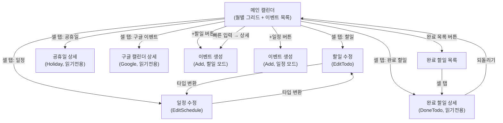
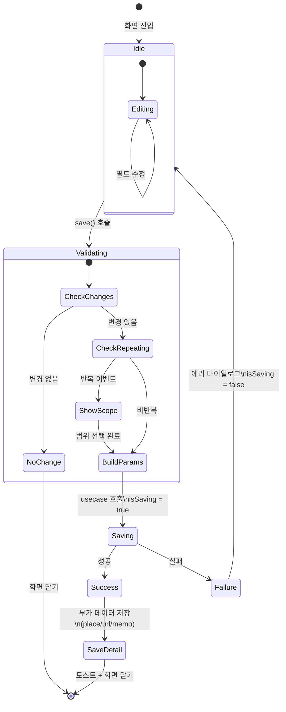
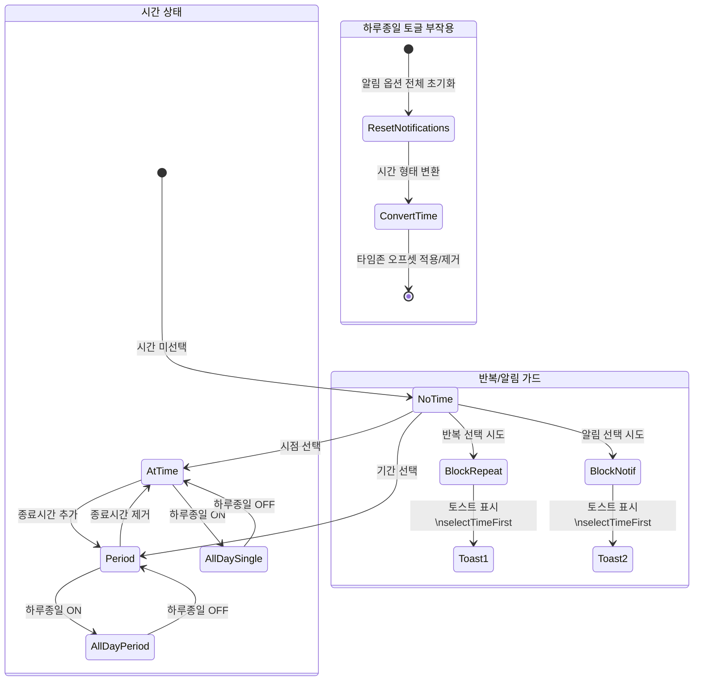
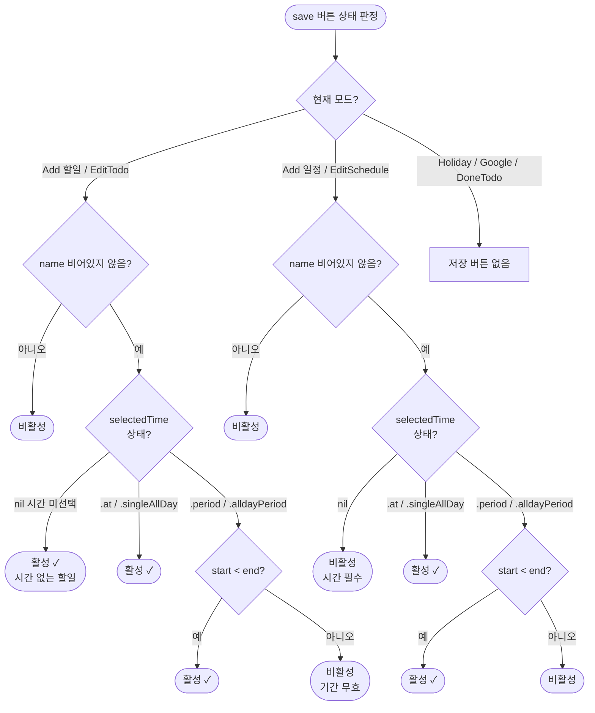
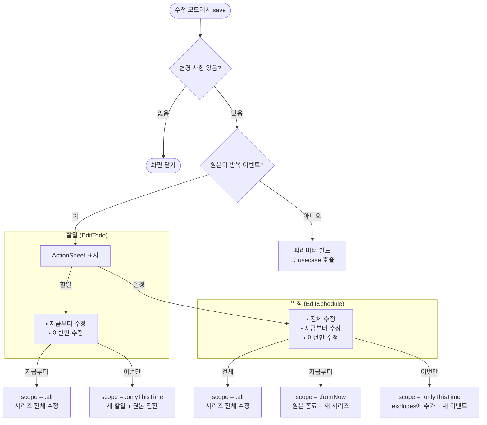
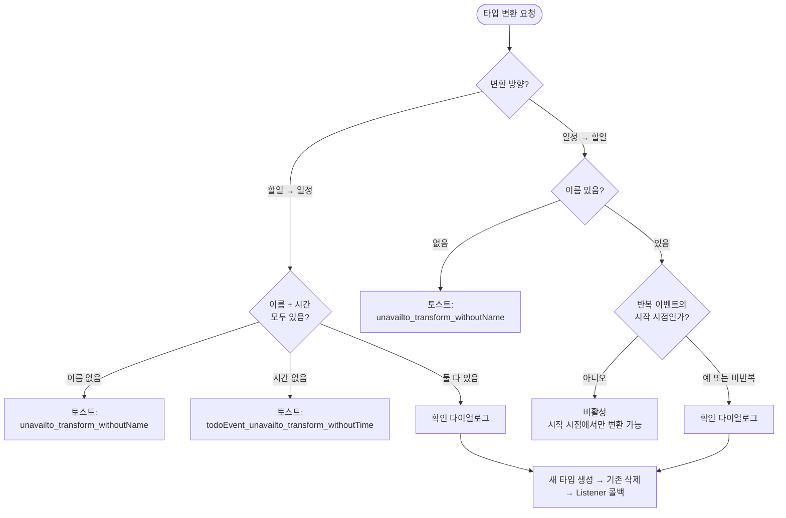

# 화면 구성 상세 스펙

> 메인 기획서 [섹션 2](../product-specification.md) 참조

---

## 상태 전이 다이어그램

### 메인 화면 네비게이션 플로우



### 이벤트 상세 저장 플로우



### 필드 연동 상태 전이



---

## 1. 메인 캘린더 (`CalendarScene`)

월별 캘린더 그리드 + 선택일 이벤트 목록으로 구성된 메인 화면.

### 1.1 캘린더 그리드

좌우 스와이프로 월 이동하는 캘린더 그리드. UIPageViewController 기반 무한 페이징.

**무한 페이징 구조**

항상 3개월 윈도우 `[이전월, 현재월, 다음월]`을 유지한다. 포커스 인덱스는 1(가운데).

| 동작 | 결과 |
|---|---|
| 오른쪽 스와이프 (다음 월) | 배열에서 가장 이전 월을 제거하고, 끝에 새 다음월 추가 |
| 왼쪽 스와이프 (이전 월) | 배열에서 가장 최신 월을 제거하고, 앞에 새 이전월 추가 |

월 변경 시 아직 로드하지 않은 범위의 이벤트·공휴일만 추가로 요청한다 (`TotalMonthRanges`로 이미 체크한 범위 추적).

**이벤트 색상 바 표시 규칙**

캘린더 셀에 해당 날짜의 이벤트를 색상 바(rounded rectangle, cornerRadius: 2)로 표시한다.

- 단일 날짜 이벤트: 해당 날짜 셀에 1줄 바
- 기간(period) 이벤트: 여러 날에 걸쳐 배경 바(50% opacity) + 3pt 좌측 색상 바
- 색상 출처: 이벤트의 태그 색상 (구글 캘린더 이벤트는 별도 `GoogleCalendarEventColorSource` 참조)

**이벤트 스택 정렬 알고리즘** (`WeekEventStackBuilder`)

주 단위로 이벤트를 행(row)에 배치한다. 정렬 기준 (우선순위 순):

1. **이벤트 길이** — 기간이 긴 이벤트가 위 행에 배치
2. **시작 요일** — 더 이른 날짜의 이벤트가 우선
3. **기존 행 수** — 이미 적은 행을 사용 중인 이벤트가 우선

배치 방식: 전체 주(1...7)를 차지하는 이벤트를 먼저 별도 행에 배치한 뒤, 나머지를 재귀적으로 빈 공간에 채운다. 같은 행에서 겹치지 않는 이벤트끼리 좌/우 이웃으로 배치.

**"+N" 더보기 인디케이터**

셀 높이에 따라 표시 가능한 최대 행 수가 결정된다:

```
maxDrawableEventRowCount = (셀높이 - eventTopMargin) / eventRowHeightWithSpacing - 1
```

- 표시 가능 행 수 < 전체 행 수: 숨겨진 행의 이벤트 수를 날짜별로 집계하여 "+N" 텍스트로 표시
- 표시 가능 행 수 ≥ 전체 행 수: 모든 이벤트 표시, 하단 여백 처리

**날짜 선택 규칙**

| 상태 | 선택 날짜 |
|---|---|
| 사용자가 날짜 탭 | 탭한 날짜 |
| 사용자 선택 없이 오늘이 속한 월을 볼 때 | 오늘 |
| 사용자 선택 없이 다른 월을 볼 때 | 해당 월의 1일 |

**기타 인터랙션**

- 공휴일/주말 강조 표시 (색상 구분)
- 오늘 날짜 하이라이트
- "오늘" 버튼: 오늘이 속한 3개월 윈도우로 재구성 → 오늘 날짜 선택 초기화
- 날짜 롱프레스 → `SelectDayDialog` (SwiftUI DatePicker `.graphical` 스타일 바텀시트)
  - 날짜 선택 후 확인 → `SelectDayInfo` 전달 (같은 해/같은 날 플래그 포함)

### 1.2 일별 이벤트 목록 (`DayEventList`)

선택 날짜의 이벤트를 표시하는 목록. 다음 순서로 섹션이 구성된다:

| 순서 | 섹션 | 조건 |
|---|---|---|
| 1 | 강조 이벤트 (Foremost Event) | 사용자가 지정한 경우에만 |
| 2 | 미완료 할일 목록 | 설정에서 활성화한 경우에만 |
| 3 | 날짜 정보 (양력 + 음력 + 공휴일명) | 항상 |
| 4 | 이벤트 목록 | 항상 |
| 5 | 빠른 할일 입력 (QuickAddNewTodo) | 항상 |
| 6 | 새 이벤트 추가 버튼 (+일정 / +할일) | 항상 |

**이벤트 정렬 규칙**

이벤트 목록 섹션 내에서의 정렬 순서:

1. **시간 없는 할일 (current todos)** — `createdAt` 오름차순. 둘 다 `nil`이면 이름 알파벳순
2. **시간 있는 할일** — `EventTime` 기준 오름차순
3. **일정** — `EventTime` 기준 오름차순
4. **공휴일** — 원래 순서 유지
5. **구글 캘린더 이벤트** — 원래 순서 유지

**이벤트 셀 구성**: 타입 아이콘, 이름(1줄), 시간 텍스트, 태그 색상 바

### 1.3 화면 간 네비게이션

| 출발 | 도착 | 트리거 |
|---|---|---|
| 이벤트 목록 셀 탭 | 이벤트 상세 (모드에 따라 분기) | 셀 탭 |
| "+할일" 버튼 | 이벤트 상세 (Add, 할일 모드) | 버튼 탭 |
| "+일정" 버튼 | 이벤트 상세 (Add, 일정 모드) | 버튼 탭 |
| "완료 목록" 버튼 | 완료 할일 목록 | 버튼 탭 |
| 빠른 입력 → 상세 | 이벤트 상세 (Add, 할일 모드, 이름 프리필) | 상세 추가 버튼 |

---

## 2. 이벤트 상세 (`EventDetailScene`)

하나의 화면에서 생성/수정/조회를 모두 처리. ViewModel 변형으로 모드 분기.

### 2.1 모드

| 모드 | ViewModel | 설명 |
|---|---|---|
| 생성 (Add) | `AddEventViewModelImple` | 할일/일정 타입 선택 후 새 이벤트 생성 |
| 할일 수정 (EditTodo) | `EditTodoEventDetailViewModelImple` | 기존 할일 편집 |
| 일정 수정 (EditSchedule) | `EditScheduleEventDetailViewModelImple` | 기존 일정 편집 |
| 공휴일 상세 (Holiday) | `HolidayEventDetailViewModelImple` | 읽기 전용, D-Day 카운트다운 |
| 구글 캘린더 상세 (GoogleCalendar) | `GoogleCalendarEventDetailViewModelImple` | 읽기 전용, 구글에서 편집 링크 제공 |
| 완료 할일 상세 (DoneTodo) | `DoneTodoDetailViewModelImple` | 읽기 전용, 완료 취소(되돌리기) 가능 |

### 2.2 모드별 필드 매트릭스

| 필드 | Add | EditTodo | EditSchedule | Holiday | GoogleCal | DoneTodo |
|---|---|---|---|---|---|---|
| 이름 | 편집 | 편집 | 편집 | 표시 | 표시 | 표시 |
| 타입 토글 (할일/일정) | **활성** | 비활성 | 비활성 | — | — | — |
| 날짜/시간 | 편집 | 편집 | 편집 | 표시 | 표시 | 표시 (원본+완료시간) |
| 하루종일 토글 | 편집 | 편집 | 편집 | — | — | — |
| 기간 (종료시간) | 편집 | 편집 | 편집 | — | 표시 | — |
| 반복 | 편집 | 편집 | 편집 | — | 표시 (RRULE 파싱) | — |
| 알림 (복수) | 편집 | 편집 | 편집 | — | — | 표시 |
| 태그/색상 | 편집 | 편집 | 편집 | — | 표시 (캘린더명) | 표시 |
| 위치 | 편집 | 편집 | 편집 | — | 표시 | 표시 |
| URL | 편집 | 편집 | 편집 | — | — | 표시 |
| 메모 | 편집 | 편집 | 편집 | — | 표시 (description) | 표시 |
| D-Day | — | — | — | 표시 | 표시 | — |
| 컨퍼런스 링크 | — | — | — | — | 표시 | — |
| 참석자 | — | — | — | — | 표시 | — |
| 첨부파일 | — | — | — | — | 표시 | — |
| 강조 이벤트 (Foremost) | 비활성 | 표시+토글 | 표시+토글 | — | — | — |
| 추가 액션 (더보기) | — | 활성 | 활성 | — | 편집 링크 | 되돌리기 |

### 2.3 저장 버튼 활성화 조건

저장 버튼은 `isSavable` 상태에 따라 활성/비활성 처리된다.

**할일 (Add 할일 모드 / EditTodo)**

```
isSavable = 이름이 비어있지 않음 AND 선택된 시간이 유효하지 않은 상태가 아님
```

- 시간 미선택(`nil`)은 허용 — 시간 없는 할일
- 시간 선택 후 기간의 시작 ≥ 종료인 경우만 invalid

**일정 (Add 일정 모드 / EditSchedule)**

```
isSavable = 이름이 비어있지 않음 AND 선택된 시간이 명시적으로 유효함
```

- 시간 필수 — `nil`이면 저장 불가
- 기간 이벤트: 시작 < 종료 필수

**시간 유효성 판정 (`SelectedTime.isValid`)**

| 시간 타입 | 유효 조건 |
|---|---|
| `.at(date)` | 항상 유효 |
| `.singleAllDay(date)` | 항상 유효 |
| `.period(start, end)` | `start.date < end.date` |
| `.alldayPeriod(start, end)` | `start.date < end.date` |

### 2.4 필드 간 연동 규칙

**하루종일 토글 변경 시**

| 변경 | 영향 |
|---|---|
| 일반 → 하루종일 | `.at()` → `.singleAllDay()` / `.period()` → `.alldayPeriod()` (타임존 오프셋 적용) |
| 하루종일 → 일반 | `.singleAllDay()` → `.at()` / `.alldayPeriod()` → `.period()` |
| 양방향 공통 | **알림 옵션 전체 초기화** (하루종일과 일반의 알림 옵션 체계가 다르므로) |

**시간 ↔ 반복**

- 반복 옵션 선택 시 유효한 시간이 반드시 필요. 시간 미선택 상태에서 반복 선택 시도 → 토스트: `"eventDetail.Messages.selectTimeFirst"`
- 시작 시간 변경 시 반복의 기준 시작 시간도 자동 업데이트

**시간 ↔ 알림**

- 알림 시간 선택 시 유효한 시간이 반드시 필요. 시간 미선택 상태에서 알림 선택 시도 → 토스트: `"eventDetail.Messages.selectTimeFirst"`
- 커스텀 알림: 이벤트 시간의 `DateComponents`를 기준으로 상대 시간 계산

**종료 시간 제약**

- 종료 시간 ≤ 시작 시간으로 설정 시 변경이 무시됨 (유효하지 않은 기간 방지)

### 2.5 저장/수정 플로우

**새 이벤트 생성 (Add)**

```
1. save() 호출
2. isTodo 플래그에 따라 분기
   ├─ 할일: TodoMakeParams 빌드 → todoUsecase.makeTodoEvent()
   └─ 일정: ScheduleMakeParams 빌드 → scheduleUsecase.makeScheduleEvent()
3. isSaving = true (저장 중 인디케이터)
4. 성공 시:
   ├─ 부가 데이터 저장 (메모, URL, 위치)
   ├─ 토스트 표시
   └─ 화면 닫기
5. 실패 시:
   ├─ 에러 다이얼로그 표시
   └─ isSaving = false
```

**기존 이벤트 수정 (EditTodo / EditSchedule)**

```
1. save() 호출
2. 변경 사항 확인 (basic.isChanged OR addition.isChanged)
   └─ 변경 없음 → 바로 화면 닫기
3. 원본이 반복 이벤트인 경우 → 수정 범위 선택 ActionSheet 표시
4. 수정 범위에 따라 파라미터 빌드 → usecase.update...()
5. 성공/실패 처리 (생성과 동일)
```

**반복 이벤트 수정 범위 선택**

| 수정 대상 | 할일 (EditTodo) | 일정 (EditSchedule) |
|---|---|---|
| 반복 시작 시점을 편집 | "지금부터" / "이번만" | "전체" / "이번만" |
| 다른 회차를 편집 | "지금부터" / "이번만" | "지금부터(targetTime)" / "이번만(targetTime)" |

- "전체": 시리즈 전체에 적용
- "지금부터": 현재 시점부터 미래 반복을 새 시리즈로 분기
- "이번만": 해당 회차만 수정 (반복 설정 제거, 원본에서 해당 시간 제외)

### 2.6 추가 액션 (수정 모드)

| 액션 | EditTodo | EditSchedule | 조건 |
|---|---|---|---|
| 삭제 | O | O | 반복 이벤트: 이번만/전체 범위 선택 |
| 복사 | O | O | — |
| 타입 변환 (할일→일정) | O | — | 이름 + 시간 필수 (없으면 토스트) |
| 타입 변환 (일정→할일) | — | O | 이름 필수. 반복 이벤트의 시작 시점이 아닌 경우 비활성 |
| 강조 이벤트 토글 | O | O | — |

**타입 변환 플로우**

```
1. 유효성 검증 (이름 + 시간)
   └─ 실패 시 토스트: "eventDetail.unavailto_transform_withoutName" 또는
                      "eventDetail.todoEvent_unavailto_transform_withoutTime"
2. 확인 다이얼로그 표시
3. 새 타입으로 이벤트 생성 → 기존 이벤트 삭제
4. Listener 콜백으로 부모에게 전환 결과 전달
```

### 2.7 하위 모달

**반복 옵션 선택 (`SelectEventRepeatOption`)**

진입 조건: 유효한 시간이 선택되어 있어야 함.

제공 옵션 (2개 섹션):

| 섹션 1 (기본) | 설명 |
|---|---|
| 매일 | — |
| 매주 (현재 요일) | — |
| 매 2/3/4주 (현재 요일) | — |
| 매월 (같은 일자) | — |
| 매년 (같은 날짜) | — |
| 음력 매년 | — |

| 섹션 2 (조건부) | 조건 |
|---|---|
| 매 평일 | 시작일이 주말이 아닌 경우만 |
| 매월 (모든 요일) | — |
| 매월 (N번째 특정 요일) | 예: "매월 첫 번째 화요일" |

종료 옵션:

| 옵션 | 설명 |
|---|---|
| 반복 종료 없음 | 무한 반복 |
| 특정 날짜까지 | DatePicker로 선택. 시작 < 종료 필수 (위반 시 토스트) |
| N회 반복 후 | 정수 입력 |

**태그 선택 (`SelectEventTag`)**

- `.holiday` 태그는 목록에서 제외
- 기본 태그가 목록 상단에 정렬
- 태그 생성/관리 화면으로 이동 가능 (SettingScene 연동)
- 태그 생성/수정/삭제 이벤트가 실시간으로 목록에 반영

**알림 시간 선택 (`SelectEventNotificationTime`)**

진입 조건: 유효한 시간이 선택되어 있어야 함.

- `isForAllDay` 플래그에 따라 제공되는 기본 옵션이 다름
- 기본 옵션 토글(선택/해제) + 커스텀 시간 추가/삭제
- 시스템 알림 권한 확인: `.notDetermined` → 권한 요청, `.denied` → 안내 표시
- 선택 변경 시 실시간으로 메인 폼에 반영 (Listener 콜백)

**지도 앱 선택 (`SelectMapApp`)**

| 앱 | ID |
|---|---|
| Apple Maps | `.apple` |
| Google Maps | `.google` |
| Naver Maps | `.naver` |
| Kakao Maps | `.kakao` |

- 기본 지도 앱 설정이 있으면 선택 없이 바로 열기
- 기본 앱이 없으면 설치된 앱 목록에서 선택

---

## 3. 완료 할일 목록 (`DoneTodoEventListScene`)

완료 처리된 할일을 시간순으로 조회하는 목록 화면.

### 3.1 그룹핑 규칙

완료 날짜(`doneTime`)를 기준으로 2단계 그룹핑을 적용한다.

**섹션 타이틀** (세밀한 단위):

| 조건 | 타이틀 |
|---|---|
| 오늘 완료 | "오늘" |
| 어제 완료 | "어제" |
| 그 외 | `yyyy_MM_dd` 형식 |

**섹션 그룹 타이틀** (굵은 단위, 그룹 변경 시에만 표시):

| 조건 | 그룹 타이틀 |
|---|---|
| 오늘 | "오늘" |
| 어제 | "어제" |
| 올해 같은 달 | "이번 달" |
| 올해 다른 달 | 월 번호 (MM) |
| 다른 해 | 연도 (yyyy) |

그룹 타이틀은 직전 섹션과 그룹이 달라질 때만 `shouldShowSectionGroupTitle = true`로 표시.

### 3.2 페이지네이션

- **커서 기반**: 마지막 아이템의 `doneTime.timeIntervalSince1970`을 다음 페이지 커서로 사용
- **초기 로드**: `cursorAfter: nil`
- **추가 로드**: 목록 하단 도달 시 자동 트리거 (무한 스크롤)
- **중복 제거**: 여러 페이지의 결과를 `uuid` 기준으로 병합

### 3.3 완료 취소 (되돌리기)

두 가지 경로로 되돌리기 가능:

**목록에서 직접 되돌리기**

1. 완료 아이콘(체크 표시) 탭 → 아이콘이 빈 원으로 변경 (시각적 피드백)
2. 비동기 Task로 `todoUsecase.revertCompleteTodo()` 호출
3. 성공 시 해당 아이템을 목록에서 제거 (`revertedIdSet`으로 필터링)
4. 실패 시 에러 다이얼로그 표시

**상세 화면에서 되돌리기**

1. 셀 탭 → 완료 할일 상세 (DoneTodo 모드) 화면 이동
2. "되돌리기" 버튼 탭 → `listener.doneTodoDetail(revert:to:)` 콜백
3. 목록 화면이 Listener로서 콜백 수신 → `revertedIdSet` 업데이트 → 섹션 재계산

### 3.4 일괄 삭제

ActionSheet로 삭제 범위를 선택한다:

| 옵션 | 동작 |
|---|---|
| 전체 삭제 | 모든 완료 할일 삭제 |
| 1개월 이전 | 1개월보다 오래된 완료 할일 삭제 |
| 3개월 이전 | 3개월보다 오래된 완료 할일 삭제 |
| 6개월 이전 | 6개월보다 오래된 완료 할일 삭제 |
| 1년 이전 | 1년보다 오래된 완료 할일 삭제 |

삭제 중 `isRemovingTodos = true`로 프로그레스 인디케이터를 표시하고, 완료 후 목록을 다시 로드한다.

---

## 4. 설정 (`SettingItemListViewController`)

**메뉴 구조**
```
설정
├── 계정 (로그인/계정 관리)
├── 외형 설정
│   ├── 캘린더 외형
│   ├── 컬러 테마
│   ├── 타임존
│   └── 위젯 외형
├── 이벤트 설정
│   ├── 기본 태그
│   ├── 기본 알림 시간
│   └── 기본 지도 앱
├── 공휴일 설정
│   └── 국가 선택
├── 피드백 전송
├── 도움말 (외부 링크)
├── 앱 공유
├── 앱스토어 리뷰
└── 소스코드 (GitHub)
```

## 5. 인증 (`MemberScenes`)

| 화면 | 설명 |
|---|---|
| 로그인 | 바텀시트 모달, 구글 OAuth2 |
| 계정 관리 | 로그인 방법, 이메일, 최종 로그인 시간 표시. 로그아웃/계정 삭제/데이터 마이그레이션 |

## 6. 에러 표시 패턴

모든 화면에서 공통으로 사용하는 에러 표시 메커니즘:

**에러 다이얼로그** (`showError`)

- `RuntimeError` / `ServerErrorModel` → 에러 메시지 추출
- 기본 에러 메시지 + 상세 메시지를 함께 표시
- 확인 버튼만 있는 단일 액션 다이얼로그
- `ServerErrorModel.code == .cancelled`인 경우 무시 (사용자 취소)

**토스트** (`showToast`)

- 짧은 알림 메시지용 (저장 완료, 유효성 안내 등)
- 자동 사라짐

**확인 다이얼로그** (`showConfirm`)

- 제목, 메시지, 확인/취소 버튼
- 삭제, 타입 변환 등 되돌리기 어려운 액션의 사전 확인용

**ActionSheet** (`showActionSheet`)

- 반복 이벤트 수정/삭제 범위 선택, 일괄 삭제 범위 선택 등 다중 선택지 제공

## 7. 화면 간 데이터 전달 패턴

모든 화면 간 데이터 전달은 3가지 메커니즘을 사용한다:

| 방향 | 메커니즘 | 용도 |
|---|---|---|
| 간접 공유 | `SharedDataStore` (Usecase 경유) | 같은 데이터를 구독하는 독립 화면 간 (캘린더 ↔ 이벤트 목록 등) |
| 부모 → 자식 | `Interactor` 프로토콜 | 부모가 자식에게 명령 전달 |
| 자식 → 부모 | `Listener` 프로토콜 (weak 참조) | 자식이 부모에게 이벤트 전달 |

**Builder/Router 조립 패턴**:

```
Builder.make...Scene(listener) → ViewController 생성
  ├─ ViewModel 생성 (usecase 주입)
  ├─ Router 생성 (하위 Builder 주입)
  ├─ Router.scene = ViewController
  ├─ ViewModel.router = Router
  └─ ViewController.interactor = ViewModel
```

Router가 하위 화면을 생성할 때 `currentScene?.interactor`를 Listener로 전달하여, 자식 화면의 결과가 부모 ViewModel에 직접 콜백된다.

---

## 8. 결정 트리

### 저장 버튼 활성화 결정 트리



### 수정 모드 반복 범위 선택 결정 트리



### 타입 변환 결정 트리



---

## 9. 엣지 케이스

### 9.1 캘린더 그리드 — 이벤트 스택 오버플로우

```
상황: 하루에 이벤트가 10개, 셀 높이로 표시 가능한 행 수 = 2

WeekEventStackBuilder:
  전체 라인: 10개 이벤트 → 약 5~8행 필요 (겹침에 따라 다름)
  표시 가능: 2행

결과:
  상위 2행의 이벤트만 색상 바로 표시
  나머지: "+N" 인디케이터 (숨겨진 행의 이벤트 수 집계)

"+N" 계산:
  각 날짜별로 숨겨진 행에 속한 이벤트 수를 개별 카운트
  → 같은 날이라도 겹침에 따라 "+3", "+5" 등 다를 수 있음
```

### 9.2 기간 이벤트의 주 경계 처리

```
상황: 3/10(월)~3/21(금) 기간 이벤트

WeekEventStackBuilder (주 단위):
  1주차 (3/10~3/16): 월~일 전체 커버 → 1행 배경 바
  2주차 (3/17~3/23): 월~금 커버 → 1행 배경 바

표시:
  각 주에서 독립적으로 배경 바 렌더링
  좌측 3pt 색상 바는 시작 날짜(3/10)에만 표시
```

### 9.3 빠른 할일 입력 → 임시 상태 표시

```
상황: 빠른 입력 필드에 "장보기" 입력 후 확인

플로우:
  1. 임시 TodoCellViewModel 생성 (아직 DB 미저장)
  2. pendingTodoEvents에 추가 → 목록에 즉시 표시
  3. 비동기 Task: todoUsecase.makeTodoEvent()
  4a. 성공 → pendingTodoEvents에서 제거 (SharedDataStore에서 정식 이벤트로 대체)
  4b. 실패 → pendingTodoEvents에서 제거 + 에러 표시

의미: 낙관적 UI. 생성 전에 목록에 미리 보여주고,
     실패 시 롤백.
```

### 9.4 하루종일 토글 시 알림 초기화

```
상황: 일정에 "30분 전" 알림 설정 → 하루종일 토글 ON

결과:
  1. 시간: .period(10:00~11:00) → .alldayPeriod(3/15~3/15)
  2. 알림: ["30분 전"] → [] (전체 초기화)

이유: 하루종일과 일반의 알림 옵션 체계가 다름
  일반: "1분 전", "5분 전" 등 (시간 기준)
  하루종일: "당일 9시", "1일 전 9시" 등 (날짜 기준)
  → 변환 불가능하므로 초기화

다시 하루종일 OFF:
  시간: .alldayPeriod → .period (시간 복원)
  알림: [] (복원되지 않음 — 사용자가 다시 설정 필요)
```

### 9.5 월 이동 시 이벤트 로딩 최적화

```
상황: 1월 → 2월 → 3월 → 2월(뒤로) 이동

TotalMonthRanges 추적:
  1월 진입: 로드 범위 = 12월~2월 (3개월 윈도우)
  2월 진입: 로드 범위 = 3월만 (1~2월은 이미 로드)
  3월 진입: 로드 범위 = 4월만
  2월 복귀: 로드 범위 = 없음 (1~4월 이미 로드됨)

최적화 핵심:
  이미 로드한 범위는 재요청하지 않음.
  3개월 윈도우에서 이미 체크한 범위를 제외한 부분만 요청.
```

### 9.6 완료 할일 목록 — 그룹 타이틀 전환 경계

```
상황: 다음 데이터가 페이지네이션으로 로드됨

데이터 (완료 시간순):
  오늘 15:00  → sectionTitle: "오늘",     groupTitle: "오늘"      (show=true)
  오늘 10:00  → sectionTitle: "오늘",     groupTitle: "오늘"      (show=false, 같은 그룹)
  어제 18:00  → sectionTitle: "어제",     groupTitle: "어제"      (show=true, 그룹 변경)
  3/25        → sectionTitle: "3/25",    groupTitle: "이번 달"    (show=true, 그룹 변경)
  3/20        → sectionTitle: "3/20",    groupTitle: "이번 달"    (show=false, 같은 그룹)
  2/15        → sectionTitle: "2/15",    groupTitle: "2"         (show=true, 그룹 변경)
  2025/12/01  → sectionTitle: "12/1",    groupTitle: "2025"      (show=true, 그룹 변경)

shouldShowSectionGroupTitle은 직전 섹션과 비교하여 결정.
```

### 9.7 반복 이벤트 수정 — 시작 시점 vs 다른 회차

```
상황: 매주 월요일 일정, 사용자가 3/17(두 번째 회차) 편집 화면 진입

EditSchedule 동작:
  repeatingUpdateScope 선택지가 달라짐:

  시작 시점(3/10) 편집 시:
    → "전체 수정" / "이번만 수정"

  다른 회차(3/17) 편집 시:
    → "지금부터(3/17~) 수정" / "이번만 수정"

  "전체"는 시작 시점에서만 나타남.
  다른 회차에서는 "지금부터"가 "전체" 역할을 대체.
```
