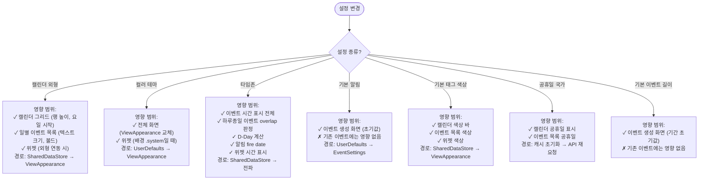

# 설정 상세 스펙

> 메인 기획서 [섹션 12](../product-specification.md) 참조

---

모든 설정은 `EnvironmentStorage` (UserDefaults 래퍼)에 저장되며, Usecase가 SharedDataStore에 publish하여 구독 중인 모든 화면에 실시간 반영된다.

### 1 캘린더 외형 설정

`CalendarAppearanceSettings` — UserDefaults 키별 저장.

| 설정 | UserDefaults 키 | 옵션 | 기본값 |
|---|---|---|---|
| 첫째 요일 | Repository (SQLite) | 일~토 | `.sunday` |
| 이벤트 있는 날 밑줄 | `show_underline_eventday` | on/off | `true` |
| 행 높이 | `calendar_row_height` | 소/중/대 | `.medium` (rawValue: 0) |
| 캘린더 내 이벤트 텍스트 크기 | `event_on_calendar_additional_font_size` | CGFloat 조절 | `0` |
| 캘린더 내 이벤트 볼드 | `bold_text_event_on_calendar` | on/off | `false` |
| 캘린더 내 태그 색상 표시 | `not_show_event_tag_color_on_calendar` | on/off | `false` (반전 키: 표시=true) |
| 이벤트 목록 텍스트 크기 | `event_additiona_font_size` | CGFloat 조절 | `0` |
| 공휴일 이름 표시 | `show_holiday_name_on_eventList` | on/off | `false` |
| 음력 날짜 표시 | `show_lunar_calendar_date` | on/off | `false` |
| 12/24시간 표시 | `is_24_hourForm` | 12h/24h | `true` (24시간) |
| 미완료 할일 상단 표시 | `hide_uncompleted_todos` | on/off | `false` (반전 키: 표시=true) |
| 햅틱 피드백 | `haptic_effect_off` | on/off | `false` (반전 키: 켜짐=false) |
| 애니메이션 효과 | `animation_effect_on` | on/off | `false` |
| 공휴일 강조 (색상) | `accent_holiday` | on/off | `false` |
| 토요일 강조 (색상) | `accent_saturday` | on/off | `false` |
| 일요일 강조 (색상) | `accent_sunday` | on/off | `false` |

**실시간 반영 흐름**:
```
사용자 변경 → AppSettingUsecase.changeCalendarAppearanceSetting()
    → EnvironmentStorage(UserDefaults) 저장
    → SharedDataStore.put(CalendarAppearanceSettings)
    → CalendarViewModel 등 구독자가 Combine으로 수신 → UI 즉시 갱신
```

**영향받는 화면 매트릭스**

| 설정 변경 | 캘린더 그리드 | 이벤트 목록 | 위젯 |
|---|---|---|---|
| 첫째 요일 | ✅ 그리드 재구성 | — | ✅ 주/월 위젯 |
| 행 높이 | ✅ 셀 높이 + "+N" 재계산 | — | — |
| 이벤트 텍스트 크기/볼드 | ✅ 이벤트 바 폰트 | — | — |
| 태그 색상 표시 | ✅ 색상 바 표시/숨김 | — | — |
| 목록 텍스트 크기 | — | ✅ 셀 폰트 | — |
| 공휴일 표시 | ✅ 공휴일 강조 | ✅ 날짜 정보 섹션 | ✅ |
| 음력 표시 | — | ✅ 날짜 정보 섹션 | — |
| 미완료 할일 | — | ✅ 섹션 표시/숨김 | — |
| 컬러 테마 | ✅ 전체 | ✅ 전체 | ✅ 전체 |

### 2 이벤트 기본값 설정

`EventSettings` — UserDefaults 키별 저장.

| 설정 | UserDefaults 키 | 옵션 | 기본값 |
|---|---|---|---|
| 기본 이벤트 길이 | `default_new_event_period` | 0분/5분/10분/15분/30분/45분/1시간/2시간/하루종일 | `.minute0` |
| 기본 태그 | `default_new_event_tagId` | 태그 선택 | `.default` |
| 기본 알림 (시간 이벤트) | 별도 저장 | 알림 시간 옵션 선택 | — |
| 기본 알림 (하루종일) | 별도 저장 | 알림 시간 옵션 선택 | — |
| 기본 지도 앱 | `default_map_app` | Apple Maps / Google Maps / Naver / Kakao | `nil` (선택 안 함) |

이벤트 생성 화면 진입 시 `EventSettings`에서 기본값을 읽어 초기 필드를 채움.

### 3 공휴일 설정

- 국가 선택 (디바이스 지역 코드 기반 자동 선택)
- 연도별 공휴일 lazy 로딩 (요청 시점에 API 호출 → 캐시)
- 캐시: `[countryCode][year][holidays]` 중첩 구조 (SharedDataStore `holidays` 키)
- 12월 → 다음해, 1월 → 전년도 공휴일도 함께 로드 (캘린더 3개월 윈도우 대응)
- 국가 변경 시 기존 캐시 초기화 → 새 국가 공휴일 재로드

### 4 타임존 설정

- 기본: `TimeZone.current` (시스템 타임존)
- 전체 타임존 목록에서 선택 (Repository에 SQLite 저장)
- SharedDataStore `timeZone` 키로 전파
- 하루종일 이벤트는 타임존에 따라 `Range<TimeInterval>.shiftting()` 적용:
  ```
  원본(이벤트 타임존) → UTC로 변환 → 대상 타임존으로 변환
  ```
- D-Day 계산, 이벤트 목록 정렬, 알림 fire date 모두 현재 설정 타임존 기준

### 5 컬러 테마

사용 가능 (`color_set` 키): `systemTheme` (시스템 따라감), `defaultLight`, `defaultDark`

테마 변경 시 `ViewAppearance` 전체가 갱신 → 모든 화면 즉시 반영.

### 6 기본 태그 색상

| 태그 | UserDefaults 키 | 기본값 |
|---|---|---|
| 기본(default) 태그 | `default_tag_color` | `"#088CDA"` (파란색) |
| 공휴일(holiday) 태그 | `holiday_tag_color` | `"#D6236A"` (분홍색) |

색상 변경 시 SharedDataStore `defaultEventTagColor` 키로 전파 → 캘린더, 이벤트 목록, 위젯 모두 반영.

---

## 결정 트리 & 상태 전이

### 설정 변경 → 영향받는 화면 매트릭스



---

## 엣지 케이스

### 타임존 변경 시 이벤트 시간 표시

```
상황: KST(+9) → PST(-8) 전환

하루종일 이벤트 "3/15 하루종일" (KST 기준 저장):
  저장: .allDay(3/15 00:00..<3/16 00:00, secondsFromGMT: +32400)

KST에서 표시: 3/15 하루종일
PST에서 표시:
  shiftting(+32400, to: PST(-8))
  → UTC: 3/15 09:00..<3/16 09:00
  → PST: 3/14 17:00..<3/15 17:00 (시작이 3/14)
  → 캘린더에서 3/14~3/15 양일에 걸쳐 표시

의미: 타임존 변경 시 하루종일 이벤트의
     캘린더 표시 위치가 달라질 수 있음.
```

### 공휴일 국가 변경 시 캐시

```
상황: 한국 → 미국으로 국가 변경

처리:
  1. 기존 공휴일 캐시 전체 초기화
  2. SharedDataStore[holidays] = [:]
  3. 현재 보이는 3개월에 대해 미국 공휴일 API 요청
  4. 응답 수신 → 캐시에 저장 → 캘린더 갱신

주의: 국가 변경 즉시 캘린더에서 한국 공휴일이 사라짐.
     미국 공휴일은 API 응답 후에 표시.
     네트워크 지연 시 잠시 공휴일 없는 상태 가능.
```
