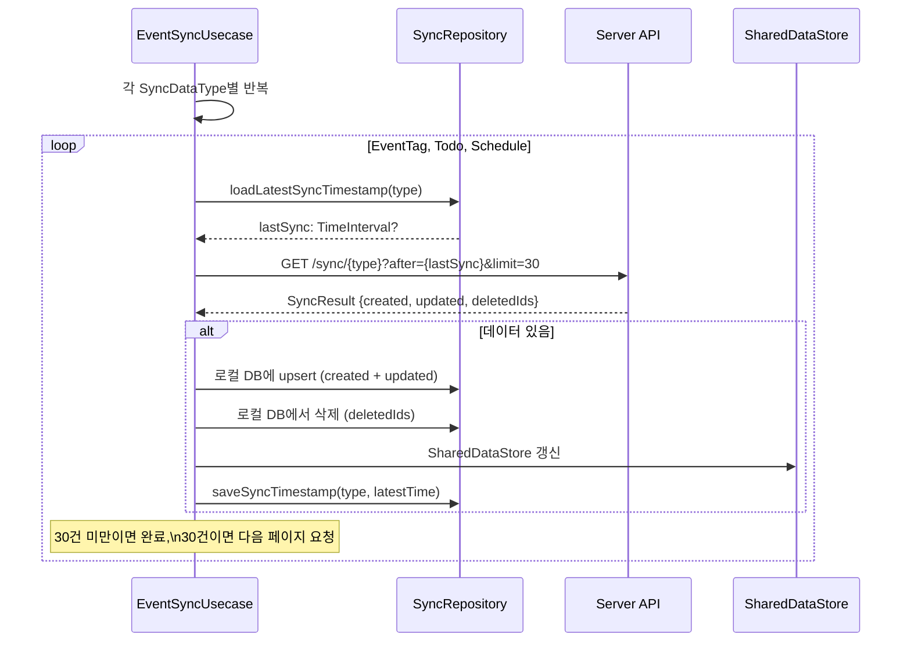
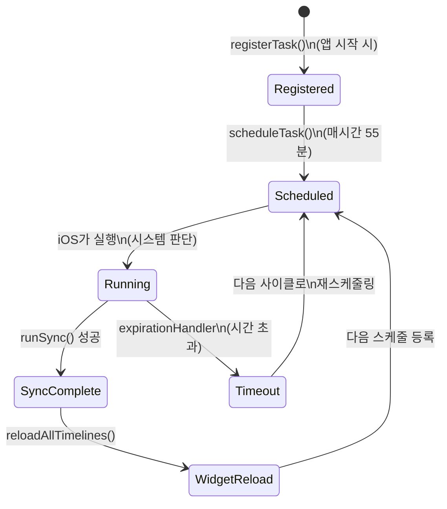

# 동기화 상세 스펙

> 메인 기획서 [섹션 11](../product-specification.md) 참조

---

### 1. 오프라인 우선 아키텍처

```
[사용자 액션] → LocalRepository (즉시 저장 → UI 즉시 반영)
                    ↓
              UploadDecorateRepository (로컬 저장 + 오프라인 큐에 태스크 추가)
                    ↓
              EventUploadServiceImple (Actor, 큐에서 pop → 업로드 시도)
                    ↓
              RemoteRepository (서버 전송)
```

- 비로그인: `LocalRepository`만 사용. Remote/Upload 계층 없음.
- 로그인: `UploadDecorateRepository`가 로컬 저장과 동시에 업로드 큐에 태스크 추가.

**Decorator별 큐잉 동작**

| Decorator | 생성 시 큐 | 수정 시 큐 | 삭제 시 큐 |
|---|---|---|---|
| `TodoUploadDecorateRepositoryImple` | `.todo` | `.todo` | `.todo(remove)` + `.eventDetail(remove)` |
| Todo 완료 시 | — | `.todo` + `.doneTodo` + `.doneTodoDetail` | — |
| `ScheduleEventUploadDecorateRepositoryImple` | `.schedule` | `.schedule` | `.schedule(remove)` + `.eventDetail(remove)` |
| `EventTagUploadDecorateRepositoryImple` | `.eventTag` | `.eventTag` | `.eventTag(remove)` |
| `EventDetailUploadDecorateRepositoryImple` | `.eventDetail` | `.eventDetail` | `.eventDetail(remove)` |

### 2. 서버 동기화

| 항목 | 내용 |
|---|---|
| 동기화 대상 | `EventTag`, `TodoEvent`, `ScheduleEvent` (3가지 `SyncDataType`) |
| 페이지 크기 | 30건/요청 (`pageSize` 상수) |
| 방식 | 타임스탬프 기반 증분 동기화 (밀리초 단위 정수) |
| 페이지네이션 | 커서 기반 (서버가 `nextPageCursor` 반환) |
| 타임스탬프 저장 | `SyncTimestamp` SQLite 테이블 (data_type별 독립 관리) |

**API 엔드포인트**

| 단계 | 메서드 | 경로 | 파라미터 |
|---|---|---|---|
| 체크 | GET | `/v1/sync/check` | `dataType`, `timestamp` (optional) |
| 시작 | GET | `/v1/sync/start` | `dataType`, `timestamp` (optional), `size` (30) |
| 계속 | GET | `/v1/sync/continue` | `dataType`, `cursor`, `size` |

**동기화 체크 응답** (`EventSyncCheckRespose`)

| 응답 (`CheckResult`) | 동작 |
|---|---|
| `.noNeedToSync` | 해당 데이터 타입 건너뛰기 |
| `.needToSync` | 서버가 반환한 `startTimestamp`부터 증분 동기화 |
| `.migrationNeeds` | 타임스탬프 무시, 처음부터 전체 동기화 |

**동기화 응답 구조** (`EventSyncResponse<T>`)

```swift
struct EventSyncResponse<T: Sendable> {
    var created: [T]?        // 새로 생성된 항목
    var updated: [T]?        // 수정된 항목
    var deletedIds: [String]? // 삭제된 항목 ID
    var nextPageCursor: String? // 다음 페이지 커서 (nil이면 마지막 페이지)
    var newSyncTime: Int?    // 다음 체크에 사용할 타임스탬프
}
```

**동기화 실행 순서** (`EventSyncUsecaseImple.runSyncTask`):
1. `EventSyncMediator.waitUntilEventSyncAvailable()` — 업로드 큐 비움 + 마이그레이션 대기
2. EventTag 동기화 (check → start → continue 루프)
3. Todo 동기화
4. Schedule 동기화
5. 각 타입은 독립적으로 에러 처리 (한 타입 실패해도 나머지 계속)

**충돌 해결 전략**: **서버 우선 (Last-Write-Wins)**
- 클라이언트는 충돌 감지 없음 (엔티티에 버전 번호 없음)
- 동기화 응답의 `created`/`updated` 항목이 로컬을 덮어씀 (`updateCreatedOrUpdated()`)
- `EventSyncMediator`가 업로드 완료 후 동기화를 시작하여 순서 보장: 로컬 변경 → 서버 전송 → 서버 상태 pull

### 3. 오프라인 큐

**저장소**: `event_upload_pending_queue` SQLite 테이블

| 컬럼 | 타입 | 설명 |
|---|---|---|
| `timestamp` | REAL | 큐잉 시각 (FIFO 정렬 기준) |
| `data_type` | TEXT | 데이터 타입 (eventTag/todo/schedule/eventDetail/doneTodo/doneTodoDetail) |
| `uuid` | TEXT | 엔티티 ID |
| `is_remove` | INTEGER | 0: 생성/수정, 1: 삭제 |
| `upload_fail_count` | INTEGER | 재시도 횟수 (기본 0) |

- 복합 PK: `(uuid, data_type)` → 같은 엔티티의 중복 큐잉 시 upsert
- 정렬: `timestamp` 오름차순 (FIFO)

**처리 흐름** (`EventUploadServiceImple` — Swift Actor):
1. `append(tasks)` → SQLite 큐에 upsert → `resume()` 호출
2. `resume()`:
   - `isUploading = true`
   - `popTask()`: `upload_fail_count < maxFailCount`인 가장 오래된 태스크 pop
   - `uploadTask()`: Remote API 호출
   - 성공 → 큐에서 삭제
   - 실패 → `upload_fail_count + 1`로 재큐잉 (타임스탬프 갱신)
   - 큐가 빌 때까지 반복
   - `isUploading = false`
3. `pause()`: 현재 배치 취소

**재시도 정책**:
- 최대 재시도: **10회** (`AppEnvironment.eventUploadMaxFailCount`)
- 재시도 간격: 즉시 (큐에서 다시 pop될 때). 별도 지수 백오프 없음.
- 10회 초과 시: 큐에 남아있으나 pop 대상에서 제외. 다음 동기화 사이클이나 강제 동기화로 처리.

**업로드 엔드포인트**

| 데이터 타입 | 생성/수정 | 삭제 |
|---|---|---|
| EventTag | `PUT /v2/tags/{tagId}` | `DELETE /v2/tags/{tagId}` |
| Todo | `POST/PUT /v2/todos/{todoId}` | `DELETE /v2/todos/{todoId}` |
| Schedule | `PUT /v2/schedules/{eventId}` | `DELETE /v2/schedules/{eventId}` |
| EventDetail | `POST /v1/event_details/{eventId}` | `DELETE /v1/event_details/{eventId}` |

### 4. 백그라운드 동기화

`BackgroundEventSyncUsecaseImple`이 iOS 백그라운드 작업을 관리.

**등록** (`registerTask()`):
- 식별자: `"com.sudo.park.TodoCalendarApp.bgSync"`
- 타입: `BGAppRefreshTask`
- 시점: `AppDelegate.application(didFinishLaunchingWithOptions:)`에서 호출

**스케줄링** (`scheduleTask()`):
- `BGAppRefreshTaskRequest` 생성
- `earliestBeginDate`: 다음 정시 55분 전 (≈ 매시간 1회)

**실행** (`handleBackgroundSync(task)`):
1. `UIApplication.beginBackgroundTask()` → 확장 실행 시간 확보
2. `expirationHandler` 설정 → 타임아웃 시 다음 사이클로 재스케줄링
3. `runSync()` → `eventSyncUsecase.sync()` 실행
4. 동기화 완료 → `WidgetCenter.shared.reloadAllTimelines()` (위젯 갱신)
5. 태스크 완료 마킹 + 다음 스케줄 등록

**시스템 제약**:
- iOS가 실행 빈도를 앱 사용 패턴에 따라 자동 조절 (빈도 보장 없음)
- 배터리 저전력 모드 시 실행 연기 가능
- 네트워크 상태는 별도 체크하지 않음 (Alamofire가 네트워크 에러 반환 시 업로드 실패 → 재시도)

### 5. 강제 동기화

- `EventSyncUsecase.forceSync()`: 모든 `SyncDataType`의 타임스탬프 초기화 (`clearSyncTimestamp()`) → 전체 재동기화
- 설정 화면에서 수동 트리거 가능
- 동기화 진행 상태: `isSyncInProgress: AnyPublisher<Bool, Never>`로 UI에 표시

---

## 상태 전이 다이어그램

### 오프라인 큐 → 업로드 플로우

```mermaid
flowchart TD
    Start([이벤트 CRUD]) --> Local[로컬 DB 즉시 저장]
    Local --> Queue[오프라인 큐에 추가\nEventUploadService]

    Queue --> Pop[큐에서 pop\nFIFO 순서]
    Pop --> Upload{서버 업로드}

    Upload -->|성공| Remove[큐에서 제거]
    Remove --> Next{큐에 더 있음?}
    Next -->|예| Pop
    Next -->|아니오| Idle([대기])

    Upload -->|실패| Retry{재시도 횟수 < 10?}
    Retry -->|예| Requeue[큐에 다시 추가\n(즉시 재시도)]
    Requeue --> Pop
    Retry -->|아니오| Skip[큐에 남아있으나\npop 대상에서 제외]
    Skip --> Next
```

### 서버 동기화 (Pull) 플로우



### 백그라운드 동기화 상태 전이



---

## 엣지 케이스

### 충돌 해결 — 서버 우선 (Last-Write-Wins)

```
상황: 오프라인에서 할일 수정 → 서버에서 같은 할일 삭제됨

타임라인:
  T1: 오프라인 — 할일 "회의" 시간 변경 → 오프라인 큐에 추가
  T2: 다른 기기 — 같은 할일 삭제 → 서버에 반영
  T3: 네트워크 복구

오프라인 큐 업로드 (Push):
  PUT /todos/{id} → 서버가 이미 삭제된 이벤트에 대해 처리
  → 서버 구현에 따라: 재생성 또는 에러 반환

서버 동기화 (Pull):
  GET /sync/todos?after={T1}
  → deletedIds에 해당 할일 포함
  → 로컬 DB에서 삭제

최종 결과: 서버 상태(삭제됨)가 우선.
          오프라인 수정은 무시됨.
```

### 오프라인 큐 — 10회 실패 후 처리

```
상황: 서버 장애로 업로드 계속 실패

진행:
  시도 1~10: 실패 → 큐에 다시 추가 → 즉시 재시도
  시도 11: failCount > maxFailCount(10)
    → pop 대상에서 제외
    → 큐에는 남아있음

복구 방법:
  1. 다음 앱 실행 시 동기화 사이클에서 재처리
  2. 사용자가 설정 → "강제 동기화" 실행
     → clearSyncTimestamp() → 전체 재동기화
     → 오프라인 큐도 다시 처리

주의: 지수 백오프 없음. 즉시 재시도로 인해
     서버 장애 시 빠르게 10회 소진 가능.
```

### 동기화와 마이그레이션의 조율

```
상황: 로그인 직후 마이그레이션과 동기화가 동시 시작

EventSyncMediator 조율:
  1. 마이그레이션 시작: isTemporaryUserDataMigration = true
  2. EventSyncUsecase.sync() 호출 시:
     → Mediator 확인 → 마이그레이션 중 → 동기화 대기
  3. 마이그레이션 완료: isTemporaryUserDataMigration = false
  4. 대기 중이던 동기화 실행 시작

이유: 마이그레이션이 서버에 데이터를 업로드하는 중에
     동기화가 "서버에 데이터 없음"으로 판단하여
     로컬 데이터를 삭제하는 것을 방지.
```
