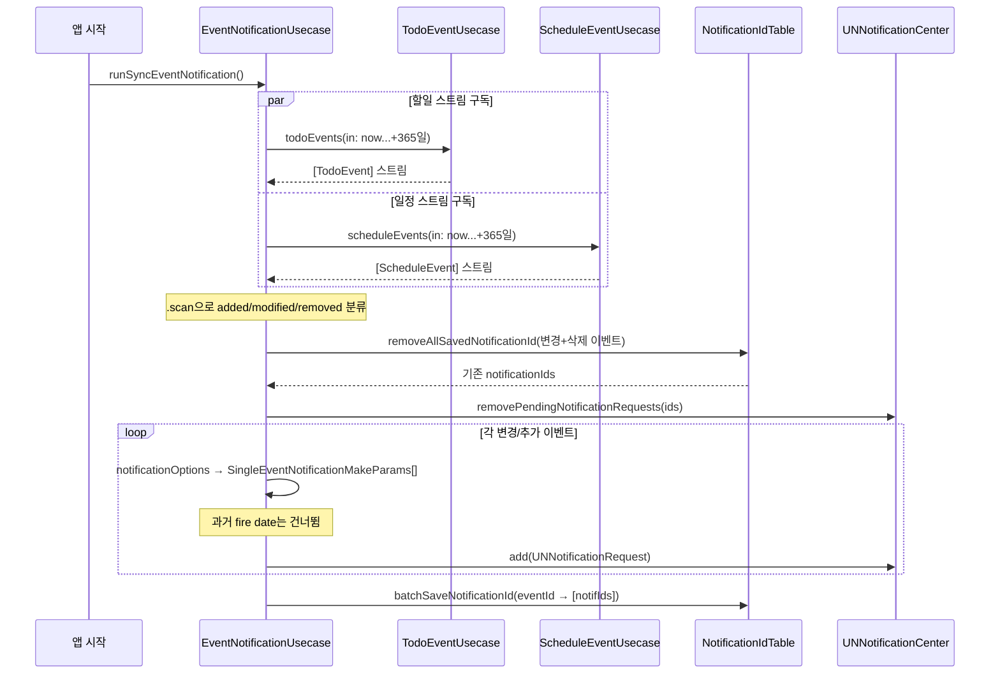
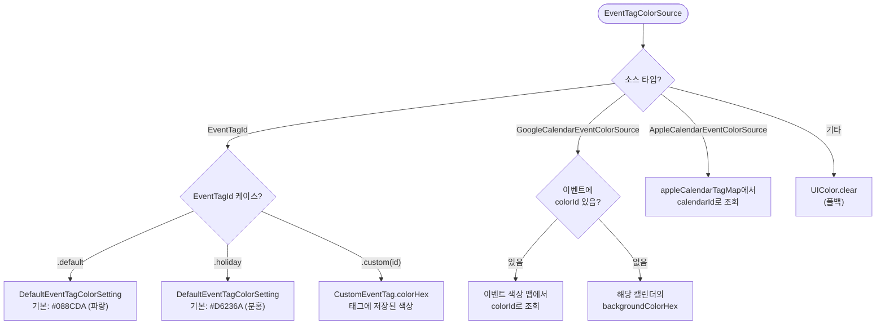

# 이벤트 태그 + 강조 이벤트 + 알림 상세 스펙

> Phase 3 고도화: 섹션 5(이벤트 태그), 6(강조 이벤트), 7(알림)의 L1 상세

---

## 상태 전이 다이어그램

### 태그 삭제 cascade 플로우

```mermaid
flowchart TD
    Start([태그 삭제 요청]) --> Q1{삭제 옵션?}

    Q1 -->|"태그만 삭제"| TagOnly[태그 레코드 삭제\n+ offTagIds에서 제거]
    TagOnly --> Orphan["이벤트의 tagId 참조 남음 (orphan)\n→ 색상은 기본값으로 폴백"]

    Q1 -->|"이벤트 포함 삭제"| Cascade

    subgraph Cascade ["Cascade 삭제"]
        C1[태그 레코드 삭제] --> C2[todoLocalStorage\n.removeTodosWith(tagId)]
        C1 --> C3[scheduleLocalStorage\n.removeSchedulesWith(tagId)]
        C2 --> C4[삭제된 todoIds 반환]
        C3 --> C5[삭제된 scheduleIds 반환]
        C4 --> C6[eventDetailLocalStorage\n.removeDetails(ids)]
        C5 --> C6
    end

    Cascade --> Notify

    subgraph Notify ["SharedDataStore 정리"]
        N1["todoUsecase.handleRemovedTodos(todoIds)"]
        N2["scheduleUsecase.handleRemovedSchedules(scheduleIds)"]
        N3["알림 취소\n(이벤트 삭제로 자동 감지)"]
    end

    Notify --> Check{삭제된 이벤트 중\n강조 이벤트 있음?}
    Check -->|예| Stale["foremostEventId stale 상태\n→ UI에서 nil로 graceful 처리"]
    Check -->|아니오| Done([완료])
```

### 강조 이벤트 상태 전이

```mermaid
stateDiagram-v2
    [*] --> Idle: 앱 시작\nrefresh()

    state Idle {
        [*] --> NoForemost: foremostEventId == nil
        [*] --> HasForemost: foremostEventId != nil
    }

    Idle --> Marking: update(foremost)\nisForemost = true
    Marking --> Idle: 성공/실패\ndefer로 idle 복원

    Idle --> Unmarking: remove()\nisForemost = false
    Unmarking --> Idle: 성공/실패\ndefer로 idle 복원

    HasForemost --> HasForemost: update(다른 이벤트)\n자동 교체
    HasForemost --> StaleRef: 강조 이벤트 외부 삭제/완료

    state StaleRef {
        note right of StaleRef
            foremostEventId는 남아있으나
            참조 이벤트 nil
            → UI에서 강조 섹션 미표시
        end note
    }
```

### 알림 라이프사이클 플로우



### 색상 결정 결정 트리



---

## 1. 이벤트 태그

### 1.1 태그 모델

**EventTagId** (enum) — 태그 식별자:

| 케이스 | 용도 | 예시 |
|---|---|---|
| `.default` | 시스템 기본 태그 | 모든 이벤트의 폴백 |
| `.holiday` | 공휴일 태그 | 공휴일 이벤트 전용 |
| `.custom(String)` | 사용자 생성 태그 (UUID) | `"550e8400-e29b..."` |
| `.externalCalendar(String, String)` | 외부 캘린더 (serviceId, calendarId) | `("google", "primary")` |

**EventTag** (protocol) — 공통 인터페이스:

| 구현체 | 속성 | 비고 |
|---|---|---|
| `DefaultEventTag` | enum (`.default`, `.holiday`) | 시스템 태그, 색상만 변경 가능 |
| `CustomEventTag` | uuid, name, colorHex | 사용자 생성, 전체 편집 가능 |
| `ExternalCalendarEventTag` | serviceId, calendarId, name, colorHex | 외부 캘린더 매핑, 읽기 전용 |

**CustomEventTag** 속성:
- `uuid: String` — 태그 고유 ID
- `name: String` — 태그 이름 (DB UNIQUE 제약)
- `colorHex: String` — 색상 (#RRGGBB)

### 1.2 태그 CRUD

#### 생성

| 항목 | 규칙 |
|---|---|
| 필수 입력 | 이름, 색상(hex) |
| ID 생성 | UUID 자동 생성 |
| 이름 중복 | `skipCheckDuplicationName` 플래그로 제어. false면 중복 시 에러 |
| 생성 후 | SharedDataStore `tags` 키에 즉시 추가, 기본 보임 상태 |

#### 수정

- 이름 및/또는 색상 변경
- SharedDataStore 즉시 반영 → 모든 구독 화면 실시간 업데이트

#### 삭제 — 두 가지 옵션

| 옵션 | 동작 | 영향 범위 |
|---|---|---|
| **태그만 삭제** | 태그 레코드 삭제 + offTagIds에서 제거 | 이벤트의 tagId 참조는 남음 (orphan) |
| **이벤트 포함 삭제** | 태그 + 연결된 Todo/Schedule 모두 삭제 | cascade: 이벤트 상세(EventDetailData), 알림, SharedDataStore 모두 정리 |

이벤트 포함 삭제 시 반환값: 삭제된 `todoIds`, `scheduleIds` → 호출 측에서 SharedDataStore/알림 정리에 사용.

#### 자동 새로고침

TodoEvent/ScheduleEvent 변경 시 새로운 tagId가 감지되면 → `refreshCustomTags()` 자동 호출:
- 현재 SharedDataStore의 태그 맵에 없는 tagId 발견
- Repository에서 해당 태그 로드 → SharedDataStore 갱신

### 1.3 태그 보이기/숨기기

**저장소**: UserDefaults 키 `"off_eventtagIds_on_calendar"` (Array<String>)

**역논리 (Inverse Logic)**: 숨김 태그 ID 집합을 관리. 집합에 **포함되면 숨김**, **미포함이면 보임**.

| 연산 | 메서드 | 설명 |
|---|---|---|
| 단일 토글 | `toggleTagIsOn(id)` | set에 있으면 제거(보임), 없으면 추가(숨김) |
| 일괄 숨기기 | `addOffIds([EventTagId])` | 여러 태그를 한번에 숨김 처리 |
| 일괄 보이기 | `removeOffIds([EventTagId])` | 여러 태그를 한번에 보임 처리 |
| 서비스별 초기화 | `resetExternalCalendarOffTagId(serviceId)` | 계정 해제 시 해당 서비스의 off 태그 정리 |

**기본 가시성**:

| 태그 유형 | 생성 시 가시성 | 이유 |
|---|---|---|
| 커스텀 태그 | **보임** | 사용자가 직접 만든 것이므로 |
| 외부 캘린더 태그 | **숨김** | 구글 캘린더의 `isSelected != true`인 캘린더는 숨김 기본 |

**영향 범위**:

| 화면 | 영향 |
|---|---|
| 캘린더 그리드 | 숨겨진 태그의 이벤트 색상 바 미표시 |
| 일별 이벤트 목록 | 숨겨진 태그의 이벤트 필터링 |
| 위젯 | 숨겨진 태그의 이벤트 제외 |
| 태그 관리 화면 | 숨김 상태 토글 UI 표시 |

### 1.4 색상 결정 체계

**EventTagColorSource** (marker protocol) — 색상 소스 타입 디스패치:

| 소스 타입 | 결정 방식 | 우선순위 |
|---|---|---|
| `EventTagId` (.default/.holiday) | `DefaultEventTagColorSetting`의 hex 값 | 설정에서 변경 가능 |
| `EventTagId` (.custom) | `CustomEventTag.colorHex` | 태그 자체 색상 |
| `GoogleCalendarEventColorSource` | calendarId → 캘린더 기본색 + 이벤트별 colorId 오버라이드 | 구글 API 색상 |
| `AppleCalendarEventColorSource` | calendarId → 시스템 캘린더 색상 | Apple 캘린더 색상 |

**DefaultEventTagColorSetting** 기본값:
- holiday: `#D6236A` (분홍)
- default: `#088CDA` (파랑)
- 설정 화면에서 사용자 변경 가능

**구글 캘린더 색상 결정**:
1. 이벤트에 `colorId`가 있으면 → 이벤트 색상 맵에서 조회
2. `colorId` 없으면 → 해당 캘린더의 기본 `backgroundColorHex` 사용
3. 색상 맵은 계정 연동 시 Google Calendar API에서 로드

**UI 렌더링**: `EventTagColorView`가 소스 타입에 따라 자동 디스패치 → 적절한 색상 반환.

### 1.5 태그 관리 화면 (EventTagListView)

**섹션 구성**:
1. 시스템 태그 (default, holiday) — 색상만 변경 가능
2. 커스텀 태그 목록 — 이름/색상 편집, 삭제 가능
3. 외부 캘린더 태그 (구글 계정별 그룹) — 보이기/숨기기만 가능

**셀 모델**: 태그 정보 + 현재 보이기/숨기기 상태 (offTagIds와 비교)

### 1.6 이벤트에 태그 할당 (SelectEventTag)

- 이벤트 생성/수정 시 태그 선택 화면으로 이동
- 현재 커스텀 태그 목록 표시 + 새 태그 생성 가능
- 선택 결과를 Listener 패턴으로 부모에게 전달 (`EventTagId`)
- 새 태그 생성 시 SettingScene의 태그 상세 화면으로 라우팅

---

## 2. 강조 이벤트 (Foremost Event)

### 2.1 개요

사용자가 가장 중요한 이벤트 **1개**를 지정하는 기능. 캘린더 일별 목록 최상단 및 위젯에서 강조 노출.

### 2.2 ForemostEventId 모델

```
ForemostEventId
├── eventId: String       — 이벤트 UUID
├── isTodo: Bool          — true=할일, false=일정
└── init(event: ForemostMarkableEvent)  — 다형성 팩토리
```

**ForemostMarkableEvent** (protocol): `TodoEvent`과 `ScheduleEvent` 모두 채택. `eventId`와 `eventTagId` 제공.

### 2.3 강조 이벤트 지정/해제

**지정 (Mark)**:

```
사용자: 이벤트 컨텍스트 메뉴 → "강조 이벤트 지정"
  → EventListCellEventHandler.handleMoreAction(.toggleTo(isForemost: true))
  → ForemostEventUsecase.update(ForemostEventId)
  → Repository.updateForemostEvent(eventId)
    ├─ Local: EnvironmentStorage 키 업데이트
    └─ Remote: PUT /foremost {event_id, is_todo}
  → SharedDataStore.put(ForemostEventId, key: foremostEventId)
  → 모든 구독자에게 전파
```

**해제 (Unmark)**:

```
사용자: 강조 이벤트 컨텍스트 메뉴 → "강조 해제"
  → ForemostEventUsecase.remove()
  → Repository.removeForemostEvent()
    ├─ Local: EnvironmentStorage 키 삭제
    └─ Remote: DELETE /foremost
  → SharedDataStore.delete(key: foremostEventId)
```

**교체**: 다른 이벤트를 지정하면 기존 강조가 자동 해제 (별도 unmark 불필요).

### 2.4 상태 관리 (ForemostMarkingStatus)

| 상태 | 의미 | 전환 시점 |
|---|---|---|
| `.idle` | 대기 중 | 초기 상태, 작업 완료/실패 후 |
| `.marking(eventId)` | 지정 중 | `update()` 호출 시 |
| `.unmarking` | 해제 중 | `remove()` 호출 시 |

- 작업 성공/실패 모두 `defer` 블록으로 `.idle` 복원 보장
- UI에서 로딩 인디케이터 표시에 활용

### 2.5 데이터 흐름 — Publisher 체인

`foremostEvent` Publisher 구현:

```
SharedDataStore[foremostEventId] (ForemostEventId?)
  → switchMap:
    ├─ id.isTodo == true  → SharedDataStore[todos][id.eventId] (TodoEvent?)
    ├─ id.isTodo == false → SharedDataStore[schedules][id.eventId] (ScheduleEvent?)
    └─ id == nil          → Just(nil)
  → AnyPublisher<(any ForemostMarkableEvent)?, Never>
```

- `foremostEventId` 변경 시 자동으로 적절한 이벤트 스트림으로 전환
- 이벤트 자체가 변경(이름, 시간 등)되어도 실시간 반영

### 2.6 캘린더 일별 목록 표시

- **섹션 위치**: 이벤트 목록 최상단 (섹션 1)
- **표시 조건**: `foremostEvent != nil`일 때만 표시
- **UI**: "강조 이벤트" 헤더 + `EventListCellView` (isForemost: true)
- 캘린더 이벤트 계산 시 해당 이벤트에 `isForemost: true` 플래그 설정 → 별도 강조 스타일

### 2.7 위젯 표시 (ForemostEventWidget)

**지원 사이즈**: `.accessoryInline` (잠금화면), `.systemSmall`, `.systemMedium`

**표시 로직**:
1. `ForemostEventWidgetViewModelProvider.getViewModel(refTime)` 호출
2. 저장된 foremostEventId로 이벤트 로드
3. TodoEvent → `TodoEventCellViewModel` 생성
4. ScheduleEvent → 과거 일정이면 `nil` (표시 안함), 미래면 `ScheduleEventCellViewModel` 생성
5. 이벤트 없으면 → 빈 상태 (랜덤 이모지 + "모두 완료" 메시지)

**TodoToggleIntent 연동**:
- 위젯에서 할일 완료 토글 버튼 표시
- `TodoToggleIntent(id: todoId, isForemost: true)` 실행
- `isForemost: true` 시 위젯 캐시 리셋 플래그 설정
- 완료 후 `WidgetCenter.shared.reloadAllTimelines()` 호출

### 2.8 엣지 케이스

| 시나리오 | 동작 |
|---|---|
| **강조 이벤트 삭제됨** | Repository에서 eventId 조회 실패 → `nil` 반환 (graceful degradation). DayEventList/Widget 모두 강조 섹션 사라짐 |
| **강조 할일 완료됨** | 완료 후에도 강조 상태 유지. 할일이 todos 테이블에 남아있는 한 표시됨 |
| **반복 일정이 강조** | base ScheduleEvent UUID로 저장. 캘린더에서 모든 반복 인스턴스에 `isForemost: true` 표시. 위젯은 다음 미래 인스턴스만 표시 |
| **할일 → 일정 교체** | 새 이벤트 지정 시 기존 자동 해제. `foremostEventId` 교체 → Publisher가 schedule$ 스트림으로 전환 |

### 2.9 API 엔드포인트

| 메서드 | 경로 | 바디 | 설명 |
|---|---|---|---|
| GET | `/foremost` | — | 현재 강조 이벤트 로드 |
| PUT | `/foremost` | `{event_id, is_todo}` | 강조 이벤트 지정/교체 |
| DELETE | `/foremost` | — | 강조 이벤트 해제 |

**Remote 캐시 전략**: Stale-While-Revalidate — 캐시 값 즉시 emit → 서버 응답으로 교체 → 캐시 업데이트.

### 2.10 로컬라이제이션 키

| 키 | 용도 |
|---|---|
| `calendar::foremostevent:title` | 일별 목록 섹션 헤더 |
| `widget.events.foremost::allFinished::message` | 위젯 빈 상태 텍스트 |
| `calendarEventMoreActionForemostMarkItemName` | 컨텍스트 메뉴: "강조 지정" |
| `calendarEventMoreActionForemostUnmarkItemName` | 컨텍스트 메뉴: "강조 해제" |

---

## 3. 알림

### 3.1 알림 시간 옵션 (EventNotificationTimeOption)

#### 시간 지정 이벤트용 (forAllDay: false)

| 옵션 | 코드 | 설명 |
|---|---|---|
| 정시 | `.atTime` | 이벤트 시각에 알림 |
| 1분 전 | `.before(seconds: 60)` | |
| 5분 전 | `.before(seconds: 300)` | |
| 10분 전 | `.before(seconds: 600)` | |
| 15분 전 | `.before(seconds: 900)` | |
| 30분 전 | `.before(seconds: 1800)` | |
| 1시간 전 | `.before(seconds: 3600)` | |
| 2시간 전 | `.before(seconds: 7200)` | |
| 1일 전 | `.before(seconds: 86400)` | |
| 2일 전 | `.before(seconds: 172800)` | |
| 7일 전 | `.before(seconds: 604800)` | |

#### 하루종일 이벤트용 (forAllDay: true)

| 옵션 | 코드 | 설명 |
|---|---|---|
| 당일 9시 | `.allDay9AM` | 이벤트 당일 오전 9:00 |
| 당일 12시 | `.allDay12AM` | 이벤트 당일 정오 12:00 |
| 1일 전 9시 | `.allDay9AMBefore(seconds: 86400)` | |
| 2일 전 9시 | `.allDay9AMBefore(seconds: 172800)` | |
| 7일 전 9시 | `.allDay9AMBefore(seconds: 604800)` | |

#### 커스텀

`.custom(DateComponents)` — 절대 날짜/시간으로 자유 지정.

### 3.2 Fire Date 계산

알림 시간은 이벤트의 `EventTime` 타입에 따라 다르게 계산된다.

#### 비-하루종일 이벤트 (.at / .period)

| 옵션 | 계산 공식 | 트리거 타입 |
|---|---|---|
| `.atTime` | `fireDate = eventStartTime` | `UNTimeIntervalNotificationTrigger` |
| `.before(N)` | `fireDate = eventStartTime - N` | `UNTimeIntervalNotificationTrigger` |
| `.custom(comps)` | 절대 DateComponents | `UNCalendarNotificationTrigger` |

- `.period` 이벤트는 `range.lowerBound`를 시작 시간으로 사용
- `fireDate < now`이면 트리거 생성하지 않음 (과거 알림 무시)

#### 하루종일 이벤트 (.allDay)

| 옵션 | 계산 과정 | 트리거 타입 |
|---|---|---|
| `.allDay9AM` | 이벤트 날짜의 9:00 AM (이벤트 타임존 기준) | `UNCalendarNotificationTrigger` |
| `.allDay12AM` | 이벤트 날짜의 12:00 PM (이벤트 타임존 기준) | `UNCalendarNotificationTrigger` |
| `.allDay9AMBefore(N)` | `(이벤트 시작일 - N초)` 날짜의 9:00 AM | `UNCalendarNotificationTrigger` |

**타임존 처리**:
1. 이벤트의 `secondsFromGMT`로 `TimeZone` 객체 생성
2. 해당 타임존의 Calendar로 날짜 컴포넌트 추출 (year, month, day)
3. hour/minute/second를 9:00:00 또는 12:00:00으로 설정
4. `UNCalendarNotificationTrigger(dateMatching:)` — 시스템이 타임존 독립적으로 매칭

**예시**: KST(+9) 하루종일 이벤트 2026-04-15
- `.allDay9AM` → DateComponents(year:2026, month:4, day:15, hour:9, minute:0, second:0)
- `.allDay9AMBefore(86400)` → DateComponents(year:2026, month:4, day:14, hour:9, minute:0, second:0)

### 3.3 이벤트당 복수 알림

하나의 이벤트에 여러 알림 시간을 설정할 수 있다.

```
TodoEvent (notificationOptions: [.atTime, .before(300)])
  → SingleEventNotificationMakeParams #1 (.atTime)
  → SingleEventNotificationMakeParams #2 (.before(300))
  → UNNotificationRequest #1 (id: "uuid-1")
  → UNNotificationRequest #2 (id: "uuid-2")
  → DB 저장: eventId → ["uuid-1", "uuid-2"]
```

### 3.4 알림 스케줄링 라이프사이클

#### 전체 흐름

```
앱 시작 → EventNotificationUsecase.runSyncEventNotification()
  ├─ runSyncTodoEvents(): TodoEventUsecase.todoEvents(in: now...+365일) 구독
  └─ runSyncScheduleEvents(): ScheduleEventUsecase.scheduleEvents(in: now...+365일) 구독
```

#### 변경 감지 + 처리 파이프라인

```
이벤트 스트림 변경 감지 (.scan으로 added/modified/removed 분류)
  ↓
1단계 — 제거: 변경/삭제된 이벤트의 기존 알림 ID를 DB에서 조회
  → UNUserNotificationCenter.removePendingNotificationRequests(withIdentifiers:)
  → DB에서 매핑 레코드 삭제
  ↓
2단계 — 생성: 변경/추가된 이벤트의 notificationOptions으로 SingleEventNotificationMakeParams 생성
  → 각 params에 대해 UNNotificationRequest 생성 + 스케줄
  → 과거 fire date는 자동 건너뜀 (trigger == nil)
  ↓
3단계 — 저장: eventId → [notificationIds] 매핑을 DB에 일괄 저장
```

#### 이벤트 변경 시나리오별 동작

| 시나리오 | 제거 단계 | 생성 단계 |
|---|---|---|
| 이벤트 생성 | — | 새 알림 생성 |
| 이름/시간 변경 | 기존 알림 전부 취소 | 변경된 정보로 재생성 |
| 알림 옵션 추가/제거 | 기존 알림 전부 취소 | 현재 옵션으로 재생성 |
| 이벤트 삭제 | 기존 알림 전부 취소 | — |
| 할일 완료 | 기존 알림 취소 | — (완료된 이벤트는 범위에서 제외) |

### 3.5 반복 이벤트 알림

반복 일정(`ScheduleEvent`)의 알림은 **각 반복 인스턴스마다 개별 생성**된다.

```
ScheduleEvent (매월 반복, notificationOptions: [.atTime])
  → repeatingTimes: [4월, 5월, ..., 내년 3월] (12개 인스턴스)
  → 12개의 SingleEventNotificationMakeParams 생성
  → 12개의 UNNotificationRequest 스케줄
```

**제외된 인스턴스**: `repeatingTimeToExcludes`에 포함된 시간의 인스턴스는 알림 대상에서 제외.

**스케줄링 범위**: 현재부터 365일 이내의 인스턴스만 대상.

### 3.6 알림 ID 관리

**저장소**: SQLite `EventNotificationIdTable`

| 컬럼 | 타입 | 설명 |
|---|---|---|
| `eventId` | TEXT NOT NULL | 이벤트 UUID |
| `notificationReqId` | TEXT NOT NULL | iOS UNNotificationRequest.identifier |

**연산**:
- `batchSaveNotificationId([eventId: [notificationIds]])` — 일괄 저장
- `removeAllSavedNotificationId(of: [eventId])` → `[notificationReqId]` — 이벤트별 전체 제거, 제거된 ID 반환

### 3.7 기본 알림 설정

이벤트 생성 시 자동으로 적용되는 기본 알림 옵션.

**저장소**: UserDefaults (EnvironmentStorage)
- 키: `"default_event_notification_time"` (시간 이벤트)
- 키: `"default_allday_event_notification_time"` (하루종일 이벤트)

**동작**:
- 설정 화면에서 시간 이벤트 / 하루종일 이벤트 별도로 기본 알림 옵션 선택 가능
- 새 이벤트 생성 시 해당 옵션이 사전 선택됨
- `nil` 설정 가능 (기본 알림 없음)

### 3.8 알림 권한

**UNUserNotificationCenter** 기반:

| 상태 | 설명 |
|---|---|
| `.notDetermined` | 아직 요청 안함 |
| `.denied` | 사용자 거부 |
| `.authorized` | 허용됨 |

- 설정 화면에서 현재 권한 상태 표시
- `.denied` 시 시스템 알림 설정으로 이동 가능
- 알림 스케줄링은 권한과 독립적으로 수행 (권한 없으면 iOS가 알림 표시 안함)

### 3.9 FCM 푸시 알림

로컬 알림과 별도로, 서버 기반 푸시 알림 지원.

**등록 플로우**:

```
앱 시작 → FCM SDK에서 토큰 발급
  → UserNotificationUsecase.register(fcmToken:)
  → DeviceInfo 수집 (deviceModel)
  → PUT /notification {fcm_token, device_model}
  → 토큰을 SQLite KeyValueTable에 저장 (중복 등록 방지)
```

**토큰 갱신**: 이전 토큰과 동일하면 API 호출 건너뜀.

**해제**: `DELETE /notification` — 로그아웃 시 호출.

**용도**: 서버 측에서 시스템 알림 (다른 기기에서의 변경, 공유 이벤트 등) 발송에 사용. 이벤트 리마인더는 로컬 알림으로 처리.

### 3.10 iOS 64개 알림 제한

**현재 상태**: 명시적 제한 처리 로직 없음.

**iOS 동작**: `UNUserNotificationCenter`는 최대 64개 pending notification 허용. 초과 시 가장 먼저 fire되는 알림 우선 유지, 나머지 무시.

**암묵적 완화**:
- 365일 스케줄링 범위가 자연적으로 알림 수를 제한
- 대부분의 사용자는 64개 미만의 미래 알림 보유
- 반복 이벤트가 많은 경우 초과 가능성 존재

**잠재적 리스크 시나리오**:
- 매일 반복 이벤트 × 2개 알림 옵션 = 730개 알림 → iOS가 일부 무시
- 사용자에게 별도 경고/안내 없음

### 3.11 알림 표시 텍스트

`SingleEventNotificationMakeParams`에서 알림 내용 구성:

| 필드 | 내용 |
|---|---|
| title | 이벤트 이름 |
| body | 이벤트 시간 텍스트 (예: "오늘 23:59", "내일 14:00", "4/15 09:00") |

**시간 텍스트 규칙**:
- 오늘 이벤트: "오늘 HH:mm"
- 내일 이벤트: "내일 HH:mm"
- 그 외: "MM/DD HH:mm"

---

## 4. 연관 관계

### 태그 ↔ 알림
- 태그 삭제(이벤트 포함)시 해당 이벤트의 알림도 제거됨
- 알림 자체는 태그와 직접 연관 없음 (이벤트 경유)

### 강조 이벤트 ↔ 알림
- 강조 이벤트에 알림이 설정되어 있으면 일반 알림과 동일하게 동작
- 강조 여부가 알림에 영향을 주지 않음

### 태그 ↔ 강조 이벤트
- 강조 이벤트의 색상은 해당 이벤트의 태그 색상으로 결정
- 태그 숨김 처리해도 강조 이벤트는 항상 표시 (태그 필터와 독립)

---

## 5. 추가 엣지 케이스

### 5.1 태그 삭제(태그만) 후 이벤트 색상

```
상황: 커스텀 태그 "업무" (#FF0000) 삭제 (태그만, 이벤트 유지)
이벤트 "회의"의 eventTagId = .custom("업무태그ID")

결과:
  1. CustomEventTag 레코드 삭제
  2. 이벤트의 eventTagId는 .custom("업무태그ID") 그대로 유지 (orphan)
  3. EventTagColorView에서 해당 tagId 조회 → CustomEventTag 없음
  4. → 색상 폴백: UIColor.clear 또는 기본 색상

의미: 태그만 삭제하면 이벤트에 "유령 태그" 참조가 남음.
     사용자가 해당 이벤트를 수정하여 다른 태그를 할당하면 해소됨.
```

### 5.2 태그 숨김 + 강조 이벤트의 독립성

```
상황: "업무" 태그를 캘린더에서 숨김 (offTagIds에 추가)
     "업무" 태그의 할일이 강조 이벤트로 지정됨

결과:
  캘린더 일별 목록:
    - 이벤트 목록 섹션: "업무" 태그 이벤트 필터링 → 미표시
    - 강조 이벤트 섹션: 태그 필터와 독립 → 정상 표시 ✓

  위젯:
    - ForemostEventWidget: 강조 이벤트 정상 표시
    - EventListWidget: 숨겨진 태그 이벤트 필터링 → 미표시

의미: 강조 이벤트는 태그 가시성 설정에 영향받지 않음.
     같은 이벤트가 "강조 섹션에서는 보이고, 이벤트 목록에서는 안 보임".
```

### 5.3 반복 일정이 강조 이벤트일 때 — 제외와 분기

```
상황: 매주 월요일 일정(uuid=A)이 강조 이벤트
동작: .onlyThisTime(3/17)으로 수정 → 새 이벤트 B 생성

결과:
  foremostEventId = {eventId: A, isTodo: false}
  원본 A: excludes += {3/17}. UUID 불변 → 강조 상태 유지 ✓
  새 이벤트 B: 단독 이벤트. 강조 아님.

  위젯 표시:
    다음 미래 인스턴스 = A의 다음 반복 (3/24)
    3/17은 B이지만 B는 강조 아님 → 위젯에 미표시

동작: .fromNow(4/7)으로 분기 → A 종료 + 새 이벤트 C 생성

결과:
  A: until(4/6)으로 종료. UUID 불변 → 강조 상태 유지
  C: 새 UUID. 강조 아님.

  위젯 표시:
    A의 마지막 미래 인스턴스 표시
    A 종료 후 → foremostEvent가 nil 반환 (A에서 미래 인스턴스 없음)
    → 강조 위젯 빈 상태 표시

의미: 분기 후 새 시리즈(C)는 자동으로 강조가 되지 않음.
     사용자가 C를 새로 강조 지정해야 함.
```

### 5.4 알림 — 이벤트 시간 변경 시 전량 재생성

```
상황: 할일 "회의" (알림: 정시 + 30분 전), time = 3/15 14:00
동작: 시간을 3/16 10:00으로 변경

알림 처리:
  1. scan이 "modified" 감지
  2. 기존 알림 2개 취소 (DB에서 eventId → [notifId1, notifId2] 조회)
  3. 새 fire date 계산:
     - 정시: 3/16 10:00
     - 30분 전: 3/16 09:30
  4. 새 UNNotificationRequest 2개 생성 + 스케줄
  5. DB: eventId → [newNotifId1, newNotifId2]

주의: 이름만 변경해도 동일 프로세스 실행.
     알림 내용(title)이 달라지므로 전량 재생성 필요.
```

### 5.5 알림 — 반복 일정의 인스턴스별 알림 수

```
상황: 매일 반복 일정, 알림 2개 (정시 + 1시간 전)
스케줄링 범위: 365일

알림 수 계산:
  365 인스턴스 × 2 옵션 = 730개 알림 요청

iOS 64개 제한:
  UNNotificationCenter는 64개만 pending 유지
  → 가장 가까운 fire date 기준 64개 유지
  → 약 32일분의 알림만 실제 스케줄됨
  → 33일 이후의 알림은 iOS가 자동 무시

앱에서의 완화:
  매번 scan 변경 시 전체 재스케줄하므로,
  가까운 알림이 fire된 후 다음 scan에서 새 알림이 채워짐.
  → 실질적으로 "슬라이딩 윈도우" 효과.
  단, scan 트리거 빈도에 의존하므로 보장은 아님.
```

### 5.6 알림 — 하루종일 이벤트의 타임존 변경

```
상황: KST(+9)에서 하루종일 이벤트 생성 → 알림: 당일 9시
     사용자가 미국 PST(-8)로 이동

알림 fire date:
  UNCalendarNotificationTrigger(dateMatching: {year:2026, month:4, day:15, hour:9})
  → 시스템 Calendar가 현재 타임존 기준으로 매칭
  → PST에서는 PST 4/15 09:00에 알림 fire

이벤트 표시:
  allDay 이벤트의 overlap 판정은 저장된 secondsFromGMT 기준
  → KST 4/15 하루종일 = PST에서 4/14 오후~4/15 오후로 표시

불일치:
  알림은 PST 4/15 09:00에 오지만,
  이벤트는 PST 기준 4/14 오후에 시작.
  → 알림이 이벤트 "다음 날" 오전에 오는 것처럼 보일 수 있음.
```
