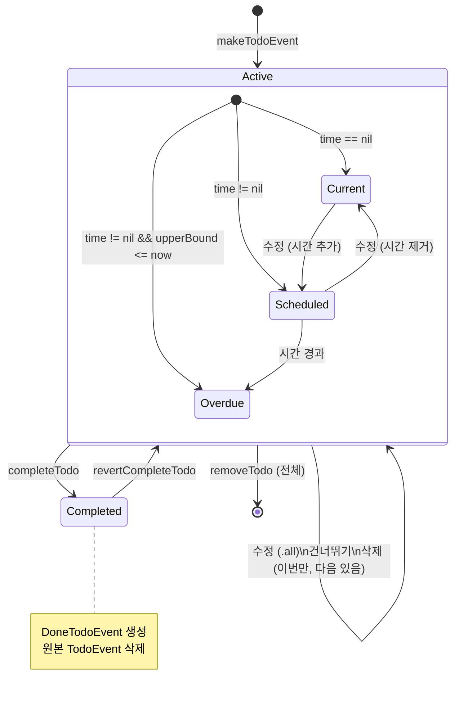
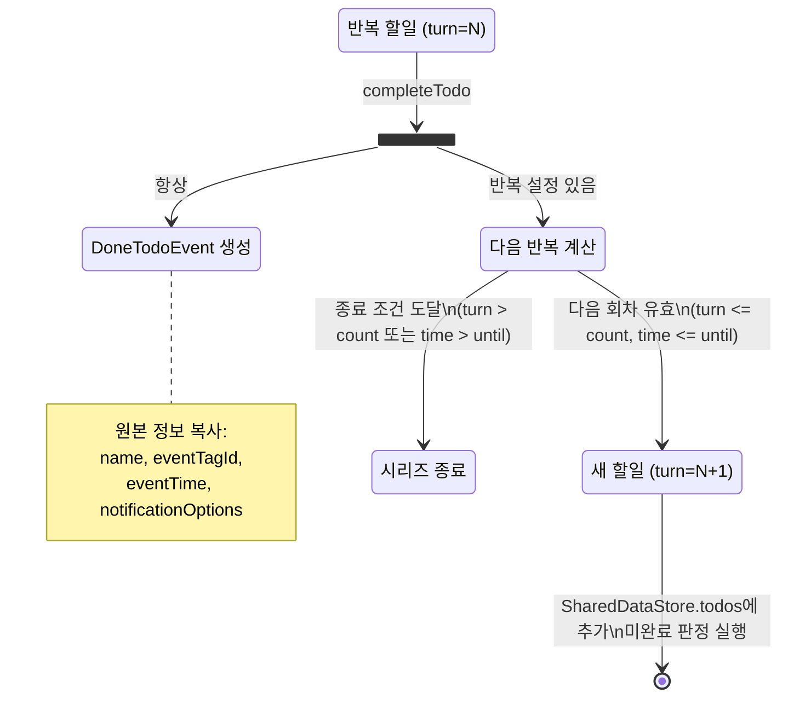
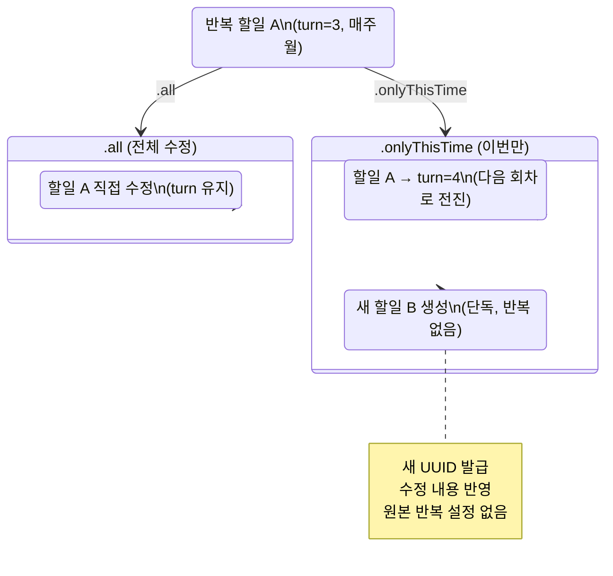
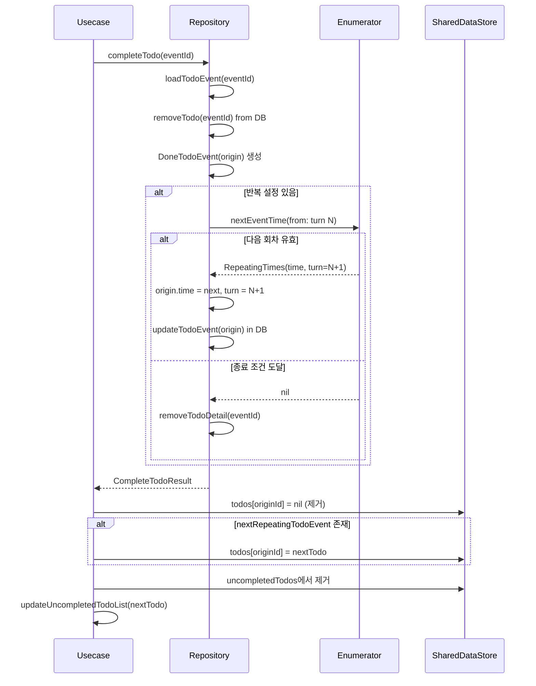
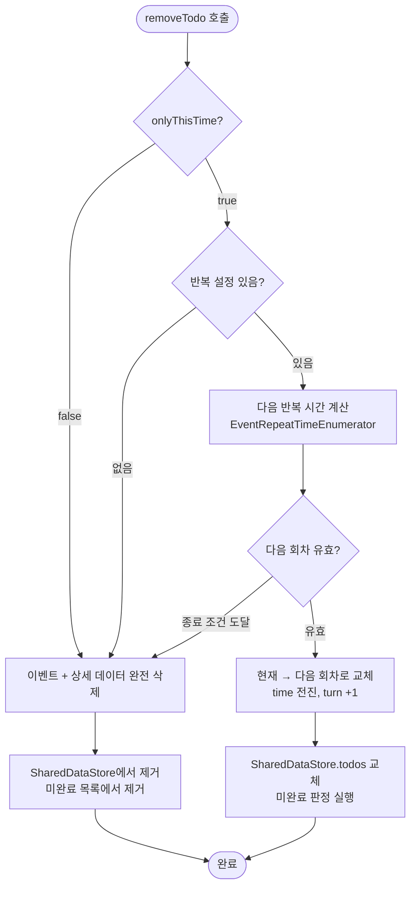
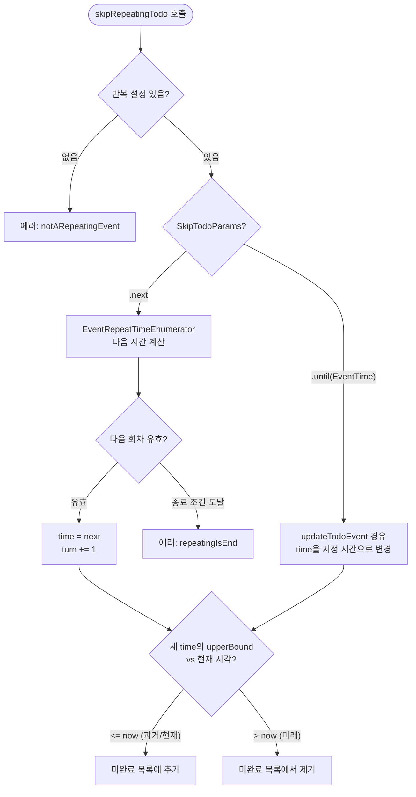
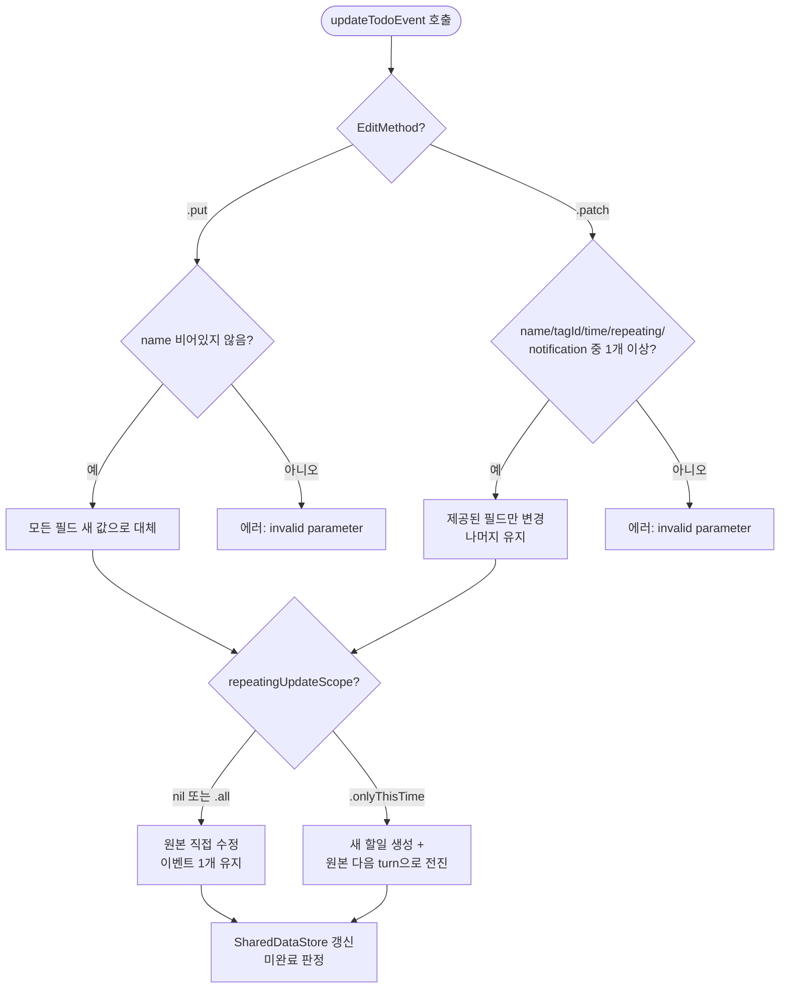

# 할일 (TodoEvent) 상세 스펙

> 메인 기획서 [섹션 3.1](../product-specification.md#31-할일-todoevent) 참조

---

## 상태 전이 다이어그램

### 할일 전체 생명주기



### 반복 할일 완료 플로우



### 수정 범위별 상태 전이



---

## 1. 데이터 구조

| 속성 | 타입 | 설명 | 기본값 |
|---|---|---|---|
| uuid | String | 고유 식별자 | 자동 생성 |
| name | String | 이벤트 이름 | (필수) |
| creatTimeStamp | TimeInterval? | 생성 시각 | 현재 시각 |
| eventTagId | EventTagId? | 태그/색상 | nil |
| time | EventTime? | 시간 (없으면 "현재 할일") | nil |
| repeating | EventRepeating? | 반복 설정 | nil |
| repeatingTurn | Int? | 현재 반복 회차 | nil (= turn 1) |
| notificationOptions | [EventNotificationTimeOption] | 알림 시간 목록 | [] |

---

## 2. 할일 생성

### 유효성 검증

| 조건 | 결과 |
|---|---|
| `name`이 nil이거나 빈 문자열 | 에러: `"invalid parameter for make Todo Event"` |
| `name`이 비어있지 않음 | 유효 (다른 필드는 모두 선택) |

- `time`, `eventTagId`, `repeating`, `notificationOptions`는 **전부 선택 사항**
- 시간 없이 이름만으로 생성 가능 → "현재 할일" (단순 체크리스트)

### 생성 결과

1. UUID 자동 생성
2. `creatTimeStamp` = 현재 시각
3. SharedDataStore `todos[uuid]`에 추가
4. 미완료 할일 목록 자동 갱신 ([미완료 할일 정책](uncompleted-todos.md) 참조)

---

## 3. 할일 수정

### 수정 방식 (EditMethod)

| 방식 | 유효성 조건 | 용도 |
|---|---|---|
| `.put` (전체 교체) | `name`이 비어있지 않을 것 | 모든 필드를 새 값으로 대체 |
| `.patch` (부분 수정) | name, eventTagId, time, repeating, notificationOptions 중 **최소 1개** 제공 | 제공된 필드만 변경, 나머지 유지 |

유효하지 않으면 에러: `"invalid parameter for update Todo event"`

### 반복 할일의 수정 범위 (RepeatingUpdateScope)

| 범위 | 동작 | 결과 |
|---|---|---|
| `.all` | 원본 이벤트 직접 수정 | 이벤트 1개 유지 |
| `.onlyThisTime` | 수정 내용으로 **새 할일 생성** + 원본은 다음 반복으로 전진 | 이벤트 2개 (새 할일 + 원본 다음 회차) |

#### `.onlyThisTime` 상세 플로우

```
Before:
  할일 A: "운동" 매주 월요일 (현재 turn=3)

Action:
  3/17(월)만 "수영"으로 변경 (.onlyThisTime)

After:
  할일 A: "운동" 매주 월요일 (turn=4, 3/24로 전진)
  할일 B: "수영" 3/17 (단독, 반복 없음, 새 UUID)
```

1. 수정 파라미터를 `TodoMakeParams`로 변환하여 새 할일 생성
2. 원본 할일을 다음 반복 회차로 전진 (Repository의 `replaceRepeatingTodo`)
3. SharedDataStore에 두 이벤트 모두 반영
4. 미완료 할일 목록 갱신

---

## 4. 할일 완료

### 상태 전이 매트릭스

| 시간 | 반복 | 원본 할일 | DoneTodoEvent | 다음 반복 할일 |
|---|---|---|---|---|
| 없음 | 없음 | **삭제** | 생성 | — |
| 있음 | 없음 | **삭제** | 생성 | — |
| 없음 | 있음 | **삭제** | 생성 | 새 인스턴스 생성 |
| 있음 | 있음 | **삭제** | 생성 | 새 인스턴스 생성 |

**공통 동작**:
- 원본 할일은 항상 SharedDataStore `todos`에서 제거
- DoneTodoEvent 생성 (원본 정보 복사)
- 미완료 할일 목록에서 제거

**반복 이벤트 추가 동작**:
- 다음 반복 회차의 새 TodoEvent 생성 (다른 UUID)
- 새 할일을 `todos`에 추가
- 새 할일에 대해 미완료 판정 실행 (시간 기준)

### DoneTodoEvent 구조

| 속성 | 타입 | 설명 |
|---|---|---|
| uuid | String | 완료 기록 고유 ID (원본과 다름) |
| originEventId | String | 원본 TodoEvent.uuid |
| name | String | 원본 이름 복사 |
| eventTagId | EventTagId? | 원본 태그 복사 |
| eventTime | EventTime? | 원본 예정 시간 복사 |
| doneTime | Date | 실제 완료 시각 |
| notificationOptions | [EventNotificationTimeOption] | 원본 알림 옵션 복사 |

### CompleteTodoResult (완료 결과)

| 필드 | 설명 |
|---|---|
| doneEvent | 생성된 DoneTodoEvent |
| doneTodoEventDetail | 원본 이벤트 상세 데이터 (장소, URL, 메모) 복사본 |
| nextRepeatingTodoEvent | 반복인 경우 다음 회차 TodoEvent, 아니면 nil |

### 완료 처리 시퀀스 (반복 할일)



---

## 5. 할일 완료 취소 (되돌리기)

- DoneTodoEvent 삭제
- 원본 TodoEvent 복원 → SharedDataStore `todos`에 추가
- 이벤트 상세 데이터(장소, URL, 메모)도 함께 복원

### RevertTodoResult (되돌리기 결과)

| 필드 | 설명 |
|---|---|
| revertTodo | 복원된 TodoEvent |
| revertTodoDetail | 복원된 이벤트 상세 데이터 |

---

## 6. 할일 삭제

| onlyThisTime | 반복 여부 | 동작 | 결과 |
|---|---|---|---|
| `false` | 무관 | 전체 삭제 | 이벤트 완전 제거 |
| `true` | 다음 반복 있음 | 현재 건너뛰기 | 다음 반복 회차로 교체 |
| `true` | 다음 반복 없음 (종료) | 전체 삭제 | 이벤트 완전 제거 |

- 삭제 시 미완료 할일 목록에서도 제거
- `onlyThisTime=true`로 다음 회차가 생기면 → 새 회차에 대해 미완료 판정

### 삭제 플로우



---

## 7. 할일 건너뛰기 (반복 할일 전용)

| 파라미터 | 동작 | 상세 |
|---|---|---|
| `.next` | 다음 1회 건너뛰기 | Repository가 반복 규칙으로 다음 시간 계산, repeatingTurn 증가 |
| `.until(EventTime)` | 지정 시간까지 건너뛰기 | 할일의 time을 지정 시간으로 변경 (updateTodoEvent 경유) |

**에러 케이스**:
| 조건 | 에러 |
|---|---|
| 반복 설정이 없는 할일 | `ClientErrorKeys.notARepeatingEvent` |
| 반복이 이미 종료된 할일 | `ClientErrorKeys.repeatingIsEnd` |

**건너뛰기 후 상태**:
- 새 시간이 과거/현재 → 미완료 목록에 추가 (기한 초과)
- 새 시간이 미래 → 미완료 목록에서 제거

**건너뛰기와 count 종료의 상호작용**:
```
count=3 반복 할일:
turn 1 → 완료         (실행 O, 1회 소비)
turn 2 → 건너뛰기(.next) (실행 X, 1회 소비)
turn 3 → 유효         (실행 O, 1회 소비)
turn 4 → 종료         (count 3회 모두 소비)
→ 실제 실행 2회, 건너뛴 1회, 총 3회 소비
```

---

## 8. 일괄 제거 (handleRemovedTodos)

외부에서 할일이 삭제되었을 때 로컬 상태 정리.

**트리거**:
- 태그 삭제 시 연관 이벤트 cascade 삭제
- 서버 동기화에서 삭제 감지

**동작**:
- Repository 호출 **없음** — SharedDataStore에서만 제거
- `todos`와 `uncompletedTodos` 모두에서 해당 ID 필터링

---

## 9. 할일 조회 & 필터링

| 조회 유형 | 필터 조건 | 용도 |
|---|---|---|
| 현재 할일 | `time == nil` | 시간 없는 단순 할일 목록 |
| 기간별 할일 | `time != nil` AND `time.isRoughlyOverlap(with: period)` | 캘린더의 날짜별 할일 |
| 미완료 할일 | [별도 정책](uncompleted-todos.md) | 기한 지난 할일 |
| 단건 조회 | UUID 매칭 | 상세 화면 |
| 완료 할일 | UUID 매칭 / 페이지네이션 | 완료 목록/상세 |

### 현재 할일 로딩 (refreshCurentTodoEvents)

- Repository에서 `time == nil`인 할일 로드
- 기존 캐시의 **현재 할일만 교체** (시간 있는 할일은 보존)
- 로딩 중 `refreshingCurrentTodo(true/false)` 브로드캐스트

### 기간별 할일 로딩 (refreshTodoEvents(in:))

- Repository에서 기간 내 할일 로드
- 기존 캐시의 **해당 기간 할일만 교체** (기간 외 할일은 보존)
- 겹침 판정: `isRoughlyOverlap` (하루종일 이벤트는 타임존 확장)
- 로딩 중 `refreshingTodo(true/false)` 브로드캐스트

---

## 10. 완료 할일 관리

### 완료 할일 삭제 범위 (RemoveDoneTodoScope)

| 범위 | 설명 |
|---|---|
| `.pastThan(TimeInterval)` | 지정 시점 이전의 완료 할일만 삭제 |
| `.all` | 모든 완료 할일 삭제 |

### 완료 할일 페이지네이션

- `cursorAfter: TimeInterval?` — 이 시점 이후부터 로드 (nil = 처음부터)
- `size: Int` — 페이지당 건수
- 무한 스크롤: 하단 도달 시 다음 페이지 자동 로드

### 완료 토글 (TodoToggleResult) — 위젯용

| 결과 | 설명 |
|---|---|
| `.completed(DoneTodoEvent)` | 완료 처리됨 |
| `.reverted(TodoEvent)` | 완료 취소됨 |

- `isToggledCurrentTodo`: 시간 없는 할일(현재 할일)의 토글 여부 판별
  - `.completed`일 때: `eventTime == nil`이면 true
  - `.reverted`일 때: `time == nil`이면 true

---

## 11. SharedDataStore 키

| 키 | 타입 | 갱신 시점 |
|---|---|---|
| `todos` | [String: TodoEvent] | 생성, 수정, 완료, 되돌리기, 삭제, 일괄 제거, 로딩 |
| `uncompletedTodos` | [TodoEvent] | 생성, 수정, 완료, 삭제, 건너뛰기, 로딩 |

### 로딩 상태 이벤트 (SharedEventNotifyService)

| 이벤트 | 발생 시점 |
|---|---|
| `refreshingCurrentTodo(Bool)` | 현재 할일 로딩 시작/완료 |
| `refreshingTodo(Bool)` | 기간별 할일 로딩 시작/완료 |
| `refreshingUncompletedTodo(Bool)` | 미완료 할일 로딩 시작/완료 |

---

## 12. 결정 트리

### 건너뛰기 결정 트리



### 수정 방식 결정 트리



---

## 13. 엣지 케이스

### 13.1 반복 종료 직전 건너뛰기

```
상황: count=3 반복 할일, 현재 turn=3 (마지막 회차)
동작: 건너뛰기(.next) 시도

결과:
  turn 3 → 건너뛰기 시도
  Enumerator: turn=4 계산 → 4 > 3 → nil 반환
  → 에러: repeatingIsEnd

의미: 마지막 회차는 건너뛸 수 없음. 완료하거나 삭제만 가능.
```

### 13.2 시간 nil ↔ 유 전환과 미완료 상태

```
상황: "장보기" (time=nil, 현재 할일)
동작 1: 수정 — time = 어제 15:00으로 설정
결과 1: 미완료 목록에 추가 (기한 초과)

동작 2: 다시 수정 — time = nil로 변경
결과 2: 미완료 목록에서 제거 (현재 할일은 미완료 아님)

동작 3: 수정 — time = 내일 15:00으로 설정
결과 3: 미완료 목록에 추가되지 않음 (미래 예정)
```

### 13.3 반복 할일 완료 후 즉시 미완료 진입

```
상황: 매일 반복 할일 "운동" (3일간 방치, 현재 turn=5, time=3일 전)
동작: completeTodo

결과:
  1. DoneTodoEvent 생성 (turn=5, time=3일 전)
  2. 다음 인스턴스: turn=6, time=2일 전
  3. 2일 전 < now → 즉시 미완료 목록에 추가

의미: 밀린 반복 할일을 완료해도, 이미 지나간 다음 인스턴스가
      바로 미완료로 나타남. 사용자는 하나씩 완료하거나
      건너뛰기(.until)로 원하는 미래 시점까지 점프 가능.
```

### 13.4 이번만 수정(.onlyThisTime) + 반복 종료 직전

```
상황: count=3 반복 할일, 현재 turn=3 (마지막 회차)
동작: .onlyThisTime으로 이름 변경

결과:
  1. 새 할일 B 생성 (수정 내용, 단독, 반복 없음)
  2. 원본 A: 다음 회차 계산 → turn=4 > count=3 → 종료
  3. 원본 A: 다음 반복 없음 → 상세 데이터 삭제
  4. SharedDataStore: todos[A] = nil (제거), todos[B] = newTodo

최종 상태: 새 할일 B만 남음, 원본 시리즈는 소멸
```

### 13.5 완료 취소(되돌리기) 후 상태 복원 범위

```
상황: 반복 할일 "운동" turn=3 완료 → DoneTodo 생성, 다음 인스턴스 turn=4 생성
동작: revertCompleteTodo(doneId)

결과:
  1. DoneTodoEvent 삭제
  2. 원본 TodoEvent 복원 (turn=3 시점의 상태)
  3. 이벤트 상세 데이터(장소/URL/메모)도 복원
  4. todos에 추가, 미완료 판정 실행

주의: 완료 시 생성된 다음 인스턴스(turn=4)는
      되돌리기로 자동 제거되지 않음.
      → turn=3(복원)과 turn=4(이미 생성)가 공존 가능.
      실제 코드에서는 Repository가 원본 ID로 교체하므로
      같은 ID의 할일은 최신 상태로 덮어씀.
```

### 13.6 위젯 TodoToggle과 반복 할일

```
상황: 위젯에서 반복 할일 완료 토글
동작: TodoToggleIntent → completeTodo 또는 revertCompleteTodo

완료 시:
  - SQLite 직접 쓰기 (앱 프로세스 외부)
  - 다음 반복 인스턴스 생성
  - 위젯 캐시 리셋 + Timeline 갱신

되돌리기 시:
  - DoneTodoEvent 삭제 + 원본 복원
  - 위젯 캐시 리셋

isToggledCurrentTodo 판정:
  - 완료된 할일의 eventTime == nil → 현재 할일 토글
  - 되돌린 할일의 time == nil → 현재 할일 토글
  → 위젯에서 현재 할일 섹션 갱신 여부 결정에 사용
```
