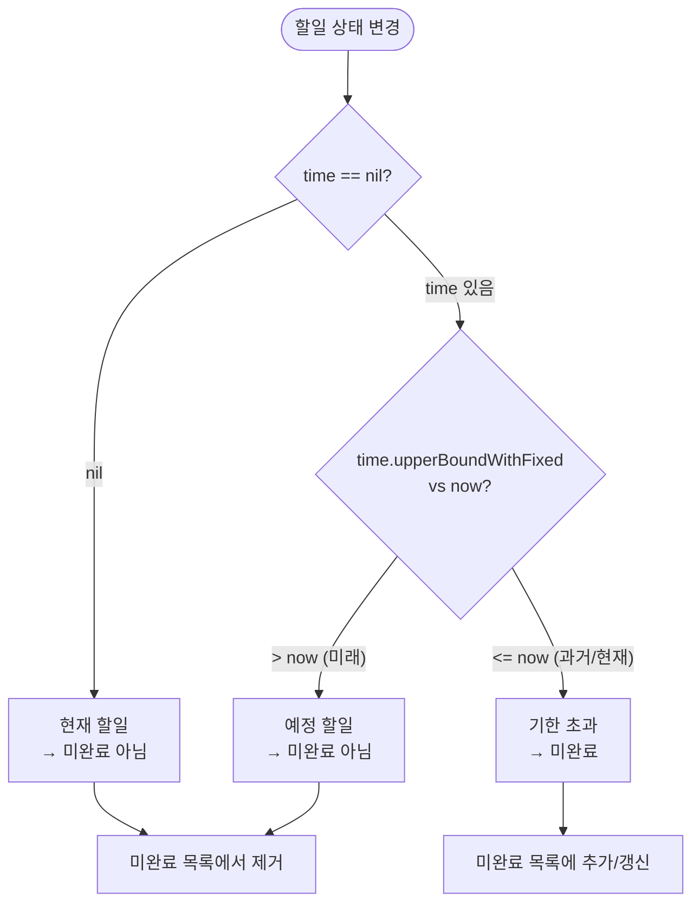
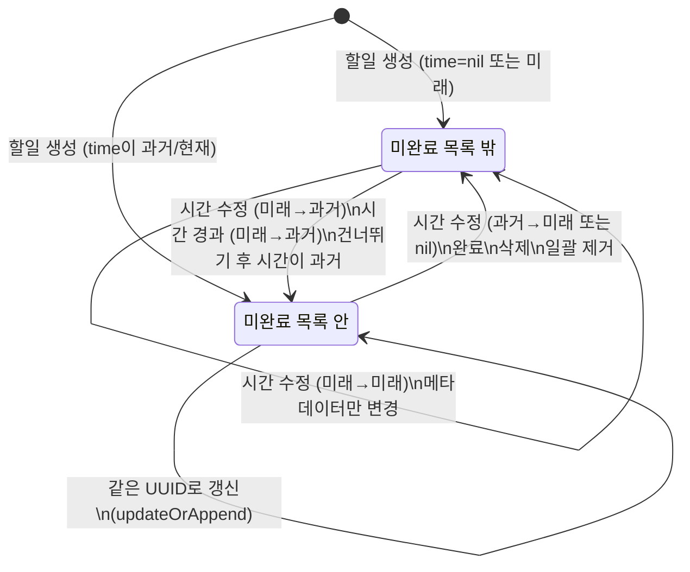

# 미완료 할일 정책 상세 스펙

> 메인 기획서 [섹션 16](../product-specification.md#16-미완료-할일-정책) 참조

---

## 1. 정의

**미완료 할일** = 시간이 설정되어 있고, 그 시간이 **현재 이전**(과거 또는 현재)인 할일.

```
분류 기준: time?.upperBoundWithFixed 와 현재 시각 비교

  time == nil                          → 현재 할일 (미완료 아님)
  time.upperBoundWithFixed <= now      → 미완료 (기한 초과)
  time.upperBoundWithFixed > now       → 예정 할일 (미완료 아님)
```

| 상태 | 조건 | 미완료 목록 |
|---|---|---|
| 시간 없는 할일 | `time == nil` | **제외** |
| 기한 초과 할일 | `time.upperBound <= 현재` | **포함** |
| 미래 예정 할일 | `time.upperBound > 현재` | **제외** |

---

## 2. 자동 갱신 트리거

미완료 할일 목록은 아래 액션마다 자동으로 갱신됨:

### 목록에 추가되는 경우

| 트리거 | 조건 |
|---|---|
| 할일 생성 | 생성된 할일의 time이 과거/현재 |
| 할일 수정 (시간 변경) | 변경된 time이 과거/현재 |
| 반복 할일 완료 후 다음 인스턴스 | 다음 인스턴스의 time이 과거/현재 |
| 반복 할일 삭제(이번만) 후 다음 인스턴스 | 다음 인스턴스의 time이 과거/현재 |
| 반복 할일 건너뛰기 후 | 건너뛴 후의 time이 과거/현재 |

### 목록에서 제거되는 경우

| 트리거 | 조건 |
|---|---|
| 할일 생성 | 생성된 할일의 time이 미래 또는 nil |
| 할일 수정 (시간 변경) | 변경된 time이 미래 또는 nil |
| 할일 완료 | 항상 제거 |
| 할일 삭제 | 항상 제거 |
| 반복 할일 건너뛰기 후 | 건너뛴 후의 time이 미래 |
| 일괄 제거 (handleRemovedTodos) | 해당 ID 필터링 |

### 전체 교체

| 트리거 | 동작 |
|---|---|
| 미완료 할일 로딩 (refreshUncompletedTodos) | Repository에서 전체 목록 새로 로드 → 기존 목록 교체 |

---

## 3. 경계값 판정 (upperBoundWithFixed)

EventTime 형태별 비교 기준값:

| EventTime | upperBoundWithFixed | 의미 |
|---|---|---|
| `.at(t)` | `t` | 마감 시각 그 자체 |
| `.period(lower..<upper)` | `upper` | 기간 종료 시각 |
| `.allDay(lower..<upper, _)` | `upper` | 하루종일 범위 종료 |

- `.at` 시점의 할일: 정확히 그 시각이 지나면 미완료
- `.period` 기간의 할일: 기간이 끝나야 미완료
- `.allDay` 할일: 하루종일 범위가 끝나야 미완료 (타임존 오프셋은 비교 시 미적용)

---

## 4. 목록 갱신 내부 동작

### updateOrAppendUncompletedTodoAtList

- 같은 UUID의 할일이 이미 목록에 있으면 → **교체** (최신 상태로 갱신)
- 없으면 → **추가**

### removeUncompletedTodoAtList

- UUID로 필터링하여 제거

---

## 5. SharedDataStore

| 키 | 타입 | 설명 |
|---|---|---|
| `uncompletedTodos` | [TodoEvent] | 미완료 할일 배열 |

- 독립 키로 관리 (`todos`와 별도)
- 로딩 시 `.put`으로 전체 교체, 개별 갱신 시 `.update`로 부분 수정

---

## 6. UI 표시

- 캘린더 메인 화면(DayEventList)에서 **별도 섹션**으로 상단 표시
- 설정 "미완료 할일 상단 표시" 토글로 표시 여부 제어 가능
- 로딩 중 `refreshingUncompletedTodo(true/false)` 브로드캐스트

---

## 7. 결정 트리 & 상태 전이

### 미완료 판정 결정 트리



### 미완료 목록 진입/퇴장 상태 전이



### 타임라인 시나리오 — 시간 경과에 따른 미완료 목록 변화

```
시나리오: 3개의 할일이 있는 상태에서 시간이 흐름

초기 상태 (현재 시각: 3/15 10:00):
  할일 A: "장보기" time=nil (현재 할일) → 미완료 X
  할일 B: "보고서" time=3/14 17:00 (어제) → 미완료 O
  할일 C: "회의준비" time=3/15 14:00 (오늘 오후) → 미완료 X (아직 미래)

미완료 목록: [B]

--- 3/15 14:00 경과 ---
  할일 C: time=3/15 14:00 → upperBound <= now → 미완료 진입

미완료 목록: [B, C]
(주: 시간 경과에 의한 자동 전환은 refreshUncompletedTodos 호출 시 반영)

--- 사용자가 B 완료 ---
  할일 B: completeTodo → 삭제 → 미완료에서 제거

미완료 목록: [C]

--- 사용자가 A에 시간 추가 (3/14 09:00) ---
  할일 A: time=nil → 3/14 09:00 → 과거 → 미완료 진입

미완료 목록: [C, A]

--- 사용자가 A 시간을 내일로 변경 ---
  할일 A: time=3/14 09:00 → 3/16 09:00 → 미래 → 미완료에서 제거

미완료 목록: [C]
```

---

## 8. 엣지 케이스

### 8.1 시간 정확히 현재인 경우

`time.upperBoundWithFixed == now` → **미완료에 포함** (`<=` 조건)

### 8.2 반복 할일 완료 후 다음 인스턴스가 이미 기한 초과

```
매주 월요일 반복, 현재 화요일:
  이번 월요일(turn=3) 완료 → DoneTodoEvent 생성
  다음 월요일(turn=4) 생성 → 아직 미래 → 미완료 아님
```

```
매일 반복, 3일간 방치:
  3일 전(turn=5) 완료 → DoneTodoEvent 생성
  2일 전(turn=6) 생성 → 이미 과거 → 미완료에 추가
```

### 8.3 시간을 nil로 변경

기존 미완료 할일의 시간을 제거하면 → "현재 할일"로 전환 → 미완료 목록에서 **제거**

### 8.4 allDay 이벤트의 미완료 판정과 타임존

```
설정: .allDay(3/15 00:00..<3/16 00:00, secondsFromGMT: +32400) (KST)
현재: 3/15 23:00 KST

upperBoundWithFixed = 3/16 00:00 (UTC 기준, 오프셋 미적용)
now = 3/15 14:00 UTC (= 3/15 23:00 KST)

비교: 3/16 00:00 > 3/15 14:00 → 아직 미래 → 미완료 아님

주의: allDay의 upperBound는 UTC 기준으로 저장됨.
     타임존 오프셋은 미완료 판정 시 적용되지 않음.
     → KST 기준 "3/15 하루종일"은 UTC 3/16 00:00까지 유효.
```

### 8.5 반복 할일 건너뛰기 후 즉시 미완료 재진입

```
설정: 매일 반복, 현재 3/15
상태: 할일 time=3/13 (2일 전, 미완료)

동작: 건너뛰기(.next)
  → time = 3/14 (1일 전)
  → 3/14 < 3/15 → 여전히 과거 → 미완료 목록에 남음

동작: 다시 건너뛰기(.next)
  → time = 3/15 (오늘)
  → 3/15 <= 3/15 → 여전히 미완료 (== 조건)

동작: 또 건너뛰기(.next)
  → time = 3/16 (내일)
  → 3/16 > 3/15 → 미완료에서 제거

의미: 밀린 반복 할일은 .next로 하루씩 전진시켜도
     미래에 도달할 때까지 미완료에 남아있음.
     → .until(미래시간)으로 한번에 점프하는 것이 효율적.
```

### 8.6 refreshUncompletedTodos 호출 시점

```
미완료 목록의 "시간 경과에 의한 자동 전환"은 실시간이 아님.
다음 시점에 전체 목록을 새로 로드:

1. 앱 foreground 진입 시
2. 캘린더 날짜 변경 시
3. 이벤트 CRUD 시 (개별 갱신)
4. 수동 새로고침 시

→ 예정 할일이 기한 초과가 되어도, 위 시점 전까지는
   미완료 목록에 나타나지 않음.
```
