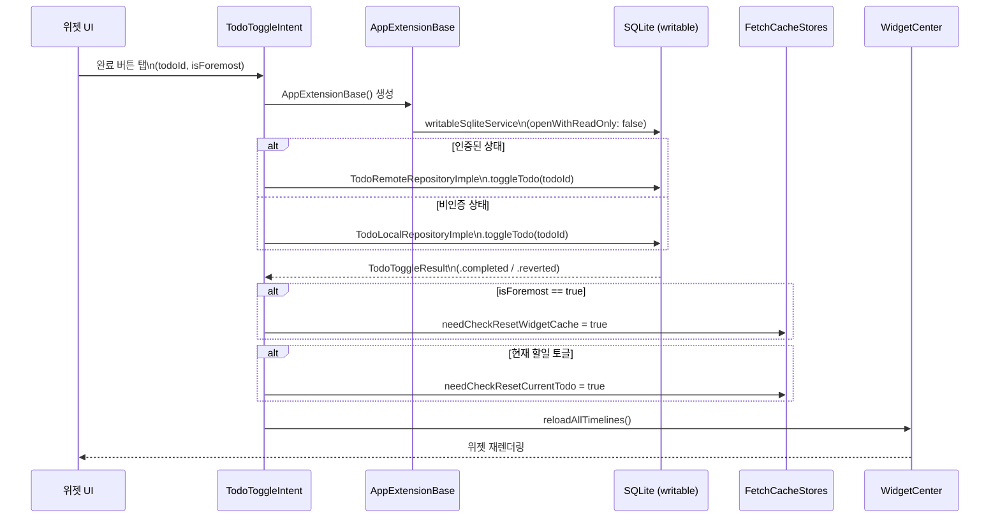
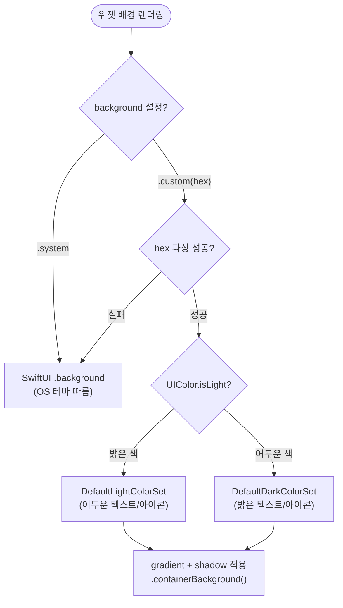
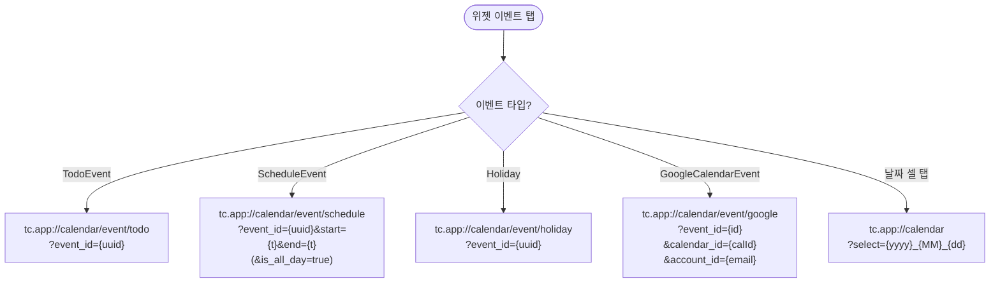

# 위젯 상세 스펙 (18종)

> Phase 5 고도화: 섹션 9(위젯)의 L1 상세

---

## 1. 위젯 카탈로그

### 1.1 BaseWidgetBundle (7종)

| # | 위젯 | kind | 지원 사이즈 | Configuration |
|---|---|---|---|---|
| 1 | TodayAndNextWidget | `TodayAndNextWidget` | `.systemMedium` | `EventListComponentSelectIntent` |
| 2 | MonthWidget | `MonthWidget` | `.systemSmall` | Static |
| 3 | EventListWidget | `EventList` | `.systemSmall`, `.systemMedium`, `.systemLarge` | `EventTypeSelectIntent` |
| 4 | TodayWidget | `TodaySummary` | `.systemSmall` | Static |
| 5 | ForemostEventWidget | `ForemostEventWidget` | `.accessoryInline`, `.systemSmall`, `.systemMedium` | Static |
| 6 | NextEventWidget | `NextEventWidget` | `.accessoryInline`, `.accessoryRectangular` | Static |
| 7 | NextRemainEventWidget | `NextRemainEventWidget` | `.accessoryRectangular` | Static |

### 1.2 ComposedWidgetBundle (4종)

| # | 위젯 | kind | 지원 사이즈 | Configuration |
|---|---|---|---|---|
| 8 | DoubleMonthWidget | `DoubleMonthWidget` | — | Static |
| 9 | EventAndMonthWidget | `EventAndMonthWidget` | `.systemMedium` | Static |
| 10 | EventAndForemostWidget | `EventAndForemostWidget` | — | Static |
| 11 | TodayAndMonthWidget | `TodayAndMonthWidget` | `.systemMedium` | Static |

### 1.3 WeeksWidgetBundle (7종)

| # | 위젯 | kind | 범위 | 지원 사이즈 |
|---|---|---|---|---|
| 12 | OneWeekEventsWidget | `OneWeekEventsWidget` | 7일 | `.systemMedium` |
| 13 | TwoWeekEventsWidget | `TwoWeekEventsWidget` | 14일 | `.systemMedium` |
| 14 | ThreeWeekEventsWidget | `ThreeWeekEventsWidget` | 21일 | `.systemLarge` |
| 15 | FourWeekEventsWidget | `FourWeekEventsWidget` | 28일 | `.systemLarge` |
| 16 | CurrentMonthEventsWidget | `CurrentMonthEventsWidget` | 이번 달 | `.systemLarge` |
| 17 | LastMonthEventsWidget | `LastMonthEventsWidget` | 지난 달 | `.systemLarge` |
| 18 | NextMonthEventsWidget | `NextMonthEventsWidget` | 다음 달 | `.systemLarge` |

---

## 2. Timeline 갱신 정책

### 2.1 다음 업데이트 시간 계산

```
현재 시각 기준:
  → 다음 날 시작(00:00)까지 1시간 미만 → 다음 날 00:00에 갱신
  → 그 외 → 1시간 후 갱신
```

모든 위젯이 `.after(Date().nextUpdateTime)` 정책 사용.

### 2.2 Timeline Entry 구조

```
ResultTimelineEntry<T>
├── date: Date                — 표시 시점
├── result: Result<T, WidgetErrorModel>  — 성공/실패
└── background: WidgetAppearanceSettings.Background  — 배경 설정
```

### 2.3 Timeline Provider 3단계

| 단계 | 메서드 | 용도 |
|---|---|---|
| placeholder | `placeholder(in:)` | 위젯 갤러리 미리보기 (샘플 데이터) |
| snapshot | `getSnapshot(in:completion:)` | 위젯 추가 시 프리뷰. 실제/샘플 데이터 분기 |
| timeline | `getTimeline(in:completion:)` | 실제 데이터 로드 → `.after()` 갱신 정책 |

---

## 3. TodoToggleIntent (할일 완료 토글)

### 3.1 파라미터

| 파라미터 | 타입 | 설명 |
|---|---|---|
| `todoId` | String | 토글 대상 할일 ID |
| `isForemost` | Bool | 강조 이벤트 위젯에서의 토글 여부 |

### 3.2 실행 플로우

```
TodoToggleIntent.perform()
  → AppExtensionBase 생성 (App Group 접근)
  → WidgetUsecaseFactory.makeTodoToggleRepository()
  → repository.toggleTodo(todoId)
    → SQLite DB 직접 업데이트 (writableSqliteService)
    → 반환: (isToggled, isToggledCurrentTodo?)
  → 캐시 리셋 플래그 설정:
    ├─ isForemost=true → EnvironmentKeys.needCheckResetWidgetCache = true
    └─ isToggledCurrentTodo=true → EnvironmentKeys.needCheckResetCurrentTodo = true
  → WidgetCenter.shared.reloadAllTimelines()
```

### 3.3 에러 시 선택적 갱신

토글 실패 시 전체 위젯이 아닌 "할일 토글 가능한" 위젯만 갱신:
- EventListWidget, ForemostEventWidget, NextEventWidget, NextRemainEventWidget
- EventAndMonthWidget, EventAndForemostWidget, TodayAndNextWidget

---

## 4. EventTypeSelectIntent (이벤트 필터)

### 4.1 구조

```
EventTypeSelectIntent (WidgetConfigurationIntent)
├── eventTypes: [EventTypeEntity]?  — 선택된 태그 목록

EventListComponentSelectIntent (WidgetConfigurationIntent)
├── eventTypes: [EventTypeEntity]?  — 선택된 태그 목록
└── excludeAllDayEvent: Bool = false — 하루종일 이벤트 제외
```

### 4.2 EventTypeEntity

| 필드 | 설명 |
|---|---|
| `id` | 태그 ID (UUID 또는 캘린더 ID) |
| `name` | 태그 이름 |
| `isDefaultTag` | 기본 태그 여부 |
| `externalServiceId` | 외부 서비스 ID (e.g., "google") |
| `externalServiceName` | 외부 서비스 표시명 |

### 4.3 태그 목록 제공 (EventTypeQuery)

```
suggestedEntities():
  → [.defaultTag] (기본 태그)
  → + CustomEventTag 전체 (EventTagRepository에서 로드)
  → + GoogleCalendar.Tag 전체 (활성 계정별, 공휴일 제외)
```

### 4.4 EventTagId 변환

| EventTypeEntity | → EventTagId |
|---|---|
| `isDefaultTag = true` | `.default` |
| `externalServiceId != nil` | `.externalCalendar(serviceId, id)` |
| 그 외 | `.custom(id)` |

---

## 5. 데이터 소스 & 쿼리

### 5.1 CalendarEventFetchUsecase

위젯 데이터 조회의 통합 인터페이스.

| 메서드 | 설명 |
|---|---|
| `fetchEvents(in:timeZone:withoutOffTagIds:)` | 범위 내 전체 이벤트 (할일+일정+공휴일+구글) |
| `fetchForemostEvent()` | 강조 이벤트 로드 |
| `fetchNextEvent(refTime:within:timeZone:)` | 다음 예정 이벤트 1개 |
| `fetchNextEvents(refTime:within:timeZone:)` | 다음 예정 이벤트 목록 |

### 5.2 CalendarEvents 반환 구조

```
CalendarEvents
├── currentTodos: [TodoCalendarEvent]           — 현재 할일 (기한 무관)
├── eventWithTimes: [any CalendarEvent]          — 시간 있는 전체 이벤트
├── customTagMap: [String: CustomEventTag]       — 커스텀 태그 맵
├── googleCalendarColors: GoogleCalendar.Colors? — 구글 색상
└── googleCalendarTags: [String: GoogleCalendar.Tag] — 구글 태그
```

### 5.3 데이터 소스별 쿼리

| 소스 | 메서드 | 비고 |
|---|---|---|
| 할일 (현재) | `todoRepository.loadCurrentTodoEvents()` | 미완료 할일 전체 |
| 할일 (범위) | `todoRepository.loadTodoEvents(in: range)` | 시간 범위 내 |
| 일정 | `scheduleRepository.loadScheduleEvents(in: range)` | 반복 전개 포함 |
| 공휴일 | `holidayFetchUsecase.holidaysGivenYears(range)` | 연도별 lazy 로딩 |
| 구글 이벤트 | `googleCalendarRepository.loadEvents(calendarId, in: range)` | 캘린더별, 활성 계정만 |

---

## 6. App Group 데이터 공유

### 6.1 App Group ID

`"group.sudo.park.todo-calendar"`

### 6.2 공유 메커니즘

#### UserDefaults (App Group Suite)

```
UserDefaultEnvironmentStorageImple(suiteName: AppEnvironment.groupID)
```

공유 데이터:
- 위젯 외형 설정 (배경색)
- 캐시 리셋 플래그 (EnvironmentKeys)
- 캘린더 설정 (타임존, 시작 요일, 12/24시간)
- 사용자 환경설정

#### SQLite 직접 접근 (App Group Container)

```
App Group Container/
├── models.db (또는 models_{userId}.db) — 할일, 일정, 태그, 설정
├── google_calendar_calendar.db         — 구글 캘린더 이벤트/태그/색상
└── apple_calendar_calendar.db          — 애플 캘린더 (향후)
```

| 컨텍스트 | 접근 모드 | 용도 |
|---|---|---|
| Timeline Provider | **읽기 전용** (`openWithReadOnly: true`) | 이벤트/태그/설정 조회 |
| TodoToggleIntent | **읽기/쓰기** (`openWithReadOnly: false`) | 할일 완료 상태 토글 |
| 메인 앱 | 읽기/쓰기 | 전체 CRUD + 동기화 |

---

## 7. 딥링크 URL

### 7.1 날짜 이동

```
tc.app://calendar?select={year}_{month}_{day}
예: tc.app://calendar?select=2026_04_15
```

### 7.2 이벤트 상세

| 이벤트 타입 | URL 패턴 | 쿼리 파라미터 |
|---|---|---|
| 할일 | `tc.app://calendar/event/todo` | `event_id={todoId}` |
| 일정 | `tc.app://calendar/event/schedule` | `event_id={scheduleId}` + EventTime 쿼리 |
| 공휴일 | `tc.app://calendar/event/holiday` | `event_id={holidayId}` |
| 구글 이벤트 | `tc.app://calendar/event/google` | `event_id={id}&calendar_id={calId}&account_id={email}` |

---

## 8. 위젯 외형 설정

### 8.1 배경 옵션

| 옵션 | 코드 | 동작 |
|---|---|---|
| 시스템 기본 | `.system` | OS 기본 위젯 배경 |
| 커스텀 색상 | `.custom(hex: "#FF5733")` | 지정 색상 + 그라데이션 + 그림자 |

### 8.2 커스텀 배경 렌더링

```
hex 색상으로 UIColor 생성
  → isLight 판정 (밝은색/어두운색)
  → 밝으면 DefaultLightColorSet, 어두우면 DefaultDarkColorSet 적용
  → 텍스트 색상이 배경 밝기에 따라 자동 조정
  → gradient + drop shadow 효과
```

---

## 9. 주요 위젯 상세

### 9.1 ForemostEventWidget (강조 이벤트)

**사이즈별 표시**:

| 사이즈 | 표시 내용 |
|---|---|
| `.accessoryInline` | 이벤트 이름 텍스트만 |
| `.systemSmall` | "강조 이벤트" 레이블 + 시간 + 이름 + 태그 색상 + 할일 토글 |
| `.systemMedium` | 위와 동일 (더 넓은 레이아웃) |

**빈 상태**: 랜덤 이모지 + "모두 완료" 메시지

**데이터 로드**:
- `CalendarEventFetchUsecase.fetchForemostEvent()` 호출
- TodoEvent → `TodoEventCellViewModel` (할일 토글 버튼 포함)
- ScheduleEvent → 과거 일정이면 nil (미표시), 미래면 `ScheduleEventCellViewModel`

### 9.2 MonthWidget (월 캘린더)

**사이즈**: `.systemSmall`

**표시**:
- 월 이름 헤더
- 요일 행 (Sun~Sat, 시작 요일 설정 반영)
- 주별 날짜 그리드
- 오늘 하이라이트 (배경 강조)
- 공휴일/주말 색상 구분
- 이벤트 있는 날짜 하단에 인디케이터 라인

**딥링크**: 위젯 탭 → `tc.app://calendar?select={year}_{month}_{day}`

### 9.3 EventListWidget (이벤트 목록)

**사이즈**: `.systemSmall`, `.systemMedium`, `.systemLarge`

**Configuration**: `EventTypeSelectIntent`로 태그 필터링

**섹션 구성**:
1. "현재 할일" 섹션 (기한 무관 미완료 할일)
2. 일별 섹션 (오늘부터 미래)
   - 오늘 = 강조 타이틀
   - 이벤트 없는 날 = 건너뜀 (오늘 제외)

**이벤트 셀**: 시간 텍스트 (30px) + 태그 색상 라인 (3px) + 이름 + 할일 토글

**태그 색상 결정**: holiday/default → 기본 설정, custom → CustomEventTag.colorHex, google → GoogleCalendar.Colors 조회

### 9.4 TodayAndNextWidget (오늘+다음)

**사이즈**: `.systemMedium`

**Configuration**: `EventListComponentSelectIntent` (태그 필터 + 하루종일 제외)

**레이아웃**: 2컬럼
- **왼쪽**: 오늘 정보 (요일, 날짜, 타임존) + 오늘 이벤트
- **오른쪽**: 다음/미래 이벤트

**행 모델 타입**:
| 타입 | 내용 |
|---|---|
| TodayModel | 요일, 날짜, 타임존 |
| DateModel | 미래 날짜 |
| EventModel | 이벤트 + 태그 색상 + 토글 |
| MultipleEventsSummaryModel | "+N more" 요약 |
| UncompletedTodayTodoSummaryModel | 미완료 할일 경고 |

**빈 상태**: 왼쪽 "오늘 이벤트 없음" / 오른쪽 "예정 이벤트 없음"

### 9.5 주/월 이벤트 위젯 (7종)

**공통 구조**:

```
WeekEventsRange
├── .weeks(count: 1~4)          — 현재 주 기준 N주
└── .wholeMonth(.previous/.current/.next) — 전체 월
```

**표시**: 날짜별 이벤트 목록 (캘린더 형태가 아닌 리스트 형태)

### 9.6 NextEventWidget (다음 이벤트)

**사이즈**: `.accessoryInline`, `.accessoryRectangular`

- **Inline**: `"HH:MM - 이벤트명"` 텍스트
- **Rectangular**: 아이콘 + 시간 + 장소 + 이벤트명

### 9.7 조합 위젯 (4종)

| 위젯 | 구성 |
|---|---|
| TodayAndMonthWidget | 오늘 요약 + 월 캘린더 그리드 |
| EventAndMonthWidget | 이벤트 목록 + 월 캘린더 그리드 |
| EventAndForemostWidget | 이벤트 목록 + 강조 이벤트 |
| DoubleMonthWidget | 연속 2개월 캘린더 그리드 |

---

## 10. 캐시 & 갱신 메커니즘

### 10.1 인메모리 캐시

```
FetchCacheStores (싱글톤)
├── holidays: HolidaysFetchCacheStore
└── events: CalendarEventsFetchCacheStore
    └── Storage:
        ├── currentTodos
        ├── allCustomTagsMap
        ├── externalAccountMap
        ├── googleCalendarColors
        ├── googleCalendarTags
        └── eventDetails
```

### 10.2 캐시 리셋 트리거

```
WidgetViewModelProviderBuilder.checkShouldReset()
  → EnvironmentKeys.needCheckResetWidgetCache == true?
    → FetchCacheStores.shared.reset() (전체 리셋)
  → EnvironmentKeys.needCheckResetCurrentTodo == true?
    → FetchCacheStores.shared.resetCurrentTodo() (현재 할일만)
```

### 10.3 위젯 갱신 트리거

| 트리거 | 동작 |
|---|---|
| `TodoToggleIntent` 완료 | `WidgetCenter.shared.reloadAllTimelines()` |
| 앱 백그라운드 진입 | `WidgetCenter.shared.reloadAllTimelines()` |
| Timeline `.after()` | 시스템이 다음 업데이트 시간에 자동 갱신 |
| 이벤트 CRUD (메인 앱) | 앱 → UserDefaults 플래그 → 위젯 갱신 |

---

## 상태 전이 다이어그램

### TodoToggleIntent 동작 시퀀스



### Timeline 갱신 결정 플로우

```mermaid
flowchart TD
    Start([Timeline 요청]) --> Check[checkShouldReset()]
    Check --> Q1{needCheckResetWidgetCache?}
    Q1 -->|true| FullReset[전체 캐시 리셋\nFetchCacheStores.reset()]
    Q1 -->|false| Q2{needCheckResetCurrentTodo?}
    Q2 -->|true| TodoReset[현재 할일 캐시만 리셋]
    Q2 -->|false| UseCache[기존 캐시 사용]

    FullReset --> Load
    TodoReset --> Load
    UseCache --> Load

    Load[DB에서 데이터 로드\n+ ViewModel 구성] --> Entry[TimelineEntry 생성]

    Entry --> Policy{다음 갱신 시점 계산}
    Policy -->|"자정까지 < 1시간"| Midnight[".after(다음날 00:00)"]
    Policy -->|"자정까지 >= 1시간"| OneHour[".after(현재 + 1시간)"]

    Midnight --> Timeline([Timeline 반환])
    OneHour --> Timeline
```

### 위젯 배경 색상 결정 트리



---

## 결정 트리

### 딥링크 URL 구성 결정 트리



---

## 엣지 케이스

### 위젯에서 TodoToggle 후 메인 앱과의 동기화

```
상황: 위젯에서 반복 할일 완료 토글

위젯 프로세스:
  1. writableSqliteService로 DB 직접 수정
  2. 다음 반복 인스턴스 생성 (DB에 직접 쓰기)
  3. needCheckResetWidgetCache = true (UserDefaults)
  4. reloadAllTimelines()

메인 앱 프로세스 (다음 foreground 진입 시):
  1. SharedDataStore에는 아직 이전 상태
  2. refreshTodoEvents() 호출 → DB에서 최신 상태 로드
  3. SharedDataStore 갱신 → UI 업데이트

주의: 위젯과 메인 앱은 별도 프로세스.
     위젯의 DB 쓰기가 메인 앱의 SharedDataStore에
     즉시 반영되지 않음. 앱 foreground 시 동기화.
```

### Timeline 갱신 빈도 제한

```
상황: 매분 갱신이 필요한 카운트다운 위젯

iOS 제한:
  - WidgetKit은 시스템이 Timeline 갱신 빈도를 제어
  - .after(Date()) 설정해도 실제 갱신은 시스템 판단
  - 배터리 절약 모드에서 더 드물게 갱신
  - 일반적으로 15분~30분 간격 보장

현재 정책:
  - nextUpdateTime = min(자정, 현재+1시간)
  - → 실질적으로 1시간 간격 또는 날짜 변경 시 갱신
  - D-Day 카운트다운의 "1초 타이머"는 메인 앱에서만 동작
  - 위젯에서는 시간 단위까지만 표시

의미: 위젯은 실시간 업데이트가 아닌 "스냅샷" 방식.
     정확한 분/초 단위 정보는 앱을 열어야 확인 가능.
```

### EventTypeSelectIntent — 태그 삭제 후 위젯 설정

```
상황: 위젯에서 "업무" 태그를 필터로 선택 → 이후 "업무" 태그 삭제

결과:
  1. Intent의 eventTypes에 삭제된 태그 ID가 남아있음
  2. 다음 Timeline 갱신 시 해당 태그 ID로 필터링 시도
  3. DB에 태그 없음 → 해당 태그의 이벤트 없음
  4. → 위젯에 해당 태그 이벤트 미표시 (자연스럽게 필터링)

복구:
  사용자가 위젯 편집 → 태그 재선택 필요
  삭제된 태그는 선택 목록에서 자동 제외
```

### 다중 계정 구글 캘린더 위젯 표시

```
상황: user1과 user2 두 계정 연동, 둘 다 "primary" 캘린더 활성

위젯 데이터 로드:
  GoogleCalendarLocalAggregatedRepositoryImple.loadEvents()
  → 두 계정의 모든 이벤트 합산

위젯 딥링크:
  user1 이벤트: tc.app://calendar/event/google?event_id=abc&account_id=user1@gmail.com
  user2 이벤트: tc.app://calendar/event/google?event_id=xyz&account_id=user2@gmail.com
  → account_id로 어느 계정의 이벤트인지 구분

색상 결정:
  GoogleCalendarEventColorSource(calendarId, colorId)
  → GoogleCalendarViewAppearanceStore에서 계정별 색상 맵 조회
  → 올바른 계정의 색상 반환
```
