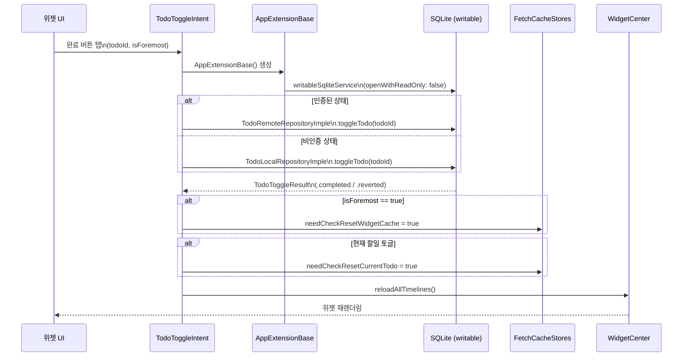
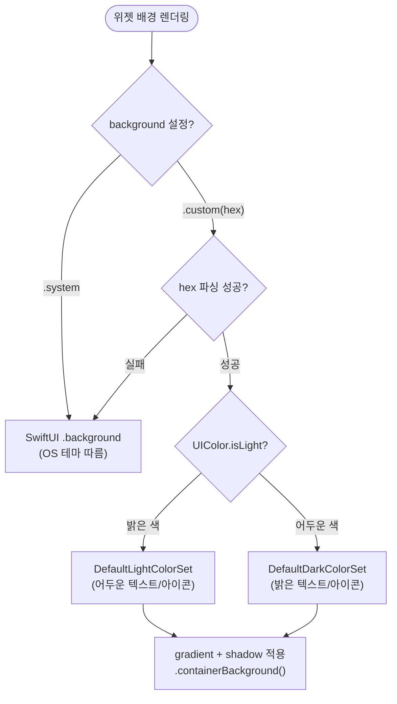
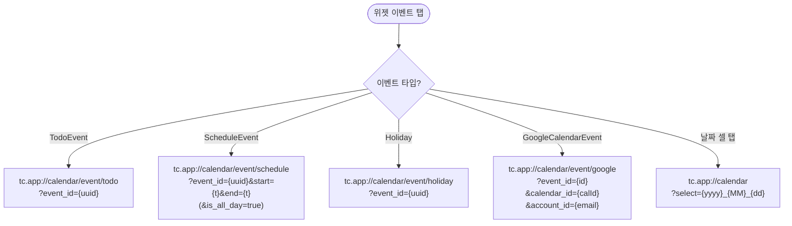

# 위젯 상세 스펙 (20종 + ControlWidget 1종 + Live Activity 1종)

> Phase 5 고도화: 섹션 9(위젯)의 L1 상세

---

## 1. 위젯 카탈로그

### 1.1 BaseWidgetBundle (9종)

| # | 위젯 | kind | 지원 사이즈 | Configuration |
|---|---|---|---|---|
| 1 | TodayAndNextWidget | `TodayAndNextWidget` | `.systemMedium` | `EventListComponentSelectIntent` |
| 2 | MonthWidget | `MonthWidget` | `.systemSmall` | Static |
| 3 | EventListWidget | `EventList` | `.systemSmall`, `.systemMedium`, `.systemLarge` | `EventTypeSelectIntent` |
| 4 | TodayWidget | `TodaySummary` | `.systemSmall` | Static |
| 5 | ForemostEventWidget | `ForemostEventWidget` | `.accessoryInline`, `.systemSmall`, `.systemMedium` | Static |
| 6 | NextEventWidget | `NextEventWidget` | `.accessoryInline`, `.accessoryRectangular` | Static |
| 7 | NextRemainEventWidget | `NextRemainEventWidget` | `.accessoryRectangular` | Static |
| 8 | AICommandShortcutWidget | `AICommandShortcutWidget` | `.accessoryCircular`, `.systemSmall` | Static — 잠금화면·홈에서 원탭 AI 입력 진입 (#768) |
| 9 | DDayWidget | `DDayWidget` | `.systemSmall`, `.systemMedium`, `.accessoryCircular`, `.accessoryRectangular`, `.accessoryInline` | `DDayWidgetConfigurationIntent` |

### 1.2 ComposedWidgetBundle (4종)

| # | 위젯 | kind | 지원 사이즈 | Configuration |
|---|---|---|---|---|
| 9 | DoubleMonthWidget | `DoubleMonthWidget` | — | Static |
| 10 | EventAndMonthWidget | `EventAndMonthWidget` | `.systemMedium` | Static |
| 11 | EventAndForemostWidget | `EventAndForemostWidget` | — | Static |
| 12 | TodayAndMonthWidget | `TodayAndMonthWidget` | `.systemMedium` | Static |

### 1.3 WeeksWidgetBundle (7종)

| # | 위젯 | kind | 범위 | 지원 사이즈 |
|---|---|---|---|---|
| 13 | OneWeekEventsWidget | `OneWeekEventsWidget` | 7일 | `.systemMedium` |
| 14 | TwoWeekEventsWidget | `TwoWeekEventsWidget` | 14일 | `.systemMedium` |
| 15 | ThreeWeekEventsWidget | `ThreeWeekEventsWidget` | 21일 | `.systemLarge` |
| 16 | FourWeekEventsWidget | `FourWeekEventsWidget` | 28일 | `.systemLarge` |
| 17 | CurrentMonthEventsWidget | `CurrentMonthEventsWidget` | 이번 달 | `.systemLarge` |
| 18 | LastMonthEventsWidget | `LastMonthEventsWidget` | 지난 달 | `.systemLarge` |
| 19 | NextMonthEventsWidget | `NextMonthEventsWidget` | 다음 달 | `.systemLarge` |

### 1.4 ControlWidget (1종, iOS 18+)

WidgetBundle이 아닌 별도 `ControlWidget` — 컨트롤 센터에 배치.

| # | 위젯 | kind | 배치 | Configuration |
|---|---|---|---|---|
| — | AICommandControlWidget | `AICommandControlWidget` | 컨트롤 센터 | Static — `OpenAICommandInputIntent`으로 `tc.app://calendar/ai` 딥링크 진입 (#768) |

---

### 1.5 Live Activity (1종)

`EventCountdownLiveActivity`는 `BaseWidgetBundle`에 함께 선언되지만 갤러리 위젯이 아니다 — 앱이 대상을 등록해야 뜨고, 동시에 하나만 산다. 등록·갱신·종료의 정책 정본은 [product-specification.md §24](../product-specification.md#24-live-activity-이벤트-카운트다운).

| 구성 | 파일 |
|---|---|
| Activity 선언 | `LiveActivities/EventCountdownLiveActivity.swift` |
| 잠금화면 뷰 | `LiveActivities/EventCountdownLockScreenView.swift` |
| 진행 링 배지 | `LiveActivities/EventCountdownRingBadge.swift` |
| 표시 모델 | `LiveActivities/EventCountdownActivityViewModel.swift` |

앱 쪽 등록·복원은 `TodoCalendarApp/Sources/Root/EventLiveActivityUsecaseImple.swift`, 잠금화면 인텐트는 `TodoCalendarApp/Sources/LiveActivity/EventCountdownLiveActivityIntents.swift`.

---

## 2. Timeline 갱신 정책

### 2.1 다음 업데이트 시간 계산

```
현재 시각 기준:
  → 다음 날 시작(00:00)까지 1시간 미만 → 다음 날 00:00에 갱신
  → 그 외 → 1시간 후 갱신
```

모든 위젯이 `.after(Date().nextUpdateTime)` 정책 사용.

### 2.2 Timeline Entry 구조

```
ResultTimelineEntry<T>
├── date: Date                — 표시 시점
├── result: Result<T, WidgetErrorModel>  — 성공/실패
└── background: WidgetAppearanceSettings.Background  — 배경 설정
```

### 2.3 Timeline Provider 3단계

| 단계 | 메서드 | 용도 |
|---|---|---|
| placeholder | `placeholder(in:)` | 위젯 갤러리 미리보기 (샘플 데이터) |
| snapshot | `getSnapshot(in:completion:)` | 위젯 추가 시 프리뷰. 실제/샘플 데이터 분기 |
| timeline | `getTimeline(in:completion:)` | 실제 데이터 로드 → `.after()` 갱신 정책 |

---

## 3. TodoToggleIntent (할일 완료 토글)

### 3.1 파라미터

| 파라미터 | 타입 | 설명 |
|---|---|---|
| `todoId` | String | 토글 대상 할일 ID |
| `isForemost` | Bool | 강조 이벤트 위젯에서의 토글 여부 |

### 3.2 실행 플로우

```
TodoToggleIntent.perform()
  → AppExtensionBase 생성 (App Group 접근)
  → WidgetUsecaseFactory.makeTodoToggleRepository()
  → repository.toggleTodo(todoId)
    → SQLite DB 직접 업데이트 (writableSqliteService)
    → 반환: (isToggled, isToggledCurrentTodo?)
  → 캐시 리셋 플래그 설정:
    ├─ isForemost=true → EnvironmentKeys.needCheckResetWidgetCache = true
    └─ isToggledCurrentTodo=true → EnvironmentKeys.needCheckResetCurrentTodo = true
  → WidgetCenter.shared.reloadAllTimelines()
```

### 3.3 에러 시 선택적 갱신

토글 실패 시 전체 위젯이 아닌 "할일 토글 가능한" 위젯만 갱신:
- EventListWidget, ForemostEventWidget, NextEventWidget, NextRemainEventWidget
- EventAndMonthWidget, EventAndForemostWidget, TodayAndNextWidget

---

## 4. EventTypeSelectIntent (이벤트 필터)

### 4.1 구조

```
EventTypeSelectIntent (WidgetConfigurationIntent)
├── eventTypes: [EventTypeEntity]?  — 선택된 태그 목록
└── excludeAllDayEvent: Bool = false — 하루종일 이벤트 제외

EventListComponentSelectIntent (WidgetConfigurationIntent)
├── eventTypes: [EventTypeEntity]?  — 선택된 태그 목록
└── excludeAllDayEvent: Bool = false — 하루종일 이벤트 제외
```

### 4.2 EventTypeEntity

| 필드 | 설명 |
|---|---|
| `id` | 태그 ID (UUID 또는 캘린더 ID) |
| `name` | 태그 이름 |
| `isDefaultTag` | 기본 태그 여부 |
| `externalServiceId` | 외부 서비스 ID (e.g., "google") |
| `externalServiceName` | 외부 서비스 표시명 |

### 4.3 태그 목록 제공 (EventTypeQuery)

```
suggestedEntities():
  → [.defaultTag] (기본 태그)
  → + CustomEventTag 전체 (EventTagRepository에서 로드)
  → + GoogleCalendar.Tag 전체 (활성 계정별, 공휴일 제외)
```

### 4.4 EventTagId 변환

| EventTypeEntity | → EventTagId |
|---|---|
| `isDefaultTag = true` | `.default` |
| `externalServiceId != nil` | `.externalCalendar(serviceId, id)` |
| 그 외 | `.custom(id)` |

---

## 5. 데이터 소스 & 쿼리

### 5.1 CalendarEventFetchUsecase

위젯 데이터 조회의 통합 인터페이스.

| 메서드 | 설명 |
|---|---|
| `fetchEvents(in:timeZone:withoutOffTagIds:)` | 범위 내 전체 이벤트 (할일+일정+공휴일+구글) |
| `fetchForemostEvent()` | 강조 이벤트 로드 |
| `fetchNextEvent(refTime:within:timeZone:)` | 다음 예정 이벤트 1개 |
| `fetchNextEvents(refTime:within:timeZone:)` | 다음 예정 이벤트 목록 |

### 5.2 CalendarEvents 반환 구조

```
CalendarEvents
├── currentTodos: [TodoCalendarEvent]           — 현재 할일 (기한 무관)
├── eventWithTimes: [any CalendarEvent]          — 시간 있는 전체 이벤트
├── customTagMap: [String: CustomEventTag]       — 커스텀 태그 맵
├── googleCalendarColors: GoogleCalendar.Colors? — 구글 색상
└── googleCalendarTags: [String: GoogleCalendar.Tag] — 구글 태그
```

### 5.3 데이터 소스별 쿼리

| 소스 | 메서드 | 비고 |
|---|---|---|
| 할일 (현재) | `todoRepository.loadCurrentTodoEvents()` | 미완료 할일 전체 |
| 할일 (범위) | `todoRepository.loadTodoEvents(in: range)` | 시간 범위 내 |
| 일정 | `scheduleRepository.loadScheduleEvents(in: range)` | 반복 전개 포함 |
| 공휴일 | `holidayFetchUsecase.holidaysGivenYears(range)` | 연도별 lazy 로딩 |
| 구글 이벤트 | `googleCalendarRepository.loadEvents(calendarId, in: range)` | 캘린더별, 활성 계정만 |

---

## 6. App Group 데이터 공유

### 6.1 App Group ID

`"group.sudo.park.todo-calendar"`

### 6.2 공유 메커니즘

#### UserDefaults (App Group Suite)

```
UserDefaultEnvironmentStorageImple(suiteName: AppEnvironment.groupID)
```

공유 데이터:
- 위젯 외형 설정 (배경색)
- 캐시 리셋 플래그 (EnvironmentKeys)
- 캘린더 설정 (타임존, 시작 요일, 12/24시간)
- 사용자 환경설정

#### SQLite 직접 접근 (App Group Container)

```
App Group Container/
├── models.db (또는 models_{userId}.db) — 할일, 일정, 태그, 설정
├── google_calendar_calendar.db         — 구글 캘린더 이벤트/태그/색상
└── apple_calendar_calendar.db          — 애플 캘린더 (향후)
```

| 컨텍스트 | 접근 모드 | 용도 |
|---|---|---|
| Timeline Provider | **읽기 전용** (`openWithReadOnly: true`) | 이벤트/태그/설정 조회 |
| TodoToggleIntent | **읽기/쓰기** (`openWithReadOnly: false`) | 할일 완료 상태 토글 |
| 메인 앱 | 읽기/쓰기 | 전체 CRUD + 동기화 |

---

## 7. 딥링크 URL

### 7.1 날짜 이동

```
tc.app://calendar?select={year}_{month}_{day}
예: tc.app://calendar?select=2026_04_15
```

### 7.2 이벤트 상세

| 이벤트 타입 | URL 패턴 | 쿼리 파라미터 |
|---|---|---|
| 할일 | `tc.app://calendar/event/todo` | `event_id={todoId}` |
| 일정 | `tc.app://calendar/event/schedule` | `event_id={scheduleId}` + EventTime 쿼리 |
| 공휴일 | `tc.app://calendar/event/holiday` | `event_id={holidayId}` |
| 구글 이벤트 | `tc.app://calendar/event/google` | `event_id={id}&calendar_id={calId}&account_id={email}` |

### 7.3 AI 입력 진입

```
tc.app://calendar/ai
```

AICommandShortcutWidget·AICommandControlWidget 탭 시 인앱 AI 버튼과 같은 동선으로 진입 (#768).

---

## 8. 위젯 외형 설정

### 8.1 배경 옵션

| 옵션 | 코드 | 동작 |
|---|---|---|
| 시스템 기본 | `.system` | OS 기본 위젯 배경 |
| 커스텀 색상 | `.custom(hex: "#FF5733")` | 지정 색상 + 그라데이션 + 그림자 |
| 배경 사진 | `WidgetStyle.photo` | D-day 홈 2변형만. 스타일 단위이고 전역 설정엔 이 축이 없다 (8.3 사진 배경 계약) |

### 8.2 커스텀 배경 렌더링

```
hex 색상으로 UIColor 생성
  → isLight 판정 (밝은색/어두운색)
  → 밝으면 DefaultLightColorSet, 어두우면 DefaultDarkColorSet 적용
  → 텍스트 색상이 배경 밝기에 따라 자동 조정
  → gradient + drop shadow 효과
```

**사진 배경은 이 경로를 안 탄다.** 사진에는 밝기를 잴 hex 가 없어 판정 입력 자체가 없다 — 대신 어둡게 덮는 판(검정 35%)을 깔고 ColorSet 을 다크로 고정한다. 보조 글자는 사진일 때만 `text2` 에서 `text1` 로 한 단계 올린다. 농도와 한 단계는 밝은 하늘·어두운 사진·중형 셋을 실제 뷰로 찍어 0/25/35/45% 를 비교해 정했다 (2026-09-20).

### 8.3 변형별 스타일 설정

배경 옵션(8.1)이 전 위젯 공통 기본값이라면, 스타일 설정은 **변형(variant) 단위**다 — 같은 위젯이라도 사이즈·캔버스마다 꾸밀 수 있는 항목이 달라서다. 잠금화면 변형처럼 손댈 축이 없는 변형은 스타일 스펙을 갖지 않고 `WidgetVariant.isCustomizable` 이 false 다 — 그 값은 스펙의 존재 여부에서 파생되므로 둘이 어긋날 자리가 없다.

| 요소 | 코드 | 비고 |
|---|---|---|
| 변형 식별자 | `WidgetVariant`(Domain) | 30종. `kind` 로 WidgetKit 위젯에, `canvas`(WidgetScenes)로 미리보기 규격에 대응 |
| 저장 좌표 | `WidgetStyleId` = `variant` × `.default` / `.custom(id:)` | 한 변형이 기본 스타일 하나와 커스텀 스타일 N 개를 갖는다 |
| 설정 payload | `WidgetStyleSetting` 채택 타입 (변형별로 다름) | `TodayStyleSetting` 은 공휴일명·타임존·년월·총 개수·할일 개수·일정 개수 여섯을 담는다 |
| payload 타입 매핑 | `WidgetVariant.settingType: (any WidgetStyleSetting.Type)?`(Domain) | 변형이 자기 payload 타입을 가리키는 자리. 꾸미기 대상이 아니면 nil 이고, `isCustomizable` 이 그 파생이다 |
| 스타일 이름 | `WidgetStyle.name: String?` | 커스텀 스타일을 사람이 부르는 이름. 기본 스타일은 갖지 않고, 공백뿐인 이름은 저장 전에 nil 로 내려간다 |
| 조회 계약 | `WidgetStyleUsecase.loadStyles(of:)` · `styles(of:)`(Domain) | 저장소는 저장된 스타일만 주므로, 기본 스타일을 항상 첫 원소로 세워 화면에 준다 — 저장값이 없으면 초기 설정이다. `styles` 는 공유 상태(`SharedDataStore` 키 `widget_styles:<변형>`)를 그대로 흘려보내기만 하고, 저장소 조회는 `refreshStyles(_:of:)` 가 맡아 그 상태를 채운다 — 화면이 진입할 때 건다. 공유 키는 변형별로 가른다 — 목록이 변형 단위이기 때문이다 |
| 좌표 발급·삭제 계약 | `WidgetStyleUsecase.makeNewStyleId(for:)` · `removeStyle(_:)` | 발급은 새 `.custom` 좌표를 내주기만 하고 저장하지 않는다. 기본 스타일은 삭제되지 않는다 — 값이 없으면 조회가 코드 기본값으로 보충하는 자리라 지우는 것 자체가 성립하지 않는다 |
| 저장소 | App Group UserDefaults 키 `widget_styles` | `[변형: [스타일: 레코드 JSON]]` 한 벌. 레코드는 `{ "name": String?, "setting": payload, "background": 배경색? }`. 남은 스타일이 없으면 변형 묶음을, 남은 변형이 없으면 키를 지운다 |

- 바깥 키가 변형(`WidgetVariant.rawValue`), 안쪽 키가 스타일(`default` / `custom::<id>`)이다. 인코딩은 Repository 내부 사항이라 `WidgetStyleId` 는 모른다.
- **읽을 때 레코드를 먼저 디코드하고, 실패하면 payload 로 직접 읽어 이름 없는 스타일로 삼는다** (이름 칸이 없던 시절 저장값). 순서를 뒤집으면 안 된다 — payload 타입은 전 필드가 Optional 이라 레코드 JSON 도 디코드에 성공해버려 설정이 통째로 비워진다.
- **표시 항목은 non-Optional 이고 초기값은 payload 타입이 갖는다** (`WidgetStyleSetting.initial` — 스타일 좌표의 `.default` 와 다른 층이다. 그쪽은 좌표고 이쪽은 값의 출발점이다). 저장값에 없는 항목은 디코딩 시 초기값으로 채워, 표시 항목이 늘어도 옛 저장값이 그대로 산다. 저장된 스타일이 없을 때의 폴백도, 기본 스타일 초기화도 같은 값을 쓴다 — "미설정이면 표시"라는 판단이 읽는 쪽에 흩어지지 않는다.
- 소비 우선순위 계약은 **인스턴스가 고른 커스텀 스타일 > 변형의 기본 스타일 > 위젯 전체 설정(8.1)** 이다. 뒤 단계는 앞 단계가 다루지 않은 속성만 채운다 — 커스텀 스타일이 정한 항목을 전체 설정이 덮지 않는다.
- **인스턴스 선택은 `WidgetConfigurationIntent` 의 스타일 파라미터가 담는다** (Today 는 `TodayWidgetConfigurationIntent.style`). 위젯 편집 시트의 후보는 변형의 기본 스타일과 저장된 커스텀 전부이고 — 기본을 목록에 두는 것은 커스텀을 골랐다가 되돌리는 길이다 —, 고른 값은 좌표 문자열(`default` / `custom::<id>`)로 인스턴스에 영속된다. 이 문자열은 저장소 키와 철자가 같아도 별개 계약이다 — 저장 포맷이 바뀌어도 이미 배치된 인스턴스의 값은 따라 바뀌지 않는다.
- **고른 스타일이 지워졌거나 값을 읽을 수 없으면 변형의 기본 스타일로 내려간다.** 기본 스타일마저 저장돼 있지 않으면 코드 기본값이다. 편집 시트 목록에서도 지워진 스타일은 빠져 다시 고를 수 없다.
- **편집 화면은 목록 전체를 초안으로 다룬다** — 추가·복사·이름·항목 토글·기본 스타일 초기화는 화면 메모리에만 남고, 유저가 저장을 누를 때 `updateStyle` 로 간다. 삭제만 확인 알럿을 거쳐 즉시 반영한다. 그래서 화면은 저장된 스타일을 좌표로 찾는 사전과 카드 순서를 그대로 담은 편집 목록을 따로 들고, 그 차이가 곧 "저장하지 않은 변경"이다.
- 복사한 카드 이름은 원본 이름에 복사 표시를 붙이고, 그 이름이 목록에 이미 있으면 뒤에 2 부터 번호를 올려 붙인다 — 비교 대상은 저장본이 아니라 편집 중 목록이라 초안끼리도 겹치지 않는다.
- **하단 두 버튼(되돌리기·저장)은 고른 카드 하나만 다룬다.** 저장은 그 카드만 저장소로 보내고 화면은 닫지 않아 다른 카드를 이어서 저장할 수 있다. 되돌리기는 그 카드를 저장본으로 되돌리고, 저장본이 없는 초안이면 목록에서 뺀다. 두 버튼의 활성도 고른 카드 기준이라 다른 카드만 바뀌었으면 꺼져 있다.
- 미저장 상태는 그 밖에 바뀐 카드의 점으로 드러낸다. 편집분을 잃을 수 있는 이탈 경로는 닫기 하나로 모으고 — 거기서 저장을 고르면 바뀐 카드를 전부 저장한다, 화면을 떠나면 남은 편집분을 되살릴 자리가 없기 때문이다 —, 미저장 카드가 하나라도 있으면 인터랙티브 팝 제스처를 잠가 확인을 건너뛰지 못하게 한다.
- **갱신 요청 전에는 스트림이 아무것도 내보내지 않는다** — 공유 상태가 비어 있는 동안 화면은 기본값 그대로다.
- **저장·삭제는 그 변형의 공유 상태를 최신 목록으로 갱신한다** — 구독 중인 화면이 재진입 없이 따라간다. 기본 스타일 삭제 요청은 위 계약대로 저장소도 공유 상태도 건드리지 않는다.
- **갤러리 프리뷰는 그 스트림을 구독한다.** 1 depth 썸네일은 변형의 기본 스타일을 그리고, 2 depth 는 기본 스타일을 맨 앞 장으로 두고 커스텀 스타일을 목록 순서 그대로 뒤에 깐다 — 뒷장은 두 장 고정이라 커스텀이 그보다 많아도 두 장만 선다. 2 depth 는 커스텀이 있다는 신호만 주는 자리라 개수·내용은 전하지 않는다 — 뒷장을 좌우로 번갈아 눕혀 부채꼴로 펼쳐 앞장에 가리지 않게만 한다.
- 위젯 갱신은 **스타일을 바꾸는 화면이 `WidgetCenter.reloadTimelines(ofKind:)` 를 직접 건다.** 저장소·usecase 는 리로드를 모른다. 한 화면이 변형 여럿을 다루면 kind 로 묶어 중복을 걷고 kind 마다 한 번만 건다.

#### 표현 층 계약 (#1114)

**스타일 계약은 payload 타입을 제네릭으로 들지 않는다.** `WidgetStyle` 은 `setting: any WidgetStyleSetting` 을 담는 비제네릭 값이고, usecase·저장소가 그대로 주고받는다 — 화면은 어느 변형인지를 런타임에 알아서 제네릭을 컴파일 타임에 못 박을 수 없기 때문이다. **구체 타입 캐스팅은 두 자리로 모인다**: 저장소의 디코딩과 편집 폼 진입점. 새 위젯군을 여는 DP 는 아래 셋을 채우면 편집 화면·갤러리를 고치지 않는다.

1. **payload 타입** — `WidgetStyleSetting` 을 따르고 `static var initial` 을 갖는다. 꾸밀 항목이 없는 위젯군도 타입은 가진다.
2. **변형이 타입을 가리킨다** — `WidgetVariant.settingType` 의 switch 에 케이스를 더한다. exhaustive 라 빠뜨리면 컴파일이 막는다.
3. **편집 폼** — `WidgetVariant.styleFormView(setting:onChange:)` 의 switch 에 케이스를 더하고, 폼 뷰는 `(setting, onChange)` 만 받고 자체 상태를 갖지 않는다. 설정이 그 변형의 타입이 아니면 빈 뷰다.

- **편집 화면은 변형 하나가 아니라 변형 집합을 받는다** (`WidgetStyleEditViewModelImple.init(variants:)`). 스타일 목록은 변형 순서대로 이어붙이고, payload 타입은 첫 변형 것을 따른다 — **한 화면이 다루는 변형들은 같은 payload 타입을 가리킨다는 것이 전제다.** 변형 여럿이 kind 하나를 공유하는 위젯군(EventList·Foremost·AICommand)에서 좌표를 어떻게 가를지는 그 위젯군을 여는 DP 가 정한다.
- 좌표의 변형이 쓰는 payload 타입이 아니면 **저장하지 않고 편집분도 바뀌지 않는다** — 캐스팅 실패를 흘리면 다른 변형의 설정이 그 좌표를 덮는다. 꾸미기 대상이 아닌 변형은 조회가 빈 목록이다.

#### 배경색 계약 (#1118)

**배경색은 payload 가 아니라 봉투가 담는다** — `WidgetStyle.background: WidgetAppearanceSettings.Background?`. 위젯군과 무관하게 같은 값이라 payload 마다 반복할 이유가 없고, 그래서 색 편집 UI 도 한 벌이다 — 위젯군별 폼(위 3번)은 표시 토글만 그린다. **nil 은 "전역 설정(8.1)을 따른다"** 는 뜻이고, 저장 레코드에서도 Optional 이라 배경색이 없던 시절 값이 그대로 디코딩된다.

- **해석은 두 걸음이다 — 스타일을 먼저 고르고, 그 스타일 안에서 색을 정한다.** ① 인스턴스가 고른 스타일, 그 스타일이 지워졌으면 변형의 기본 스타일 ② 그 스타일의 `background`, nil 이면 전역 설정(8.1), 전역이 `.system` 이면 시스템. **폴백을 필드 단위로 하면 안 된다** — 고른 스타일이 색을 안 걸었을 때 기본 스타일의 색을 빌려오면, 편집 화면이 그 스타일에 "공통 위젯 테마 따름"이라 적고 갤러리 프리뷰도 전역 색으로 그리는데 실제 위젯만 다른 색이 된다. 스타일 선택은 표시 항목(위 소비 우선순위 계약)과 같은 축이고, 배경색은 거기에 전역 단이 하나 더 붙는 것뿐이다.
- **렌더로 가는 해석은 `WidgetLook` 안에서만 일어난다** — 전역 설정과 고른 스타일을 함께 든 값이고, `background` 가 위 두 걸음을 푼다. provider·갤러리 프리뷰·편집 카드가 모두 이 값을 넘겨 받는다(#1113 소비 계약). **예외는 편집 화면의 색 피커 초기값 하나다** — 아직 저장 전 초안이라 `WidgetStyle` 이 없어 봉투를 만들 수 없고, 렌더가 아니라 피커가 열릴 때의 시작색이라 같은 2단 폴백을 그 자리에서 푼다. **저장된 전역 설정은 바뀌지 않는다** — 그걸 바꾸는 길은 설정 > 외형 > 위젯 하나뿐이다.
- 이 한 자리가 배경판과 글자색 양쪽으로 흐른다. 8.2 대로 글자색은 배경 밝기에서 파생되므로 배경만 갈아끼우면 글자색이 따라온다 — **글자색은 스타일 항목이 아니다.**
- **편집 화면의 배경 Section 은 전역 설정과 같은 2단이다** (#1113) — "공통 위젯 테마 따름" 토글이 서고, 끄면 그 아래 색 선택 줄이 나온다. 토글을 끄는 순간 **지금 보이는 색을 그대로 `.custom(hex:)` 로 굳힌다** — 토글만 눌렀는데 배경이 튀지 않게 한다. 다시 켜면 nil 로 돌아가 전역을 따르고, 표시 항목·이름 편집분은 그대로 남는다. `resetStyle` 은 스타일 전체를 초기값으로 되돌리는 별개 경로다. 카드를 복제하면 배경색도 따라간다.
- **갤러리 프리뷰 넷이 모두 반영한다** — 1 depth 썸네일은 변형의 기본 스타일 배경색을, 2 depth 앞장·뒷장과 편집 화면 카드는 카드마다 그 스타일의 배경색을 쓴다. 잠금화면 변형은 프리뷰 판이 검은 판 고정이라 배경색이 안 먹는다.
- **DDay 홈 2변형도 ColorSet 을 쓴다** — 고정 `.primary`/`.secondary` 라 배경색조차 글자에 안 닿던 자리를 8.2 경로에 맞췄다. 잠금화면 4변형은 시스템이 단색 렌더링을 강제해 그대로다.

#### 소비 경로와 빈 payload (#1113)

**전역 설정과 고른 스타일은 한 값으로 소비된다** — `WidgetLook { globalSetting, appliedStyle }`(Domain). 뷰모델·provider·프리뷰가 둘을 따로 주입받지 않고 이 봉투 하나를 든다.

- `background` 는 위 배경색 계약의 두 걸음을 푼다 — `appliedStyle?.background ?? globalSetting.background`. 스타일이 색을 안 걸었으면 전역이고, 변형 기본의 색을 빌려오지 않는다. 변형 기본으로 내려가는 것은 `WidgetStyleRepository.resolveStyle(of:style:)` 이 `appliedStyle` 을 채울 때 이미 끝난다.
- `setting<S>()` 는 payload 를 그 타입으로 돌려주고, 타입이 어긋나면 `S.initial` 이다 — 다른 변형 payload 가 섞여도 크래시하지 않는다. 뷰모델은 `var style: <Group>StyleSetting { self.look.setting() }` 계산 프로퍼티로 받아, 뷰의 표기는 `model.style.showXxx` 그대로다.
- 비제네릭인 이유는 표현 층 계약과 같다 — 프리뷰가 런타임에 변형을 정하므로 payload 타입을 컴파일 타임에 못 박을 수 없다.

**끄고 켤 항목이 없는 위젯군도 payload 타입을 갖는다** — `isCustomizable` 이 `settingType != nil` 의 파생이라, 배경색만 꾸미는 위젯군도 타입이 없으면 스타일 좌표 자체를 못 갖는다. `EventListStyleSetting` 이 그 경우로 필드가 없고 `init(from:)` 도 두지 않는다(읽을 키가 없어 합성으로 충분). 편집 화면엔 이름·배경색 섹션만 서고 표시 항목 폼은 빈 뷰다.

| 위젯군 | payload | 표시 토글 | 좌표 |
|---|---|---|---|
| TodayAndNext | `TodayAndNextStyleSetting` | 타임존 | `todayAndNextMedium` |
| EventList | `EventListStyleSetting` | 없음 (배경색만) | `eventListSmall` (3변형 공유) |
| Foremost | `ForemostStyleSetting` | "가장 중요한 일정" 라벨 | `foremostSmall` (홈 2변형 공유) |
| AICommand | `AICommandStyleSetting` | 설명 문구 | `aiCommandSmall` |
| DoubleMonth | `DoubleMonthStyleSetting { month }` | Month 4 — 두 달이 같이 따른다 | `doubleMonthMedium` |
| EventAndMonth | `EventAndMonthStyleSetting { month }` | Month 4 | `eventAndMonthMedium` |
| EventAndForemost | `EventAndForemostStyleSetting { foremost }` | Foremost 라벨 | `eventAndForemostMedium` |
| TodayAndMonth | `TodayAndMonthStyleSetting { today, month }` | Today 6 + Month 4 | `todayAndMonthMedium` |
| DDay | `DDayStyleSetting` | 없음 (사진·배경색만) | `ddaySmall` (홈 2변형 공유) |

- AICommand 는 뷰모델이 없어 뷰가 봉투에서 직접 설정을 꺼내고, 타임라인 entry 가 그 봉투를 담는다(`WidgetViewModelProviderBuilder.resolveWidgetStyle(of:style:)`).
- **합성 위젯은 제 스타일로 그린다** (#1133) — 합성 payload 가 하위 위젯군 payload 를 필드로 담고(위 표), 배경색은 봉투가 담는다. 하위 위젯군의 스타일과는 끊겨, 하위 쪽 토글·배경색을 바꿔도 합성 위젯은 안 바뀐다 — 놓이는 자리가 달라 따로 꾸민다.
- **두 절반은 한 합성 봉투에서 읽는다** — `WidgetLook.part(_:)` 가 합성 봉투에서 한 절반의 봉투를 꺼낸다: 하위 payload 를 keyPath 로 꺼내 `setting` 에 꽂고, 판 색은 합성 스타일 것을 그대로 둔다. 판과 두 절반의 글자색이 한 배경에서 파생돼야 한 절반이 안 읽히는 일이 없다. 토글이 없는 이벤트 절반은 합성 봉투를 그대로 받는다. 이 배선은 `<합성>WidgetViewModel.applying(_:)` 한 곳에 있고 provider 와 갤러리 프리뷰가 같이 쓴다.
- **편집 폼은 하위 폼을 절반마다 재사용한다** — 하위 폼이 내보낸 하위 payload 를 `<합성>StyleSetting.replacingPart(_:)` 로 합성 payload 에 감싸 올린다. 감싸지 않으면 좌표의 payload 타입이 아니어서 저장되지 않는다(표현 층 계약). 섹션 제목은 절반의 위젯 이름이다.

#### 사진 배경 계약 (#1140)

**사진도 배경색처럼 봉투가 담는다** — `WidgetStyle.photo: WidgetStylePhoto?`. 배경색과 같은 층이라 payload 에 두지 않았고, `WidgetLook` 이 해석 지점인 것도 같다. **사진이 색보다 앞선다** — 사진이 걸려 있으면 배경은 사진이고 그 스타일의 배경색은 안 그려진다. 편집 화면도 사진이 걸린 동안 색 선택 줄을 비활성으로 두어 같은 말을 한다.

- **사진 바이트는 UserDefaults 에 안 들어간다.** 저장 레코드가 갖는 것은 UUID 식별자 문자열 하나다(`{ name, setting, background, photo }`). `WidgetStyle` 을 통째로 `Codable` 로 만들면 그 순간 바이트가 UserDefaults 로 새므로, 인코딩은 `StoredStyle` 을 거치는 구조를 유지한다. 사진 칸도 Optional 이라 사진이 없던 시절 저장값이 그대로 디코딩된다.
- **실물은 App Group 컨테이너에 두 장으로 산다** — `widget-photos/<uuid>.original`(유저가 고른 원본)과 `<uuid>.render.jpg`(렌더용 축소본). **위젯은 축소본만 읽는다.** 원본을 남기는 값어치는 재생성이다 — 상한이 바뀌거나 변형이 늘거나 대비 보정을 다시 잡을 때 원본에서 다시 만든다. 디렉토리 경로는 앱 본체(`AppEnvironment.widgetPhotoDirectory`)가 저장소에 주입하고 — Repository 모듈은 App Group 을 모른다 —, 디렉토리 자체는 저장소가 첫 쓰기에서 만든다. 경로를 내주는 자리에서 만들면 사진과 무관한 위젯도 타임라인 갱신마다 그 값을 치른다.
- **다운샘플은 저장 시점 한 번이다.** 렌더마다 하면 타임라인 갱신마다 확장의 메모리·시간 예산을 쓰는데 얻을 것이 없다. 규격은 **최대 변 1000px 그리고 총 면적 700,000 px² 이하**이고 JPEG 압축률 0.9 로 굽는다. 근거는 WidgetKit 아카이브의 이미지 총 면적 상한이다 — 약 1,069,415 px² 를 넘기면 `ArchivingError.imageTooLarge` 로 **타임라인 전체가 실패**하고 위젯이 빈 골격으로 남는다(사진만 빠지는 우아한 실패가 없고 재시도는 한 시간 뒤다, 2026-09-20 실측). 정사각 사진을 medium 캔버스에 @3x 로 채우려면 1080×1080(1.17M px²)이 필요해 상한을 넘으므로, 어느 경로를 골라도 축소는 강제다.
- **사진은 스타일 좌표마다 제 파일을 갖는다.** 복제는 복제 시점에 갈라진다 — 편집 화면이 저장본을 제 임시 파일로 복사해 초안으로 들고, 저장하면 그 초안이 새 식별자를 받는다. 참조 카운팅은 두지 않고, 스타일 삭제는 그 좌표의 두 장을 지운다. 초안을 거치지 않고 저장본 좌표가 그대로 넘어오면 저장 시점에 갈라낸다.
- **레코드에 들어가는 식별자는 뒤에 파일이 선다.** 저장소는 저장본 식별자를 다시 쓰기 전에 그 파일이 남아 있는지 보고, 없으면 식별자를 지운다 — 남겨 두면 조회가 nil 을 내 유저에겐 사진이 사라진 것으로 보인다. 복제가 복제 시점에 갈라지므로 초안이 남의 파일을 가리키는 구간은 없다.
- **조회는 파일을 쓰지도 열지도 않는다** — 두 장의 자리만 돌려준다. 축소본이 없으면 렌더 자리로 원본을 내주고(그 사이엔 원본 해상도로 그린다), 두 장 다 없을 때만 사진이 없다. 축소본 파일 복구는 저장 흐름이 맡는다. 조회가 디스크에 쓰면 CQS 가 깨지고, 확장이 타임라인을 만드는 중에 공유 컨테이너에 쓰면 앱 쪽 쓰기와 겹친다.
- **컨테이너를 못 잡으면 레코드의 사진 칸을 통째로 안 건드린다.** 식별자만 지우면 파일 두 장은 남고 가리키는 값이 없어, 유저에겐 사진 유실이고 디스크엔 고아다.
- **모델은 사진 바이트를 안 든다** — `WidgetStylePhoto` 는 `{ id, original, rendering }` 으로 파일 자리만 갖는다. 편집 화면과 AppIntent 스타일 피커가 스타일 목록을 통째로 들기 때문에, 바이트를 실으면 사진을 하나도 안 그리는 화면이 저장된 사진 전부를 메모리에 올린다 — 위젯 확장은 예산이 그걸 감당하지 못한다.
- **초안과 저장본이 한 타입에 앉는다** — 식별자가 없으면 초안이고 그 두 장은 임시 디렉토리에 산다. 피커가 돌려준 바이트는 `makeDraftPhoto(from:)` 이 곧장 임시 파일로 옮기고, 저장 시점에 저장소가 컨테이너로 들이며 식별자를 발급한다. 편집 화면이 스타일 목록을 통째로 초안으로 다뤄서, 저장 전과 저장 후가 같은 자리에 앉아야 별도 대기 맵이 안 생긴다.
- **초안 좌표는 저장으로 소비된다** — 저장소가 두 장을 컨테이너로 들이면서 임시 파일을 지운다. 그래서 편집 화면은 저장 직후 저장된 좌표를 다시 읽어 편집 목록과 저장본 사전에 넣는다. 안 읽으면 화면이 지워진 임시 파일을 계속 가리켜, 위젯은 컨테이너 파일로 멀쩡히 그리는데 편집 카드만 다음 렌더에서 빈칸이 된다.
- **잠금화면 3변형엔 사진이 안 깔린다.** provider 는 family 를 모르고 한 모델이 5변형에 가므로, 확장의 배경 뷰가 family 로 갈라 잠금화면엔 배경색만 칠한다 — 시스템이 단색 렌더를 강제하는 자리다.
- **받고 가는 것: 고아 파일.** 파일 삭제가 실패하거나 삭제 직전에 프로세스가 죽으면 어느 레코드도 안 가리키는 파일이 남는다. `updateStyle`·`removeStyle` 이 non-throwing 이라 실패를 삼키고, 사진 한 장당 파일이 둘이라 누적이 눈에 띈다. 참조 카운팅도 정리 경로도 두지 않았다.

#### 추가 화면 프리뷰 계약 (#1144)

**시스템 위젯 추가 화면은 `placeholder(in:)` 이 그린다** — `snapshot(for:in:)` 이 `context.isPreview` 로 갈라 그 자리로 위임한다. `placeholder` 는 이벤트를 읽지 않고, 저장소에서 그 변형의 **기본 스타일**(`style: .default`)만 읽어 `WidgetLook` 을 조립한다. 갤러리를 훑는 동안 위젯 수만큼 fetch 가 돌면 안 되고, 아직 놓이지 않은 위젯에는 고른 인스턴스 스타일이 없다. 합성 위젯은 그 봉투를 `applying(_:)` 으로 두 절반에 나눠 준다.

- **배치 가능한 위젯을 새로 더할 때, 그 provider 가 `snapshot` 을 `placeholder` 로 위임한다면 `placeholder` 에도 이 조립을 넣는다.** 안 넣으면 홈 실물과 앱 갤러리 미리보기는 꾸민 대로 나오는데 추가 화면만 기본 모양으로 남는다.
- **구형 `TimelineProvider` 는 `placeholder` 를 안 거친다** — `getSnapshot(in:completion:)` 이 샘플 엔트리를 그 자리에서 만든다. `NextEventWidget`·`NextRemainEventWidget` 이 그 형태다. 이런 provider 는 `getSnapshot` 쪽에 같은 조립이 필요하다. 규약대로 넣었는데 추가 화면이 안 바뀌면 여기를 먼저 본다.
- **조립은 provider 마다 복제한다** — 공용 함수를 두지 않는 것이 결정이다(#1144, 2026-09-22). builder 를 만들고 두 함수를 부르고 `WidgetLook` 을 세우는 네 줄인데 넷 다 이미 있는 public API 라, 간접층을 세워 얻을 것이 없다.
- **잠금화면 전용 변형은 대상이 아니다** — `isCustomizable` 이 false 라 `resolveWidgetStyle` 이 nil 을 내고, 봉투엔 전역 설정만 남는다.

#### 스타일 공유 변형군 (#1112)

**변형이 여럿이어도 꾸밀 항목이 같으면 스타일 하나를 공유한다** — WeekEvents 7변형(`oneWeekEvents`·`twoWeekEvents`·`threeWeekEvents`·`fourWeekEvents`·`currentMonthEvents`·`lastMonthEvents`·`nextMonthEvents`), EventList 3변형(`eventListSmall`·`eventListMedium`·`eventListLarge` → `eventListSmall`), Foremost 홈 2변형(`foremostSmall`·`foremostMedium` → `foremostSmall`), DDay 홈 2변형(`ddaySmall`·`ddayMedium` → `ddaySmall`)이 그 경우다. 뷰와 provider 가 하나고 표시 항목도 같아서, 유저가 여러 벌을 따로 편집할 이유가 없다.

- **접는 이유는 편집 진입이 아니라 인스턴스 선택이다** — `EntityQuery` 는 자기가 어느 family 에 뜨는지 모르므로 변형마다 좌표를 가르면 Small 인스턴스가 Large 스타일까지 후보로 보게 된다. 같은 kind 를 쓰는 변형군은 스타일 풀 하나로 접는다.
- **잠금화면 변형은 접지 않는다** — `foremostInline`·`aiCommandCircular`·DDay 3변형(`ddayCircular`·`ddayRectangular`·`ddayInline`)은 꾸미기 대상이 아니라 자기 자신을 좌표로 내고 `isCustomizable` 이 false 다. provider 도 이 값을 보고 스타일 조회를 건너뛴다.

- **대표 변형을 `WidgetVariant.styleVariant` 가 가리킨다.** 공유하지 않는 변형은 자기 자신을 낸다. `styleSharingVariants` 는 그 역으로, 한 변형과 스타일을 공유하는 변형 전부(자기 포함)를 낸다.
- **정규화는 두 층이다.** 좌표를 받는 경로는 `WidgetStyleId.init(variant:style:)` 이 대표 변형으로 접고, `WidgetVariant` 를 좌표 없이 직접 받는 경로(`WidgetStyleUsecaseImple` 의 `shareKey`·`loadStyles`)는 그 자리에서 접는다. **한 층만으로는 샌다** — 저장소와 공유 상태 키가 `variant.rawValue` 라, 좌표만 접으면 `.twoWeekEvents` 로 연 편집 화면이 `oneWeekEvents` 키에 저장된 스타일을 못 읽는다.
- **공유하면 레코드를 통째로 공유한다** — 설정·이름·배경색이 한 JSON 레코드(`{ name, setting, background }`)로 `[변형][스타일]` 한 칸에 들어가므로, 키가 같아지면 셋이 함께 공유된다. 배경색만 변형별로 가를 수는 없다.
- **편집 화면은 공유 변형 전부를 받는다** (`WidgetGalleryDetailViewModelImple.editStyle` 이 `styleSharingVariants` 를 넘긴다). 저장 후 리로드가 받은 변형들의 kind 를 훑기 때문에, 한 변형만 넘기면 7종 중 하나만 갱신된다. 받는 쪽은 좌표로 접어 중복을 걷는다 — 그대로 훑으면 같은 목록이 7벌 이어붙는다.
- **인스턴스 선택도 대표 변형 기준이다** — `WeekEventsStyleQuery` 가 `.oneWeekEvents` 로 조회하므로 7종 어디서 편집 시트를 열어도 같은 후보 목록이 뜬다.
- 그 대가로 `WidgetStyleId.variant` 는 "그 위젯의 변형"이 아니라 **"스타일 좌표의 변형"** 이라는 뜻을 갖는다.

---

## 9. 주요 위젯 상세

### 9.1 ForemostEventWidget (강조 이벤트)

**사이즈별 표시**:

| 사이즈 | 표시 내용 |
|---|---|
| `.accessoryInline` | 이벤트 이름 텍스트만 |
| `.systemSmall` | "강조 이벤트" 레이블 + 시간 + 이름 + 태그 색상 + 할일 토글 |
| `.systemMedium` | 위와 동일 (더 넓은 레이아웃) |

**빈 상태**: 랜덤 이모지 + "모두 완료" 메시지

**데이터 로드**:
- `CalendarEventFetchUsecase.fetchForemostEvent()` 호출
- TodoEvent → `TodoEventCellViewModel` (할일 토글 버튼 포함)
- ScheduleEvent → 과거 일정이면 nil (미표시), 미래면 `ScheduleEventCellViewModel`

### 9.2 MonthWidget (월 캘린더)

**사이즈**: `.systemSmall`

**표시**:
- 월 이름 헤더
- 요일 행 (Sun~Sat, 시작 요일 설정 반영)
- 주별 날짜 그리드
- 오늘 하이라이트 (배경 강조)
- 공휴일/주말 색상 구분
- 이벤트 있는 날짜 하단에 인디케이터 라인

**딥링크**: 위젯 탭 → `tc.app://calendar?select={year}_{month}_{day}`

### 9.3 EventListWidget (이벤트 목록)

**사이즈**: `.systemSmall`, `.systemMedium`, `.systemLarge`

**Configuration**: `EventTypeSelectIntent`로 태그 필터링

**섹션 구성**:
1. "현재 할일" 섹션 (기한 무관 미완료 할일)
2. 일별 섹션 (오늘부터 미래)
   - 오늘 = 강조 타이틀
   - 이벤트 없는 날 = 건너뜀 (오늘 제외)

**이벤트 셀**: 시간 텍스트 (30px) + 태그 색상 라인 (3px) + 이름 + 할일 토글

**태그 색상 결정**: holiday/default → 기본 설정, custom → CustomEventTag.colorHex, google → GoogleCalendar.Colors 조회

### 9.4 TodayAndNextWidget (오늘+다음)

**사이즈**: `.systemMedium`

**Configuration**: `EventListComponentSelectIntent` (태그 필터 + 하루종일 제외)

**레이아웃**: 2컬럼
- **왼쪽**: 오늘 정보 (요일, 날짜, 타임존) + 오늘 이벤트
- **오른쪽**: 다음/미래 이벤트

**행 모델 타입**:
| 타입 | 내용 |
|---|---|
| TodayModel | 요일, 날짜, 타임존 |
| DateModel | 미래 날짜 |
| EventModel | 이벤트 + 태그 색상 + 토글 |
| MultipleEventsSummaryModel | "+N more" 요약 |
| UncompletedTodayTodoSummaryModel | 미완료 할일 경고 |

**빈 상태**: 왼쪽 "오늘 이벤트 없음" / 오른쪽 "예정 이벤트 없음"

### 9.5 주/월 이벤트 위젯 (7종)

**공통 구조**:

```
WeekEventsRange
├── .weeks(count: 1~4)          — 현재 주 기준 N주
└── .wholeMonth(.previous/.current/.next) — 전체 월
```

**표시**: 날짜별 이벤트 목록 (캘린더 형태가 아닌 리스트 형태)

### 9.6 NextEventWidget (다음 이벤트)

**사이즈**: `.accessoryInline`, `.accessoryRectangular`

- **Inline**: `"HH:MM - 이벤트명"` 텍스트
- **Rectangular**: 아이콘 + 시간 + 장소 + 이벤트명

### 9.7 조합 위젯 (4종)

| 위젯 | 구성 |
|---|---|
| TodayAndMonthWidget | 오늘 요약 + 월 캘린더 그리드 |
| EventAndMonthWidget | 이벤트 목록 + 월 캘린더 그리드 |
| EventAndForemostWidget | 이벤트 목록 + 강조 이벤트 |
| DoubleMonthWidget | 연속 2개월 캘린더 그리드 |

### 9.8 DDayWidget (D-day 카운트다운)

**사이즈**: `.systemSmall`, `.systemMedium`, `.accessoryCircular`, `.accessoryRectangular`, `.accessoryInline`

**표시**: 대상 이벤트 이름 + D-n 카운트 + 대상 날짜. 대상을 아직 안 고른 상태면 안내 문구를 띄운다.

**대상 선택 — `DDayWidgetConfigurationIntent`**

| 파라미터 | 타입 | 노출 조건 |
|---|---|---|
| `target` | `DDayTargetEventEntity` | 항상 |
| `turn` | `DDayTargetTurnEntity` | `target` 의 entity id에 `\|repeating\|` 조각이 있을 때만 |

`parameterSummary`의 `When` 조건은 entity id 문자열 비교만 할 수 있어, "이 대상이 반복 일정인가"를 id에 실어 회차 파라미터 노출을 가른다 (`DDayTargetEventId.entityId(isRepeating:)`).

**후보 목록 (`DDayTargetEventQuery.suggestedEntities`)**: 앞뒤 일정 기간의 일정·공휴일을 훑어 만든 자동 목록에, 유저가 직접 등록한 후보를 앞에 붙인다. 등록 후보 중 삭제된 일정은 조회 실패로 자연히 빠진다.

**후보 등록 진입점 (2곳)**

| 진입점 | 위치 |
|---|---|
| 일정 상세 더보기 | `EditScheduleEventDetailViewModelImple.moreActions` — `.toggleDDayCandidate` |
| 이벤트 리스트 셀 컨텍스트 메뉴 | `ScheduleEventCellViewModel.moreActions` — `.toggleDDayCandidate` (Schedule 셀 전용) |

둘 다 확인 다이얼로그를 거쳐 `DDayCandidateUsecase.append` / `remove` 를 호출한다.

**후보 저장**: `EnvironmentStorage` 키 `dday_candidates` (App Group 공유). 복수 등록이고 중복만 막는다 — 상한도 교체도 없다. 목록이 비면 키 자체를 지운다.

**회차 키 규칙**: `DDayCandidate.turnKey` 는 **반복 일정일 때만** 싣는다. 비반복 일정에 회차 키를 실으면 위젯의 대상 조회가 실패해 후보가 사라진다.

---

## 10. 캐시 & 갱신 메커니즘

### 10.1 인메모리 캐시

```
FetchCacheStores (싱글톤)
├── holidays: HolidaysFetchCacheStore
└── events: CalendarEventsFetchCacheStore
    └── Storage:
        ├── currentTodos
        ├── allCustomTagsMap
        ├── externalAccountMap
        ├── googleCalendarColors
        ├── googleCalendarTags
        └── eventDetails
```

### 10.2 캐시 리셋 트리거

```
WidgetViewModelProviderBuilder.checkShouldReset()
  → EnvironmentKeys.needCheckResetWidgetCache == true?
    → FetchCacheStores.shared.reset() (전체 리셋)
  → EnvironmentKeys.needCheckResetCurrentTodo == true?
    → FetchCacheStores.shared.resetCurrentTodo() (현재 할일만)
```

### 10.3 위젯 갱신 트리거

| 트리거 | 동작 |
|---|---|
| `TodoToggleIntent` 완료 | `WidgetCenter.shared.reloadAllTimelines()` |
| 앱 백그라운드 진입 | `WidgetCenter.shared.reloadAllTimelines()` |
| Timeline `.after()` | 시스템이 다음 업데이트 시간에 자동 갱신 |
| 이벤트 CRUD (메인 앱) | 앱 → UserDefaults 플래그 → 위젯 갱신 |

---

## 상태 전이 다이어그램

### TodoToggleIntent 동작 시퀀스


```mermaid
sequenceDiagram
    participant W as 위젯 UI
    participant Intent as TodoToggleIntent
    participant Base as AppExtensionBase
    participant DB as SQLite (writable)
    participant Cache as FetchCacheStores
    participant WC as WidgetCenter

    W->>Intent: 완료 버튼 탭\n(todoId, isForemost)
    Intent->>Base: AppExtensionBase() 생성
    Base->>DB: writableSqliteService\n(openWithReadOnly: false)

    alt 인증된 상태
        Intent->>DB: TodoRemoteRepositoryImple\n.toggleTodo(todoId)
    else 비인증 상태
        Intent->>DB: TodoLocalRepositoryImple\n.toggleTodo(todoId)
    end

    DB-->>Intent: TodoToggleResult\n(.completed / .reverted)

    alt isForemost == true
        Intent->>Cache: needCheckResetWidgetCache = true
    end
    alt 현재 할일 토글
        Intent->>Cache: needCheckResetCurrentTodo = true
    end

    Intent->>WC: reloadAllTimelines()
    WC-->>W: 위젯 재렌더링
```

### Timeline 갱신 결정 플로우

```mermaid
flowchart TD
    Start([Timeline 요청]) --> Check[checkShouldReset()]
    Check --> Q1{needCheckResetWidgetCache?}
    Q1 -->|true| FullReset[전체 캐시 리셋\nFetchCacheStores.reset()]
    Q1 -->|false| Q2{needCheckResetCurrentTodo?}
    Q2 -->|true| TodoReset[현재 할일 캐시만 리셋]
    Q2 -->|false| UseCache[기존 캐시 사용]

    FullReset --> Load
    TodoReset --> Load
    UseCache --> Load

    Load[DB에서 데이터 로드\n+ ViewModel 구성] --> Entry[TimelineEntry 생성]

    Entry --> Policy{다음 갱신 시점 계산}
    Policy -->|"자정까지 < 1시간"| Midnight[".after(다음날 00:00)"]
    Policy -->|"자정까지 >= 1시간"| OneHour[".after(현재 + 1시간)"]

    Midnight --> Timeline([Timeline 반환])
    OneHour --> Timeline
```

### 위젯 배경 색상 결정 트리


```mermaid
flowchart TD
    Start([위젯 배경 렌더링]) --> BG{background 설정?}

    BG -->|.system| System["SwiftUI .background\n(OS 테마 따름)"]

    BG -->|".custom(hex)"| Parse{hex 파싱 성공?}
    Parse -->|실패| System
    Parse -->|성공| Detect{UIColor.isLight?}

    Detect -->|밝은 색| Light["DefaultLightColorSet\n(어두운 텍스트/아이콘)"]
    Detect -->|어두운 색| Dark["DefaultDarkColorSet\n(밝은 텍스트/아이콘)"]

    Light --> Render["gradient + shadow 적용\n.containerBackground()"]
    Dark --> Render
```

---

## 결정 트리

### 딥링크 URL 구성 결정 트리


```mermaid
flowchart TD
    Start([위젯 이벤트 탭]) --> Type{이벤트 타입?}

    Type -->|TodoEvent| TodoURL["tc.app://calendar/event/todo\n?event_id={uuid}"]
    Type -->|ScheduleEvent| SchedURL["tc.app://calendar/event/schedule\n?event_id={uuid}&start={t}&end={t}\n(&is_all_day=true)"]
    Type -->|Holiday| HolidayURL["tc.app://calendar/event/holiday\n?event_id={uuid}"]
    Type -->|GoogleCalendarEvent| GoogleURL["tc.app://calendar/event/google\n?event_id={id}\n&calendar_id={calId}\n&account_id={email}"]
    Type -->|날짜 셀 탭| DayURL["tc.app://calendar\n?select={yyyy}_{MM}_{dd}"]
```

---

## 엣지 케이스

### 위젯에서 TodoToggle 후 메인 앱과의 동기화

```
상황: 위젯에서 반복 할일 완료 토글

위젯 프로세스:
  1. writableSqliteService로 DB 직접 수정
  2. 다음 반복 인스턴스 생성 (DB에 직접 쓰기)
  3. needCheckResetWidgetCache = true (UserDefaults)
  4. reloadAllTimelines()

메인 앱 프로세스 (다음 foreground 진입 시):
  1. SharedDataStore에는 아직 이전 상태
  2. refreshTodoEvents() 호출 → DB에서 최신 상태 로드
  3. SharedDataStore 갱신 → UI 업데이트

주의: 위젯과 메인 앱은 별도 프로세스.
     위젯의 DB 쓰기가 메인 앱의 SharedDataStore에
     즉시 반영되지 않음. 앱 foreground 시 동기화.
```

### Timeline 갱신 빈도 제한

```
상황: 매분 갱신이 필요한 카운트다운 위젯

iOS 제한:
  - WidgetKit은 시스템이 Timeline 갱신 빈도를 제어
  - .after(Date()) 설정해도 실제 갱신은 시스템 판단
  - 배터리 절약 모드에서 더 드물게 갱신
  - 일반적으로 15분~30분 간격 보장

현재 정책:
  - nextUpdateTime = min(자정, 현재+1시간)
  - → 실질적으로 1시간 간격 또는 날짜 변경 시 갱신
  - D-Day 카운트다운의 "1초 타이머"는 메인 앱에서만 동작
  - 위젯에서는 시간 단위까지만 표시

의미: 위젯은 실시간 업데이트가 아닌 "스냅샷" 방식.
     정확한 분/초 단위 정보는 앱을 열어야 확인 가능.
```

### EventTypeSelectIntent — 태그 삭제 후 위젯 설정

```
상황: 위젯에서 "업무" 태그를 필터로 선택 → 이후 "업무" 태그 삭제

결과:
  1. Intent의 eventTypes에 삭제된 태그 ID가 남아있음
  2. 다음 Timeline 갱신 시 해당 태그 ID로 필터링 시도
  3. DB에 태그 없음 → 해당 태그의 이벤트 없음
  4. → 위젯에 해당 태그 이벤트 미표시 (자연스럽게 필터링)

복구:
  사용자가 위젯 편집 → 태그 재선택 필요
  삭제된 태그는 선택 목록에서 자동 제외
```

### 다중 계정 구글 캘린더 위젯 표시

```
상황: user1과 user2 두 계정 연동, 둘 다 "primary" 캘린더 활성

위젯 데이터 로드:
  GoogleCalendarLocalAggregatedRepositoryImple.loadEvents()
  → 두 계정의 모든 이벤트 합산

위젯 딥링크:
  user1 이벤트: tc.app://calendar/event/google?event_id=abc&account_id=user1@gmail.com
  user2 이벤트: tc.app://calendar/event/google?event_id=xyz&account_id=user2@gmail.com
  → account_id로 어느 계정의 이벤트인지 구분

색상 결정:
  GoogleCalendarEventColorSource(calendarId, colorId)
  → GoogleCalendarViewAppearanceStore에서 계정별 색상 맵 조회
  → 올바른 계정의 색상 반환
```
