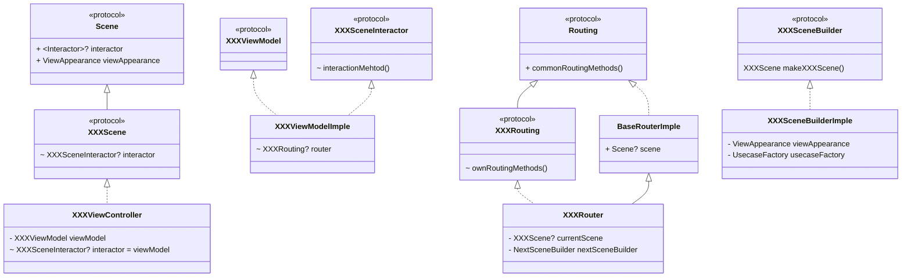
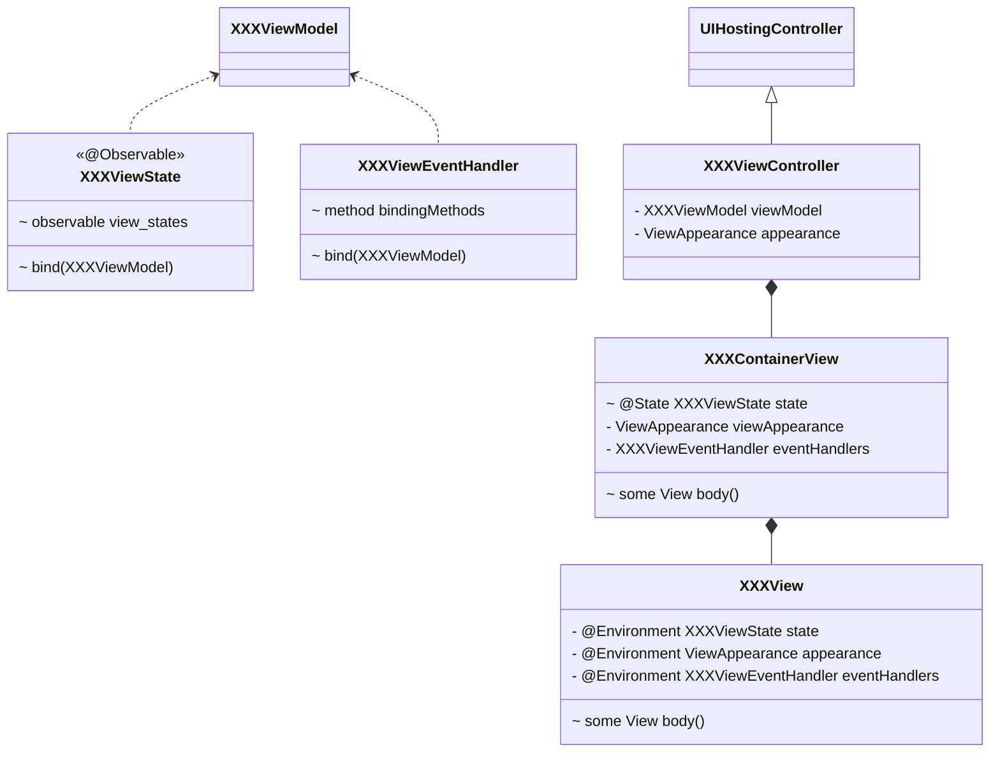
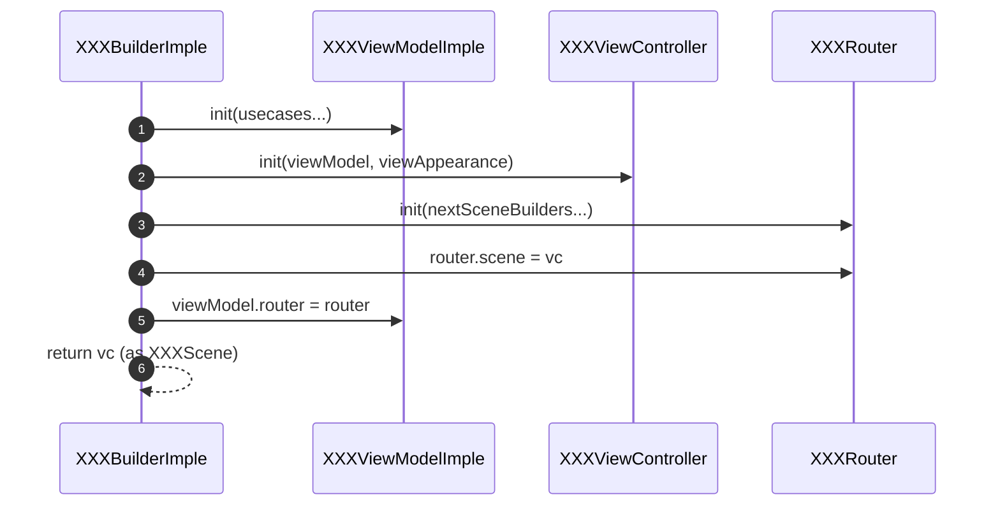
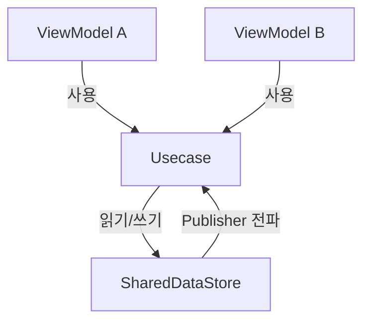
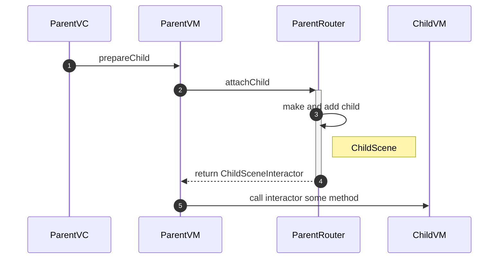
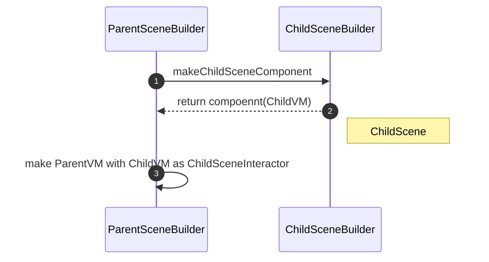
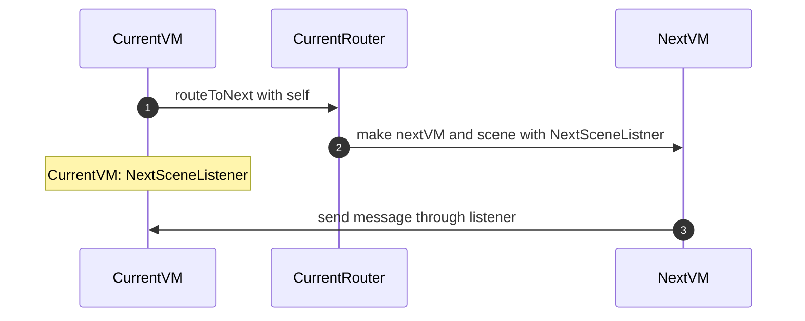
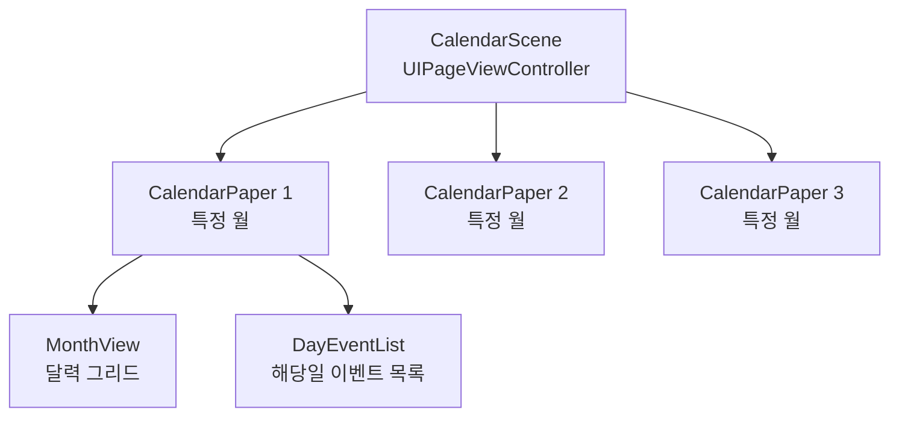
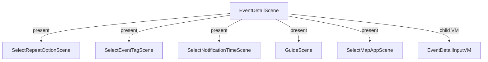

# 화면단위 구조

To-do Calendar iOS app을 구성하는 개별 화면들은 기본적으로 UIKit을(UIViewController) 사용하여 구현되고 연결됩니다. 허나 대부분의 화면들은 실제 구현은 SwiftUI를 사용하고있습니다. 이 경우 SwiftUI로 구현된 View들은 UIHostingController를 사용하여 UIKit의 view hierarchy에 통합됩니다.


## 템플릿 및 구성
To-do Calendar app에서는 앱을 구성하는 화면을 하나의 단위로 보고 이를 Scene이라 칭합니다, 하나의 Scene 구현하기 위해서는 여러 컴포넌트들이 필요로 하고 이들간 협업을 위한 코드가 필요로 합니다. 반복되는 위 과정을 줄이기 위해 프로젝트내에 템플릿을 설치하여 기본 파일 생성을 손쉽게 할 수 있습니다.
아래의 명령어를 이용하여 템플릿을 추가하세요. 이후 xcode에서 파일 추가시에 'Todo-Calendar-Scene'이라는 템플릿이 추가됩니다.
```swift
// location: ./Template/install.swift
sudo swift install.swift
```
`Todo-Calendar-Scene`을 선택하고 추가할 Scene의 이름을 입력하면 아래와 같은 파일들이 만들어집니다. (`use SwiftUI` 체크박스를 선택하여 SwiftUI로 view를 그리고자하는 경우에는 추가적인 파일이 생성됩니다.)
```swift
- XXXScene+Builder.swift
- XXXViewController.swift
- XXXViewModel.swift
- XXXBuilderImple.swift
- XXXRouter.swift
- XXXView.swift // use SwiftUI 체크시에
```
이들의 관계는 아래 사진과 같으며 자세한 설명은 아래를 참고하세요
- 기본

```mermaid
classDiagram
    Scene <|-- XXXScene
    XXXScene <|.. XXXViewController
    XXXViewModel <|.. XXXViewModelImple
    XXXSceneInteractor <|.. XXXViewModelImple
    Routing <|.. BaseRouterImple
    Routing <|-- XXXRouting
    XXXRouting <|.. XXXRouter
    BaseRouterImple <|-- XXXRouter
    XXXSceneBuilder <|.. XXXSceneBuilderImple
    class Scene {
        <<protocol>>
        + ~Interactor~? interactor
        + ViewAppearance viewAppearance
    }
    class XXXSceneInteractor{
        <<protocol>>
        ~ interactionMehtod()
    }
    class XXXScene{
        <<protocol>>
        ~ XXXSceneInteractor? interactor
    }
    class XXXViewModel{
        <<protocol>>
    }
    class XXXViewController{
        - XXXViewModel viewModel
        ~ XXXSceneInteractor? interactor = viewModel
    }
    class XXXViewModelImple{
        ~ XXXRouting? router
    }
    class Routing{
        <<protocol>>
        + commonRoutingMethods()
    }
    class BaseRouterImple{
        + Scene? scene
    }
    class XXXRouting{
        <<protocol>>
        ~ ownRoutingMethods()
    }
    class XXXRouter{
        - XXXScene? currentScene
        - NextSceneBuilder nextSceneBuilder
    }
    class XXXSceneBuilder{
        <<protocol>>
        XXXScene makeXXXScene()
    }
    class XXXSceneBuilderImple{
        - ViewAppearance viewAppearance
        - UsecaseFactory usecaseFactory
    }
```
- swiftUI 사용시

```mermaid
classDiagram
    XXXContainerView *-- XXXView
    XXXViewModel <.. XXXViewState
    XXXViewModel <.. XXXViewEventHandler
    UIHostingController <|-- XXXViewController
    XXXViewController *-- XXXContainerView
    class XXXContainerView{
        ~ @State XXXViewState state
        - ViewAppearance viewAppearance
        - XXXViewEventHandler eventHandlers
        ~ some View body()
    }
    class XXXView{
        - @Environment XXXViewState state
        - @Environment ViewAppearance appearance
        - @Environment XXXViewEventHandler eventHandlers
        ~ some View body()
    }
    class XXXViewState{
        <<@Observable>>
        ~ observable view_states
        ~ bind(XXXViewModel)
    }
    class XXXViewEventHandler{
        ~ method bindingMethods
        ~ bind(XXXViewModel)
    }
    class XXXViewController{
        - XXXViewModel viewModel
        - ViewAppearance appearance
    }

```

### Scene + Builder
템플릿을 이용하여 Scene 추가시 입력한 scene의 이름이 prefix로 붙어 {prefix}Scene+Builder.swift 파일이 만들어 집니다. 이 파일에는 추가할 화면에 해당하는 Scene 프로토콜과 Builder 프로토콜이 정의되어 있습니다.

#### Scene protocol
추가된 화면의 scene protocol을 XXXScene이라 할때 이는 Scene 프로토콜을 상속받습니다. Scene 프로토콜은 앱을 구성하는 화면들을 추상화한 프로토콜의 공통 프로토콜입니다. 이는 associatedtype의 Interactor를 요구사항으로 지니기 때문에 상속받은 프로토콜인 XXXScene은 자신의 Interactor의 타입을 명시해야합니다. 자동으로 생성된 파일 내에는 XXXSceneInteractor protocol이 정의되어있고 이는 XXXScene의 Interactor 타입으로 지정되어있습니다.
Interactor의 역할은 화면간 메세징이 필요한경우 쓰이게 됩니다. 자세한 내용은 `화면간 데이터 공유 및 메세징` 섹션을 참고해 주세요.(대부분의 경우 XXXScene이 다른 화면과의 협업이 필요없을 수 있습니다. 이 경우에는 XXXSceneInteractor의 빈구현을 그대로 남겨두세요)

Scene 프로토콜은 interactor 외에 `viewAppearance`도 요구합니다. Router가 `self.scene?.viewAppearance`를 읽어 `showWebView` 같은 공통 화면의 테마를 맞추기 때문입니다. 이 때문에 ViewController가 보관하는 `viewAppearance`에는 접근 제어 제약이 붙습니다 — 규칙은 [`presentations-rules.md`](../.claude/rules/presentations-rules.md) §7 소관입니다.

#### Builder protocol
같은 파일내에 이 화면(XXXScene)을 만드는 역할을 추상화한 XXXSceneBuilder 프로토콜이 존재합니다. XXXSceneBuilder의 유일한 역할은 XXXScene을 생성하는 것 입니다.

#### Scene 프로토콜을 어디에 둘 것인가
Presentation framework끼리는 서로를 직접 import 하지 않습니다. 그래서 **다른 모듈에서 참조해야 하는 Scene의 프로토콜은 `Scenes` framework**에 두고, 모듈 내부에서만 쓰이는 Scene은 그 모듈 안에 그대로 둡니다.

어느 `Scenes+*.swift`에 무엇이 들어있는지는 [`presentations-rules.md`](../.claude/rules/presentations-rules.md) §7의 표가 정본입니다.

### ViewController
추가된 XXXViewController는 화면을 실제 구현하는 객체 입니다. UIKit을 사용하여 ViewController 내에서 ui를 구현하거나 SwiftUI를 사용하는 경우 swiftUI View를 호스팅하여 ui를 구성합니다. MVVM 구조로 해당 scene에서 구현하여야하는 요구사항에 대한 실제 동작은 ViewController가 소유한 viewModel이 처리합니다. XXXScene의 요구사항인 interactor의 실제 구현도 viewModel이 하게 됩니다(이를 통하여 외부 scene과의 메세징은 viewModel 간 이루어지게 됩니다)

### ViewModel
XXXViewModel 파일에서 vc를 추상화한 viewModel을 구현하세요. 템플릿은 기본적으로 vm의 interaction method 부분과, presenting value(publishers)으로 구분하여 구현하는것을 권장하고 있습니다. 또한 내부적으로 상태를 보관해야하는 경우 Subject struct 안에 subject 객체들을 추가합니다. interaction method를 호출하여 상태를 조회하고 결과를 subject에 보관한 뒤에 이를 변형하거나, 다른 subject와의 합성을 이용하여 presenting value로 value converting 하는것을 권장합니다.

XXXViewModel 구현시에 라우팅 동작이 필요한 경우 이를 vm이 소유하는 Router에 필요 인터페이스를 추가하고, 위임하세요.

### Router
XXXRouter는 위 scene에서 다른 scene으로의 전환이나, 팝업을 띄우는 등 라우팅에 관련된 동작을 구현하는 역할을 합니다.
에러 팝업, 토스트 출력과 같이 공통적으로 사용하는 라우팅의 경우 인터페이스는 Routing protocol에 실제 구현은 BaseRouterImple에 위치합니다. XXXRouter는 BaseRouterImple를 상속받기에 이들을 사용할 수 있고, 필요시 오버라이딩하여 구현을 분기하세요.

BaseRouterImple이 제공하는 공통 라우팅(에러·토스트·확인·액션시트·웹뷰·공유시트·바텀슬라이드 등)의 전체 목록은 [`presentations-rules.md`](../.claude/rules/presentations-rules.md) §5가 정본입니다. 새 라우팅을 만들기 전에 거기 있는지 먼저 보세요.

XXXRouter에서 다른 화면으로의 전환을 위해서는 해당 scene을 만들 수 있어야합니다. 위 scene을 NextScene이라 할때, XXXRouter는 이를 만들기 위하여 NextSceneBuilder가 필요로 합니다.

### BuilderImple
XXXSceneBuilder의 실제 구현체 입니다. 구현체인 XXXBuilderImple의 makeXXXScene method에서는 vm를 만들고, 이를 소유하는 vc를 만든 후, router를 만들고, router의 scene을 vc로 지정해주고, vm의 router를 지정해주는 코드가 작성되어있습니다.


```mermaid
sequenceDiagram
    autonumber
    participant B as XXXBuilderImple
    participant VM as XXXViewModelImple
    participant VC as XXXViewController
    participant R as XXXRouter

    B->>VM: init(usecases...)
    B->>VC: init(viewModel, viewAppearance)
    B->>R: init(nextSceneBuilders...)
    B->>R: router.scene = vc
    B->>VM: viewModel.router = router
    B-->>B: return vc (as XXXScene)
```

BuilderImple는 기본적으로 ViewAppearance 객체를 소유합니다. 이는 빌더 객체 생성시에 주입되며, vc에서 뷰를 그릴때 폰트, 색상 등 뷰와 관련된 속성을 참조할때 사용됩니다.
일반적으로 vm의 구현을 위해서 Domain framework 내에 구현된 usecase 객체를 사용하고, 이를 vm이 주입받게 됩니다. 이로인해 빌더구현체가 vm을 생성할때 usecase 객체 참조나 생성이 필요로 하는데 주로 UsecaseFactory를 주입받아 이용합니다.

#### UsecaseFactory
모든 Scene Builder는 UsecaseFactory를 주입받아 usecase를 획득합니다. 이는 서브도메인별 factory 프로토콜들을 합성한 프로토콜입니다.

```swift
public protocol UsecaseFactory:
    AccountUsecaseFactory,
    CalendarUsecaseFactory,
    EventUsecaseFactory,
    NotificationUsecaseFactory,
    SettingUsecaseFactory,
    CommonUsecaseFactory,
    SupportUsecaseFactory,
    ExternalCalendarUsecaseFactory,
    AIAgentUsecaseFactory,
    BillingUsecaseFactory,
    AdUsecaseFactory
{
    var eventNotifyService: SharedEventNotifyService { get }
}
```

구현체는 `TodoCalendarApp/Sources/Factories/`에 있고 **로그인 여부에 따라 `LoginUsecaseFactoryImple` / `NonLoginUsecaseFactoryImple`로 갈립니다.** 어느 쪽이 쓰일지는 로그인·로그아웃 시점에 분기됩니다.

usecase 인스턴스 생성은 factory의 책임이고, **ViewModel은 factory를 직접 참조하지 않습니다** — builder가 factory에서 꺼내 vm에 주입합니다.

### View(SwiftUI 사용시)
SwiftUI를 사용하는 경우 XXXView.swift 파일이 별도로 추가됩니다. 또한 XXXViewState 및 XXXViewEventHandler 코드도 같이 추가되는데 각자의 역할은 다음과 같습니다.

#### ViewState
뷰에 해당하는 정적, 동적 상태들을 보관합니다. `@Observable`로 선언되며, bind 메서드에서 매칭되는 vm이 방출한 presentingValue를 구독하고 내부 property를 업데이트 합니다. bind는 중복 호출을 막기 위해 `didBind` 플래그로 한 번만 수행됩니다.

#### View
실제 SwiftUI를 사용하여 그릴 custom view에 해당합니다. 앞서 설명한 ViewState를 `@Environment(XXXViewState.self)`로 주입받으며, 이를 참조하여 상태 변경시 뷰가 업데이트 됩니다.

#### ViewEventHandler
view에서 발생한 유저 이벤트를 vm으로 전달하기위한 객체 입니다. 이벤트를 전달하려는 경우, ViewEventHandler 객체에 함수 property를 추가합니다. 그리고 bind 구문에서 매칭되는 vm의 interaction method와 매핑을 해줍니다.

ViewState, ViewEventHandler는 View와 ViewModel간의 직접적인 참조를 끊기 위한 역할을 합니다. 이는 ViewModel이 SwiftUI의 View를 위한 구조로 설계되는것을 지양하고, View의 경우 Preview를 위해 fake vm 객체를 만드는 번거로움을 줄이기 위함입니다.

### ContainerView
XXXView.swift 파일 내에 XXXContainerView가 같이 생성됩니다. 이는 XXXViewState와 XXXViewEventHandler를 소유하고, body 구문에서 xxxView를 그리는 역할을 합니다. XXXContainerView가 그리는 XXXView가 onAppear 되었을 경우, vm와 xxxViewState 간의 바인딩을 트리깅 합니다. ViewState·EventHandler·ViewAppearance는 `.environment(...)`로 하위 뷰에 내려갑니다.
또한 SwiftUI 사용시 UIHostingController를 상속받도록 변경된 XXXViewController를 rootView로 xxxContainerView를 사용합니다.

### ViewAppearance
앱 전체의 시각적 속성(폰트, 색상, 캘린더 외형 설정 등)을 관리하는 단일 인스턴스 입니다. Builder가 ViewController와 ContainerView에 주입하고, SwiftUI View에서는 `@Environment(ViewAppearance.self)`로 접근합니다. 설정이 변경되면 Combine publisher로 전파되어 이를 참조하는 모든 view가 갱신됩니다.


## 화면간 데이터 공유 및 메세징
개발시 여러 화면간 데이터와 이벤트를 공유하거나, ui상 같은 화면이라도 서브 모델로 나누어 협업을 하는 식으로 복잡도를 떨어뜨리는 경우가 있습니다. To-do Calendar app에서는 이와같은 구조를 지향하며, Scene으로 구성된 컴포넌트간 데이터 공유나 메세징은 다음과 같이 이루어 집니다.

### Usecase를 이용한 데이터 공유
분리된 Scene간 데이터 및 이벤트를 공유해야하는 대부분의 경우 Usecase를 이용합니다. UsecaseFactory를 이용하여 생성되어 VM에 주입되는 Usecase의 경우 객체가 공유되는 것은 아니지만 공유해야하는 상태의 경우 싱글턴으로 관리되는 SharedDataStore에 의해 관리되고 전파됩니다.


```mermaid
graph TB
    VM_A[ViewModel A] -->|사용| UC[Usecase]
    VM_B[ViewModel B] -->|사용| UC
    UC -->|읽기/쓰기| SDS[SharedDataStore]
    SDS -->|Publisher 전파| UC
```

### Interactor
Parent화면에서 일부분을 Child로 분리한 경우 Interactor를 이용하여 Parent에서 Child로 메세지를 전달합니다. 이와같은 구조는 같은 화면을 작은 단위로 나누어 복잡도를 떨어뜨리거나, 역할을 분리하는 경우 많이 사용합니다.
To-do calendar에서 이를 구현하는 방식은 아래와 같습니다.

UIKit 환경에서 ParentScene이 ChildScene을 child로 들고있는 상황이라 가정해봅시다

```mermaid
sequenceDiagram
    autonumber
    ParentVC->>ParentVM: prepareChild
    ParentVM->>+ParentRouter: attachChild
    ParentRouter->>ParentRouter: make and add child
    note right of ParentRouter: ChildScene
    ParentRouter-->>-ParentVM: return ChildSceneInteractor
    ParentVM->>ChildVM: call interactor some method
```
1. ParentVC의 viewDidLoad나 적절한 타이밍에 ParentVM에게 child 준비를 요청합니다.
2. ParentVM은 ParentRouter를 이용하여 child 추가 요청을 합니다. 필요한경우 요청에 인자를 추가합니다.
3. ParentRouter는 자신이 소유한 ChildScene의 Builder를 이용하여 ChildScene을 만들고, currentScene에 addChild합니다. (ParentVC에는 addChild를 위한 기능이 구현되어있어야 합니다)
4. Router는 attachChild의 결과로 ChildScene의 interactor를 반환합니다. ChildSceneInteractor의 실제 구현은 ChildVM이 하게됩니다.
5. ParentVM은 4번의 결과로 반환되는 interactor 레퍼런스를 보관하고, 필요한 시점에 이를 호출해 ChildVM에게 메세지를 전달합니다.

SwiftUI를 사용하는 경우(ParentView안에 ChildView가 들어가는 경우) Parent에서 Child가 연결되는 방식은 UIKit을 사용했을 경우와 다르게 Builder를 통해 이루어 집니다.

```mermaid
sequenceDiagram
    autonumber
    ParentSceneBuilder->>ChildSceneBuilder: makeChildSceneComponent
    ChildSceneBuilder-->>ParentSceneBuilder: return compoennt(ChildVM)
    note right of ChildSceneBuilder: ChildScene
    ParentSceneBuilder->>ParentSceneBuilder: make ParentVM with ChildVM as ChildSceneInteractor
```
1. ParentSceneBuilder를 이용하여 ParentScene이 만들어지는 경우, 먼저 ChildSceneBuilder를 이용하여 ChildScene의 component를 생성합니다.
2. ChildSceneComponent에는 ChildScene을 생성하기 위한 컴포넌트가 포함됩니다. 대표적으로 ChildVM을 포함합니다.
3. 이후 ParentVM을 생성하는 경우 2번 단계에서 생성한 ChildVM을 ChildSceneInteractor로 주입합니다.

### Listener
interactor와는 반대의 방향으로 child에서 parent로 메세지를 전달하는 경우 Listener를 사용합니다. 이는 일반적으로 vc간 사용하는 Delegate 패턴과 유사하며 다음과 같은 방식으로 연결 및 구현됩니다.
Current화면에서 Next 화면을 present 하였고, Next에서 다시 Current로 메세지를 전달하는 경우를 예로 들겠습니다.

```mermaid
sequenceDiagram
    autonumber
    CurrentVM->>CurrentRouter: routeToNext with self
    CurrentRouter->>NextVM: make nextVM and scene with NextSceneListner
    note over CurrentVM: CurrentVM: NextSceneListener
    NextVM->>CurrentVM: send message through listener
```
1. CurrentVM에서 CurrentRouter로 Next로의 라우팅을 요청합니다. 이 경우 NextSceneListener로 자기 자신을 전달합니다.(Listener로 두 vm을 연결하기 위해서는 CurrentVM이 NextSceneListener를 구현해야합니다)
2. CurrentRouter에서 NextSceneBuilder를 이용하여 NextScene을 만듭니다. 이 때 NextVM은 NextSceneListener로 CurrentVM을 주입받게 됩니다. **Listener는 weak로 보관합니다** — parent가 child를 소유하므로 강한 참조로 잡으면 순환이 생깁니다.
3. 특정 시점에 NextScene이 주입받은 listener를 이용하여 메세지를 전달하고, 이는 CurrentVM이 처리하게 됩니다.


## 복잡한 화면 나누기
하나의 화면이 커지면 Scene을 더 작은 Scene으로 나눕니다. 나누는 기준은 대체로 아래 넷 중 하나입니다.

| 기준 | 예시 |
|---|---|
| 독립적인 데이터 소스 | 캘린더 그리드 vs 일별 이벤트 목록 |
| 재사용 가능성 | 태그 선택 다이얼로그 (여러 곳에서 사용) |
| 페이지/탭 단위 | 월별 페이지 (UIPageViewController child) |
| 모달/시트 | 반복 옵션 선택, 알림 시간 선택 |

### CalendarScene

```mermaid
graph TD
    CS[CalendarScene<br/>UIPageViewController] --> CP1[CalendarPaper 1<br/>특정 월]
    CS --> CP2[CalendarPaper 2<br/>특정 월]
    CS --> CP3[CalendarPaper 3<br/>특정 월]
    CP1 --> MV[MonthView<br/>달력 그리드]
    CP1 --> DEL[DayEventList<br/>해당일 이벤트 목록]
```
CalendarScene은 UIPageViewController로 월간 페이지 전환을 관리하고, 한 달치 화면인 CalendarPaper가 그리드(MonthView)와 목록(DayEventList)을 품습니다. 각 Paper는 독립 ViewModel을 갖고 CalendarScene의 ViewModel과 Interactor·Listener로 통신합니다.

### EventDetailScene

```mermaid
graph TD
    ED[EventDetailScene] -->|present| RO[SelectRepeatOptionScene]
    ED -->|present| ET[SelectEventTagScene]
    ED -->|present| NT[SelectNotificationTimeScene]
    ED -->|present| GD[GuideScene]
    ED -->|present| MA[SelectMapAppScene]
    ED -->|child VM| EI[EventDetailInputVM]
```
입력 폼 로직은 같은 VC 안에서 EventDetailInputVM으로 분리하고, 나머지는 모달로 present되는 독립 Scene입니다. Router가 각 Builder를 보관하여 생성합니다.


## 새 Scene 추가 체크리스트
1. 템플릿 설치 (최초 1회): `sudo swift Template/install.swift`
2. Xcode에서 파일 추가 — `Todo-Calendar-Scene` 템플릿 선택 후 Scene 이름 입력 (SwiftUI로 그릴 경우 `use SwiftUI` 체크)
3. Scene 프로토콜을 어디 둘지 결정 — 다른 모듈에서 참조하면 `Presentations/Scenes/Sources/Scenes+*.swift`, 모듈 내부 전용이면 `XXXScene+Builder.swift`에 그대로
4. 부모 Router에 이 Scene의 Builder 주입 — 부모에서 전환하려면 부모 Router가 Builder를 소유해야 합니다
5. `tuist generate --no-open` 실행 (파일 추가·삭제 시 필수)

> 화면 배치 경로와 MUST/MUST NOT 규칙은 [`.claude/rules/presentations-rules.md`](../.claude/rules/presentations-rules.md) 소관입니다.
